# Analyzing Compliance Against Targets

To recap, we have:
- Set up our model using site information
- Established key building targets and constraints, both geometrically and numerically
- Extracted key data from our design model

Now that we've done all of that, the last step it to take all of that info, and test it against each other in a smart, organized way, to ensure that we are meeting our complance targets. 

## Calculating Allowable from FAR with Bonus

We're going to do one last quick, dynamic calculation to determine our compliance. Our site is somewhat unique, in that there is a bonus for any public space that is created. In order to maximize out building size, we will want to use these bonuses - but there is a tradeoff. The space that we add will need to clearly accounted for in the design, and may take up some footprint that could be dedicated to the built area.

In order to do this, we will set up a way of calculating what our maximum allowable FAR is based on both our lot size and the amount of public space we provide. Let's open up the definition from the prvious exercise and start adding some more functionality to it. I'm going to add this to the top of the definition, so slide everything down to make some space. It's important to think about how your canvas layous out, and it's good to group similar functions together. 

- To calculate the base FAR, we will need to grab out property line, grab the area, and multiply that by 10.0 (since our allowable FAR for this lot is 10.0). In Grasshopper, use a `Geometry Pipeline (Pipeline)` component, an `Area` component, and a `Multiplication (A x B)` to achieve this. Let's also round the values to ensure the output is clean and understandable (plus we don't need to calculate to such a refined value). It should look something like the following:

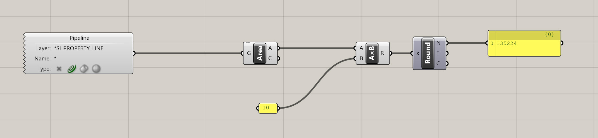

- Now we need to account for the bonus - but again this in not a fixed number - your bonus is driven by the amount of public space you provide. And based on the zoning, we have a ratio of 1 to 6, or for every 1 SF of public space, we are allowed to build an additional 6 FAR. For a developer, that's a great deal, and a lot of additional, valuable square footage, so we are going to want to take advantage of that. The last thing to consider is that we cannot exceed more than 2.0 FAR additional with our bonus, so 12.0 FAR max is our limit. Let's set up some logic to figure that out.
- First, create a new layer that represents your public space. Name is DP_PUBLIC_SPACE and place it in the DESIGN_PROPOSAL layer. Use a `Geometry Pipeline (Pipeline)` component and set is as a curve type. Now, draw a quick curve to represent your public space - doesn't need to be perfect, but let's get something in there to test. Note, it should be a Closed Polycurve to calculate area.

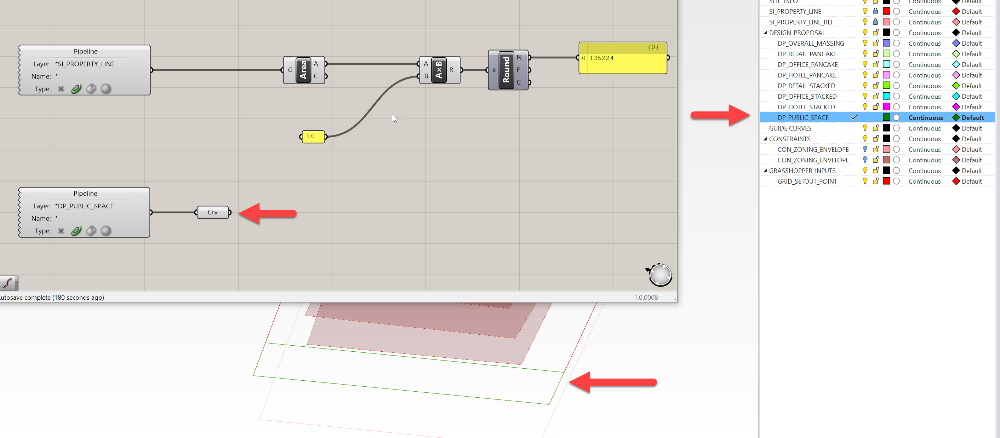

- Extract the area from this curve representing the public space, multiply it by 6 (our bonus ratio) and round it. This output represents the bonus allowable Zoning Floor Area.

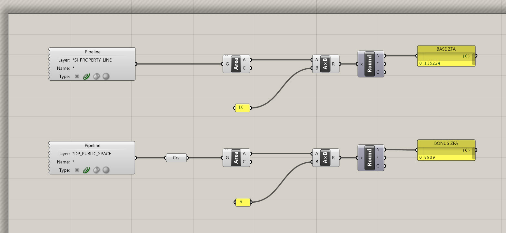

- Now, we need to make sure our total does NOT exceed 12 FAR, which is our maximum allowable (or not to exceed value), even with the bonus. To do this, multiply the orginal property line area by 12.0. We need to put in a check to ensure we never exceed this amount. Add the BASE ZFA to the BONUS ZFA, then plug this total value into a `Minimum (Min)` component. Then, plug the ZFA NOT TO EXCEED VALUE into the other input of the `Minimum (Min)` component. What this component does is return the smaller of two values - label this output as your ALLOWABLE ZFA. 

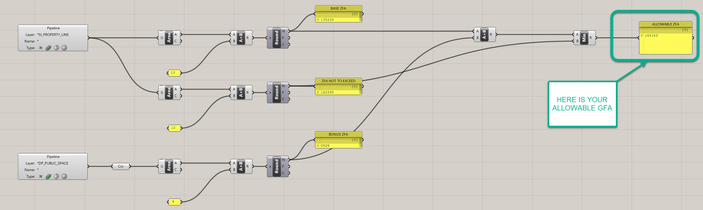

- You'll see that as you increase your curve representing your public space, your allowable FAR will dynamically update until it reaches the maximum threshold, then it will cap at that amount:

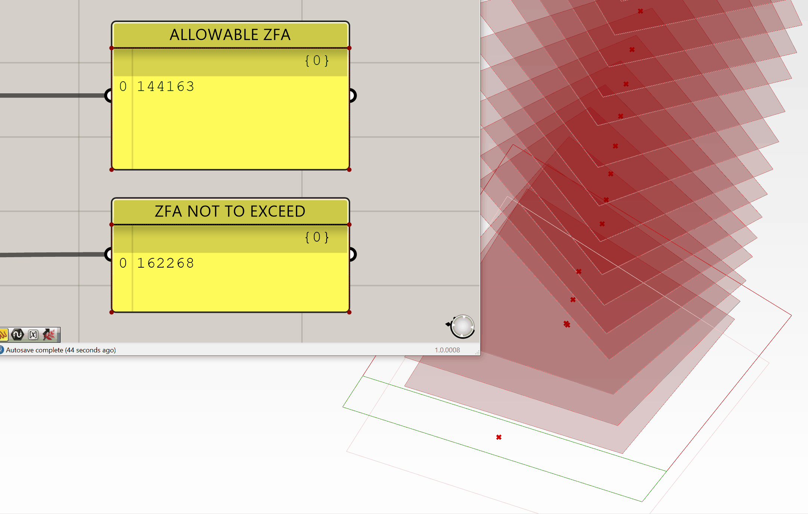

If you got lost, you can [download my definition here](https://drive.google.com/file/d/1tSxwWgR3y6yVEAMNCzIOsqfjQgykp6xg/view?usp=sharing) before moving on to the next section.

## Checking Building Geometry Against Constraints - Zoning

- We will now need to check to make sure our building conforms with zoning. This is a simple calculation, where we essentially need to check to see if our building geometry penetrates the zoning envelope. We're going to do this BY using geometry, as it is helpful to see exactly where a building crosses a zoning envelope while designing. This allows you to pinpoint your issue rather then searching for it

**Joe's Tip #10**
>
> Despite what I said above, always try to minimize the amount of geometric operations you use when building your defnition - this will make it process exponentially faster. For example, to test whether two Breps collide with each other, you can use with the `Brep | Brep (BBX)` component OR the `Collision One|Many (ColOM)` component. Take a look at both to see the difference. In our circumstance we need to see geometry, but avoid it unless it is necessary.

- Ok, now that we've gotten that settled, let's go back to the first design propsoal we worked on, that looks like this:

 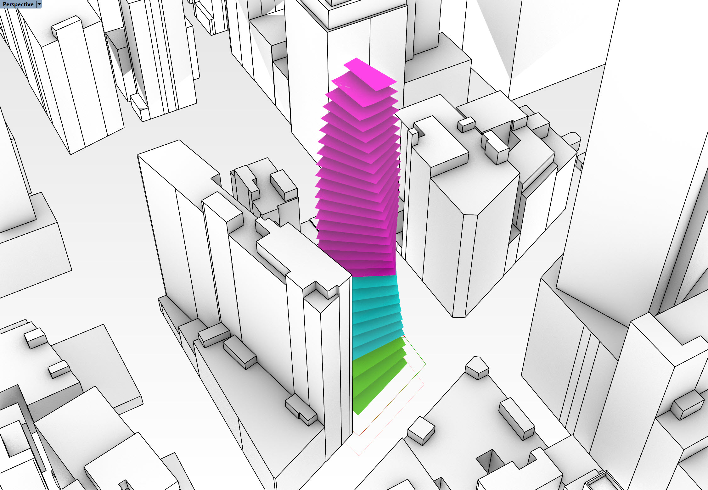

 - Checking to see if the project intersects with the zoning envelope is as simple as using a `Brep | Brep (BBX)` component and plugging the output of your zoning envelope for analysis into input A, and pluggin your massing proposal into input B.

 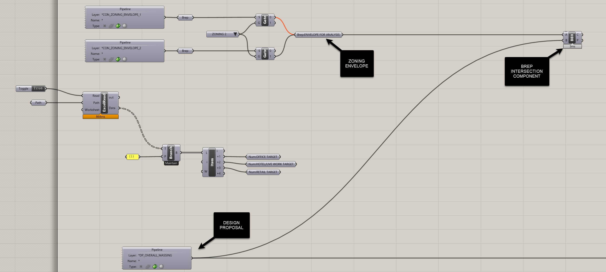

 - Now, were going to do two operations to help identify if we're not compliant with the zoning envelope. The first is to make the envelope visually pop-up if we are non compliant. Second is to highlight the intersection area, geometrically.
 - To make the envelope pop up, we will need to count the number of curves that are created through intersection. If this number equals or exceeds one (1) it means we have at least one collision. Use a `List Length (Lng)` component to do this, followed by a `Larger Then (Larger)` component. Test to see if the output of the `List Length (Lng)` component is larger then 0. If it is, it will return True, and mean the design is non-compliant. If it returns False, it means the design is compliant. 

 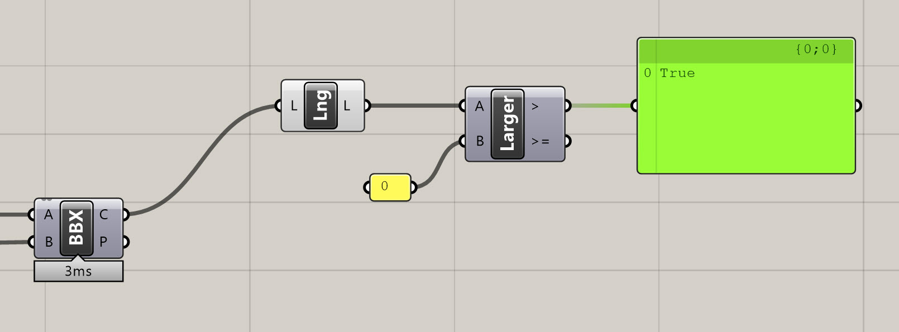

 - Visualizing the envelope is now easy - we are going to use a `Stream Gate (Gate)` component. Plug the output of the zoning envelope for analysis into the S in the `Stream Gate (Gate)`, and the > output of your `Larger Then (Larger)` component into the G. What a `Stream Gate (Gate)` component does is switch output streams depending on that the G input states. So, if you are inputing True, it evaluates this as 1, and False will be 0. If the G value is 1, the 1 output will be streamed, therefore, but connecting a `Geometry (Geo)` component to the 1 output, you'll get preview of the zoning envelope. Make sure you turn off the preview of all the other components that contain information about the zoning envelope, or else this won't work. See below for how the definition should look and function.

 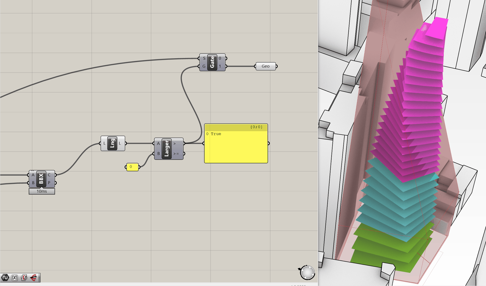

 - Finally, we want to preview the region where we break the envelope. In the example above, it's quite obvious, but that's not always the case. If I use the tower envelope option, it only penetrates in a small area, which you'll see in a second. To visualize where it penetrates, we're going to simply use a `Patch` component and plug it into the C output of the `Brep | Brep (BBX)`, and then add a `Custom Preview (Preview)` component to the output of the patch. Assign a bright Red color to this and you'll be able to visualize your output. 
- As you'll see in the example below, the envelope will only appear if you have a penetration, and it will identify where the penetration occurs. You can switch between the two envelopes to see the result, and manipulating the underlying geometry will also help you find a proposal that is compliant.

- So if we are to evaluate our design propsoal in the context of zoning, you'll see that our design option will definitly not work with the sky plane zoning option, but is only slightly non-complaint with the tower zoning option. By just slightly moving the tower off the propertyline, we're able to make it fully compliant.

**Side Challenge 6:** *After you've set up the geometric collision operation above, can you set up a second option that DOES NOT indicate where the building crosses the zoning envelope, but rather just returns a True/False value? This might be helpful for an operation where you do not need to see exactly where a building intersects, but rather quickly run an analysis on a bunch of volumes to see if they intersect*
 

## Applying Efficiency Ratios and Checking Compliance

Now that we’ve set up our allowable ZFA, calculated bonuses, and tested our building geometry against zoning envelopes, there’s one last step — **applying program-specific efficiency ratios to understand net floor areas, and comparing against targets.**

We already have a clean `Panel ()` providing **gross floor area by program**. All we need to do is multiply these gross areas by efficiency ratios for each program to get net areas.

### Step 1: Establish Efficiency Ratios

- We already know the program order of our gross areas is:
  - Retail
  - Office
  - Hotel

- Create three `Number Slider ()` components ranging from `0` to `1`. Set them to the following default efficiency ratios:
  - Retail: `0.90` (90%)
  - Office: `0.85` (85%)
  - Hotel: `0.75` (75%)

Rename each slider to clearly indicate its purpose:
- `Num:RETAIL EFFICIENCY RATIO`
- `Num:OFFICE EFFICIENCY RATIO`
- `Num:HOTEL EFFICIENCY RATIO`

**Joe’s Tip #11**
> Keep your sliders clearly labeled and grouped with their corresponding outputs. This makes it much easier to adjust and audit your assumptions later on.

### Step 2: Multiply Gross Areas by Efficiency Ratios

- Use an `Entwine` component to combine the three efficiency ratios into a single tree.
- Multiply this tree by your gross areas tree using a `Multiplication (A×B)` component.  
  > *Your data structure should already match up if you’ve kept everything clean — but always double-check that your branches align!*

The result is your **net floor area by program.**

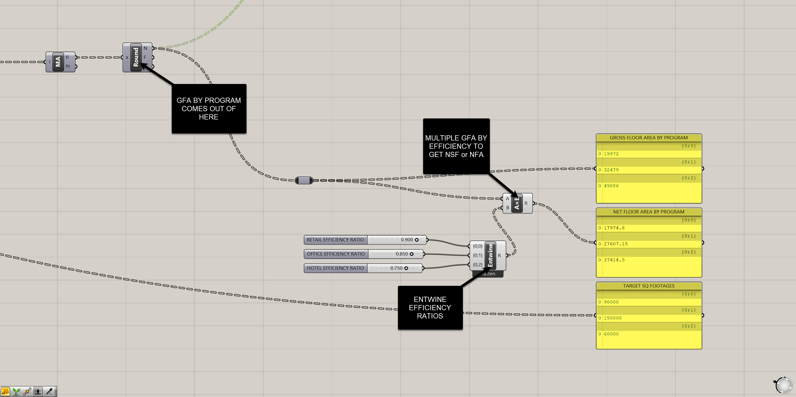

### Step 3: Bring in Program Targets

Remember the Excel file we connected earlier? We already extracted target square footages for each program from that file.  
- Use another `Entwine` to collect these three targets into a single list.
- Place a `Panel ()` and label it `TARGET SQUARE FOOTAGES`.

Now you should have three parallel outputs:
- Gross area by program
- Net area by program
- Target area by program

Organize these visually on your canvas so they’re easy to read and compare.

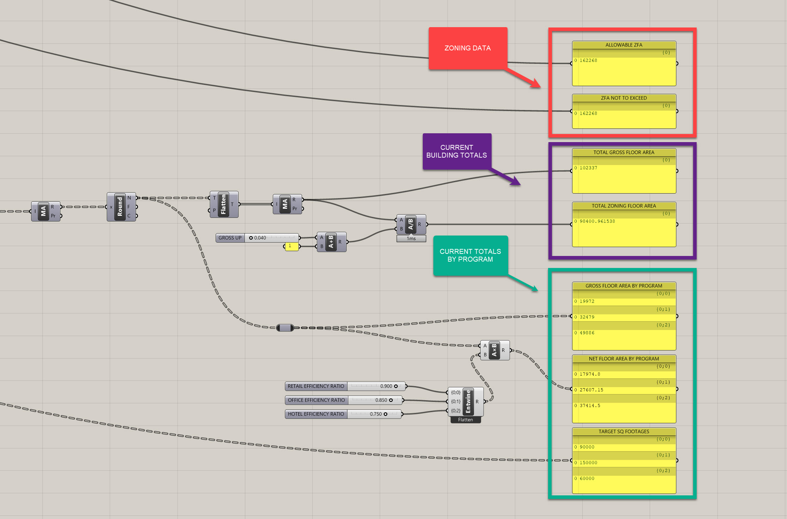

### Step 4: Review and Adjust

At this point, you can adjust your massing, test new configurations, or modify your program assumptions as needed to bring your net areas in line with your targets.  
You now also have all of the following metrics at your fingertips:
- Allowable ZFA
- Current ZFA
- Gross Floor Area (by program)
- Net Floor Area (by program)
- Target Floor Area (by program)

This is the power of computational tracking — everything stays live and dynamic.

If you need the full final definition, [download it here](https://drive.google.com/open?id=1cBr0d-jyto8nNFQYvFZe8S3y7C2fYd4S&usp=drive_fs) before moving on to the next module.

**Side Challenge 7:** *Can you set up a simple visual indicator to show whether or not your current design meets its targets? Think about the `Larger Than (Larger)` and `Stream Gate (Gate)` techniques you used earlier for zoning compliance — can you adapt these to create a dynamic feedback system in the viewport? Maybe your model changes color when it’s over or under its targets, or you simply output `True/False` for each program. Post your solution in Slack when you crack it!*

---

## Module 2: Summary

In this module, we developed a robust system for **establishing and achieving building targets**. We:
- Set up a clean, organized site and model
- Defined key zoning envelopes and program constraints
- Extracted critical data from our model geometry
- Calculated bonuses and allowable ZFA
- Compared our design against zoning compliance using dynamic checks
- Applied program efficiency ratios to understand net areas
- Compared gross, net, and target areas dynamically

By the end of this module, you should now have a fully functional definition that allows you to test your design against regulatory and programmatic constraints — all while keeping your model live and flexible.

On to the next module!
