The fundamental mechanism of rendering is to simulate the behavior of light rays and their interaction with objects in the scene. Having a strong understanding of how light works in the real world is crucial to understanding the computational process of rendering, and the subjective process of designing the look & feel of a particular scene. 

## Light & Shadow

### Light

Light is the emission of electromagnetic energy in the visible spectrum. Light originates from bright objects (such as the sun, or an incandescent light bulb) and travels in straight lines. When light interacts with objects, it can be absorbed, reflected, or refracted. For our purposes, we will measure the quantity of light emitted from a source as its intensity.

When objects are moved farther away from a light source, the quantity of light that reaches them diminishes. This is because light spreads out over a larger area as it travels away from its source. We can quantify this effect with the observation that the surface brightness of an object decreases relative to the square of the distance from the light source.

### Shadows

Shadows are regions where light is blocked from reaching an object or surface. Controlling the quality of shadows in a scene can be used for narrative, dramatic, and artistic effect.

When a light source is very small relative to the size of the subject, it produces shadows with a sharp edge. As the size of the light source increases relative to the subject, the shadow's edge becomes softer, because the edge of the shadow is no longer either completely illuminated or completely dark. This soft edge region is called a penumbra. The penumbra receives a varying amount of the light source across its area, producing a gradient of illumination. When a light source is so large that every part of the penumbra can be reached by at least part of the light source, the shadow's edge is lost completely and the object appears to have little or no shadow at all.

Although the sun is the largest light source in our solar system, it is relatively small when seen from a vantage point on the surface of the earth. As a result, the sun is considered a "small" light source in relative terms. Accordingly, it normally casts sharp shadows.

### Indirect Light

When a surface is not in direct view of a light source, it can still be illuminated by light rays that have been reflected off of other surfaces. This light is called indirect light. 

Indirect light is particularly important indoors. Most of the light that illuminates a room in the daytime is indirect light that has been reflected off of the walls, ceiling, and floor.

Indirect light can change color, depending on the surfaces off of which it has reflected. This is why colored surfaces, such as the brightly colored walls of a Luis Barragan house, change the color of other surfaces nearby.

Indirect light is computationally expensive to simulate in a rendering engine, since it requires tracing millions of light rays as they bounce off of objects and surfaces in a scene. In practice, most rendering engines limit the number of indirect light bounces that are simulated, even though light rays in the real world often bounce an uncountably large number of times before being completely absorbed.

### Diffuse Light

The size of the light source can be affected by surfaces that are between the light source and the subject. When light passes through certain materials, including semi-transparent surfaces or atmospheric volumes such as clouds or fog, it can be scattered in all directions. This scattering is called diffusion and has the effect of making the light on a subject appear to be coming from a larger area (while reducing its overall intensity). 

Perceptually, diffuse light creates scenes with less contrast than direct light.

On an overcast day, cloud cover can act as a large diffusing surface and transform the light of the sun to produce soft or nearly invisible shadows instead of hard shadows.

On an architectural scale, semi-transparent surfaces such as frosted glass or corrugated plastic can act as diffusing surfaces, producing soft-shadows indoors.

## Adding Lights in Blender

### Viewport Setup

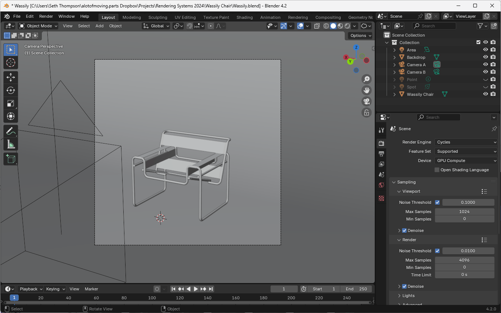

To accurately see the effects of light and shadow in our scene, we will need to set up our viewport to show a preview of the final rendering.

To better preview the lighting of the scene while editing, split your viewport into two:

1. Hover over the top right corner until a Plus icon appears, click, and drag left to create a new window.
1. In the new window, set the view to Camera (`Numpad 0`).
1. Set the viewport shading to Rendered.

This setup allows us to see both the overall arrangement of our scene and the final view through the camera.

1. In the Properties panel, go to the Render Properties tab (the second one down).
1. Set the render engine to Cycles.
1. Under Device, choose either CPU or GPU Compute based on your hardware (GPU is usually faster if you have a dedicated GPU. On a laptop, CPU may be faster).
1. Make sure Viewport > Denoise is checked.

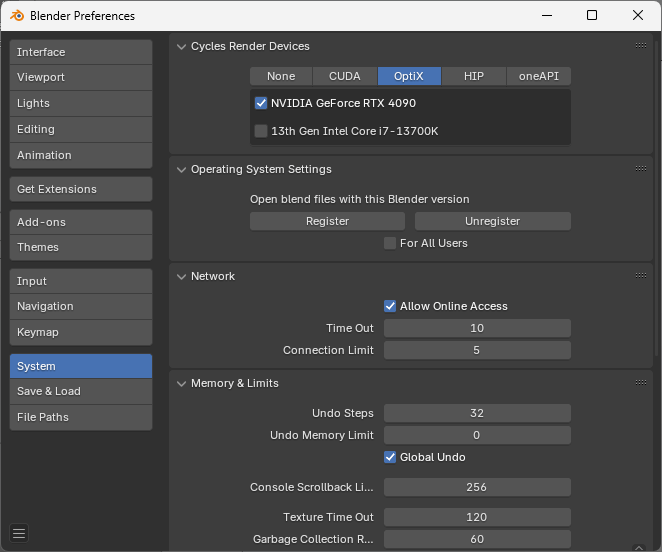

Note: If you have a dedicated GPU, you should check Edit > Preferences > System to make sure that it is selected under Rendering Devices. If you have an NVIDIA GPU with RTX raytracing, you should also make sure OptiX is selected. If you are on macOS, you should selected Metal under Rendergng Device.

## Lights

Rendering engines simplify the different kinds of real life light sources into a few idealized types.

### Point Light

*A point light with a radius of 0 casts hard shadows.*

A point light is a small light source that emits light in all directions. By default it casts sharp shadows, although its size can be adjusted via the Radius property to create a shape that is a larger sphere.

1. Add a point light: Add > Light > Point
2. Position the light using the move tool (`G`).
3. Adjust light properties in the Object Data Properties panel:
   - Color
   - Power (or intensity)
   - Radius (to change the size of the light source)

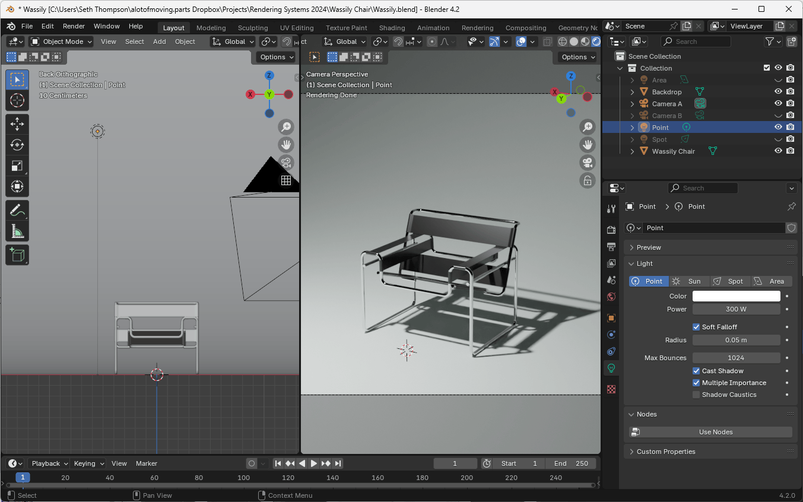
*A point light with a radius of 0.05m casts slightly softened shadow edges.*

Point lights can be used to simulate small light sources, such as light bulbs, or small light fixtures.

### Spot Light

A spot light approximates the behavior of a point light covered with a conical filter to block the light except in a particular direction.

1. Add a spot light: Add > Light > Spot
2. Adjust properties:
   - Color
   - Power (or intensity)
   - Radius (to change the size of the light source)
   - Spot Shape (Size and Blend)

Spotlights can be used to simulate small light sources inside fixtures that direct light in a particular direction, such as a track spotlights, facade wash lights, lamps, or flashlights. 

### Area Light

An area light is a large light source that emits light over a two-dimensional surface. Depending on the size of the area light relative to the subject, it can produce soft shadows and even, uniform lighting.

1. Add an area light: Add > Light > Area
2. Adjust size and shape for softer shadows
3. Useful for simulating large light sources like softboxes or windows

Area lights can be used to simulate large light sources, such as a photographer's softbox, or light through a window.

### Sun Light

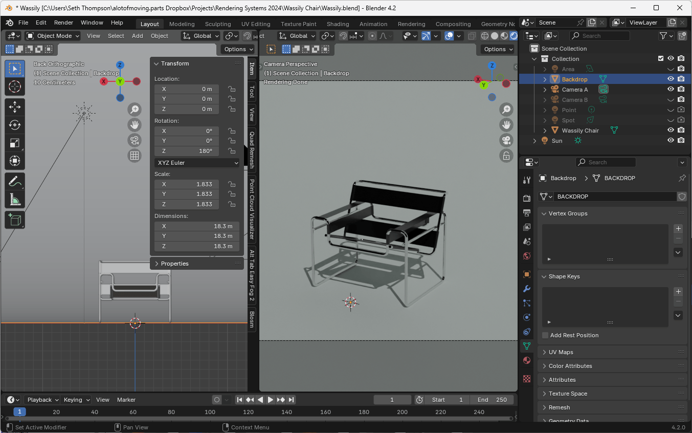

The sun light is a directional light that approximates an infinitely distant light source. Only the rotation of the sun light has an effect on the lighting of the scene. The position of the sun light in the scene has no effect at all.

1. Add a sun light: Add > Light > Sun
2. Adjust properties:
   - Color
   - Power (or intensity)
   - Rotation (to change the direction of the light source)

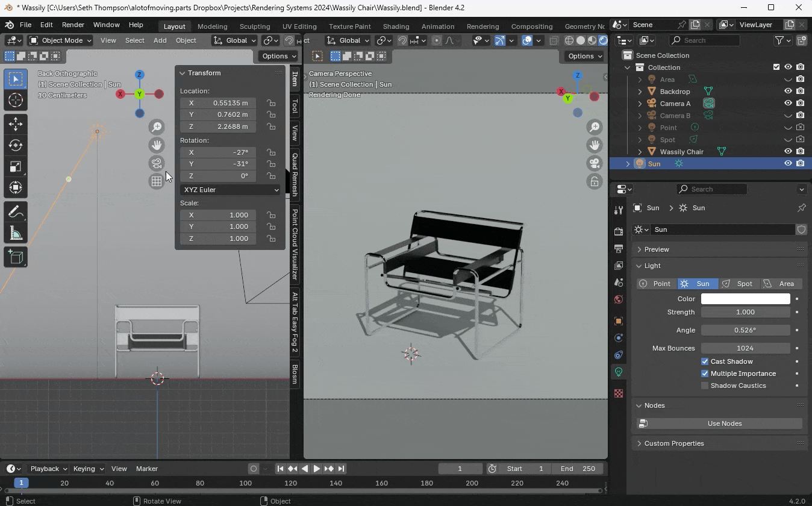
*Rotation is the only way to change a sun light. Changing position has no effect.*

The sun light can be used to simulate the light of the sun or a distant light source. However, outdoor lighting is affected by the atmosphere and the environment to a significant degree. You may find that a sun light alone is not sufficient to create a realistic outdoor scene. Instead see the following section on Environment Lighting.

## Environment Lighting

In addition to supporting distinct light sources, Blender allows us to simulate light from the surrounding environment as a simulated 360° dome around the scene. This technique is called Environment Lighting and it is akin to adding a material to the surrounding world itself.

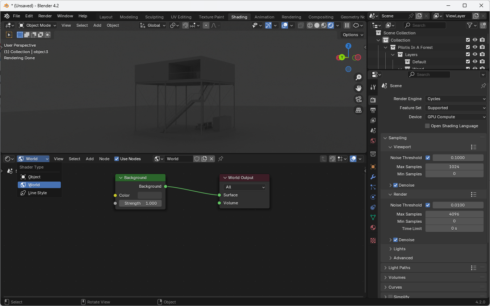
*Switch to the Shading workspace and change the Shader Editor from Object to World mode in the top-left corner*

You can modify the world material (or shader) by changing to the Shading workspace and clicking the World shader in the top left of the Shader Editor.

### Introduction to Nodes (Shader Editor)

Blender uses a node-based system to create small computational programs called Shaders that determine how light should behave at any given point in our scene. A shader can represent an environment (World mode) or an object's material (Object mode).

- Nodes are individual modules representing behaviors, configurations, or data
- Node graphs combine these modules into a sequence of operations
- The output of a set of modules becomes the input for other modules. Therefore, you can start reading node graphs backwards from the output (usually World Output or Material Output), slowly revealing how the material's final color was determined.

The World shader has a special World Output node and a special Background node. The task for changing or updating the shader is to replace the Color input of the Background node.

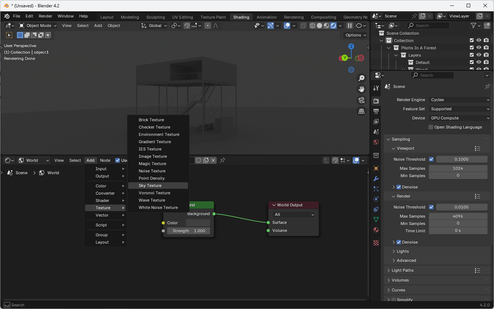
*Adding a texture node to the node graph.*

Try adding a node to the shader graph by going to Add > Texture and selecting a texture.

### Nishita Sky (Built-in Sky Texture)

Blender has a built-in, procedural sky shader that can be used to simulate the atmospheric scattering of light from the sun at a variety of times of day and weather conditions.

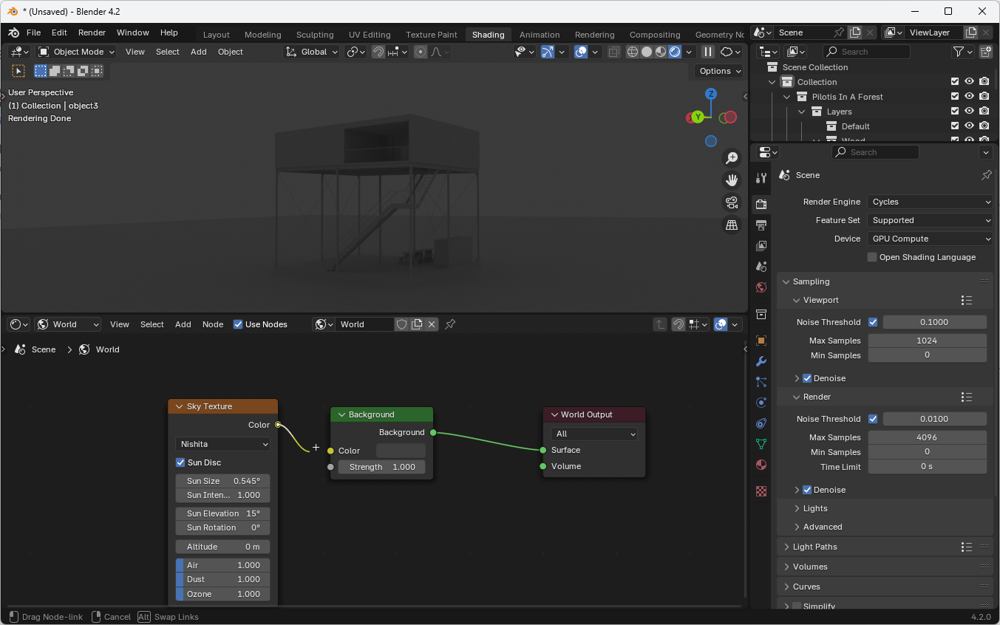
*Adding a sky texture by connecting the shader node to the Background input of the World shader.*

1. In the World shader, go to Add > Texture > Sky Texture.
2. Set the Sky Type to "Nishita" for the most realistic results.
3. Adjust Sun Direction, Turbidity, and other parameters to achieve your desired look.

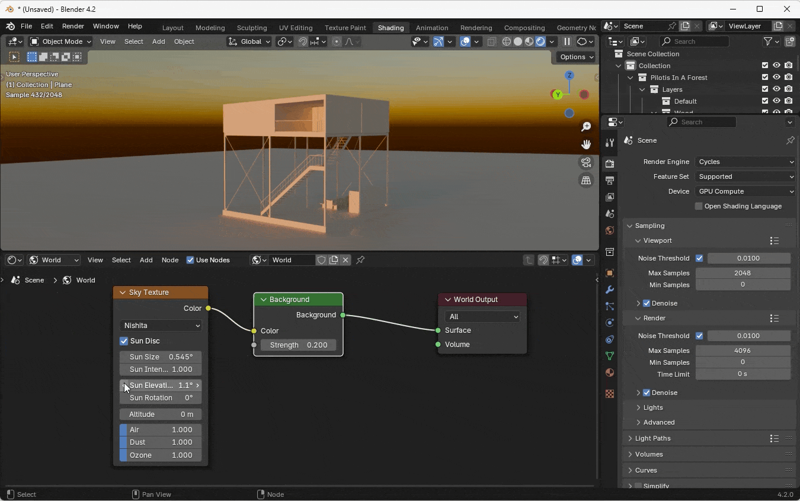

Although the Nishita sky shader doesn't have any clouds, it is a good option if you would like *dynamic* control of the sky's appearance.

### HDRi Lighting

HDRi stands for High Dynamic Range Image. HDRi images capture the full range of light intensities in a 360° scene. This makes them ideal for simulating a wide range of natural lighting conditions, from outdoor weather effects to recreating distant urban or outdoor environments without modeling them in detail.

HDRi images tend to produce a more realistic look than other lighting techniques, because they convey a rich range of colors and lights, from all directions. Their main downside is that they are static captures, and cannot capture moving lights or dynamic effects.

#### Resources for HDRi Images

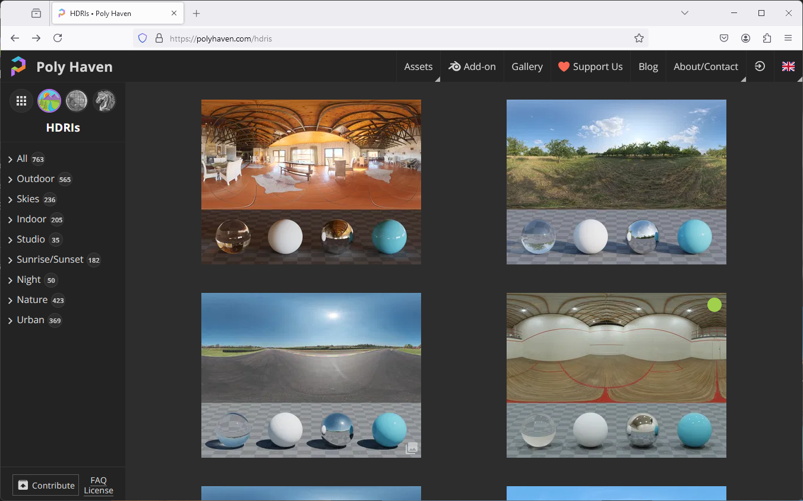

You can find free and open source HDRi images online. 

- [Poly Haven HDRIs (free)](https://polyhaven.com/hdris)
- [Ambient CG HDRIs (free)](https://ambientcg.com/)

Photographer Peter Guthrie curates a large collection of paid skies at [PG Skies (paid)](https://www.pg-skies.net/) that are categorized by weather conditions and times of day.

#### Adding an HDRi to Your Scene

1. Add an Environment Texture node: Add > Texture > Environment Texture
1. Load an HDRi image
1. Connect the Color output to the Background input
1. You may need to adjust the intensity of the background node (or adjust the Scene exposure) to achieve a realistic look.

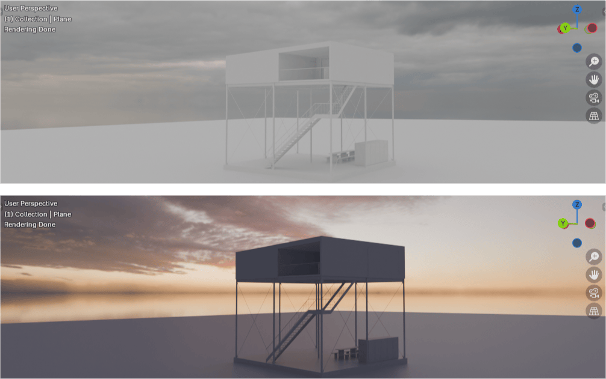
*Different HDRi images may need different background intensity values to achieve realistic lighting for your scene.*

In a perfect world, HDRi images would be calibrated to real-world sun intensities, but they rarely are. Don't be surprised if certain images need to be adjusted drastically to produce intensities within a realistic range.

### Rotating HDRi Environment Maps

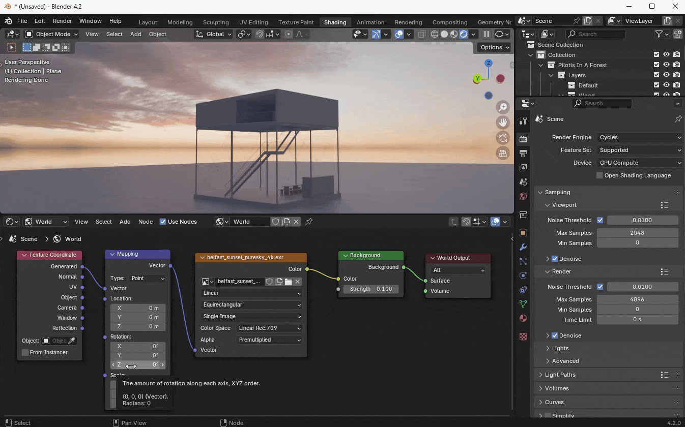

To precisely control the direction of light from an HDRi:

1. Add a Texture Coordinate node and a Mapping node.
1. Connect the Generated output of the Texture Coordinate to the Vector input of the Mapping node.
1. Connect the Vector output of the Mapping node to the Vector input of your Environment Texture node.
1. Adjust the Z Rotation in the Mapping node to rotate the environment.

The Generate texture coordinate is used implicitly by the Environment Texture node to map the 2D HDRi into 3D space. By explicitly adding the node, we can inset a Mapping node in between, which applies a transformation to the coordinates before they are used to sample the texture.

## Adjusting Light Intensity and Exposure

- Modify individual light intensities in their respective properties panels
- Adjust overall scene exposure:
  1. Go to Render Properties
  1. Under Color Management, adjust the Exposure value
  1. To achieve more dramatic lighting contrasts, change the Look setting from "None" to "High Contrast".

Ideally, your light intensities are calibrated to real-world values (and you use the scene exposure to achieve the correct look for a particular rendering). In practice, it may be difficult to know what values should be used for different types of light sources and how to map them to the units that Blender expects.

For more information, see [Unity's Light Intensity diagram](https://docs.unity3d.com/Packages/com.unity.render-pipelines.high-definition@13.1/manual/Physical-Light-Units.html#lighting-and-exposure-diagram) and [read this discussion](https://devtalk.blender.org/t/cycles-unit-of-light-energy-attn-brecht/12456) about the unit Blender uses for light intensity.

## Adding Lights to Your Scene

Now you should have the tools to add lights to your model. Try adding a few lights to your scene and adjusting their properties to achieve your desired look. 

Find an HDRi image that depicts a unique time of day and use it in a World shader to add an environment light.