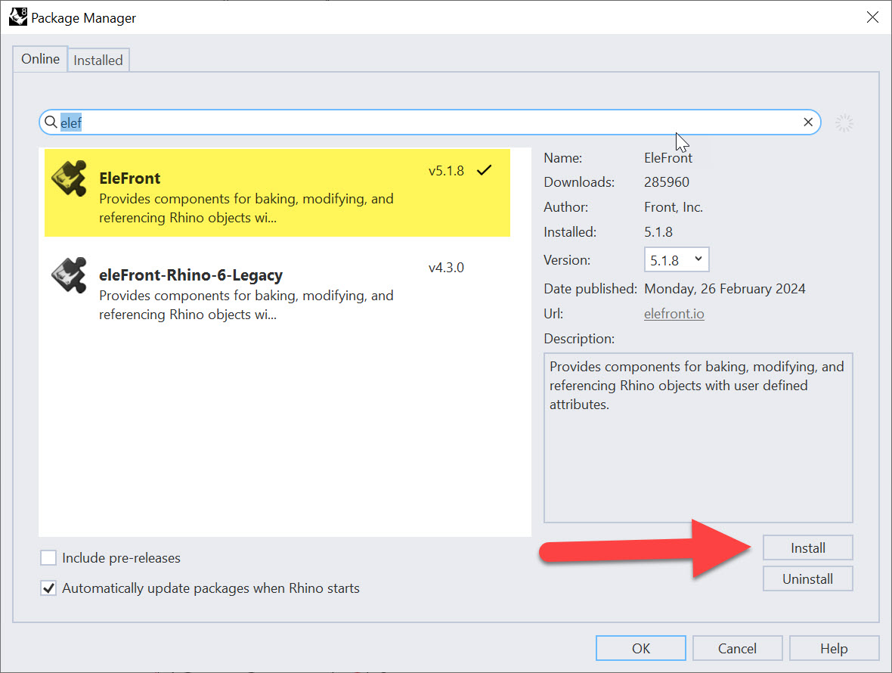

# Leveraging Object Attributes

Up to this point, we’ve:
- Set up our Rhino model with good construction geometry
- Established zoning and program targets
- Extracted key numerical and geometric data from our model

Now we’re ready to begin **establishing an underlying structural grid** that will carry through to Revit. But before we dive directly into slabs, columns and beams, we need to talk about a critical concept: **object attributes**. This will give us a way to transfer information cleanly between different Grasshopper definitions, while keeping our data lightweight and manageable.

## Why Break Definitions into Parts?

In the last few sections, we built a fairly large Grasshopper definition to handle:
- Massing
- Zoning compliance
- Program tracking
- Area calculations

We *could* keep stringing everything together in one giant script, but that quickly becomes slow and difficult to manage. A better approach is to treat each stage as its own **function** or even as its own **definition**:
- One script for analysis and massing
- A new, clean script for building structural systems

This modular approach makes it easier to debug, reuse, and pass files between team members.

But in order to break things apart, we need a way to **carry and organize data outside of Grasshopper**. That’s where attributes come in.

## Two Ways to Manage Data

There are two main strategies for managing complex data in Grasshopper:
1. **Data Trees** – powerful, but can become very difficult to manage in large projects
2. **Object Attributes** – lightweight, stored directly on the geometry, and transferable between definitions

We’re going to focus on **Object Attributes**, using the plug-in [**Elefront**](https://www.food4rhino.com/en/app/elefront). Note - don't install from Food4Rhino - see install instructions later in this section.

> **Joe’s Tip #12**  
> Don’t think of this as an either/or decision. In real projects, I use **both Data Trees and Attributes**. Learn them both, and use each where it makes the most sense.

## What is Elefront?

Elefront was originally developed by the façade consultants at [**Front Inc.**](https://front.global/) They needed a way to manage thousands of façade panels with different properties (curvature, type, material, etc.), and quickly realized that relying only on Data Trees was not scalable. Their solution: extend Rhino’s native object attribute system into Grasshopper.

- **Attributes** are essentially custom key–value pairs you can attach to geometry  
  - Example: `Program = Retail`  
  - Example: `Height = 14'-0"`  

- Once attached, these attributes stay with the object in Rhino (after baking) and can be queried later—whether in a new Grasshopper file or when exporting to Revit.

Rhino 8 has implemented some of this functionality natively, but I still recommend Elefront:
- Easier to understand
- More powerful in some workflows
- Free and actively used in practice
- Better documentation

## Installing Elefront

1. In Rhino, run the command `PackageManager`:  
2. Search for **Elefront**.  
- You’ll see two options: `Elefront` and `Elefront (Rhino6 Legacy)`.  
- Choose **Elefront** (only use the legacy version if you’re opening old definitions).  
3. Install, then **restart Rhino**.  

Once installed, you’ll see a new **Elefront tab** in Grasshopper.

## Setting Up Attributes on Floor Plates

We’re going to start by attributing our **floor plate curves** from the last module. These represent the boundaries of each slab, broken down by program type (Retail, Office, Hotel).

1. Open your Grasshopper file from the last module.
2. Locate the **section curves** that represent each floor plate. These are currently stored in a Data Tree with branches by program type.
3. To simplify, add a `Shift Paths (PShift)` component to clean up the structure.

At this point, you should have three sets of curves, one for each program.

## Adding Program Attributes

1. Drop an `Elefront Attributes` component onto the canvas.  
(It looks overwhelming, but don’t worry—we only need a few inputs.)
2. For the **Key (K)** input, create a `Panel` with the text `Program`:  
3. For the **Value (V)** input, create another `Panel` with the three program types listed on separate lines:  
`Retail`
`Office`
`Hotel`
> Right-click the panel and check **Multiline Data** so Grasshopper reads them as separate items.
4. Use a `Longest List` component to match up the keys and values so Elefront doesn’t throw an error.

Now every floor plate curve knows its **program**.

## Adding Height Attributes

Next, let’s store the **floor-to-floor height** as an attribute.

1. Create another `Elefront Attributes` component.
2. Plug the output of the first Attributes component into the **A** input of the second—this carries the first set of attributes forward.
3. For the new **Key**, create a panel with the text `Height`: 
4. For the **Value**, connect your floor-to-floor height numbers (from your stacking logic in the last module).
5. Again, use a `Longest List` to keep everything aligned.

Now each curve knows both its **Program** and its **Height**.

## Baking Attributed Geometry

Attributes are only useful if they stick to the geometry in Rhino. To do this:

1. Drop an `Elefront Bake Objects` component.
2. Connect your boundary curves to the **Geometry (G)** input.
3. Connect your attributed data to the **Attributes (A)** input.
4. Create a `Panel` that says `BAKED SLABS` and plug it into the **Bake Name** input.  
- This ensures that re-baking deletes old geometry instead of duplicating.
5. Use the same `Panel` and plug it into the **Layer** input in your first `Elefront Attributes` component.  
- This will send all baked geometry to a clean new layer layer.

Click **Bake**, and you’ll now see a Rhino layer called `BAKED_SLABS`.  
Check the Properties panel → **User Text** to confirm that each curve has its attributes.

At this point, you no longer need to keep the Grasshopper definition live—your curves are carrying the data themselves. To verify this, click on a curve in Rhino, then click on the Properties tab, and then click on the Attribute User Text button. You should see data associated with each curve. Click on a hotel, retail, and office curve to verify they have different data - if not, check you data organization in Grasshopper.

> **Joe’s Tip #13**  
> This is the real power of attributing: you can safely close one definition, and later open a new one that picks up right where you left off. The geometry itself is now a carrier of structured information.

**Side Challenge 8** Try extending this workflow by adding one more attribute:
- **Area**: Use the areas of each slab which we've already calculated and store it as an attribute.  
- Hint: Use the areas from before, connect them to a `Longest List`, and feed the values into another Elefront Attributes component.

If you can do this, you’ll now have geometry that stores **Program, Height, and Area**—ready for downstream use.

You can download the completed files here if needed:

[Grasshopper Definition](https://drive.google.com/file/d/1E7jpYyQ7R_ohUCKyAk6VAkXtiNSzmN8n/view?usp=drive_link)

[Rhino File](https://drive.google.com/file/d/1OF-cMd-HhzIPqt2Nq8zMGEej9Le-AfcO/view?usp=drive_link)

## Summary

In this section, we:
- Learned why it’s better to break Grasshopper definitions into smaller parts
- Introduced **object attributes** as an alternative to only using Data Trees
- Installed and set up **Elefront**
- Attached program and height attributes to our floor plate curves
- Baked them into Rhino with attributes intact

With these attributed slabs, we’re ready to move into the next step: establishing a **structural slab** in Rhino and Revit, using the attributes as a foundation for parametric coordination.

On to the next tutorial!

