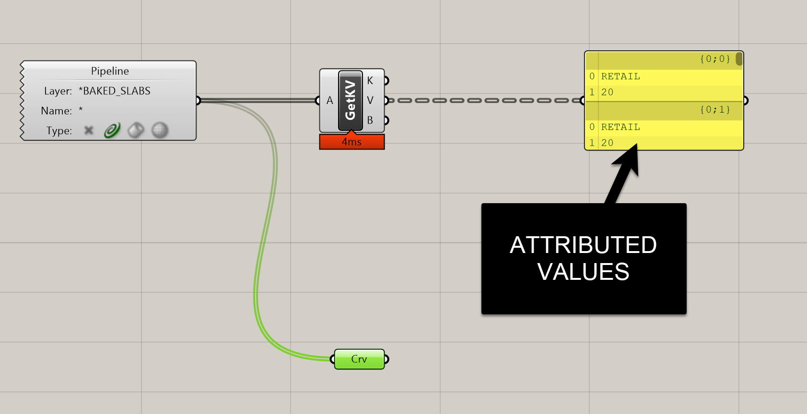
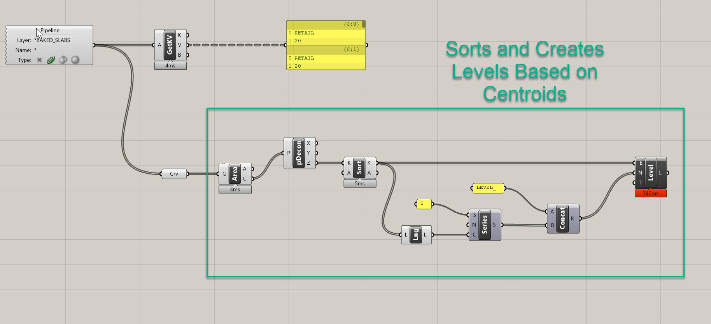
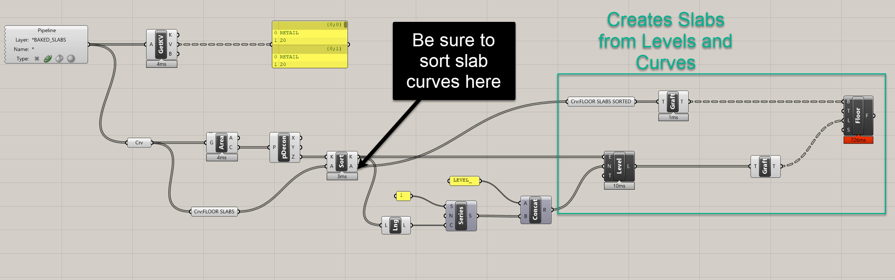
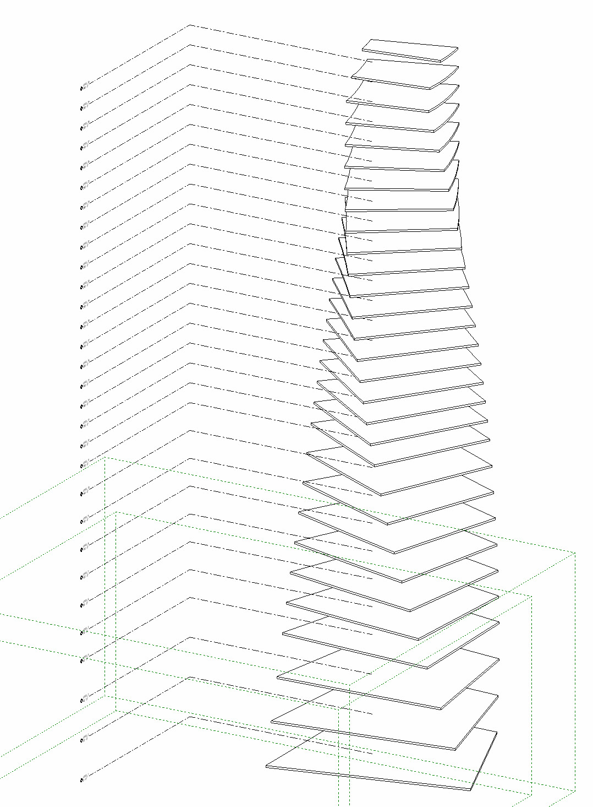
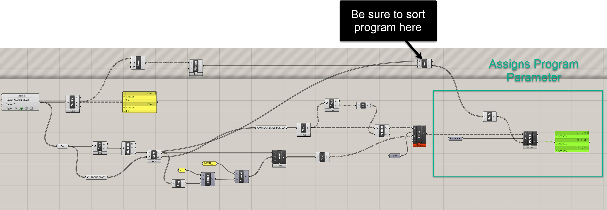
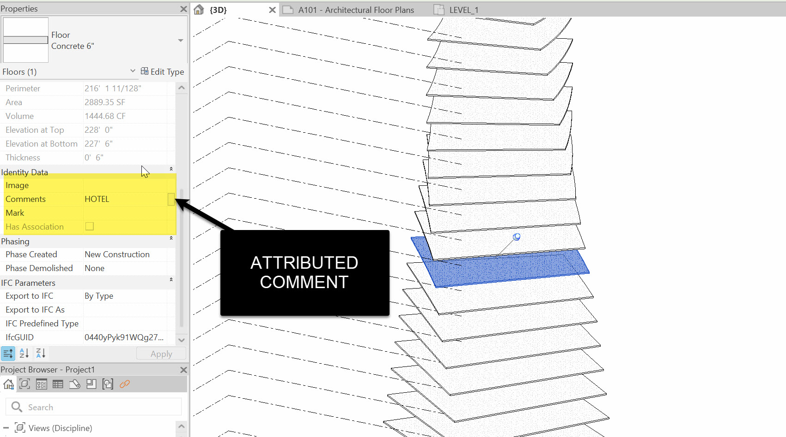
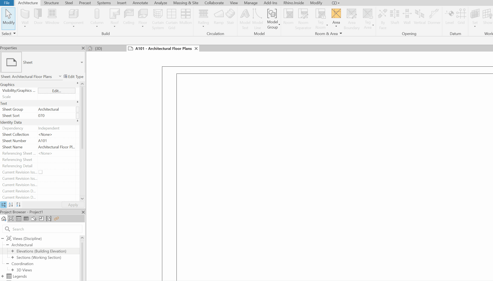

# Establishing Levels & Clean Slabs

Up to this point, we’ve:
- Built attributed slab boundaries with program and height data
- Baked them cleanly into Rhino for downstream use
- Set up a workflow where geometry itself carries structured information

Now we’re ready to **establish levels and slabs in Revit**. This step is critical: it translates our attributed 2D boundaries into 3D Revit elements that will serve as the backbone of the building. Done correctly, this creates a robust and parametric link between your Rhino massing logic and your BIM model.

---

## Why Start Fresh?

In the last section, we emphasized breaking definitions into **functions**. Rather than building on top of the large attribute script, we’ll:
- Open a **new Grasshopper definition**
- Reference the **baked slab curves** with attributes already attached
- Use those attributes to drive levels and slabs in Revit

This keeps our scripts lean and avoids carrying unnecessary complexity forward.

---

## Step 1: Bring in Baked Slabs

1. Drop a `Geometry Pipeline` component.  
   - Layer = `BAKED_SLABS`  
   - Geometry Type = Curves  
2. Add an Elefront `Get All Keys/Values (getKV)` component.  
   - Connect the pipeline output.  
   - Verify the outputs:  
     - Keys = `Program`, `Height`, `Bake_Name`  
     - Values = e.g. `Retail`, `20 ft`, etc.

At this point, you have geometry + attributes reconnected in a clean new definition.

---

## Step 2: Extract Elevations

To establish levels, we need the Z-heights of each floor.

1. Connect curves → `Area` → take **Centroid (C)**.  
2. `Deconstruct Point` → extract **Z** values.  
3. Use `Sort List` with Z as the key.  
   - This guarantees levels are created in order from bottom to top.  
   - Also sort the slab curves with the same keys, so everything stays aligned.

---

## Step 3: Create Levels in Revit

1. Get the number of slabs with `List Length`.  
2. Create a `Series`:  
   - Start = 1 (so we get Level_1 instead of Level_0)  
   - Step = 1  
   - Count = number of slabs  
3. Use `Concatenate` to build names like:  LEVEL_1, LEVEL_2, LEVEL_3

4. Add a `Revit → Add Level` component:  
- Elevation = sorted Z values  
- Name = concatenated strings

Check Revit → You should see a clean stack of levels. Delete any default L1/L2 levels from your template (Revit will warn about deleted views; we’ll recreate them later).

---

## Step 4: Create Clean Slabs

1. Ensure slab boundary curves are sorted with the same keys as levels.  
2. (Optional but recommended) Guardrail for planarity:  
- `Area` → centroid → `XY Plane`  
- `Project to Plane` → flatten curves  
3. Use `Revit → Add Floor`:  
- Boundary = projected curves (grafted)  
- Level = corresponding level (grafted)  
- Type = select from `Type` filter (e.g. “6\" Concrete”)

Check Revit: floors should place cleanly at each level.

---

## Step 5: Write Program into Revit

1. From `getKV` Values, extract **Program** with a `List Item`.  
2. Sort the program list with the same Z key used for slabs.  
3. Graft the list to match floor branches.  
4. Use `Revit → Parameter` filtered to **Floors**, select **Comments**.  
5. Use `Element Parameter`:  
- Elements = Floors  
- Parameter = Comments  
- Values = Program list

Now each floor in Revit carries its program directly in the Comments field.

---

## Step 6: Recreate Plan Views

Since we deleted template levels, create new floor plans:

- In Revit: **View → Plan Views → Floor Plan**  
- Select all new levels  
- Click OK

You now have fresh views for each level.

---

## Side Challenge 9

Try extending this workflow with two refinements:
1. **Zero-Padded Level Names** – format series numbers so they read `LEVEL_01, LEVEL_02, …`.  
2. **Auto Roof Level** – detect the top Z, add a “ROOF” level at `Top + Offset`.

---

## Summary

In this section, we:
- Referenced baked slabs with attributes in a new definition
- Extracted elevations and created ordered Revit levels
- Built clean Revit floors, ensuring planarity and alignment
- Wrote **Program** into each slab’s Revit Comments field
- Recreated floor plans for all levels

At this stage, you’ve established a **coherent skeleton** for your building in Revit: levels, slabs, and associated metadata. This is the foundation for structural systems, façade systems, and compliance checks in later modules.

On to the next tutorial!

