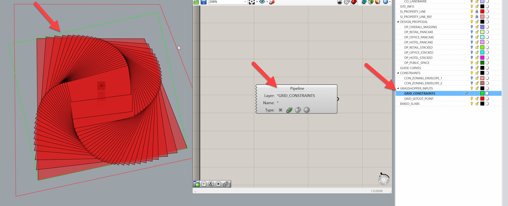
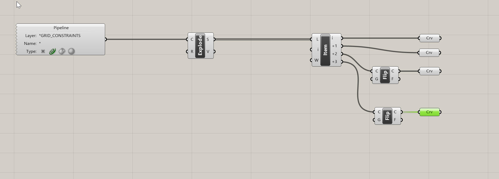
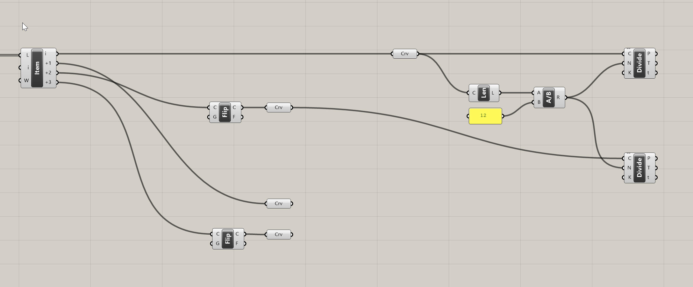
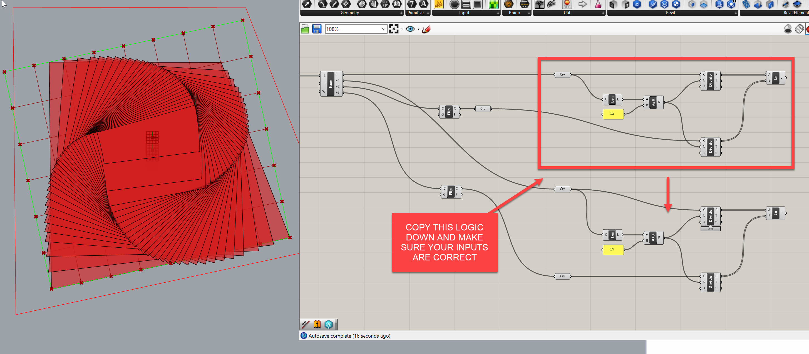
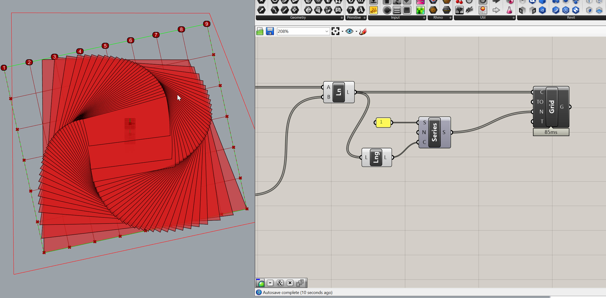
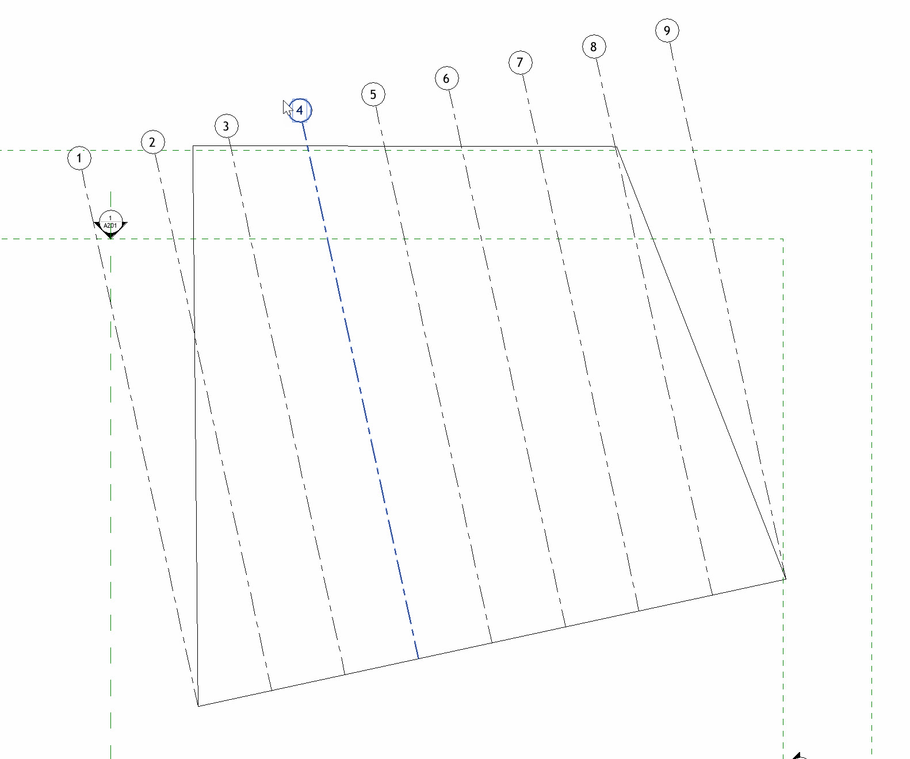
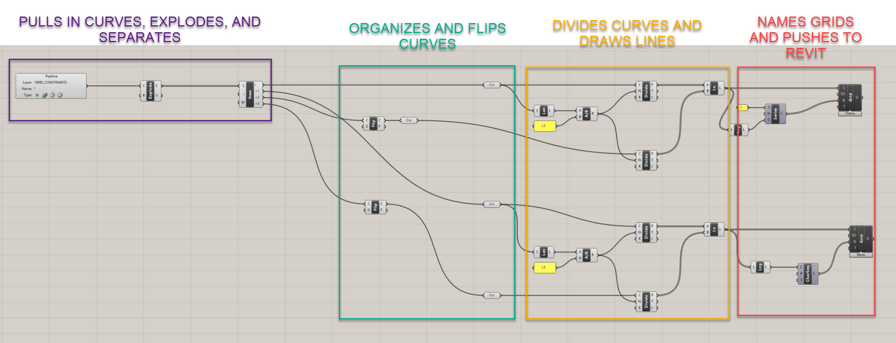

# Establishing Base Grid Using Numerical Inputs

To recap, we have:
- Set up our model and established global levels
- Linked Rhino and Revit through Rhino.Inside
- Prepared our file structure and layers for automation

Now, we’ll set up a **numerically defined grid system** to establish the foundation for our model. This grid will define our building’s organization, column layout, and major reference geometry. We’ll do this entirely parametrically, so spacing and extents can update dynamically as the footprint changes.

## Setting Up the Grid Constraint

Before creating the grid lines, we need a boundary to define where the grid should exist.

1. **Draw a rectangular or polygonal curve** in Rhino to define the grid boundary.  
   - Layer: `GRID_CONSTRAINTS`  
   - Name: `Grid Constraints`
2. In Grasshopper, drop a `Geometry Pipeline (Pipeline)` component.  
   - Filter for `Curves`  
   - Layer filter: `GRID_CONSTRAINTS`
3. Rename the curve component to `Grid Constraints` for clarity.

>**Joe’s Tip**  
> Use Geometry Pipeline wherever possible. It saves time when reloading or swapping models — the reference updates automatically when the same layer structure is used.

---

## Extracting Grid Axes

We’ll start by breaking our boundary into separate edges so we can define grid directions.

1. Use an `Explode (Explode)` component to split the rectangle into four edges. You should get four segments.
2. Add a `List Item (Item)` component and zoom in to create four outputs: `i`, `i+1`, `i+2`, `i+3`.
3. Add `Flip Curve (Flip)` components to ensure direction consistency:  
   - Flip `i+2` so it aligns with `i`  
   - Flip `i+3` so it aligns with `i+1`

This ensures both pairs of parallel edges run in the same direction, which will be important when we start connecting grid lines.

---

## Dividing Curves by Target Spacing

We’ll define grid spacing numerically to generate clean, regular divisions.

1. Add a `Length (Len)` component to measure the first edge.
2. Divide that length by a **target spacing value** using a `Division (A/B)` component. Use a `Panel` for 12 feet or your preferred spacing.
3. Plug the result into the **N (Count)** input of a `Divide Curve (Div)` component.  
   - Grasshopper will automatically round to the nearest whole number.
4. Copy this logic for the opposite edge, but reuse the same **N** so spacing remains consistent.

> **Joe’s Tip #2**  
> Always reuse division counts for parallel edges — that guarantees a uniform grid and clean intersections.

**Side Challenge:** *Can you set up variable spacing (e.g., an A/B pattern or a tighter grid near the core)? Try using an `Evaluate Curve` component instead of a Divide Curve*

---

## Creating Grid Lines

Now that we have matching points on each pair of parallel edges, we can connect them to form the full grid.

1. Use a `Line (Ln)` component. Connect the divided points from one edge (`A`) to their matching points on the opposite edge (`B`).
2. Repeat this for both X and Y directions.

This creates a clean, orthogonal network of grid lines across the footprint.

## Adding Grids to Revit

With Rhino.Inside Revit, we can now turn these lines into real Revit grid elements.

### Step 1: Numbered Grids (East–West)
1. Use an `Add Grid` component.
2. Plug your horizontal grid lines into the **C (Curve)** input.
3. Create a `Series (Series)` component to generate sequential grid numbers:  
   - Start: `1`  
   - Step: `1`  
   - Count: `List Length (Lng)` of your lines
4. Plug the output of the series into the **Name** input.

### Step 2: Lettered Grids (North–South)
1. Duplicate the setup for the vertical grid lines.
2. Use a `Character Sequence (CharSeq)` component for naming:  
   - **Count:** Connect a `List Length (Lng)` from the number of vertical grid lines  
   - **Pool:** Default alphabet (`A–Z`)
3. Plug the output into the **Name** input.

Now, when you open Revit, you’ll see numbered grids in one direction and lettered grids in the other.

---

## Adjusting Grid Geometry

Because this system is driven by the **Grid Constraints** curve, any change to that curve updates the entire grid network.

- Move or reshape the curve to follow your building footprint.
- Offset the boundary outward or inward (2’–3’) if you want columns set back from the edge.
- Lock the Grasshopper solver while editing to prevent mid-operation updates.

As soon as you unlock the solver, your Revit grids will update automatically.

## Side Challenge

*Try implementing an automatic offset system using a numeric input within Grasshopper. This ensures grids never intersect with the building perimeter.*

---

## Module Summary

In this module, we:
- Defined a flexible **Grid Constraints** boundary  
- Extracted directional edges and aligned them correctly  
- Divided the curves using **numerical spacing inputs**  
- Created grid lines dynamically  
- Pushed the results into Revit using **Add Grid** with automatic numbering and lettering  
- Adjusted and verified the grid to match complex footprints  

By the end of this exercise, you now have a fully parametric grid system that stays coordinated between Rhino and Revit — a key foundation for the next module, where we’ll begin defining **column and beam locations.**
