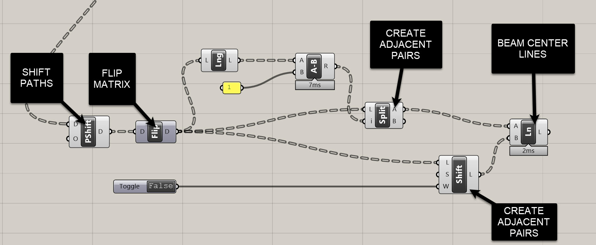
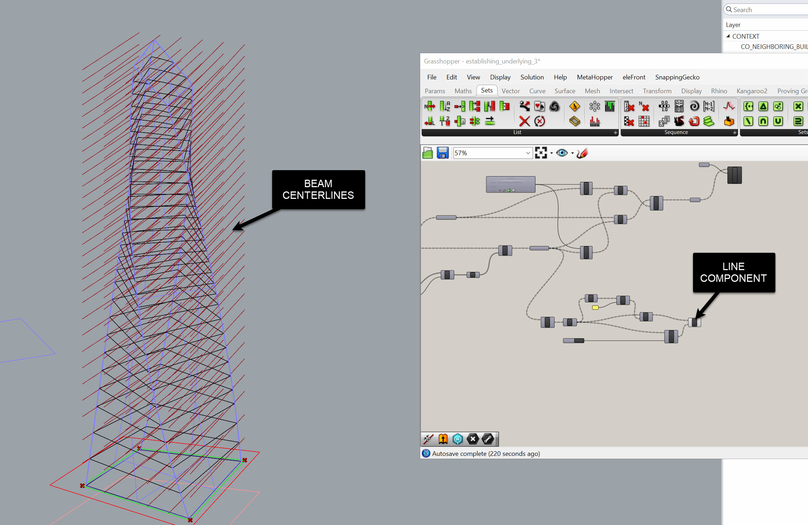
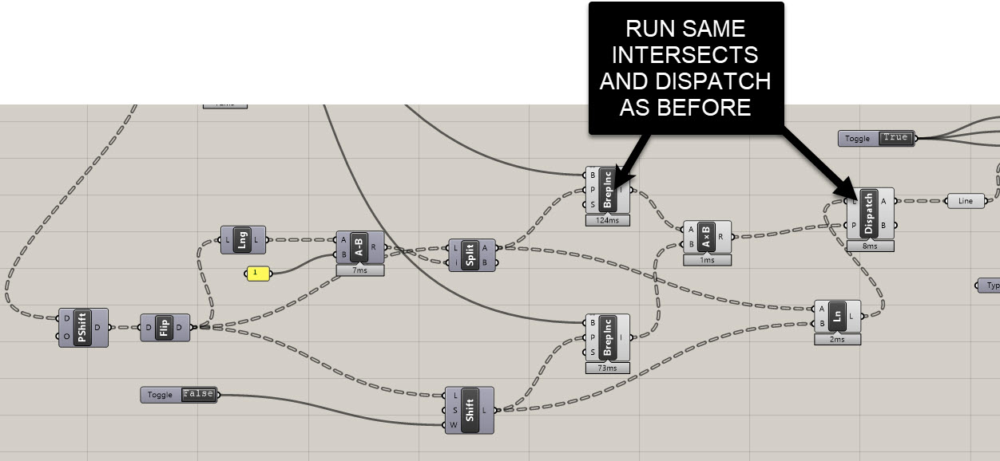
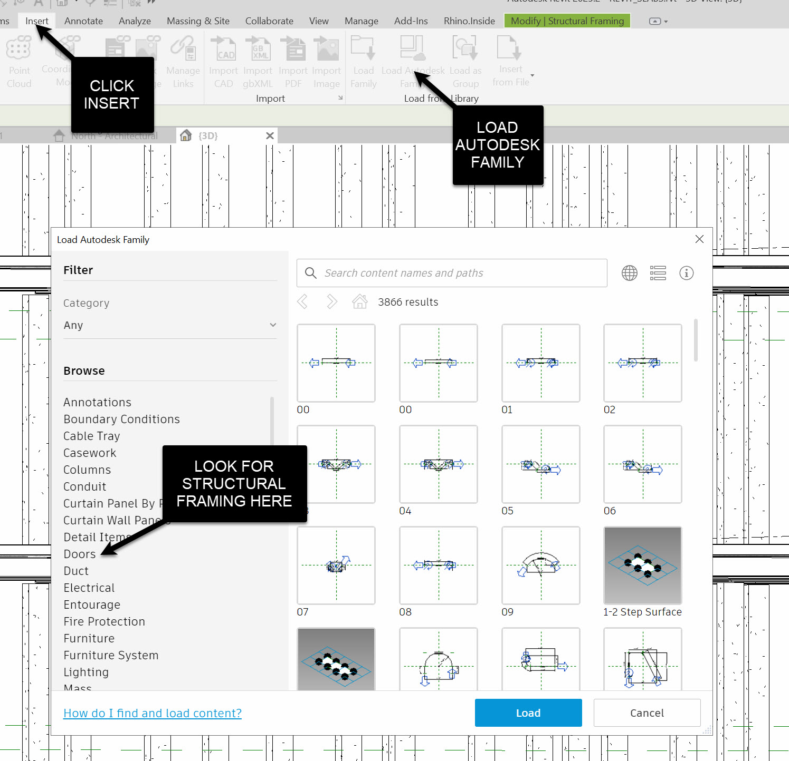
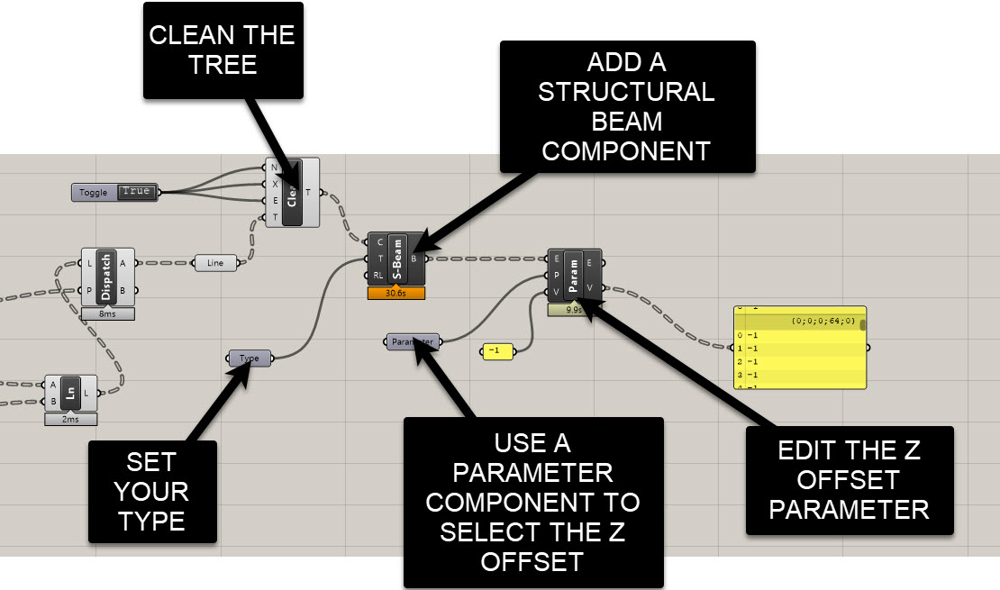
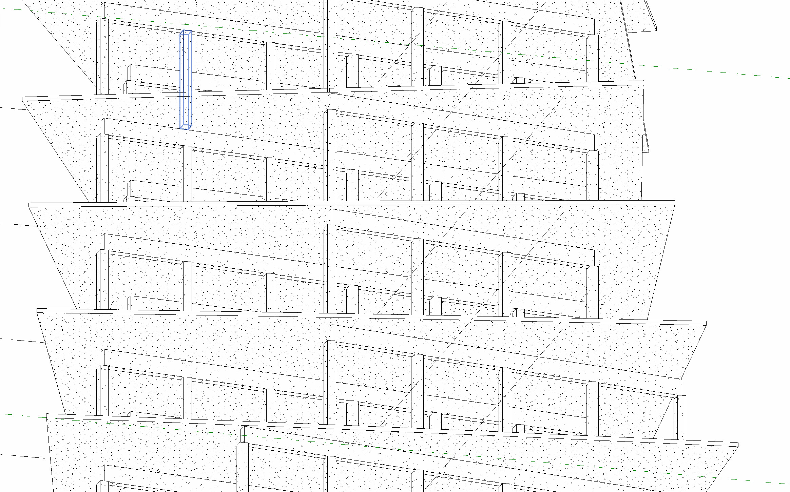

# Generating Beam Centerlines from Column Top Points

Now that we’ve got our columns in place, we’ll use the **column top points** to generate beam centerlines, **clean and cull** those beams to the building massing, and then push **Structural Framing** into Revit with the correct **Z Offset** so beams sit cleanly below the slab.

What you’ll make by the end:
- Beam centerline curves derived from column top points  
- A tidy, predictable data-tree structure (per grid direction)  
- A culling workflow that keeps only beams fully inside the massing  
- Revit beams placed with correct type and vertical offset

---

## Build a beam run per grid direction

We’ll start from the **column top points** created in the previous module.

1. **Flatten one level of hierarchy**  
   Use **Shift Paths** (`PShift`) on the column top points to remove the *floor* level from the paths so points are grouped **by grid line** instead of `(grid × floor)`.

2. **Flip Matrix to regroup**  
   Use **Flip Matrix** to “transpose” your data (think Excel rows ↔ columns).  
   - Before: grouped by vertical grid line (with many floors)  
   - After: you’ll get lists that are easier to connect across the span in a single direction (e.g., vertical lines → connect along the horizontal).

3. **Create adjacent pairs**  
   We want to connect points 1→2, 2→3, … across each grid line list.  
   - Get **List Length**, subtract **1**, and use that value to **Split List** → output **A** gives items `1..(n-1)`  
   - Take the original list and **Shift List** by `-1` with **Wrap = False** → output gives items `2..n`  
   - Use **Line** (start = A, end = shifted list) to create the beam centerlines.

   

> **Joe’s Tip**  
> **PShift** is your “remove one folder from the path” tool. Use it to collapse an extra tree level (like floors) when you only need grouping by grid.

> **Joe’s Tip**  
> **Flip Matrix** is just a *transpose*. If your logic calls for “the other grouping,” try flipping first before you rebuild anything.

---

## Cull beams to the massing

Just like with columns, keep only beams whose **both endpoints** lie within the building mass.

1. **Bring in massing (Brep)**  
   Use **Geometry Pipeline** to reference your overall massing layer.

2. **Point-in-Brep tests**  
   Run **Point In Brep** on each beam’s **start** and **end** points (the two lists from your split/shift workflow).

3. **Keep only fully-inside beams**  
   - Combine the two boolean lists  BY multipling as 1/0
   - Use **Dispatch** on the **beam lines** with that pattern → the “kept/true” set are your valid beams.
   

---

## Place Revit Structural Framing

When you’re ready to generate native beams:

1. **Type selection**  
   Add a **Type** node → right-click → choose a **Structural Framing** type (e.g., *Concrete Rectangular 12x24*).  
   If you need to load families, do it in Revit first (**Insert → Load Autodesk Family → Structural Framing → Concrete → Rectangular**).
   

2. **Add Structural Beam**  
   Use **Rhino.Inside.Revit → Elements → Structural → Add Beam** (sometimes labeled **Add Structural Beam**).  
   - **Curve** = your **culled** beam centerlines  
   - **Type** = from the Type node  
   - Right click on the node. In the component options, set **Tracking Mode = Enabled Replace** so it updates cleanly on re-runs. You may need to set this for your columns as well

3. **Set Z Offset so beams clear the slab**  
   Revit places beams by **centerline**, so you’ll often need a **negative Z Offset** to drop them under the slab soffit.  
   - Use **Element Parameter** (get/set) for your placed beams  
   - **Parameter** = “Z Offset Value”  
   - For a 12" deep beam: set **Z Offset = -0.5'**  
   - For a 24" deep beam: set **Z Offset = -1'**  
   (Adjust for your units and exact depth.)

   
   

> **Joe’s Tip**  
> The sign convention trips everyone: **negative** Z Offset lowers the beam. Match the magnitude to **half the beam depth** if you want the **top** to align to the level.

---

## Housekeeping & performance

- **Clean Tree** before parameter writes to avoid empty branches.  
- Keep the **massing** simple (single closed Brep) for faster **Point In Brep**.  
- If the wrong beams are forming, check your **Split List** and **Shift List (Wrap=False)**—off-by-one errors usually live there.  
- Verify units: `0.5` feet = 6 inches.

---

## Side Challenge

So far we built runs in **one** grid direction.  
**Build the other direction** using the same approach: PShift → Flip Matrix (as needed) → Split/Shift to make adjacent pairs → Lines → Point-In-Brep cull → Add Structural Beam → Z Offset. Hint: You may need to shift your path in another direction.
Extra credit: assign different **Revit Types** per direction.

---

## Summary

You now have:
- Beam centerlines constructed by adjacent-pairing column top points  
- A consistent, readable tree strategy using **PShift** and **Flip Matrix**  
- A robust culling workflow against the massing  
- Native Revit beams with correct types and **Z Offsets** for clean slab relationships

This sets you up for framing in both directions and prepares the graph for program-aware variations and connection details in later steps.
