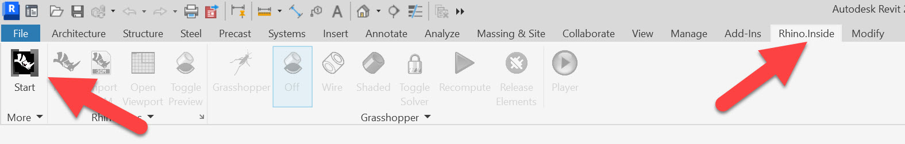
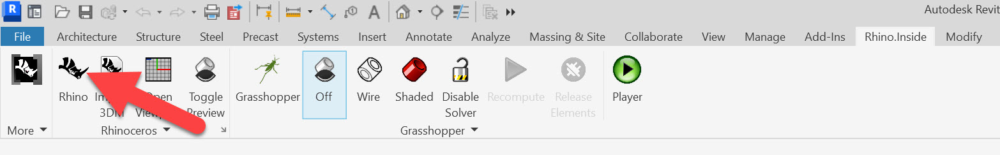
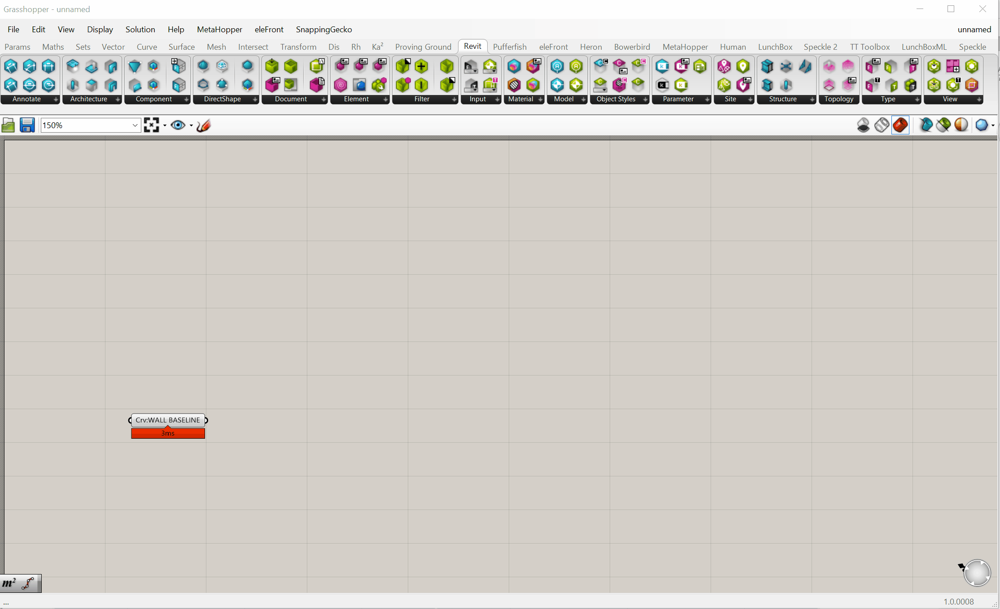

# Intro

In this section, we’ll cover the fundamentals of setting up a structural system in Revit using Rhino.Inside. This is a key milestone in our workflow: transitioning from conceptual modeling and construction geometry in Rhino into a fully interoperable, native BIM model in Revit.

You’ll learn:
- The core concepts behind Rhino.Inside
- How construction geometry plays a critical role in interoperability
- How to launch Rhino.Inside properly
- How to create native Revit walls and floors from Rhino geometry
- What makes a good Rhino-to-Revit workflow and how to avoid common pitfalls

---

## Why Construction Geometry Matters (Again)

You may remember this concept from the [Construction Geometry](https://smorgasbord.cdp.arch.columbia.edu/modules/24-parametric-thinking-for-building-modeling/241-construction-geometry) module: clean, simple, and intentional geometry is your friend. As we move into Revit, that principle becomes even more important.

**Why?** Because Rhino.Inside doesn’t simply import whatever you’ve modeled—it interprets your inputs to create *native Revit elements*. Solids, meshes, and messy trimmed surfaces from Rhino make for clunky, inaccurate Revit models. Instead, use construction lines, curves, and planes as the “skeleton” to generate proper Revit elements.

> **Joe’s Tip #11**
>
> Keep a dedicated layer for construction geometry in Rhino. You can flesh out your Rhino model with solids for rendering and visualization, but always preserve the underlying lines and points that can drive Revit elements later.

---

## What is Rhino.Inside?

Put simply, **Rhino.Inside** runs Rhino and Grasshopper *inside* another application—Revit in this case. This allows you to:
- Use Grasshopper to access and manipulate the Revit API
- Create native walls, floors, roofs, and other objects
- Maintain full Revit parametric behavior

This is fundamentally different from importing Rhino geometry, which creates “dumb” CAD or mesh objects in Revit.

### Rhino.Inside vs. Dynamo
If you’ve used Dynamo before, you’ll recognize many of the same workflows. However:
- Rhino.Inside leverages Grasshopper, which is far more powerful and flexible for geometry
- Rhino.Inside gives you the ability to work directly with your Rhino model
- You can use your existing Grasshopper skills, rather than learning a new tool

> **Joe’s Tip #12**
>
> When in doubt, use the tool you know best. Both Dynamo and Rhino.Inside can accomplish similar tasks—but confidence and speed matter more than theoretical “best.”

---

## How to Launch Rhino.Inside

Let’s step through the correct way to start a Rhino.Inside session.

1. Open **Revit** and start a new project (use any template—for this demo, I used `Imperial - Multidiscipline`)
2. Navigate to the `Rhino.Inside` tab in the Revit ribbon
3. If you don’t see it, check under `Add-Ins` instead
4. Click `Start` to launch Rhino.Inside
5. Then click `Rhino` to open the embedded Rhino window
6. Finally, launch Grasshopper as usual from within Rhino

Once Grasshopper is running, you’ll see additional tabs:
- **Revit**: components for creating and modifying Revit elements
- **Revit Params**: containers and data types for Revit categories, types, and levels

---

## Your First Native Revit Element: The Wall

Let’s build a wall natively in Revit using a Rhino line.

### Step 1: Draw the construction line
In Rhino, draw a polyline about 20 feet long. Put it on your `CONSTRUCTION_GEOMETRY` layer.

### Step 2: Reference the curve
In Grasshopper:
- Drop a `Curve` parameter and `Set One Curve` to your line
- Name it `Crv:WALL BASELINE`

### Step 3: Create the wall
From `Revit > Architecture`, drop an `Add Wall` component. Connect:
- `Crv:WALL BASELINE` → `Curve`
- Optional: use a `Panel` or `Slider` to set `Height` (e.g., 12’)
- Optional: use the `Type` component to select a specific wall type (e.g., `Generic 10”`)
  - Right-click `Type`, set category to `Walls`, and pick from your project types

When successful, the `Add Wall` component turns black. Check Revit—you’ll see a native wall there.

> **Joe’s Tip #13**
>
> When working with walls, you cannot use a closed polycurve directly. Explode it first into individual lines and feed them into a single `Add Wall` components. Revit expects individual segments for walls.

<!-- Suggest inserting a side-by-side image: Rhino line + Revit native wall created -->

---

## Floors: Even Easier

Unlike walls, floors *can* accept closed polycurves. Try this:
- Draw a closed rectangle in Rhino
- Reference it in Grasshopper
- Use `Revit > Architecture > Add Floor`
- Set floor type and level if desired

This will generate a native Revit floor based on your polycurve.

---

## Clean Geometry is Critical

One of the most common failure modes in Rhino.Inside is messy geometry. Here’s what to watch out for:
- Avoid overlapping or self-intersecting curves
- Ensure closed curves are truly closed
- Keep points and levels aligned correctly
- Maintain proper direction (sometimes reversing a curve can flip your wall orientation)

> **Joe’s Tip #14**
>
> The hard part isn’t creating the wall in Revit—it’s making sure your Rhino geometry is clean enough to drive it.

---

## Understanding Feedback Colors

You’ll notice different color states in your Grasshopper components:
- **Black**: successfully created native Revit elements
- **Gray**: working fully within Grasshopper, but not pushing data to Revit.
- **Orange**: missing input or minor issue
- **Red**: serious error—check your inputs (but may also still work)

Pay attention to these states—they’re your first line of debugging.

---

## Summary

We’ve now set the foundation for using Rhino.Inside effectively:
- It runs Rhino + Grasshopper inside Revit and gives you access to the Revit API
- You can use clean Rhino construction geometry to drive native Revit elements
- Walls require individual open curves; floors accept closed curves
- You can assign types, levels, and other Revit parameters directly from Grasshopper
- The real challenge is clean, organized geometry—not the scripting

In the next part of this module, we’ll use these principles to build out a full structural grid and framing system.

---

> **Side Challenge 7:** Draw a closed rectangle in Rhino, explode it into lines in Grasshopper, and build a joined native Revit wall system. Then use the original rectangle to create a floor. Compare how each behaves in Revit. Also try constructing a floor from a complex NURBS curve and see what happens.

<!-- Suggest inserting an image here showing a structural grid generated in Revit from clean Rhino lines -->

