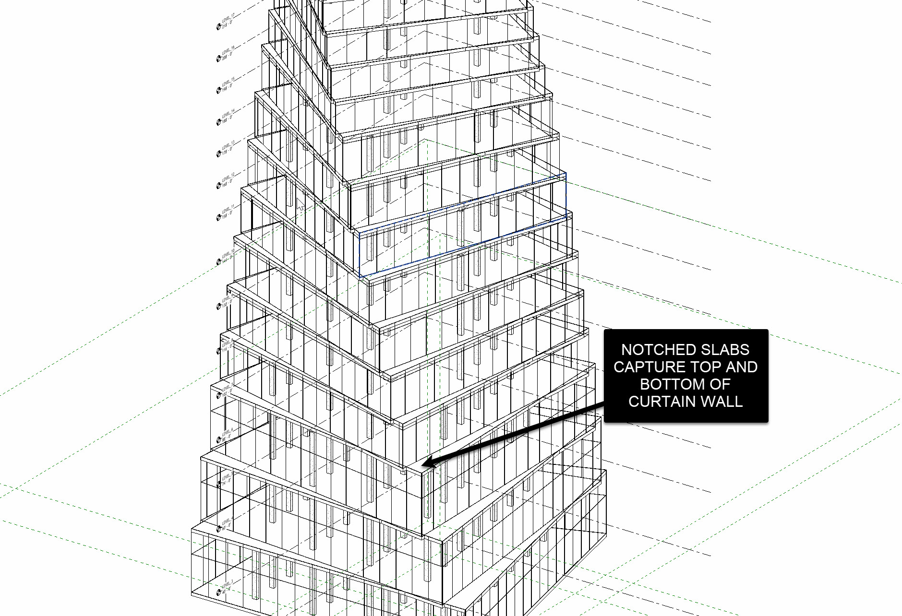
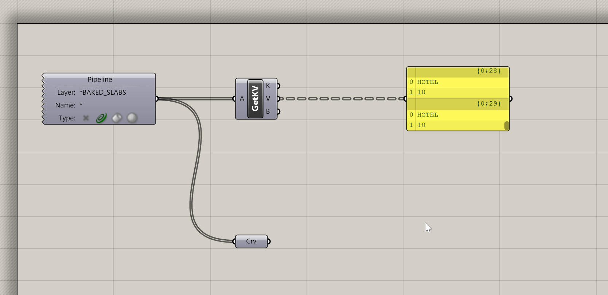
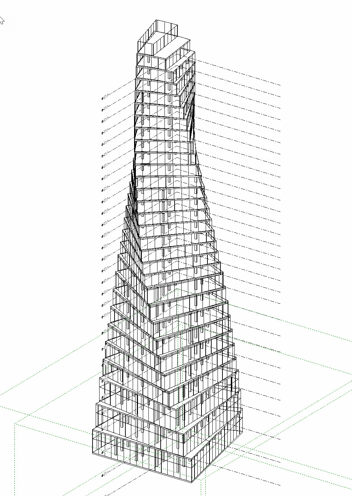
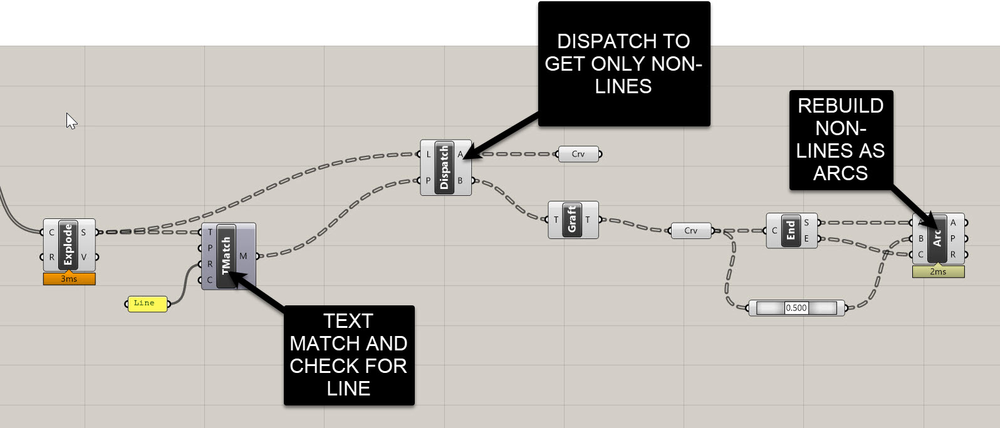
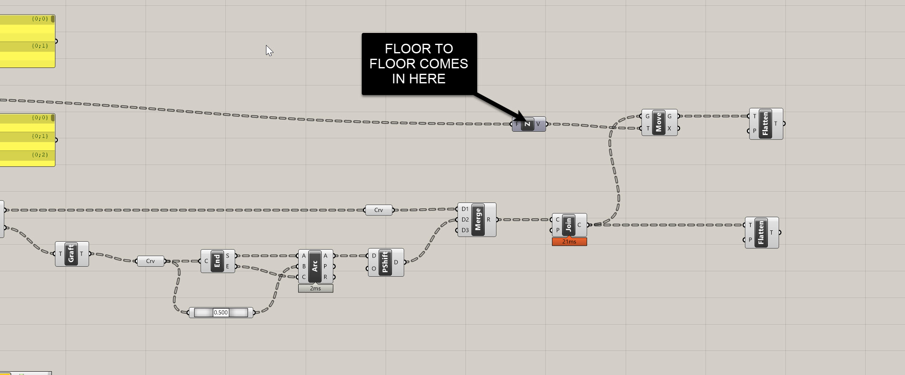
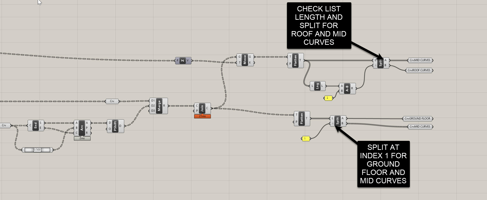
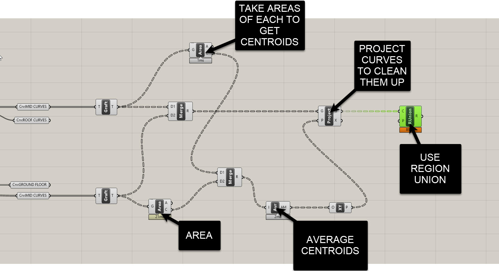
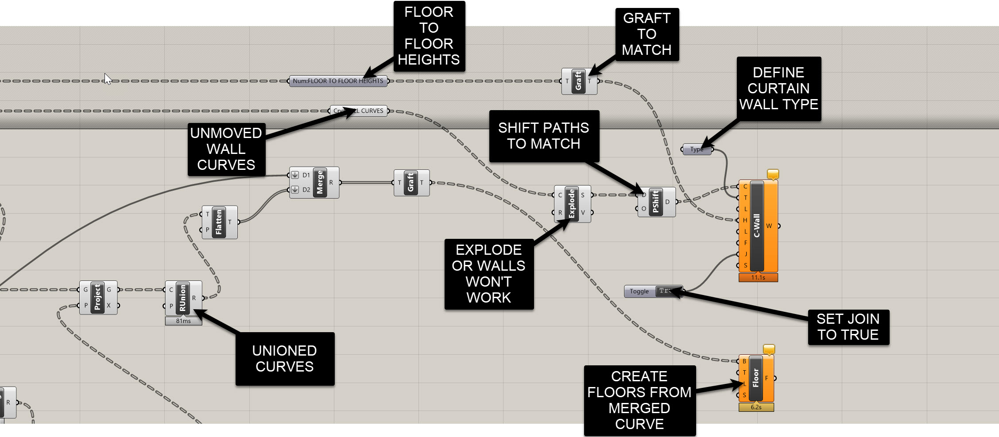

# Leveraging System Families for Simple Facades

In this module, we’ll build our first **Revit-driven facade** using **system families** (curtain walls and basic walls) driven from Grasshopper via Rhino.Inside.

This approach is best suited for buildings where:

- Facades are **vertical** (not leaning in or out), and  
- They are either **straight in plan** or **curved in plan**, but **not twisting** as they rise.

More complex conditions (twisting towers, leaning facades, or non-vertical panels) will be handled later with **adaptive families** and **direct shapes**.

We’re going to:

- Re-use our **attributed slabs** and floor-to-floor data from earlier modules  
- Clean up slab edge curves so Revit reads them as **pure lines and arcs**  
- Rebuild slabs so they **close gaps** at the top and bottom of the facade  
- Use those cleaned curves to drive **Revit floors and curtain walls** via Rhino.Inside

---

## 1. Starting a Fresh “Facade Definition”

We’re intentionally **not** building facades inside the structural or massing definitions. Instead, we’re treating this as a **new function** dedicated solely to facades, and re-using previously baked, attributed geometry.

1. Start a **new Grasshopper definition** in the same Rhino file.  
2. Drop a `Geometry Pipeline (Pipeline)` to pull in your **attributed floor slabs** (curves or slabs) on the appropriate layer.  
3. Use `GetKV` from Elefront to retrieve:
   - Program  
   - Floor-to-floor height  
   for each slab.  
4. Confirm you have:
   - A list/tree of **slab edge curves**  
   - A list/tree of associated **heights** and **programs**

   

Conceptually, this definition is your **“Facade System Families”** function, sitting alongside your:

- **Massing + program extraction**  
- **Structural system**  
- **Compliance/targets**

---

## 2. Geometry Strategy Before Facade Strategy

Before we draw a single wall, we need to make a **big decision**:

> Are we treating this tower as a **vertical system facade** or as a **twisting / leaning facade**?

In this module, we’re assuming:

- All facades are **vertical**,  
- They can be **curved in plan**,  
- But they **do not twist** as they rise.

That choice **changes how we build our slabs**:

- For a **twisting tower**, you might let each slab follow the twist and let the facade “lag” or cut through.  
- For a **vertical curtain wall**, the slabs need to **“close the gaps”** at top and bottom so that the vertical glass still works as you move up the building.

We’re going to **rebuild** our slab curves specifically for this vertical system-facade scenario.

> **Joe’s Tip**  
> Always decide on your **facade strategy** before you invest in geometry. Twisting mass + vertical glass ≠ same slab logic as twisting mass + twisting glass. If you don’t decide early, you’ll end up rebuilding a lot of geometry later.

---

## 3. Cleaning Up Slab Edge Curves (Lines + Pure Arcs Only)

Revit’s wall-by-curve components are happier when the input curves are **pure lines and arcs**, not messy “referenced planar curves” or polycurves. This step is all about **curve hygiene**.

### 3.1 Explode the Slab Boundaries

1. Start from your **floor slab boundary curves** (one closed curve per floor).  
2. Use `Explode` on those curves.  
3. Inspect the output with a `Panel`:  
   - You’ll see a mix of **“line-like curves”** and **“referenced planar curves”** (almost arcs, but not quite).

We want to keep the true lines, and **rebuild** everything else as **true arcs**.

### 3.2 Classify Segments with Text Match + Dispatch

Grasshopper labels the segment types as text, so we can use that to sort them:

1. Add a `Text Match` component (`Sets > Text > Match Text`).  
2. Plug the **exploded curves** into the *T* input.  
3. In the *R* (regex) input, type:  
   `line`  
4. The `M` output gives you a **True/False** pattern:
   - `True` = line segment  
   - `False` = planar curve needing rebuild  
5. Use a `Dispatch`:
   - `A` → lines  
   - `B` → curves to rebuild

### 3.3 Rebuild Planar Segments as Arcs

For segments in `B`:

1. `Graft` the curves.  
2. Use `End Points` (start + end).  
3. Use `Point On Curve` (`t = 0.5`) for midpoints.  
4. Build a `Arc 3Pt`:
   - Start  
   - Mid  
   - End

Result:  
A clean set of **true arcs** that perfectly replace all the “almost planar” curves.

### 3.4 Reassemble Per-Floor Closed Curves

1. `Merge` the line and arc segments.  
2. Use `Shift Paths` to group them back into **one branch per floor**.  
3. Use `Join Curves` to create a **clean closed boundary** per slab.

---

## 4. Rebuilding Slabs to Close Facade Gaps

Now we’ll fix the top/bottom gaps so a **vertical curtain wall** can work correctly.

### 4.1 Move Curves Up by Floor-to-Floor Heights

1. Get **floor-to-floor heights** from your attributed data.  
2. Flatten or graft so curves and heights align.  
3. Move curves upward using `Move` with a Z vector multiplied by height.

Now you have:

- Original curves  
- Curves shifted up one level  

### 4.2 Isolate Ground, Middle, and Roof Curves

Original curves:

- Split List at index **1**  
  - First → ground floor  
  - Second → mid + roof  

Shifted curves:

- Compute list length → subtract 1 → split  
  - First → mid shifted  
  - Second → roof  

### 4.3 Region Union for Mid Slabs

We union lower/upper curves to remove gaps:

1. `Graft` mid curves.  
2. `Merge` lower + upper curves per floor.  
3. If region union errors occur, project curves onto XY planes created at each curve centroid:
   - `Area` → centroid  
   - `Construct Plane`  
   - `Project`  

Result: Perfectly planar outlines for each mid slab.

### 4.4 Use Region Unions as New Slab Boundaries

In Revit:

- Delete all existing slabs (select all instances → unpin → delete).

In Rhino.Inside:

- Use `Add Floor`.  
- Feed region union curves as boundaries.

You should now see **notched slabs** that cleanly close the facade.

**Important:**  
- Use **region union curves** for slabs.  
- Use **cleaned curves** (lines + arcs) for walls.

---

## 5. Building System-Family Curtain Walls from Clean Curves

### 5.1 Set the Wall Type

Choose `Exterior Glazing` (or your own system) in Revit.

### 5.2 Feed Curves Into the Wall Component

The wall-by-curve component requires **segments**, not closed curves.

1. `Explode` your cleaned slab edges again.  
2. Plug segments into `Curve` input.  
3. Turn **Allow Joins = True** to let Revit join walls internally.

### 5.3 Set Heights From Floor-to-Floor Data

1. `Graft` height values to match curve structure.  
2. Plug into `Height`.

### 5.4 Tracking Mode: Enabled Replace

Always use:

> **Tracking Mode: Enabled Replace**  
> (Deletes + recreates elements each solve)

Much safer during early design when element counts change.

---

## 6. Using the Right Curves for the Right Job

Summary:

- **Region union curves** → slabs  
- **Cleaned line/arc curves** → walls  
- **Exploded curves** → wall-by-curve  
- **Joined curves** → never used directly for walls  

You can download the final working file here: https://drive.google.com/file/d/1O4hkWXVs-PbYg87efCzgZhXoIT2Mk9aT/view?usp=sharing

---

## Side Challenge: Controlling the Slab–Facade Relationship

Try adjusting:

- **Base offset**  
- **Top offset**  
- **Location line**  
- **Height constraints**

See if you can produce:

- Exposed slabs  
- Flush facades  
- Recessed glass conditions  

All driven parametrically.

**Also, can you use sorting to add the roof into slab list?**

---

## Wrapping Up

In this module, we:

- Cleaned slab boundaries into **Revit-friendly lines + arcs**  
- Rebuilt slabs via **region unions**  
- Drove **system-family curtain walls** from Grasshopper  
- Introduced best practices for **planarity, list management, and tracking**

Next up: **Adaptive families for twisting facades**.
