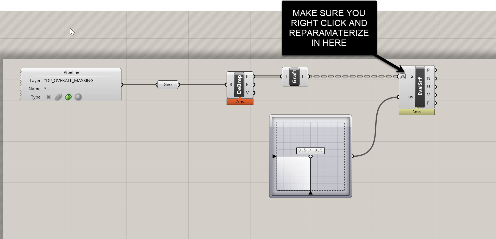
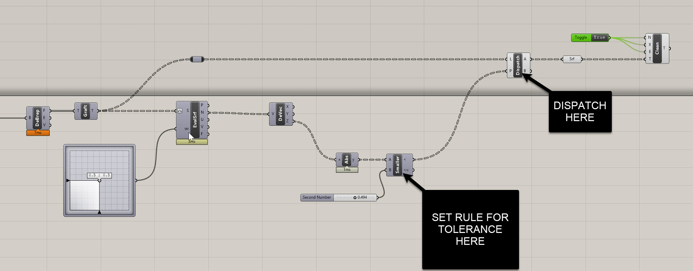
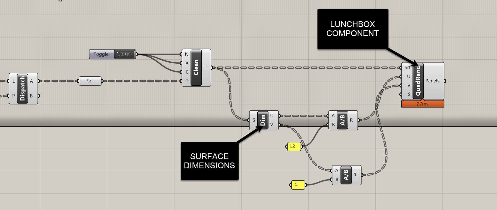
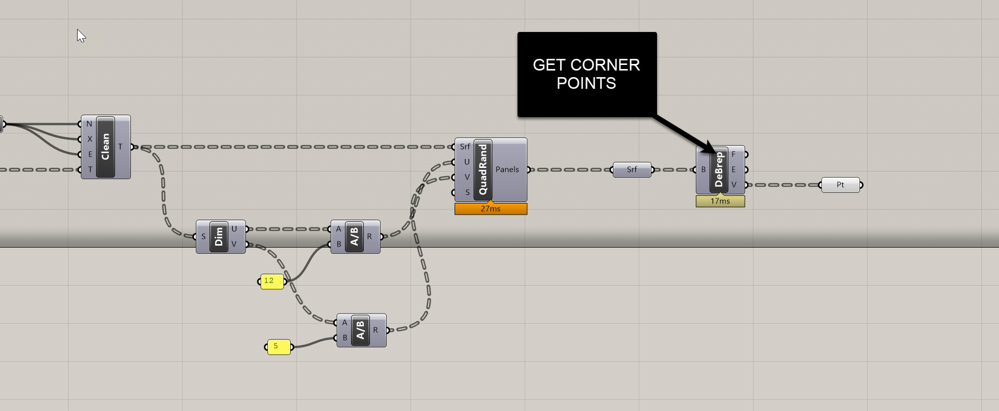
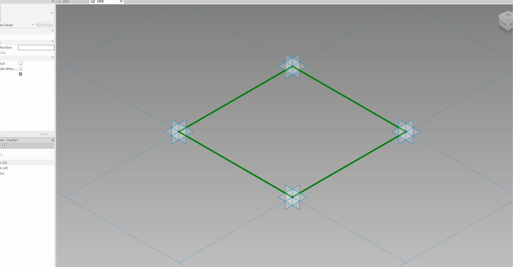
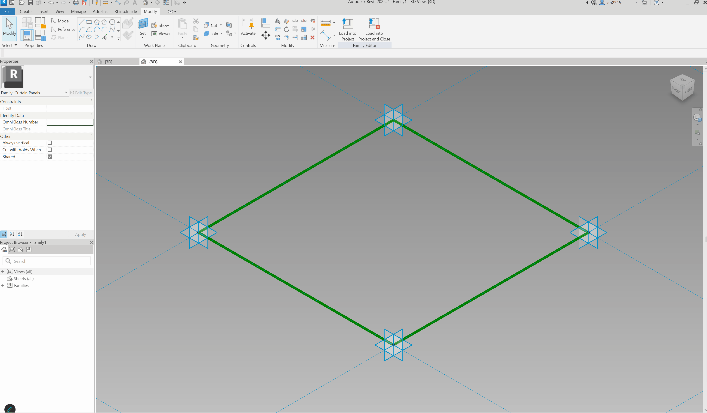
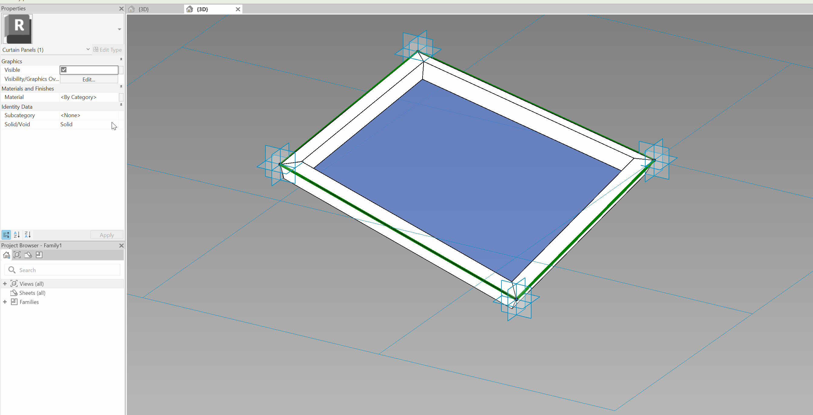
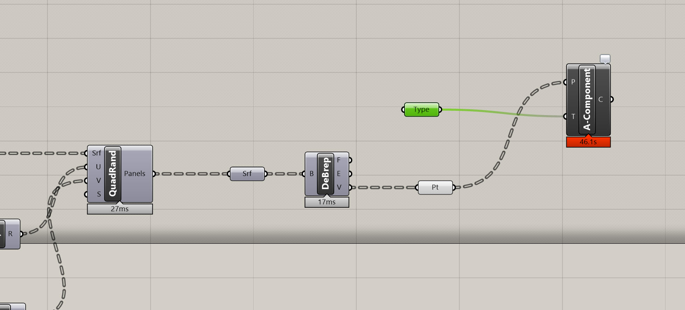

# Using Adaptive Families for More Complex Facades

In the previous module, we leaned heavily on **system families** to drive relatively simple facades – think vertical glazing, modest planar bends, and regular floor-to-floor modules. System families are fantastic when the geometry is more or less behaving.

But what happens when the geometry stops behaving?

- You want a **swooping facade** that twists and leans.
- Panels need to **follow a curved massing** in multiple directions.
- You’re exploring **triangles, hexagons, diagrids**, or other non-rectangular panel logics.
- You want something closer to a **real-world complex façade** (think KPF towers in Asia, Middle East, or certain North American projects).

This is where **adaptive families** come in.

In this module, we’ll take the same tower logic we’ve been using and rebuild the façade using a **pattern-based adaptive curtain panel** placed via Grasshopper + Rhino.Inside.Revit.

---

## 1. Resetting the Model & Rhino.Inside Best Practices

We’re starting with a clean slate for this adaptive façade exercise.

### Clear out system-family facade elements

Inside Revit:

- Select previous **glass / curtain wall** geometry   
  `Right-click → Select All Instances → Entire Project`  
  → **Unpin** → **Delete**.
- Do the same for **slabs** and any other façade elements that came from the previous module.

### Close all Grasshopper definitions before editing in Revit

When a Grasshopper definition with active Rhino.Inside nodes is open:

- Revit continues trying to *regenerate* elements you may not want regenerated.
- Performance tanks.
- Manual edits fight your live Grasshopper logic.

**Always close GH definitions** when doing unrelated Revit work.

> **Joe’s Tip**  
> Treat active Grasshopper definitions as *live pipes* into your Revit model.  
> If you don’t want data flowing through them, **shut the pipe off**, not partially.

### Regenerate structure if needed

If you deleted supporting elements you want back:

- Reopen your **structure-generation GH file**.
- Run it again to rebuild columns, slabs, and beams.

When the structural context is ready, we move on to a **brand new GH definition** dedicated to adaptive components.

---

## 2. Starting a New Grasshopper Definition (Adaptive Only)

We’ll read the tower mass, extract usable vertical faces, panelize them, and convert them into adaptive panel placements.

### Bring in the tower mass

1. In Rhino, ensure the tower mass is on a clean layer (e.g. `DP_OVERALL_MASSING`).
2. In Grasshopper:
   - Add a **Geometry Pipeline**.
   - Set the Layer filter to your massing.
   - Set geometry type to **Brep**.

### Deconstruct faces

- Add **Deconstruct Brep** → plug in the mass.
- The **Faces (F)** output will give you all six surfaces:
  - Four vertical sides (ideally untrimmed)
  - One top
  - One bottom

Next, we isolate the **vertical** ones.

---

## 3. Identifying Vertical Facade Surfaces Using Normals

Instead of guessing or manually picking faces, we’ll classify surfaces by their **normal direction**.

### Evaluate each surface at its center

1. Add **Evaluate Surface**.
2. Graft faces from **DeBrep** → plug into **S**.
3. Add an **MD Slider** at (0.5, 0.5).
4. Right-click **S** → **Reparameterize**.

This ensures (0.5, 0.5) = the *center* of each surface in U/V space.

Each face now yields a point **P** and a normal vector **N**.

### Use the Z value of the normal to classify surfaces

1. Add **Deconstruct Vector** → plug **N** in.
2. Take **Z** output.
3. Add **Absolute**.
4. Add **Smaller Than (<)**:
   - **A** = |Z|
   - **B** = slider ~ `0.25` (tolerance for “vertical”)

This produces a **True/False** list.

### Dispatch vertical faces

1. Add **Dispatch**:
   - **List (L)** = original faces  
   - **Pattern (P)** = output of `<`
2. Output **A** = vertical faces
3. Add **Clean Tree** to remove empties.

You should now have your four clean, vertical, untrimmed tower faces.

---

## 4. Panelizing the Vertical Faces Using Lunchbox

We’ll subdivide the façade using **Random Quad Panels**, targeting approximate **5' × 12'** modules.

### Install/use Lunchbox

- Add **Lunchbox → Random Quad Panels**.
- Plug the vertical surfaces into **S**.

### Compute panel counts from real dimensions

1. Add **Dimensions (Dim)** → plug surfaces in.
2. Divide each dimension by target sizes:
   - U direction: divide by **12 ft**
   - V direction: divide by **5 ft**
3. Plug these computed counts into **U** and **V** of Random Quad Panels.

You now have a panel grid across curved surfaces.

---

## 5. Extracting 4 Corner Points per Panel

The adaptive component requires **ordered point sets**.

1. Add **Deconstruct Brep** after Random Quad Panels.
2. Use **Vertices (V)**:  
   - Each branch = panel  
   - Each branch contains **4 points**

This is exactly what we need for adaptive placement.

If needed, reorder points (not covered here) but Lunchbox typically outputs consistent ordering.

---

## 6. Building a 4-Point Adaptive Curtain Panel in Revit

Now we create the parametric panel that each point set will drive.

### Create the adaptive family

1. Revit → **File → New → Family**
2. Choose **Curtain Panel Pattern Based**
3. Template loads with 4 fixed points

> **Important**  
> Grasshopper points are indexed `0,1,2,3`.  
> Revit adaptive points are `1,2,3,4`.  
> Grasshopper point **0 → Revit point 1**, etc.

### Build the panel geometry

1. Tab-select the **vertical reference plane**.
2. Draw a band / rectangle (e.g., **8" x 8"**) on the plane.
3. Select the base green curve that was provided in the template → **Create Form**.

4. For glass:
   - Select edge curve on one side.
   - Ctrl-select opposite curve.
   - Click **Create Form**.
   - Hit **Spacebar** until the form becomes a **loft surface**.
   - Hit **Enter**.

Test by pulling adaptive points – the geometry should twist/deform.

### Assign materials

- Select the glass surface → set **Material = Glass**.
- Select the band → assign generic solid/metal.

### Save and load

Save as something like:  
`Adaptive.rfa`

Load into your tower model.

---

## 7. Deploying Adaptive Panels via Grasshopper

### Add Component Adaptive

In Grasshopper:

1. Add **Add Component Adaptive**.
2. **P input**:
   - Plug in the **panel corner points** (4 points per branch).
3. **Type input**:
   - Right-click → *Set one Adaptive Component type*  
   - Choose **Curtain Panel → Adaptive_SwoopingPanel**

Grasshopper will think for a moment.

Once the component icon turns **black**, all adaptive panels have been placed into Revit.

You should now see a **smoothly twisting façade** of adaptive curtain panels, following the underlying mass in both plan and section curvature.

You can download the final working file here: https://drive.google.com/file/d/1kEmHCg0OQzcHSV99kwI6QpAGrvilqbfz/view?usp=sharing

### Optional explorations

- Replace quadrilateral panels with **triangles** (3-point adaptive).
- Try **hexagonal** or other polygonal families. 

---

## 8. Wrap-Up

In this module we:

- Reset the model to avoid Rhino.Inside conflicts.
- Used **Evaluate Surface** and vector logic to isolate **vertical** surfaces.
- Panelized the surfaces using Lunchbox based on approximate design sizes.
- Extracted **four corner points** per panel.
- Built a **Revit adaptive curtain panel** family.
- Used Grasshopper’s **Add Component Adaptive** to populate a highly curved tower.

Once your adaptive family and GH definition are clean, this workflow gives you enormous flexibility — perfect for real-world complex projects that don’t fit neatly into Revit’s system family logic.

---

## Side Challenge: Triangular Adaptive Panels

Try creating a **3-point adaptive** panel instead:

- Build a new **triangular** adaptive family in Revit.
- Split each quad panel into two triangles in Grasshopper.
- Feed each triangle’s 3 points into **Add Component Adaptive**.

Post a screenshot or GIF in the class Slack when you get it working.

