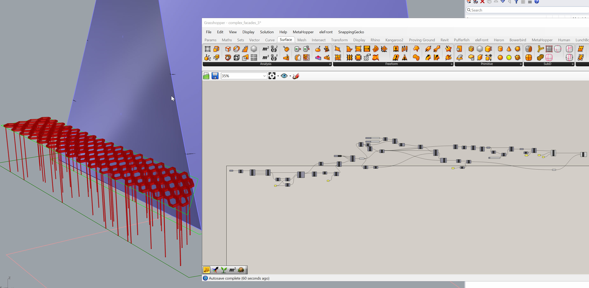
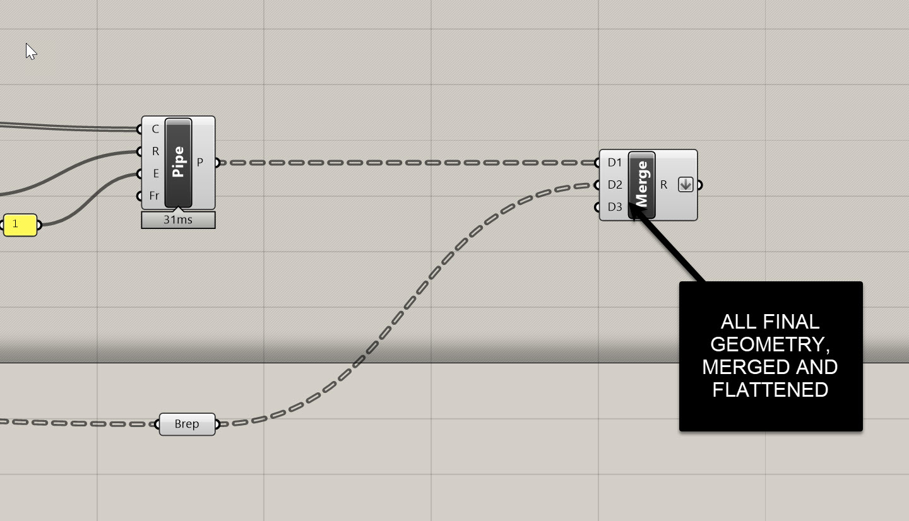
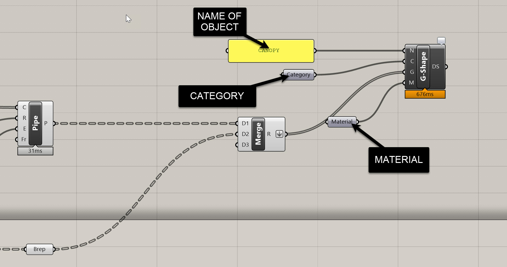
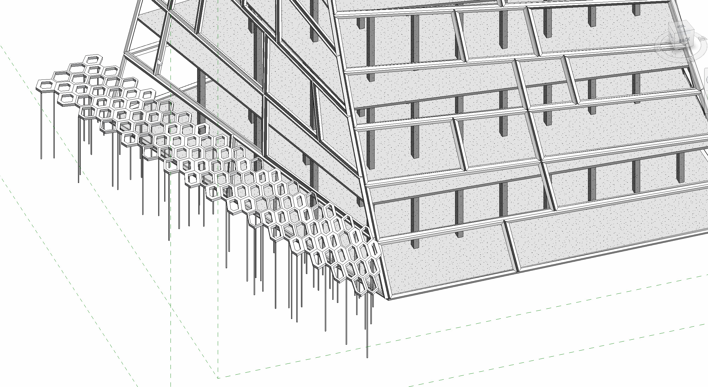
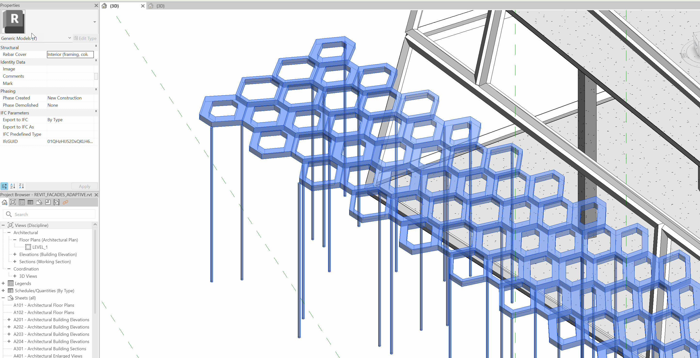

# Direct Shapes for Non-Native Revit Geometries

In this final façade-modeling section, we’ll look at how to bring **complex, non-native Rhino geometry directly into Revit** using *Direct Shapes*. This method is intentionally simple—think of it as a “super import”—but it becomes incredibly powerful when you're iterating quickly, evaluating options, or testing complex geometry against coordinated BIM environments.

Direct Shapes are best used when:

- The geometry is **difficult or impossible** to model natively in Revit  
- You’re still **iterating** and don’t want to rebuild a full family  
- You have a **complex component**, façade element, or canopy still evolving in Rhino  
- You need a **fast preview** inside Revit to check alignment, proportions, and context  

This is the most lightweight way to bring Rhino geometry into Revit—just remember it comes with strict limitations, which we’ll discuss below.

---

# Example Overview: A Complex Canopy

For this demonstration, I’m using a simple Grasshopper script that produces a canopy structure—a hexagonal surface with openings and a set of irregular supporting columns. Could you model this natively in Revit? *Technically yes*—using a combination of adaptive components, structural columns, and pipes—but it would take far longer than it's worth at this stage of design.

Instead, we’ll use Direct Shapes to bring in the entire object as a single, lightweight, non-parametric element.

> **Download Note:**  
> I’ll upload the example GH definition so you can explore how the geometry is generated and how the final merged output is structured.

---

## Preparing the Geometry

At the end of my GH definition, everything collapses into **one merged, flattened list of geometry**. This single list is essential:

- **Flattened list → one Direct Shape object**  
- **Grafted list → many Direct Shape objects**

For a canopy, we want *one object*, so keep the geometry flattened.

---

# Creating a Direct Shape in Revit (via Rhino.Inside)

The process in Grasshopper is extremely simple:

### 1. Go to the *Direct Shape* tab  
Use the `Add Direct Shape Geometry` component.

### 2. Assign a Name  
Use a `Panel` or `String` component. I'm using *Canopy*

### 3. Assign a Category  
Use a `Category` component.

For this demo, I’m using *Generic Models*

But in real workflows you should **always choose the correct Revit category**:

- Curtain Panels  
- Structural Columns  
- Furniture  
- Entourage  
- Mass  
- Specialty Equipment  

The category dictates:

- Visibility settings  
- Lineweights in section  
- How it behaves in different view types  
- How it appears in schedules (limited for Direct Shapes)  

### 4. Assign Geometry  
Take your **flattened** list of geometry and plug it into the Geometry input.

If the input turns **black**, you’re good.

### 5. (Optional) Assign Material  
Right-click the Material input → set or load a material such as “Aluminum.”

**Image Placeholder**  

---

# Viewing the Result in Revit

Once you run the component:

- The canopy appears instantly in Revit  
- It shows in the **correct category**  
- It displays using the **assigned material**  
- It behaves like an **in-place family**  

You can download the final script, including the canopy, here: https://drive.google.com/file/d/1dd0Rh6mWQl3_fs8KzW3Nlc75K8r76VIO/view?usp=sharing

---

# Important Note: Direct Shape Behavior

Direct Shapes are extremely specific in how they behave:

### You *can*  
- Move them  
- Hide/Isolate them  
- Delete them  
- Assign categories and materials  
- Tag them (limited)  
- View them in all Revit views  

### You *cannot*  
- Edit their geometry in Revit  
- Add parametric controls  
- Host components on them  
- Trim, cut, or boolean them  

If you need to change the object, you must:

1. Update the Rhino/Grasshopper script  
2. Rerun the Direct Shape component  
3. Re-inject it into Revit  

This "replace rather than edit" workflow is why Direct Shapes are ideal for:

- Placeholders  
- Early-stage studies  
- Complex/procedural geometries  
- Non-native façade features  
- Rapid design-test-iterate cycles  

---

# Controlling Object Granularity

One last important behavior:

**Flattened Geometry → One Object**
Use this when:
- You want the canopy to behave as a single element  
- You don’t want visual clutter  
- You aren’t scheduling parts individually  

**Grafted Geometry → Many Objects**
Use this when:
- You want to control/hide components individually  
- You need multiple tags or different materials  
- You're preparing something that might become *true Revit elements* later  

---

# Limitations & Best Practices

Direct Shapes are powerful, but they come with constraints. Some guidelines:

### **Use Direct Shapes when:**  
- You're testing complex geometry  
- You’re coordinating early design in Revit  
- You want *just enough* fidelity to check fit and alignment  
- The object is too complex to model natively  

### **Avoid Direct Shapes when:**  
- You need parametric, editable Revit components  
- You need proper scheduling behavior  
- You need true structural connectivity  
- The geometry is simple enough to build as a family  

### **Joe’s Tip:**  
Always keep the **construction geometry** and **procedural logic** in Rhino/Grasshopper. Revit should receive only what it needs to evaluate the building, not the full generative model. This keeps Revit fast, clean, and coordinated.

---

# Conclusion

Direct Shapes are the **fastest and simplest** way to bring complex or non-native geometry into Revit. While limited, they are perfect for iterative façade studies, unusual shapes, or anything still being resolved outside the BIM environment.

At this point, you should understand the three major façade workflows in Revit:

1. **System Families** for simple, repetitive geometry  
2. **Adaptive Components** for controlled, complex panelized systems  
3. **Direct Shapes** for difficult-to-model or external geometry  

Together, these give you a complete toolkit for rationalizing and delivering complex façade systems using Rhino.Inside.Revit.

