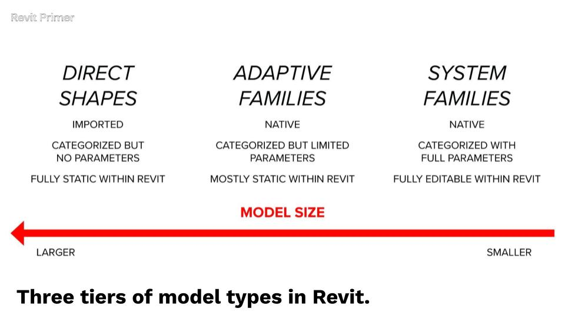
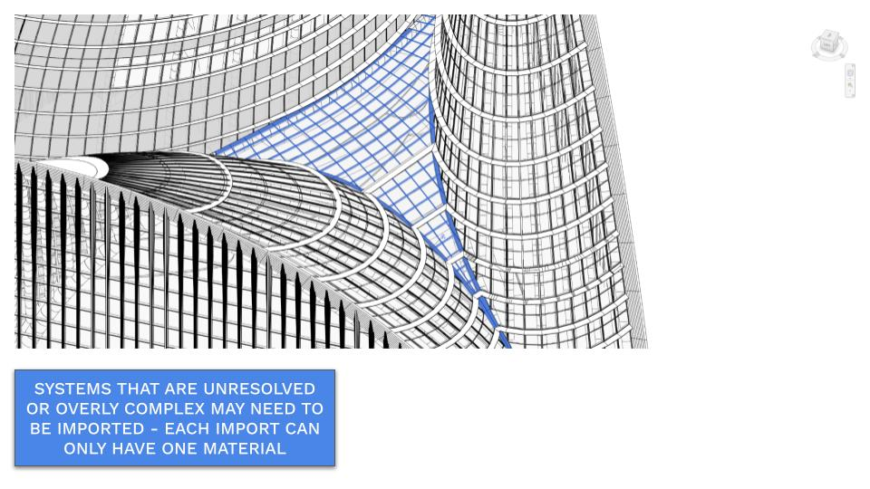
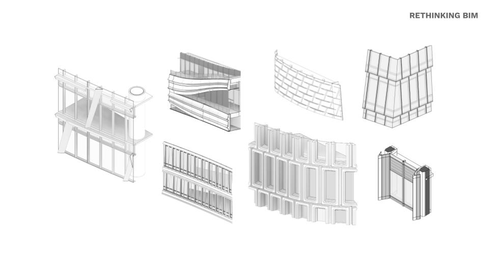

# Intro

In this section, we’re going to shift from *“I have a cool surface in Rhino”* to *“I have a buildable, coordinated facade system in Revit.”* This is where a lot of real projects either come together—or completely fall apart.

We’ll look at how to translate complex Rhino facades into **native Revit systems** in a way that:

- Aligns with structural grids and floor slabs  
- Respects real-world fabrication and installation logic  
- Stays editable and lightweight in Revit  
- Still lets you do “interesting” geometry without blowing up the BIM model  

You’ll learn:

- When to use **system families** for simple or moderately curved facades  
- When to use **adaptive families** for more complex, multi-axis curvature  
- When you’re forced to use **Direct Shapes**—and how to use them intelligently  
- How to clean and prep **host surfaces** so they’re actually automatable  
- How to align facade subdivisions with **grids, levels, and slab edges**  
- How to feed **analysis data** back into your facade logic  
- How to combine everything into **accurate computational facades** suitable for real projects  

Throughout this section, we’ll reference actual buildings—like 55 Hudson Yards, Seagram, Lever House, One Island Drive, Manhattan West, and North Bund Lot 91—to ground the concepts in real-world applications, not abstract parametric exercises.

---

## From Fancy Surfaces to Constructible Systems

Most early-stage Rhino models don’t “think” like buildings yet—they’re about **form**, not about **how the facade is built**.  
Revit, on the other hand, only cares about systems, categories, and rules.

To bridge that gap, it helps to classify your facade into three broad buckets:

---

### 1. System Families

Use system families when your facade is:

- Rectilinear or gently curved **in one direction**
- Planar at the panel level  
- Driven by a repeatable grid or module  
- Similar to most curtain walls built in the last 50 years  

These are great for buildings like:

- [**55 Hudson Yards**](https://www.kpf.com/project/55-hudson-yards)  
- [**Seagram Building**](https://seagram375park.com/)
- [**Lever House**](https://leverhousenyc.com/)  
- [**Disney HQ (Hudson Square)**](https://www.som.com/projects/disney-new-york-city/)  
- [**One Island Drive** (curving in plan but not elevation)](https://www.kpf.com/project/mo-residences-miami)

**System families should always be your first stop.**

> **Joe’s Tip**  
> Start every facade with the question:  
> **“If I simplified the geometry, could this be a system family?”**  
> Only move to adaptive families or Direct Shapes when you can articulate why a simpler system *truly* won’t work.

*Some common rectilinear based facades that can be done with system familes*

*If you look closely, even a complex looking form like One Island Drive can be modeled with basic system families*

---

### 2. Adaptive Families

Adaptive families are for facades that:

- Curve or tilt in **two directions**  
- Shift in both **plan and elevation**  
- Have rounded corners, subtle double curvature, or tapering geometry  
- Need precise 3D placement of panel corners  

Think of cases like:

- [**North Bund Lot 91** – subtle multiaxial tilt](https://www.kpf.com/project/north-bund-lot-91)  
- [**Manhattan West Towers** – tapering, curved towers with rounded corners](https://www.som.com/projects/manhattan-west-development/)
- [**One Highline** - twisted rectilinear forms](https://big.dk/projects/one-high-line-3358)

Adaptive families allow you to maintain logic and consistency even when the geometry becomes too “smart” for system families.

> **Joe’s Tip**  
> If your panel corner points move in *both* plan and elevation—even slightly—assume you’re in **adaptive-family territory**.

---

### 3. Direct Shapes

Direct Shapes are powerful—but should almost never be your first option.

Use them only when:

- The geometry **cannot** be represented as a system or adaptive family  
- You need a coordination placeholder for complex or unresolved geometry  
- You’re dealing with bespoke or one-off components  
- You’re importing elements that Revit fundamentally can’t reconstruct  

They essentially create an **in-place family** automatically, with whatever category you assign.

Tradeoffs:

- Heavier models  
- Limited editability  
- Must reimport for every design update  
- Separate imports needed per material (glass vs. mullion)

> **Joe’s Tip**  
> Think of Direct Shapes as “Revit-approved imports,” not real building systems.  
> Keep them under 10–15% of your project if possible.

---

## Getting Host Surfaces and Subdivisions Right

Regardless of method, everything begins with **clean geometric hosts** in Rhino.

This means:

- Surfaces should be simple, continuous, and rebuildable  
- Panel boundaries should follow **lines and arcs** (not noisy NURBS)  
- Subdivisions should align with:
  - Structural grids  
  - Levels and floor slabs  
  - Key architectural joints  

We’ll explore:

- Techniques for rebuilding or remaking surfaces to make them automatable  
- How to align panel grids with **previously established building grids**  
- How to ensure facade joints line up with **slabs, structure, and corners**  

> **Joe’s Tip**  
> If your Rhino surface subdivisions don’t align with **floors** and **grids**, fix that *before* doing anything in Grasshopper.  
> It will save you weeks later.

---

## Analysis-Driven Facades (Without Overcomplicating It)

We won’t run full environmental analyses here, but we *will* explore how analysis can influence facade logic.

Common metrics include:

- Solar exposure  
- Sky view  
- Privacy or openness  
- Performance zones across the facade  

We’ll look at:

- How to store this data inside your model  
- How to use it to modify panel attributes  
- How to build adaptive systems that respond intelligently to analysis values  

The goal is to understand how **performance + geometry + system logic** come together.

---

## Learning from Real Projects: Reverse-Engineering Rules

Before building anything, you’ll learn to look at real buildings and identify:

- The underlying panel grid  
- The logic of joints and breaks  
- Where curvature happens  
- How panels relate to **floors**, **corners**, and **structure**  
- Which Revit system (system / adaptive / direct shape) best fits  

We’ll reference:

- **Seagram / Lever House → System Families**  
- **Disney HQ → Slight variation, still System Families**  
- **One Island Drive → System Families with curved-in-plan hosts**  
- **Manhattan West → Adaptive Families**  
- **North Bund Lot 91 → Adaptive Families**  

And then map those rules to your own design.

> **Joe’s Tip**  
> Anytime you're unsure how to document a facade, try to find a similar precedent in the real world and thank about how the systems and alignments compare to yours. Try to visually break the facade down into Revit elements.

---

## Summary

In this section, you will:

- Classify facades into **System Families**, **Adaptive Families**, and **Direct Shapes**  
- Look at how real projects map to each strategy  
- Learn how to rebuild and clean **host surfaces**  
- Align panel subdivisions with **grids and slabs**  
- Use **analysis data** to drive facade design  
- Combine all this into a workflow that produces **accurate, Revit-native facade geometry**  

Next, we’ll begin with the most common case:  
**Leveraging System Families for Simple Facades.**

---

> **Side Challenge**  
> Pick three built precedents—one rectilinear, one curved-in-plan, one subtly curved/tapered.  
> For each annotage images to show the following:  
> - Identify the underlying grid or module  
> - Select system vs. adaptive vs. direct shape  
> - Describe how you’d align panel joints with floors  
