# Getting started with Grasshopper

👋 Hi there and welcome! This course will teach the foundations of computational design through the design tool Grasshopper.

## Module Summary

Before we develop our parametric tower further, we are going to pause and introduce best practices for developing clean and clear grasshopper definitions through techniques for organizing, grouping, labeling and color coding.

## Why is this important?

You might be thinking, why am I taking a break from developing an awesome parametric tower just to organize and label my definition? That sounds _super boring_ and a waste of time. Much like in computer programming, maintaining best practices for clean and clear definitions is critical for building and maintaining complex parametric models, creating re-usable and modular definitions, and allowing for collaboration with others. Taking the time to implement best practices while your develop you definitions will also save you time and frustration later.

> What is Grasshopper?

Grasshopper is a computational design tool that works with the [CAD](https://en.wikipedia.org/wiki/Computer-aided_design) program [Rhino](https://www.rhino3d.com/). It allows you to create designs not by modeling the geometry directly, but by defining relationships between smaller processes that come together to create the final design. Using computational design in Grasshopper allows you to think of designs as systems rather than static objects.

> Ok, then what is computational design, and how is it different from just using a computer for design?

Computers have been impacting the way designers work since the arrival of the personal computer in the early 1980s. These days, computers are heavily integrated into the day-to-day work of almost every design professional. However, most designers still rely on out-of-the-box software solutions that come with standard user interfaces that support typical workflows for accomplishing specific design tasks.

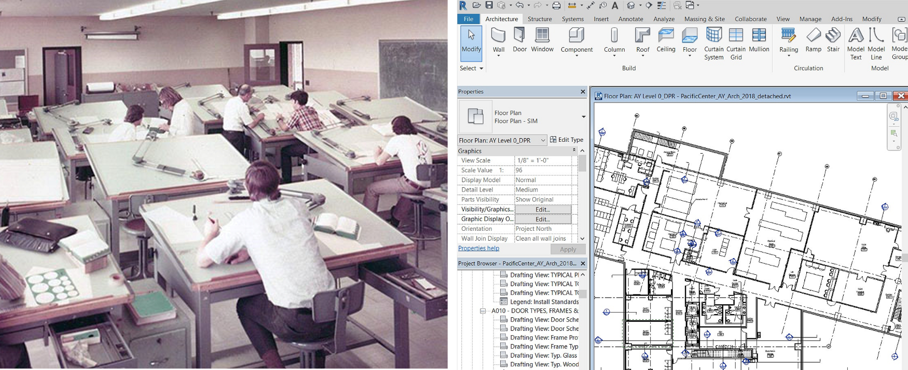

Recently, however, a growing number of designers are going a level deeper to actually program computers to do more specialized tasks and leveraging the power of algorithms and computation to unlock new potentials for their creative design work.

When we talk about computational design, we’re usually referring to using a computer beyond the standard workflow created by a particular software. Traditional software is controlled through a visual user interface (UI) composed of elements such as buttons and text boxes which allow the user to perform a set of pre-defined tasks. Meanwhile, the core functionality of the software is hidden away from the user.

Computational design tools give users access to these core functionalities, allowing them to control the software directly through custom programs and algorithms. To build these algorithms, computational designers must be familiar with some level of computer programming, which is the practice of writing algorithms to describe specific tasks to a computer. Although computer programming is not traditionally thought of as a core design skill, as design workflows become more and more digital and complex, the ability to program design tools to do custom things is becoming increasingly important.

> What is computational design for?

Computational design is still an emerging field, with many new uses emerging every day. Some of the more common uses are:

### Parametric design

When you describe a design as a system rather than a static object, you can expose certain variables or parameters that control how the system works. Later, you can adjust these parameters to quickly change the design outcome without having to rebuild the entire model. For example, if you modeled a curtain wall the traditional way and the panel design changed, you would have to rebuild the entire model with the new design. But, if you described the process of creating the curtain wall using computational design (for example, take a single panel model and align it with a grid of points generated according to the dimensions of the building), you would simply input the new panel design and run the program again to regenerate the entire model automatically.

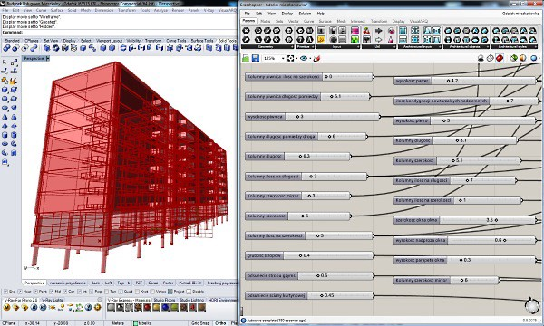

### Formal complexity

Creating a computational design system can be challenging and time-consuming, but once the system is defined you can easy run it many times to create a large amount of geometry and complexity, often much more than would be possible to model or develop by hand. The capability of computational design tools to generate an extreme level of variation within a given system was expressed strongly in the visual language of many architectural projects of the 2000’s when these tools first started to become available. While this kind of computationally-driven formal variation is still popular, the emphasis these days is more on how to make it buildable by tapping into similarly-sophisticated fabrication workflows.

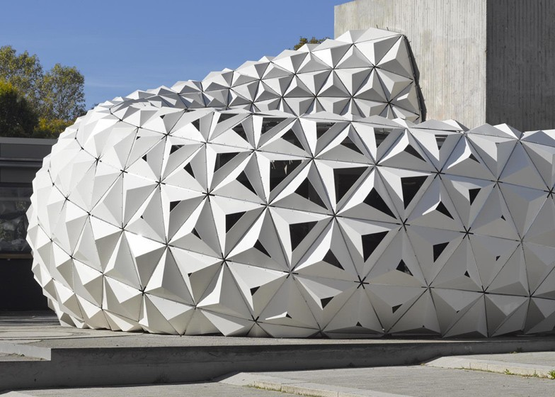

### Performance-driven design

Another major advantage of computational design is that it allows the designer to easily connect their design models to computer simulation tools that can help them evaluate the performance of their designs (for example structural, environmental, or energy performance). Traditionally, each time a designer wanted to perform a simulation they would have to process their digital model manually for each specific simulation program. With computational design, the design is already defined through data, making it much easier to connect to simulation engines that run within the same computational design environment. This creates more immediate feedback and a much faster turnaround, allowing simulations to be used much earlier in the design process. We will look at two different structural simulation libraries that run within Grasshopper later in the course.

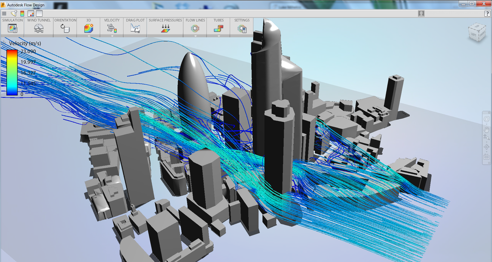

### Design automation

Because of it’s focus on breaking down and describing design processes, computational design can be used to build custom tools and workflows that automate some portions of the design processes. This can range from simple definitions that automatically add tags to particular objects in a model, to complex [optimization workflows](https://medium.com/generative-design) that can actually help the designer find optimal solutions to their problems given a set of high-level objectives. We will look at automation and optimization workflows in more detail later in the course.

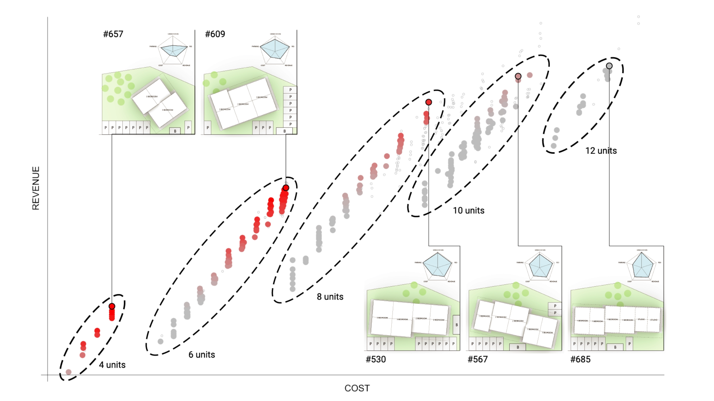

Now that we know what computational design is and how it can be useful to us, let’s dive in and learn how to do it ourselves. One of the most popular tools for computational design is Grasshopper.

> Ok ok, but then what is Grasshopper?

Grasshopper is a visual programming environment built on top of Rhino. It allows you to create _visual scripts_ or definitions that describe a design through a series of relationships between operations, geometries, and other data.

Like any programming environment, Grasshopper allows you to create algorithms, or sets of instructions, for telling a computer what to do. In traditional, text-based programming, these instructions are written using text that follows strict formatting rules and has a specific vocabulary for describing computer operations. With visual programming, the instructions are described in a visual interface using a set of nodes, or components, that describe operations, and a set of lines, or wires, that create connections between them.

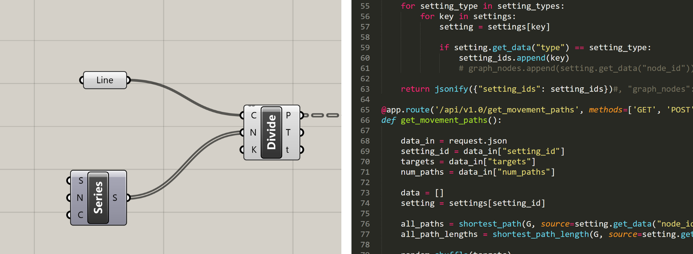

_Visual programming (left) and text-based programming (right)_

In mathematical terms, you can think of the nodes as _functions_ which take in inputs and generate outputs. The wires then are the way in which data is passed between the inputs and outputs of different functions. Although text-based and visual programming do basically the same thing, a visual interface can be easier to learn and more intuitive to use for designers, who tend to be more visually oriented.

Forgetting design for a moment, let’s consider how we could use visual programming to describe a simple formula: `y = 2x + 3`:

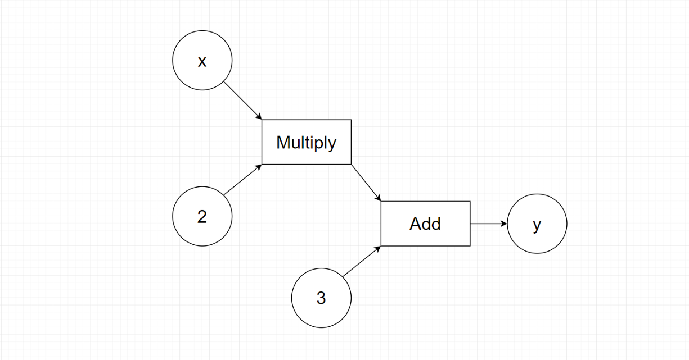

Going in the order of operations, you first pass a variable x and the number 2 into a function that multiplies them together. Then you take the result of that function and the number 3 and pass them into another function that adds them together. The result of this function will be the solution to the formula, y. In Grasshopper, the definition would look like this:

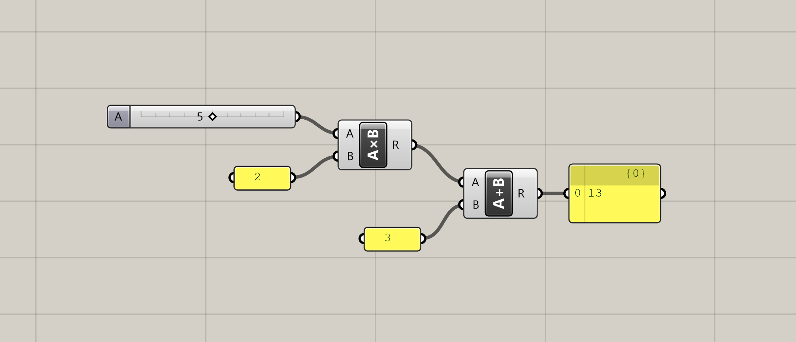

Pretty straight forward, huh? It’s amazing that all Grasshopper definitions are composed of only these two types of elements: components that define small operations that do stuff, and connecting wires that pass information between the components.

Since Grasshopper is a design tool, it cannot be limited to simple mathematical operations. Luckily, since Grasshopper is built on the 3d modeling software Rhino, it has access to all of the geometric functions contained within Rhino, and allows us to access these functions within our definitions. The combination of its intuitive visual programming interface with Rhino’s best-in-class geometry library makes Grasshopper a powerful tool for computational design and by far the most popular computational design tool used today.

> How does Grasshopper connect to Rhino?

Like most computer software, Rhino has two components — the front-end graphical user interface (UI) with which users interact, and a backend system that contains all the logic for what the program can do. In a CAD program like Rhino, the front-end contains the visual display of the geometry and a command-input system that allows users to run commands to generate geometry while providing inputs and getting visual feedback from the display. On the backend, there is a library that defines the functionality behind all of the geometric commands, along with other functionality needed by Rhino such as saving and loading a file.

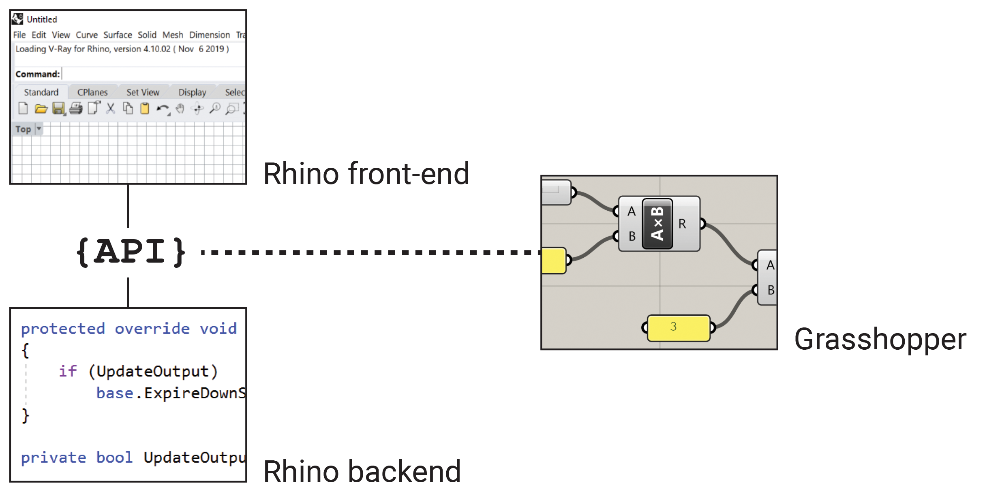

Like many modern software, Rhino exposes its backend system through an Application Programming Interface (API), which allows third-party developers to build functionality on top of Rhino’s backend system while bypassing the front-end user interface. Grasshopper utilizes this API to expose the geometric operations as individual components, allowing users to craft their own automated workflows using Rhino’s backend. APIs will be discussed in more detail [later in the course]().

## Designing with algorithms

When you first learned how to model geometry in a CAD software, you probably used a visual UI to perform many of the operations. For example, if you wanted to make a box, you would run the “box” command, which would give you a series of instructions to follow for making the box. First, you would click on a point in space to specify the first corner of the box, then click another point to specify the other corner of the base, and finally use your mouse to visually define the height of the box. This is a very visual and intuitive way of making geometry in the computer, and matches the traditional way of working with physical materials by hand to create form.

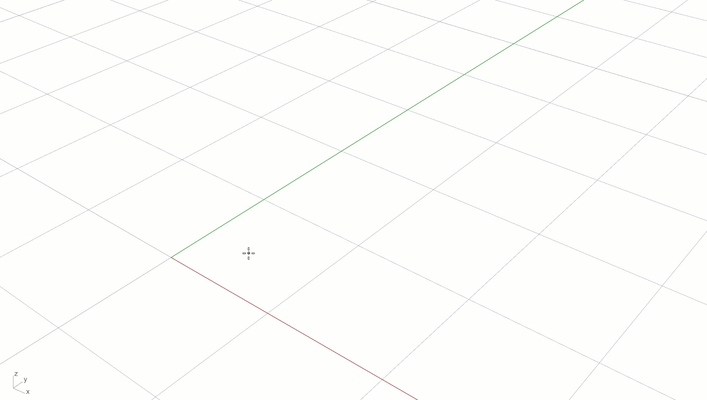

_Box created in Rhino using the visual interface_

If you wanted to be more precise about the geometry, you could start to enter exact values for some of the dimensions. For example, you could specify exact coordinates for the base point of the box. You could also use the desired width and length of the box to calculate the second corner point, and finally enter an exact height for the box. Now the box is precisely defined through data, without relying on any intuitive input. Most designers use a combination of these two methods: intuitive visual modeling for generating initial concepts, and then adjusting exact dimensions as the model is refined.

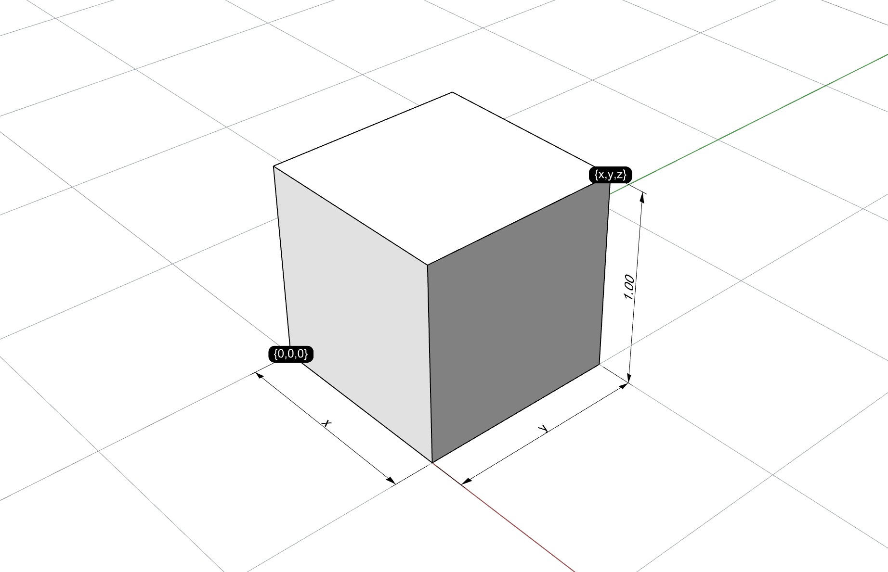

_Box created in Rhino based on exact dimensions_

When you work with computational models, you have to define everything about your design through data and functions, without relying on a visual UI. Creating form this way can be a challenge for many designers, since it requires not only knowledge of computational design tools such as Grasshopper, but good working knowledge of fundamental geometric concepts such as vector math and trigonometry, which are not typically taught as required courses in design schools. The goal of this course is to give you just enough background on these topics so you can get started with Grasshopper, and continue to develop your knowledge over time with more intermediate and advanced courses.

_Box created in Grasshopper by defining a system of variables and operations_

## Computational Design Thinking

Once you get past the initial technical learning curves, true success with computational design relies not just on knowing the tools, but also in a change in how you think about design itself.

Traditionally, design was a highly intuitive and visual process, where the designer started with a base material and crafted it through a series of operations while getting direct visual feedback about what they were designing. With computational design, things are a bit different. Since computational design involves designing systems and not objects directly, there is not always the direct physical input or visual feedback to guide the process. Instead, computational design requires the designer to think of design problems systematically, break them down into smaller solvable parts, and then solve those smaller problems using the computational tools (such as Grasshopper) that they have at their disposal.

Because of its reliance on math and connection to computer programming, computational design is often thought of as more analytical and less intuitive than traditional design methods. However, there is still a large amount of intuition and creativity involved with designing computational models properly to ensure that they achieve the desired outcomes.

This change of mindset, or learning to think through design problems analytically and computationally, is often called _Computational Design Thinking_. This new way of thinking about design relies on learning some new technical tools such as computational geometry and visual programming, but it goes far beyond that. Learning the tools and techniques of computational design will not only make you a more skilled designer, but will give you a new way of thinking about design and your creative process.

## The Grasshopper community

One of the best features of Grasshopper, and one of the key factors behind its success, is the amazing community of designers and programmers that’s grown around it.

Designing computationally can be a very challenging and creative process. When you are building something totally new there are not always standard answers out there for how to solve the problems you might run into. In such cases it is useful to have a strong community of fellow users who can share experiences and help each other to overcome challenges in a collaborative way.

Because of its connection with computer programming, computational design inherits a lot of the community and open-source culture of the software development industry. A great way to get to engage with the Grasshopper community is by visiting the Grasshopper forum: [https://discourse.mcneel.com/c/grasshopper-developer](https://discourse.mcneel.com/c/grasshopper-developer).

At this point, Grasshopper is old enough and the community of users is large enough that you can usually Google “Grasshopper + whatever your issue is” and get results from the Grasshopper forum (or occasionally private blogs or video tutorials) discussing the same issue.

## Getting started with Grasshopper

Grasshopper started its life as a plugin for Rhino which you had to download and install separately. Since version 6, Rhino now has Grasshopper built-in, so if you are using Rhino 6 or later, you don’t need to install any additional software to use Grasshopper. You can start Grasshopper either by clicking the Grasshopper button in the toolbar or by typing `Grasshopper` in the Command line.

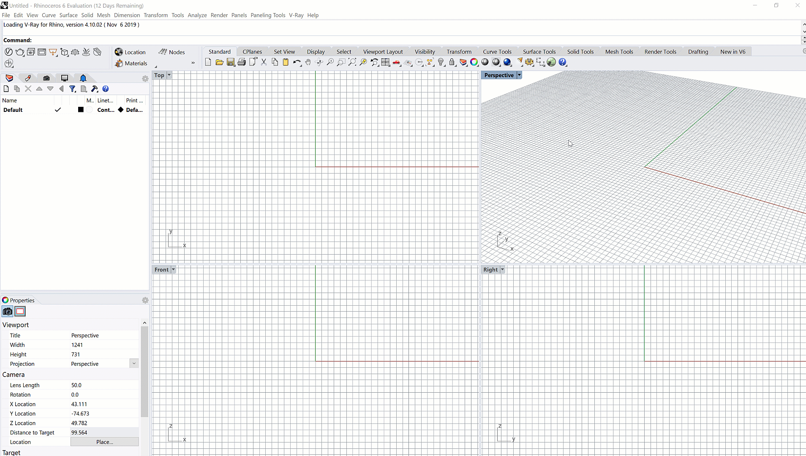

When you start Grasshopper, it will open up in a new window on top of your Rhino interface. The Grasshopper interface consists of two main parts: the _components library_ at the top, and the _canvas_ below.

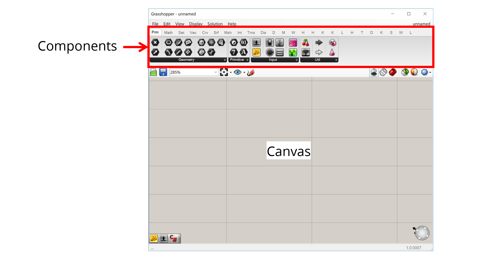

### The components

The components library contains all the components that are available to use in your model. Grasshopper comes pre-loaded with a large number of basic components, and you can also download libraries of custom components made by other users (more on loading libraries later). Each component is represented by an icon in the toolbar, and they are organized according to their function or the library they come from.

### The canvas

The canvas is the most important part of Grasshopper. It is the visual environment in which you develop your Grasshopper models. To create a model, you drag components from the top toolbar onto the canvas, and then connect them together with wires by clicking and dragging between an input and output node.

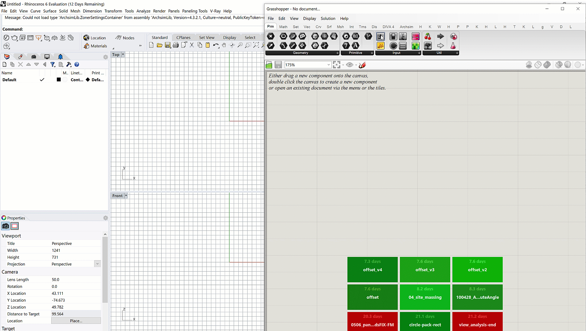

You can think of the Grasshopper window as a separate “view” into your Rhino file. The Grasshopper model developed within the canvas has a connection to the Rhino model from which it was launched, so you should think of both Rhino and Grasshopper working together in a common environment, using their own separate interfaces.

When you develop geometry in Grasshopper, you will see this geometry visualized within the Rhino viewport. You can also reference objects from Rhino into your Grasshopper definition. With certain objects like points, you even get an interactive widget that allows you to move the Grasshopper geometry directly within Rhino.

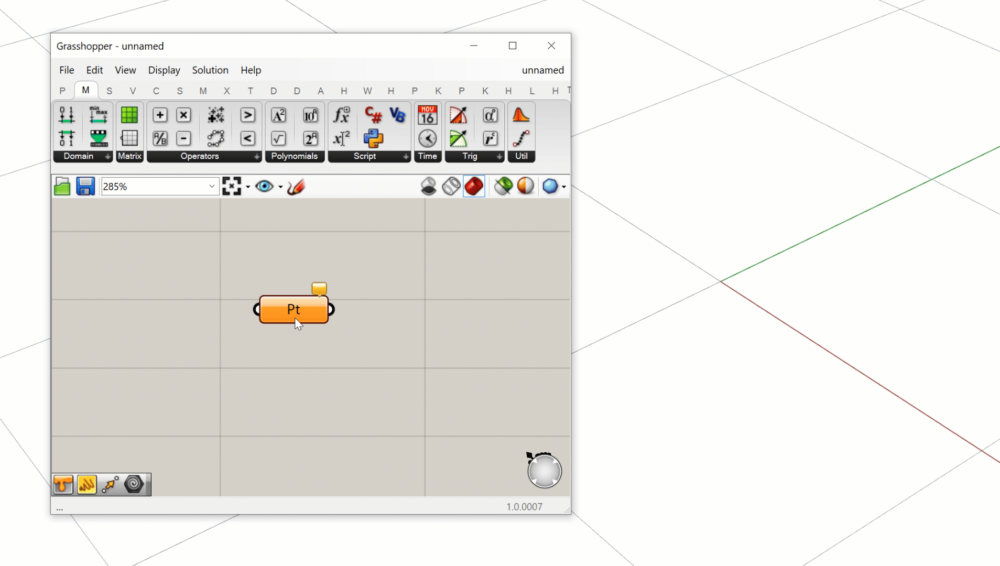

Any geometry developed within Grasshopper is considered “dynamic geometry” because it does not actually exist in the Rhino model, but is only displayed for preview purposes in the viewport. Because of Grasshopper’s connection to the Rhino model, however, you can take any geometry developed in Grasshopper and “bake” it so it becomes a permanent part of the Rhino file.

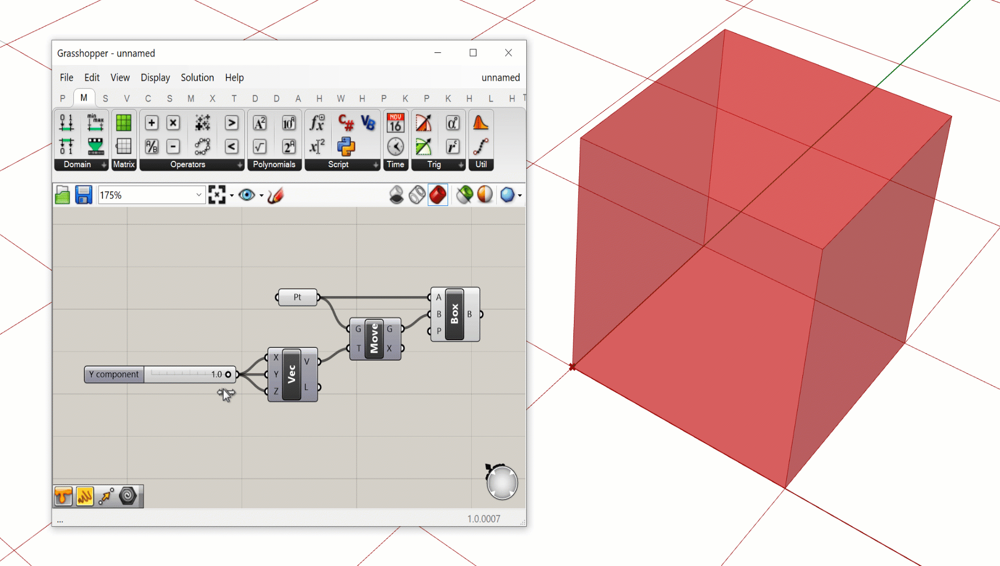

Because Grasshopper has its own interface and stores its own data, the definitions you develop in Grasshopper need to be saved to a separate file which usually has the extension .gh or .ghx. This file is separate from the .3dm file which contains your main Rhino file. This means that when you are working with Grasshopper, you typically are working in two separate files: a Rhino document and a Grasshopper model that is connected to it.

Now that you have Rhino and Grasshopper open, [go on to the next tutorial](), where we will build our first Grasshopper definition.
