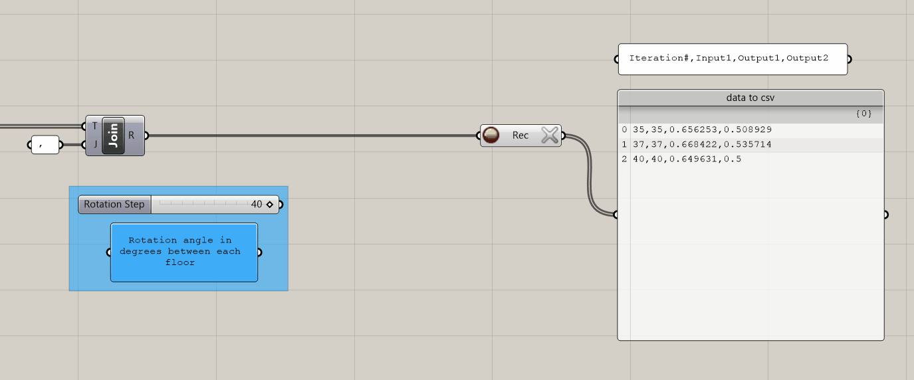
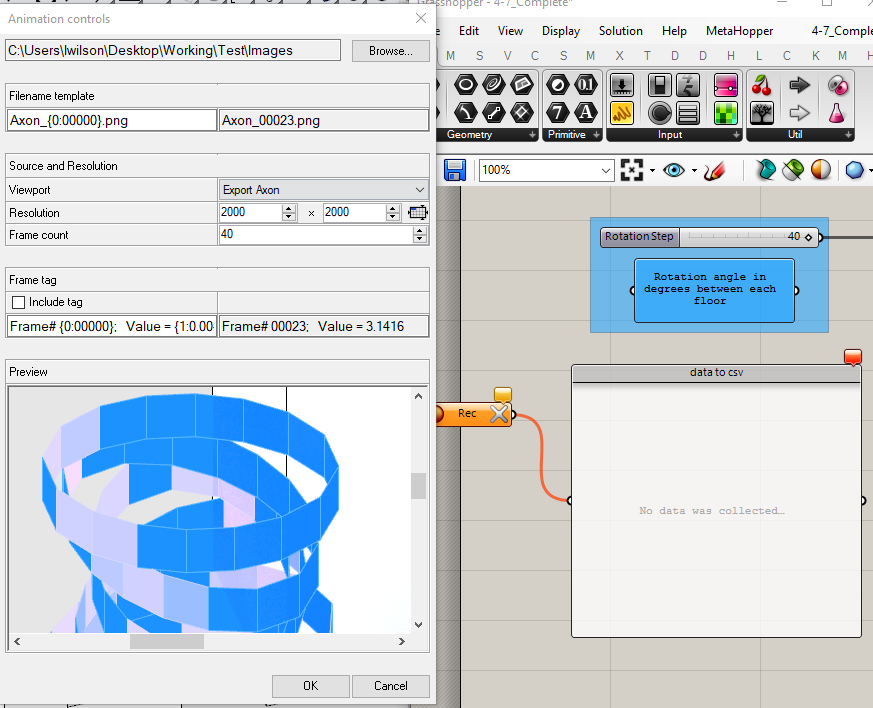

# Generating and Exploring Spatial Data

## Module Summary

The last module of the Intro to Grasshopper sequence will be somewhat light on the actual grasshopper content, instead it will focus on generating spatial data sets and exploring them to understand the relationship be between form (inputs) and performance (metric outputs.)

We are going to animate the Rotation Step input slider, testing every rotation option and record the metric outputs to a csv file for data exploration.

## Why is this important?

Through computational design modeling in grasshopper you have the ability to quickly generate hundreds to thousands of design options with associated performance metrics (geometry + data.) This results in a spatial data set that through critical exploration can lead to decision-making informed by data. Instead of generating a few options for a building or master plan, imagine being able to generate and explore hundreds of thousands of spatial variations. Pretty awesome.

While the approach covered in this model is focused on analyzing every design option for a tower, it could also be adapted to generate new urban data sets by analyzing urban spaces for new metrics. For example, you could analyze every plaza in New York City for daylight and explore correlations with built density. Or analyze every building for walkability to parks and explore correlations with income levels. See the paper in further reading for an example of using this method for generating new urban data sets.

## Tutorial

### 1. Adjust Slider Range

We are going to use the animation function of the `Rotation Step Slider` (more on that later.) To start, we need to adjust the range of the slider to match the number of options we want to test. Originally we brought in the slider with the default range of 0 to 100, however, it doesn't make sense to test tower options with up to 100 degree rotational differences between floors, so lets reduce the range to `40`. (Although given the speed at which this definition solves you could easily run out 100 or even 1000 options very quickly.) Double click on the text portion of the Slider to bring up the dialogue box and adjust the Range.

### 2. Prepare Data for Export

Next we need to collect and join all the data we want to export, which will almost always be:

1. **Iteration Number** - This comes directly from the slider you will animate to create your data set. We want this so we can recreate options that we identify through the subsequent data exploration.
2. **Inputs** - We want only the dynamic inputs, in most cases the sliders, and not static inputs, such as the ellipse radius or the floor to floor height. In this case we have just one, Rotation Step, but in future sequences you will build computational design models with multiple dynamic inputs. _Why the inputs? Is isn't this all about the metric outputs?_ We need the inputs so we can relate form, which is generated from the inputs to performance, our outputs.
3. **Outputs** - Only metric outputs (not geometry.)

Copy the parameter holder for `Rotation Step Slider` and bring over to be in vertical alignment with the outputs from the view analysis.

> _Space and straight lines!_

 

Copy `Num: Rotation Step` and rename it `Num: Iteration Number`. In this case the slider is both an input and the slider that we will use to generate our data set, however, in computational design models where you have more then one dynamic input (ie more then one slider to vary), this will not be the case. Do this now to reinforce best practices for formatting your data for output.

Next, put the data for export into a `Merge` in the following order:

1. Iteration Number
2. Rotation Step
3. % Avg Open View
4. % Above View Threshold

The order of the last two doesn't matter, just make sure the over all order is Iteration Number -> Inputs -> Outputs.

Finally, add a `Text Join` component and plug the merged data into (T) and a panel with a `,` into (J). We are using this to structure our data for export to a Comma-Separated Values, or CSV, file type. CSV are a simple file format for structuring tabular data. A row is defined by each item in our list and the commas delineate columns. Once we export our data we will open in a spreadsheet program, such as Google Sheets or Excel, to explore the data.

### 3. Data Recorder

Now that our data is properly structured for export, we need to record the data for each step of the slider. We will use the `Data Recorder` component, which when active records any changes to the input, so when we animate out slider in the next step, the data recorder will record the data for each step of the slider.

Add a data recorder and plugin in the output (R) of the text join.

The data recorder has two buttons. The circular one to on the left is to activate or deactivate recording. Make sure it is active (red) before exporting data. The X to the right clears any data. Make sure to clear all data before exporting.

Finally, we need to set up grasshopper to export our data set. We will use the export function of a panel (yes, panels can export data!) Add a panel and plugin the output of the data record component. Next, right click on the panel, select `Stream Contents`, navigate to the folder you want to export to, name the file and make sure to add .csv to the file extension. Common convention is to call it `data.csv`. If you have previously set the file path, clicking Stream Contents toggles the streaming on and off, and clicking `Stream Destination` allows you to change the file path and file name.

### 4. Generate the Data Set

Time to export our data! Follow these steps to prepare:

1. Set the `Rotation Step` slider to the last value.
2. Click the `X` of the `Data Recorder` to clear any data.
3. Make sure the `Record Button` is red.

The `Data Recorder` should be orange and the panel empty.

Next, right click anywhere on the `Rotation Step` slider and select `Animate...` to bring up the animation dialogue box:

1. Set you file path.
2. In the Filename template change the name of your files by replacing the text preceding "\_{0:00000}." The file name doesn't make a difference, so name it whatever you want or keep the default.
3. Change the file extension to either jpg or png. (Or keep it as bmp if you prefer that image file type.)
4. Click the drop down menu next to Viewport and select the Named View you want to use. If you don't have a Named View saved, select whatever view you are currently on.
5. Adjust the resolution to your desired size. You can see the exact image size in the Preview window at the bottom, but will likely need to use the scroll bars to navigate the window to see the full extents of the image.
6. Set you Frame count to be `1 - Total Options` tested. If your slider starts at 0 then this value will be the last number on your slider.
7. Click `ok` to animate and export your data set!

As the slider animates you should see the panel with data filing up and an image of each individual step exported. The dialogue box just above the command line in Rhino will display which step it is currently on and an _estimate_ of the time remaining. The estimate is extrapolated from the time per option run out to that point so can't account for other factors that could slow down the export, such as options with more complicated geometry.

### 4. Explore Results

Next we are going to open the exported data set into a spreadsheet software for exploration. But first we need to protect our data. With the panel set to stream contents it will continue to write (or delete) data from the data.csv file as grasshopper changes. For example, if you clear the data in the Data Recorder it will delete all data from you .csv or if you change the slider it will continue to write data. There are two ways to protect your data, either toggle off the stream contents for you panel, or make a copy of you data.csv file. (The second method is the safest.)

Open your data.csv (or the copy if you chose that option) within a spreadsheet program. (In this example we are using Google Sheets.) Start by labeling your columns following the order you joined them in grasshopper: Iteration Number -> Inputs -> Outputs.

Next, sort your sheet by each of the two output metrics, largest to smallest, and look for differences and any trends in the inputs. Since the two metrics are derived from the same analysis (and as a result, directly correlated) the trends between the two should be fairly consistent. (In future Modules we will repeat this process with additional metrics with trade-offs in performance.)

In the case of this example, options 0, 27 and 30 performed the best across both metrics. Option 0 is a straight tower, 27 and 30 have a high step of rotation.

Next, determine the range of each metric. Is there a meaningful change? In this example the Percent Open metric has a range of about 4% and the View Threshold a range of about 6.5%. Neither is a huge range, suggesting either rotation step does not have a meaningful impact on views or that the context has more of an impact on views then the form of the building.

> _One of the high performing options._

  

If your completed definition isn't working as it should, here is a [completed grasshopper definition](https://github.com/GSAPP-CDP/Smorgasbord/raw/main/src/content/modules/4-grasshopper-intro/Definitions/4-10_Complete.gh) of this tutorial.

## Conclusion

Exploring the relationships between form and performance and developing hypothesis (like the ones above,) to iteratively test using this methodology is very powerful. (The assignment will ask you to do just that.) This allows you to describe spatial characteristics that result in a desired (and quantifiable) outcome. Imagine describing to another designer, or city planner, or developer a set of spatial rules that if they follow, will always result on the desired outcome, such as walkable neighborhoods or thermal comfortable spaces or net zero buildings. Pretty fantastic.

## Assignment

1. Performance <-> Form: Start by adjusting the slider to the top 5 performing options of your model and examine the physical characteristics. Is there a pattern that is describable? Do the same for the lowest performing options. Often it can be equally as useful to understand the characteristics of low performing options.
2. Testing Hypothesis: For the example in this tutorial the highest performing options were either no rotation or a lot of rotation. Did that relationship hold true for your model? In either case, lets test the two hypothesis stated earlier in the tutorial:
3. Is it the context? Change your context buildings and re-animate your model. Are the performance trends the same? Can you describe them?
4. Is it the building? Lets check to see if the even rotation step has a meaningful impact on the performance by introducing a procedural rule for the rotation of the tower floors based on their proximity to the surrounding context. The rule will be introduced after the floors have been rotated but before they are subdivided, so make some room in your definition at that location. The `Pull Point` component is going to be key to introducing this rule. It returns the closest point and distance between an input point and a collection of geometry. It is looking for points (try subdividing the floors to add points, but make sure to graph them first) and geometry that pulls (your context.) Next you'll need to `Sort` the distance output, select the smallest distance and re-map the values to rotate the floors away from the context. (Closer = more rotation maybe?) Once you've done this animate your model again. Do the results change? Any new Form <-> Performance trends.

5. Cluster groups (or collections of groups) to make it easy to grab and reuse portions of your definition. Make clusters for: 1. the base tower, 2. the view analysis and 3. the window generation. Select the components you want to cluster and right click -> Cluster. Make sure to have the labeled parameter holders as the inputs and outputs for each cluster. This will maintain the clear labeling once clustered. If an input or output does not connect to another component, it will not have an output from the cluster, so either connect it to another parameter holder or add a `Cluster Output`. If you forget to do this prior to clustering, double click on the cluster to edit it and add the missing Cluster Outputs.

## Additional Resources

- ["Quantifying the Urban Experience: Establishing Criteria for Performance Based Zoning."](https://static1.squarespace.com/static/568ee2b4cbced6419694f1fc/t/5c37585f4d7a9c82b6128f70/1547130979391/Performance_Based_Zoning.pdf) Paper on deriving spatial data using grasshopper to establish performance based zoning regulations.
