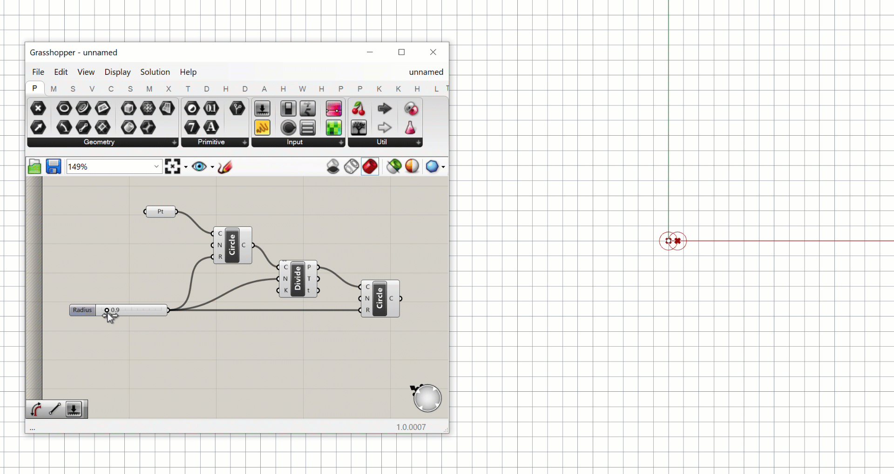
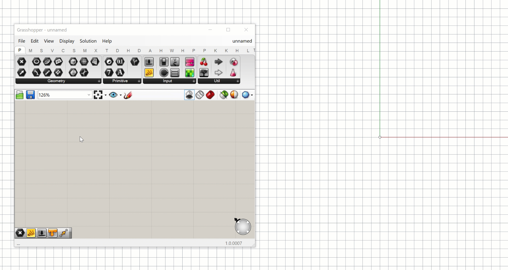
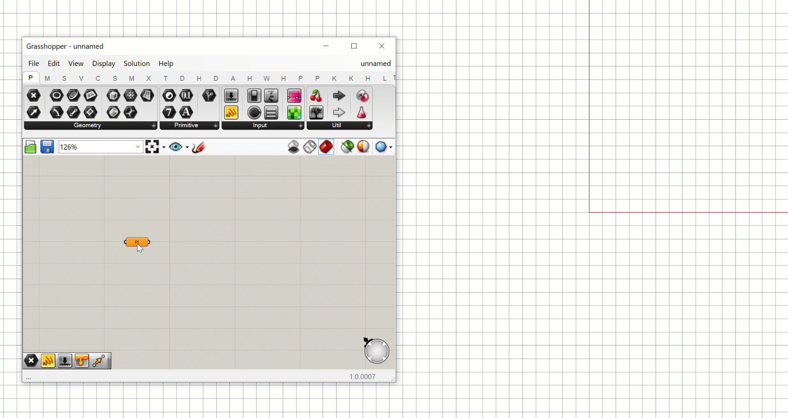
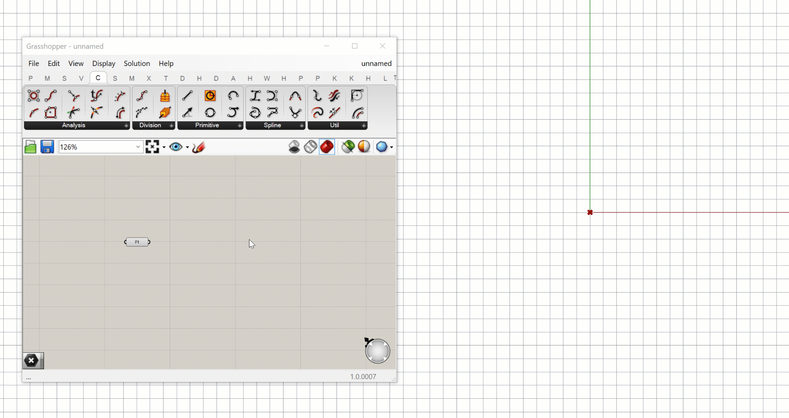
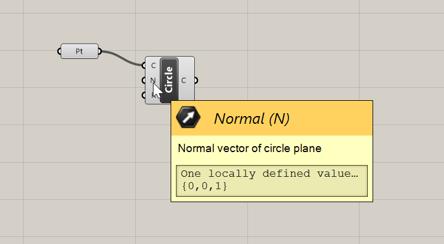
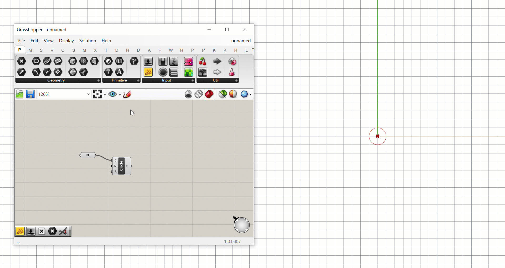
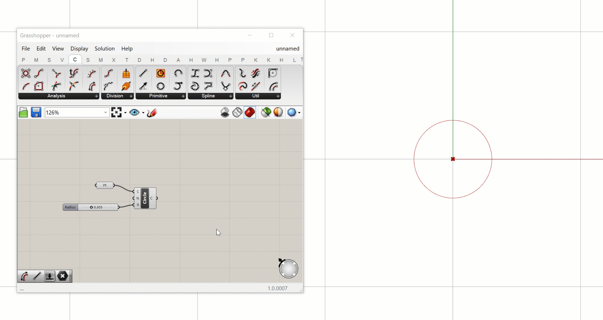
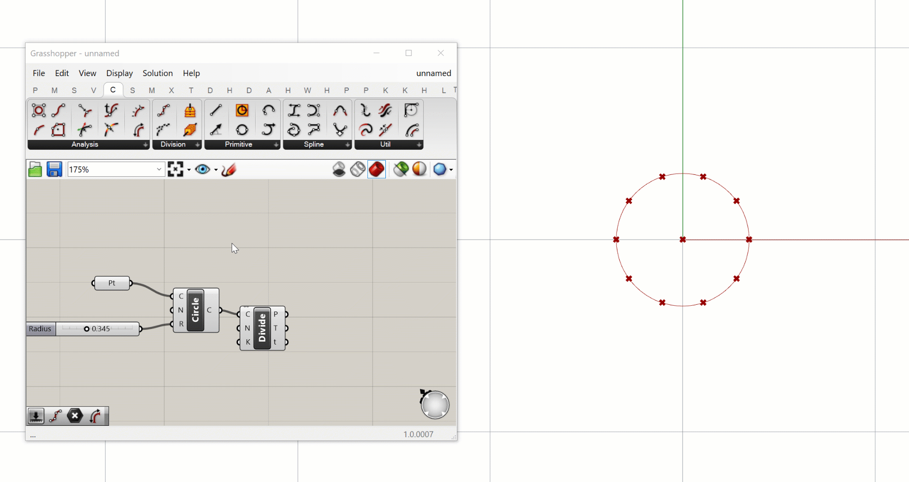

# Exercise - Hello Grasshopper!

Let’s dive right in and build something cool in Grasshopper.

Learning new software can be a difficult and laborious process, especially with a more technical and analytical tool such as Grasshopper. The best way to stay motivated is to devote enough time during your training process to actually working with the tools and learning their capabilities first hand.

This course will alternate between two types of lessons:

1. Lecture-style lessons that describe high-level concepts in Grasshopper and computational design
2. Hands-on exercises that guide you through an actual project in Grasshopper and encourage you to take the work further through challenges

It can be tempting to just read through the lecture-style lessons and skip the exercises to finish the course quicker. But without doing the exercises and working on the challenges you will only get a high-level view of what Grasshopper has to offer. Learning how to solve design problems analytically using all the tools at your disposal is the true challenge of computational design, and it can be gained only through working in the software and learning to solve challenges first hand.

For the first exercise, let’s start with something simple that nevertheless shows some of the key concepts behind Grasshopper. We will create a 5-component definition that generates a series of circles based on one number slider.

### Step 1: Define the base point.

We need somewhere to start with our definition. A good place to start is defining a location where our circle geometry will be generated. We can do this using a point object, which defines a location in space based on its x, y, and z coordinates.

To define a point in Grasshopper we can use the `Point` component. This defines a point in Grasshopper by referencing a point already in the Rhino model or by creating one directly in Rhino. To place the point on the canvas, click the component in the toolbar, and while holding down the mouse button drag it onto the canvas. Release the mouse button to place the component on the canvas.

When you first place the component on the canvas it will be colored orange, which tells you that there is some kind of warning being generated by the component. In this case, it’s because we haven’t yet defined a point for the component, so let’s fix that in the next step.

Right-click on the `Point` component and select ‘Set One Point’. This will switch you over to the Rhino interface and ask you to select a location for the Point. Look at the command line and make sure the option for selecting the location is set to ‘Coordinate’. This will allow you to pick the location dynamically by clicking in the Rhino viewport. You can also type “0” and hit Enter to place the point at the model’s origin.

Once you place the point, you will be taken back to the Grasshopper canvas, where the component has now turned the default light grey color. You will also see a red cross in the Rhino viewport representing the location of the point defined in Grasshopper. Remember that this is just a visualization of the point, which only exists in Grasshopper and does not exist in the actual Rhino model. If you click on the Point component you will see a widget displayed over the point in Rhino which allows you to change its position interactively.

### Step 2: Create a circle

Now that we have a point to work from, let’s use it to create a circle. To make sure you see the circle geometry properly, switch to either the Top or a 3d viewport in Grasshopper, centered on the point we just created.

To create a circle, we need to find the right component in the toolbar. Grasshopper actually has several different components for creating circles, which can be found in the ‘Primitive’ section of the ‘Curve’ tab five over from the left. The one you choose depends on how you want the circle to be generated. In our case, we will use the `Circle CNR` component, which generates a circle based on its Center-point, Normal vector, and Radius (CNR).

Drag a `Circle CNR` component out to your canvas and place it to the right of the `Point` component. As before, the component is orange because we have not supplied it with the data it needs to generate its output. To make the component work we need to supply this data through its input ports.

Let’s start by defining the circle’s center point by connecting the output port of the `Point` component to the ‘C’ input port of the `Circle CNR` component. When these components are connected, the point geometry stored in the `Point` component ‘flows’ to the `Circle CNR` component, where it is used to specify the center point of the circle created. It is important to understand that the geometry does not physically move between the components. The point geometry is still stored in the `Point` component, but is referenced by the `Circle CNR` component when it performs its task.

Once we define the circle’s center point, the `Circle CNR` component turns grey and you should see a red circle appear around your point in the Rhino viewport. The component is able to run and generate the circle geometry even though we did not supply the second and third inputs. This is because it has default values for those inputs stored within the component.

You can see these default values by hovering over the labels of the inputs. In this case, the component is using a unit Z vector as the default normal vector, and ‘1’ as the radius. We will discuss vectors in more detail in a later lesson so we won’t worry about it for now and leave the default Normal vector as it is.

To control the size of our circle interactively, let’s connect the `Circle CNR` component’s ‘R’ input to a `Number Slider`. You can find the `Number Slider` in the ‘Input’ section of the ‘Params’ tab, first from the left. Place a `Number Slider` component below the `Point` component on the canvas and connect it to the `Circle CNR` component’s ‘R’ input. You can now change the value of the `Number Slider` and see the circle changing size dynamically in the Rhino viewport. Since the range of the slider is set to 0–1 by default, you may have to zoom in on your viewport to see the circle.

### Step 3: Divide the circle

Now that we have one circle, let’s make some more! To make more circles, we will need more center points to define their location. This time, instead of creating the points manually, let’s generate them from the geometry we’ve already created.

To generate a set of points, we can use the `Divide Curve` component. Like the related Rhino command, the `Divide Curve` component places a set of points at even increments along a curve to represent divisions within a curve. You can find this component in the ‘Analysis’ group in the ‘Curve’ tab fifth from the left. Place the component to the right of the `Circle CNR` component on your canvas, and connect the (C) output of the `Circle CNR` component to the (C) input of the `Divide Curve` component.

The `Divide Curve` component requires 3 inputs: the curve to divide (C), the number of divisions (N), and a True/False value for whether to split the curve at kinks before dividing. As before, the second and third inputs have default values, so as soon as you connect the circle to the curve input you should see a set of 10 points appear around the circle.

The `Divide Curve` component generates three different outputs, which you see represented by three ports on the component’s right side. The first output (P) stores the actual points, the second (T) stores the curve’s tangent vector at each point, and the third (t) stores the curve’s parameter values at each point.

### Step 4: Create more circles

Now that we have some more points we can use them to define more circles using the `Circle CNR` component. If you want to reuse a component (or set of components) in your canvas you can easily copy and paste them using the ‘Ctrl+C’ and ‘Ctrl+V’ shortcuts. Copy and paste another version of the `Circle CNR` component and move it to the right of the `Divide Curve` component. You will see that the pasted copy keeps the same inputs as the original component, so in effect it is creating the same circle. To finish off our definition, let’s swap the new `Circle CNR` component’s (C) input to the new points stored in the `Divide Curve` component’s (P) output. This generates 10 more circles, one at each of the new points.

Notice that when we pass one point to the `Circle CNR` component we get one circle, and when we pass ten points we get ten circles. This is because the component runs once for each input supplied. We will discuss in more detail how Grasshopper handles multiple data streams, and how this affects how components run, later in the course.

## Conclusion

In this exercise, we created a simple definition from five components that creates a set of related circles. Although it’s only a small example, it does illustrate the basic concepts of how we develop models in Grasshopper. Every Grasshopper model needs a starting point, and from there you build up complexity by passing data through more and more components.
As you get more experience with Grasshopper, you will see that learning the components is only the first step of becoming a great computational designer. The true skill of computational design is learning how to approach design problems computationally, and break down complex problems into a set of simpler problems that can be represented through the right set of components.

# CHALLENGE:

Can you modify the definition to control the number of division points (and thus the number of circles generated) dynamically? Can you set it up so that the number of circles as well as their size is controlled through a single `Number Slider`?

> HINT: since divisions happen in whole numbers you may have to change the range of the number slider to create values higher than 1.
