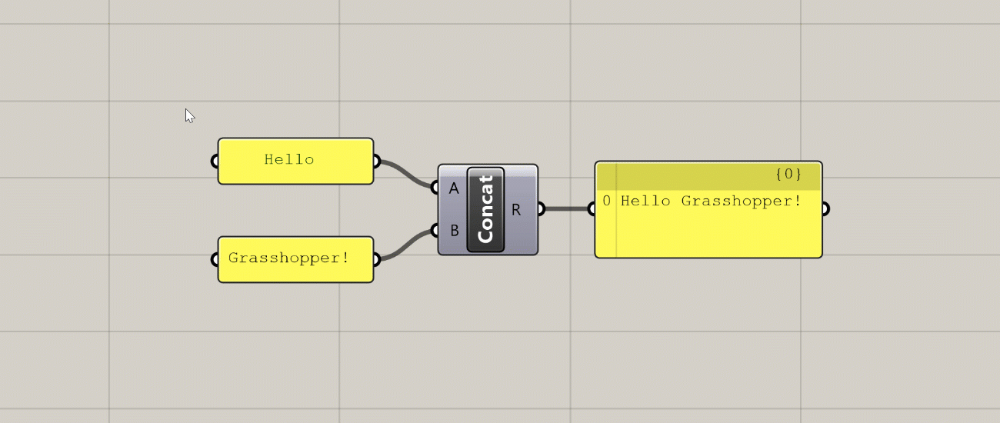
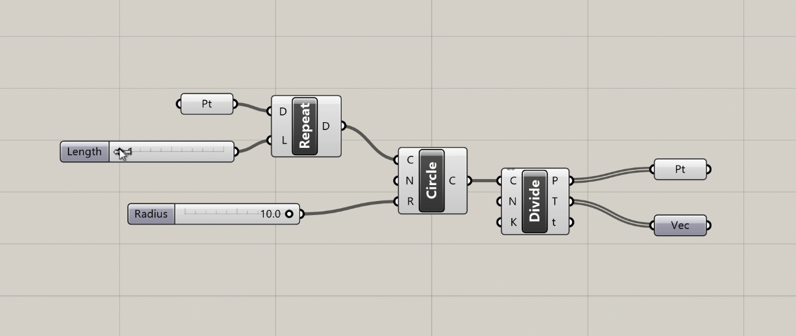

# Anatomy of a definition

All Grasshopper definitions are composed of only two kinds of elements: _components_ which hold data and perform tasks, and _wires_ that connect and pass data between the components. Using these two elements, we can define complex systems as assemblies of smaller parts working together to achieve a common goal.

## Components

Components are the core of Grasshopper. They define all of the individual operations that Grasshopper can do. Components are the tools in your computational toolbox 🧰.

Just like a carpenter has to first learn how all the tools in their toolbox work before they know what is appropriate for each job, a large part of learning Grasshopper is getting familiar with all of the components that Grasshopper has to offer. A component-by-component glossary is useful, but would not make for a good tutorial or an engaging online course. So we will get familiar with components the fun way: by using them to develop working definitions in the [exercise lessons](https://medium.com/intro-to-grasshopper/search?q=exercise) of this course.

For now, let’s look at some of the general concepts behind components, and how they come together to form our Grasshopper definitions.

### Component types

There are three types of components in Grasshopper:

1. General components
2. Inputs
3. Containers

### General components

Most components are of the ‘General’ type. These components represent individual operations that do stuff in the definition. You can think of each component as a small function that takes in a set of inputs, processes them a certain way, and generates a set of outputs as a result.

The component’s inputs are represented as ‘ports’ on the left of the component, while the outputs are represented by ‘ports’ on the right. Wires can be connected to these ports to pass data from the outputs of one component to the inputs of another.

### Inputs

Inputs are a special component type that allows us to bring data into our definitions. All the inputs components can be found in the ‘Input’ group within the ‘Params’ tab first from the left.

The most common input components allow us to generate data dynamically within the definition. For example, we can use a `Number Slider` to choose a number using a visual slider, a `Panel` to type numbers or text into a textbox, or a `Boolean Toggle` to flip a switch to set a True/False condition.

Some of the more advanced input components bring data in from outside sources. For example, an `Image Sampler` imports pixel information from image files, while the ‘Import’ components bring data in from various other file types.

### Containers

‘Container’ components are another special type in Grasshopper. There are found in the ‘Geometry’ and ‘Primitive’ groups within the ‘Params’ tab first from the left. These are called ‘containers’ because they don’t do anything other than store data. These components have one input port that accepts the data and one output port that passes it on.

The ‘container’ components are special because each one can only hold data of a specific type, and there is one ‘container’ component for each type of data supported by Grasshopper. The data types are split into two main categories:

1. **Primitive** data types are all the standard types like numbers, booleans, and text which are not directly related to geometric elements.

2. **Geometric** data types are all of the different kinds of geometry supported by Rhino and Grasshopper. In addition to the common types you might use in Rhino like lines, curves, surfaces, and meshes, there are also lower-level geometry types such as points, vectors, and planes. These types are usually not exposed in a visual modeling environment but are crucial when we start to define our geometries computationally.

_Primitive data types (left) and Geometry data types (right)_

There are two ways to bring data into a ‘container’ component: pass the data in through the input port, or right-click on the component and use the ‘Set…’ options to set the data directly. With primitive data types, you can enter one or more values directly using a text box. With geometric data types, you will be sent to the Rhino window to either define the geometry directly or reference it from an object in the Rhino document. We’ve already seen an example of this in the [last exercise](https://medium.com/p/c3cd53dd19d5#37b1) where we used a `Point` container component to create a base point for our model.

## Component display

Once you place a component on the canvas, you can interact with it in several ways:

### Tooltips (hover)

Hovering over the inputs, name, and outputs of a component will give you a tooltip with information about the component and the data stored inside of it. Hovering over any of the input ports will tell you the data type the input is expecting, a description of what this input is used for, and what data is currently being input. Hovering over the component’s name will give you a description of what the component does (similar to what you see in the component toolbar). Hovering over any of the component’s output ports will tell you the data type that the output generates, and a preview of the generated data.

_Various tooltips generated by hovering over a component_

### Context menus (right-click)

Right-clicking on the inputs, name, and outputs of any component will give you options pertaining to that input, output, or component as a whole. I will not describe all of these options here, but we will encounter them over time as we proceed through the exercises.

_Context menu generated by right-clicking on a component’s input_

### Zoomable UI

This is a recently added feature of Grasshopper which adds additional UI elements to some components based on the level of zoom in the canvas. The additional features you get with the zoomable UI depends on the type of component, but the most typical uses are adding and removing input and output ports for components that support it, and setting styling and display options within `Panel` components.

_Additional UI elements generated at close zoom_

## Component States

The color of the component on the canvas indicates its state. There are six possible states for a component, each with its own visual representation:

### Normal

This is the default state. The component is shown in the default _white_ color, and any geometry generated by the component is displayed in the Rhino viewport in a semi-transparent red color.

### Selected

When you click on a component or use a selection window to select it, the component will turn _green_, as will the geometry generated by the component in the Rhino viewport.

### Hidden

If you don’t want the geometry generated by a component to show up in the Rhino viewport, you can hide it by right-clicking on the component and de-selecting ‘Preview’ in the context menu. The component will turn a _darker grey_ and its geometry will no longer be visible in Rhino. This is very useful as you start building more complex definitions to hide geometry that is needed by the definition but does not need to be seen.

### Disabled

If you want to stop a component from running you can disable it by right-clicking and de-selecting ‘Enabled’ from the context menu. The component will turn completely grey, and be stopped from running, which will likely stop other components which rely on its outputs from running as well. This is useful for turning off entire sections of your definition, for example when trying to isolate a problem or temporarily disabling a part of the definition that takes a long time to compute.

### Warning

If there is a non-critical issue with the component that does not completely prevent it from running, the component will produce a warning and turn _orange_. This usually happens if you have not supplied any data to an input that requires it, or something went wrong with a particular input that did not prevent the rest of the inputs from being processed. You can see the warning by hovering over or left-clicking the bubble in the component’s upper right corner.

_You can see a warning or error message by hovering over or clicking on the bubble_

### Error

An error is similar to a warning, but an error is more critical, usually meaning that the component failed completely and did not generate any outputs. If a component has an error it will turn _red_. As with a warning, you will see a small bubble on the component which will give you more information about the error.

# Connecting components with wires

To pass data from one component to another you connect their ports using wires. To create a wire, click on either an input or output port, and while holding down the mouse button drag your mouse over a port of another component you want to connect it to. When you hover over a valid port, the wire will snap into place and turn solid, meaning you can make the connection. Release the mouse button to create the wire, which will now be shown on the canvas.

The visual representation of the wire depends on the nature of the data flowing through it. With a single piece of data, for example one number, the wire will be a single line. If it is carrying several pieces of data in a List, the wire will be a double line. If it is carrying data in a more complex structure known as a DataTree, the wire will be dashed. We will cover Lists and DataTrees in more detail later in the course.

# Making the data flow

When you connect the output of one component to an input of another, you are carrying the data produced by the first component to the second component which will use it to create its own outputs. These connections create dependencies between the components, as the second component won’t be able to do what it needs to do unless it receives the proper data from the component “upstream”. This creates a “flow” of data through the definition — starting from the initial inputs on the left and ending with the final results on the right.

Unlike other types of computer programs, Grasshopper definitions are “[steady-state](https://en.wikipedia.org/wiki/Steady_state)” programs, meaning that the definition only calculates when something has been changed, but otherwise is inactive. While a definition is being calculated the interface is frozen, and only after a definition has been fully processed will you be able to navigate the Grasshopper and Rhino windows and see a preview of the generated geometry.

Because of its steady-state nature, Grasshopper does not allow connections that form “loops” in the definition, which happen when an output of one component is passed as an input to another component on which the original component depends. Although loops are a common tool in traditional text-based programming, in Grasshopper loops would create an infinite perpetual cycle which would cause it to freeze permanently, so they are not allowed by default. Later in the course, we will look at an external library that allows these kinds of loops through special components.

The steady-state nature of Grasshopper also means that components only run when they need to, which is any time the data they depend on is changed. When you change a component ‘up-stream’, any component that depends on it ‘down-stream’ will be recalculated, while any components that don’t depend on it will remain unchanged. Although in the beginning this may seem like a technical detail, as your definitions become more complex it is important to consider these dependencies to make sure your definition is working as efficiently as possible.

_When we turn off one slider, any component that depends on it will be affected, while other components will remain unchanged._

# Conclusion

In this lesson, we looked at the two basic elements common to all Grasshopper definitions: components which define a set of operations, and wires that connect the components together. Using these two elements, we can start to represent complex design systems by first breaking them down into a set of smaller interrelated parts, and then building out the relationships between them in the Grasshopper canvas.

Let’s now move on to the next lesson, where we will learn some techniques for better navigating the Grasshopper canvas.

# Navigating the canvas

Most of Grasshopper’s interface is focused on the canvas, which is where you compose your definitions by laying out the components and connecting them with wires. Working in the canvas should be pretty intuitive for anyone used to working with digital design tools, but let’s spend some time looking at a few of it’s more advanced features which will speed up your workflow and allow you to get the most out of Grasshopper.

## Context menus

Clicking on an empty part of the canvas will bring up a set of context menus that will help you select components and access common options faster.

- _Double-clicking_ on the canvas with the _left mouse button_ brings up the component search bar. Once the search bar pops up you can start typing the name of the component you want to create and the search bar will present the closest matches from the components you have loaded. You can then press Enter to select the closest match, scroll through the matches with the arrow keys, or select from the matches with the mouse to place the chosen component on the canvas. As long as you know the name of the component you want to create, the search bar can be a very quick way to find it.

- _Clicking_ on the canvas with either the _middle_ or _right mouse button_ brings up a context menu that allows you to select from a set of common options. For example, if you have a set of components selected you can control their visibility or turn them on and off all at once. You can also use the context menu to group components and create Clusters, as well as control the execution of the definition itself. For example, you can lock the definition to keep it from running or force it to recalculate. The middle and right mouse button menus contain the same exact options but organized a different way, so you can use whichever one you think is more convenient.

## Grouping and Clustering

Groups and Clusters allow you to work with sets of components. To create a Group or Cluster, you must first select a set of components, which you can do by either holding down _Shift_ and clicking on them one by one or by using the _left mouse button_ to click and drag a window around the components you want to select. Once the components are selected, you can use the context menu to create a Group or Cluster.

When you create a **Group**, Grasshopper will place a new Group object around the selected components. You can then select this object to move all the components in the Group at once. You can also right-click on the Group to select all the components inside as well as add and remove components from the Group. You can use the shortcut ‘Ctrl+G’ to create a Group as well.

When you create a **Cluster**, Grasshopper takes all the selected components and places them inside of a new component. Any wires leading to the components become the inputs of the new Cluster component, and any wires leading out become the outputs. You can think of this as creating your own custom components out of a set of other components. To edit the components in the Cluster you double-click the Cluster component, which brings up a separate canvas showing the components inside. Once you’re done editing you can save your changes and go back to the main definition canvas.

Clusters are especially useful when you have a set of components doing a specific task that you reuse often within the same definition or between definitions. Once you define a Cluster, you can copy and paste it within your definition or into other definitions. Copies of Clusters act as _instances_, meaning that when you edit a Cluster and save changes, the changes are updated in every instance of that Cluster. With Clusters, you can start to define your own library of specialized components without knowing any code. We will discuss Groups and Clusters in more detail later in the course.

## Widgets

Widgets are extra UI elements that appear on the canvas in certain instances. You can see what widgets are available and turn them on and off in the main menu under ‘Display → Canvas Widgets’.

- The **Align** widget appears when you select two or more components. This widget helps you lay out the components more evenly on the canvas and can be a great tool for keeping your definitions visually organized.

- The **Profiler** widget is turned off by default, but if you turn it on you will see a balloon under some components that will tell you how long the component took to execute. This can be very useful for troubleshooting and optimizing more complex definitions. Like most UI elements in Grasshopper, the Profiler balloons appear only at certain zoom levels, and only for components that take more than a few milliseconds to calculate.

_Profiler balloons appear below components that take longer to execute as the amount of data passing through them increases._

## Canvas Toolbar

Between the component toolbar and the canvas there is a toolbar with options for the canvas. The most important things here are the buttons on the right which control how your Grasshopper geometry is previewed in Rhino. The first three buttons give you global control to preview all geometry in Shaded or Wireframe mode or turn it off completely. The fourth button makes it so that only geometry contained within selected components is visible. This is useful for figuring out what each component is producing when troubleshooting a definition or learning how it works.

# Conclusion

In this lesson, we learned some additional features that help us work in the Grasshopper canvas. In the next lesson, we will continue with our hand-on exercises to construct one of the most classic examples of computational design — a parametric tower!
