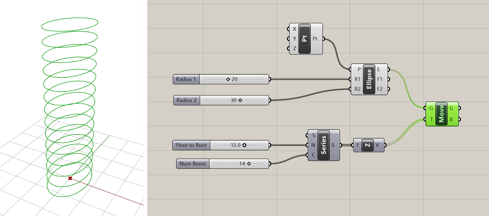

# Exercise - Parametric tower (part 1)

In this tutorial, we will construct a tower model controlled by a set of parameters in Grasshopper. In this first of four exercises, we will focus on the basic form of the tower.

### Step 1: Design concept and strategy

As with any design process, when approaching a new computational design problem it is useful to spend some time thinking through the problem you are trying to solve and formulating a concept and approach to guide your design process. Most Grasshopper tutorials only focus on the _what_ of computational design, with step-by-step instructions describing the process of building a particular model. This can teach you some useful tools and approaches but misses the critical points of _how_ to think about design problems computationally, and _why_ we might want to do this in the first place.

When formulating a concept for your model, a good approach is to first sketch what you want to achieve and then “reverse engineer” it to figure out how to build it. In this case, I want to create a twisting tower with parameters to control the amount of twist as well as the height of the tower and the shape of the floors. I can start by sketching out what I think a twisting tower might look like. Don’t spend too long on these sketches, they don’t need to be especially detailed or of high artistic quality. Nonetheless, they are important for getting a rough understanding of what you want to build so that you have a good strategy for how to start in Grasshopper.

Once I have a basic design approach in mind, I can start to break it down into components to develop a strategy for building the model. Looking at the sketches I can observe that the twisting effect comes from having similar shape floors that rotate relative to each other as they go up the building.

Based on this observation, I can develop a strategy for building the model in Grasshopper. For example, I might first figure out how to create one floor, then copy the floor multiple times vertically, adding a small rotation to every copy. Of course, you will need to adjust your strategy while you build the model based on what you find works and doesn’t work, but starting with an initial visual concept and strategy will make the process of starting a model much easier.

### Step 2: Define the base point

As we saw in the previous [tutorial](https://medium.com/intro-to-grasshopper/exercise-hello-grasshopper-c3cd53dd19d5), a good place to start a model is with a base point that defines a point in space relative to which we can start defining the rest of our geometry.

Last time we used a `Point` component to define the point in the Rhino viewport. This time, let’s use a `Construct Point` component to build the point directly in Grasshopper. This component has three numerical inputs representing the X, Y, and Z coordinates of the point in 3-d space. Each of these inputs has a default value of 0, which means that when you first place the component on the canvas it will create a point at (0,0,0) or the model’s origin. If you want to move the point somewhere else you can input a `Number Slider` or `Panel` with a numerical value into any of the inputs. For now, let’s keep the defaults to leave our base point at the origin.

### Step 3: Model the first floor

Once we have a base point to locate our tower, we need to define the shape of the first floor. Based on the sketch, I want something curvy and not rotationally symmetric so I get the twisting effect when I rotate the floors relative to each other. I will choose to model my floors with an ellipse but feel free to experiment with other shapes as well.

To create the ellipse we can use the `Ellipse` component, which creates an ellipse based on a center point and two numbers that define its radius in both directions. Let’s connect the base point we just created to the (P) input and connect two new `Number Slider` components to the two radius inputs.

Here is a useful shortcut for creating `Number Slider` components: double-click anywhere on the canvas to bring up the search menu and type any number in the search bar. This will create a `Number Slider` component set to that number. The decimal places you use in the number controls the decimal resolution of the slider. By default, the range of the slider will go from 0 to the closest power of 10 to the number. You can also set the range yourself by typing the minimum and maximum values, along with the number, in the format `min<number<max`. For example, typing in `0<25<50` will produce a number slider with the range 0–50, set to 25.

### Step 4: Create more floors

Now that we’ve built one floor, we can multiply it vertically to create the other floors. In Rhino we would do this with the Copy or Array command. In Grasshopper, things work a little differently. Each component on the Grasshopper canvas runs individually, and stores the data it produces in its outputs. Even if that data is then passed on to one or more components downstream, the original data produced by a component will always remain within that component. This means that objects created by one component cannot be directly modified by another component, but only used for generating its own outputs.

The persistence of data in the canvas means that Grasshopper does not need separate components for copying or arraying objects. Instead, you can use the `Move` component to translate the object one or more times, and then hide the original object if you don’t want to see it in the Rhino viewport.

The `Move` component has two inputs: the geometry (G) you want to move and a translation vector (T) that describes the magnitude and direction of the move. We’ll discuss Vectors in more detail in the [next lesson](), so you can follow along for now or skip ahead if you’d like more background.

Create a new `Move` component and place it to the right of the `Ellipse` component on the canvas. To specify the geometry, connect the ellipse created in the (E) output of the `Ellipse` component to the `Move` component’s (G) input.

To specify the direction of the move, we will use a `Unit Z` component to create a new vector pointing in the model’s vertical Z direction. If you look in the ‘Vector’ section of the Vector tab of the component toolbar you will see that there is one Unit Vector component for each of the three coordinate axes. Place a new `Unit Z` component on the canvas and connect its (V) output to the (T) input of the `Move` component.

You should now see a copy of the ellipse appear one unit length above the original ellipse. The Unit Vector components have one input (F) which controls the magnitude of the vector. This input has a default value of 1.0, so by default these components create vectors of one unit magnitude (such vectors are called unit vectors).

Since the magnitude of the vector will control how much the ellipse is moved, it should be based on the height of each floor. But we don’t want to only create one floor. We want the `Move` component to run multiple times, creating a new ellipse each time and moving it vertically to its proper location. To do this we will first create a <List> of values representing the height of each floor, and then pass this List to the `Unit Z` component to create a set of vectors to move all the ellipses into place.

A quick way to generate a set of evenly spaced numbers is with the `Series` component (we will review these more in the <next lesson>). This component creates a set of sequential numbers based on three inputs — the starting value (S), the step or increment between each value (N), and the number of values to generate (C).

We will keep the default starting value of 0.0 so our first floor stays in the same place as the original curve. Let’s create two new `Number Slider` components to control the other two inputs. The step size controls the distance between each height value, so the first `Number Slider` component will set the floor-to-floor height of the building. The number of values we want to generate is based on the number of floors we want to create, so the second `Number Slider` component will control the total number of floors in the building. You can rename the `Number Slider` components so you remember what they control by right-clicking on them and changing the name at the top of the context menu.

Connect the (S) output of the `Series` component to the (F) input of the `Unit Z` component to generate the floors of the tower. We now have a simple tower definition based on four parameters. You can slide the `Number Slider` components one by one to get a feel for how they control the model in real-time.

### Step 5: Let’s twist

To create the twist in our tower, we will apply a rotation to each of the ellipses. First, let’s use another `Series` component to generate a list of numbers representing the rotation angles of each floor. Since we need one rotation value for each floor, we should reuse the same `Number Slider` component that specified the number of floors previously for the (C) inputs of both `Series` components in our model. This way, if we want to change the number of floors in the future, all we have to do is change one `Number Slider` component and everything will update correctly. Reusing input data within your model is good practice for making robust models and minimizing the chance of bugs later on.

Once the rotation values are generated, we can use them to rotate our ellipses using the `Rotate` component. Create a new `Rotate` component on the canvas and connect the ellipses to its (G) input and the angle values to its (A) input. In Grasshopper, angles are usually expected to be in radians. If you’d prefer to work in degrees, you can pass the values through the `Radian` component first to convert the degrees to radians, and then pass the resulting radian values to the `Rotate` component.

Because the original non-rotated ellipses are still stored in the `Move` component, you will probably see the new rotated Ellipses overlapping them in the Rhino viewport. At this point, it may be useful to start hiding the outputs of some of the earlier components to create a cleaner visualization of the final result.

### Step 6: Give it (solid) form

The last step of this exercise is to create the solid volumes of the building by extruding each ellipse vertically based on the building’s floor-to-floor height.

To extrude the ellipses we can use the `Extrude` component. This component has two inputs: one for the Curve you want to extrude, and one for the Vector that describes the magnitude and direction of the extrusion. Create a new `Extrude` component and connect its (B) input to the (G) output of the `Rotate` component which is storing the rotated ellipses.

To define the direction of extrusion for each curve, let’s use another `Unit Z` component. Connect its (F) input to the `Number Slider` component we created previously to control the floor-to-floor height and it’s output to the (D) input of the `Extrude` component. Since we are connecting multiple curves but only one vector, the same vector will be reused for each extrusion, which is fine since all the floors of the building have the same height.

At this point, you should see a stack of ribbons defining the shape of the tower. The last step is to create the lower and upper surface of each volume by passing the result of the `Extrude` component into a `Cap` component. This component will fill in any planar holes in a `Surface` or `Polysurface` object. Once the top and bottom holes are capped, we will have one closed Brep or Polysurface object defining the volume of each floor in the tower.

# Conclusion

In this exercise, we defined the basic twisting form of the parametric tower. The five `Number Slider` components we created while building the model can now be used to control the various parameters of the tower. Spend some time experimenting with the parameters and see what kind of different tower shapes you can create. In case you got lost along the way, you can download a finished version of the demo [here](https://www.dropbox.com/s/44ohfz1qxjzrymx/intro-to-gh_tower_1.gh?dl=1).

# CHALLENGE:

We built our simple parametric tower definition based on elliptical floors. What if we wanted rectangular floors instead? The beauty of Grasshopper is that once you define your model’s logic once, it should be relatively easy to make changes by replacing certain aspects of the model while keeping the rest of the logic intact. Try replacing the Ellipse component with one or more other components to change the shape of the floors while keeping the rest of the tower definition the same. What kind of interesting towers can you create by combining the twist operation with floors of different shapes?

