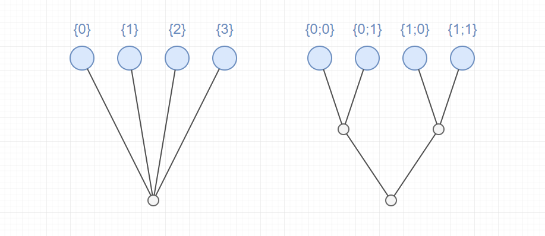

# Working with Lists

At the heart of any Grasshopper definition is the data. Grasshopper components process and create data, while wires transport the data between different components. In the [last exercise](https://medium.com/intro-to-grasshopper/exercise-parametric-tower-part-1-bdbad26bc6ca), you may have already noticed that some wires look different from each other. This is because the visualization of the wire changes based on the structure of the data flowing through it. There are three types of data that can flow through a wire in Grasshopper:

- **Item** — one data element, for example one curve object
- **List** — an ordered set of elements, for example 10 points
- **DataTree** — a more complex data structure composed of two or more Lists

DataTrees are the subject of the next lesson section. For now, let’s focus on Lists, and how to work with them in Grasshopper.

## Creating lists

Many components generate Lists of items as a result of their operation. For example, the `Divide Curve` component we saw in the [first exercise](https://medium.com/p/c3cd53dd19d5#4f18) uses one curve and a value specifying the number of divisions to create a List of Points along the Curve.

To create your own List from scratch, you can input multiple values into a `Panel` component. A shortcut for creating a `Panel` is to double-click on the canvas to bring up the search bar, then type ‘//’. This will create a new `Panel`, and place any text you type after the two slashes into the `Panel`. A `Panel` can be used to input text or numerical data. To create a List of values, put them on separate lines in the `Panel`. Make sure to right-click on the `Panel` and select the option for ‘Multiline Data’ to separate the lines into different items in a list. Otherwise, the text will be output as one big chunk.

You can find many useful components for creating and manipulating Lists in the ‘Sets’ tab in Grasshopper’s component toolbar.

_The ‘Sets’ tab of the component toolbar contains many useful tools for working with Lists_

In the ‘Sequence’ section of the ‘Sets’ tab, you will find several components for generating sets of numbers, which can be very useful for driving your computational models. In the [previous exercise](https://medium.com/p/bdbad26bc6ca#d858) we used the `Series` component to generate a set of numbers given a starting value, a step value between each number, and a total number of values to generate.

The `Range` component also generates a set of evenly spaced numbers, but it does so based on a [Domain](https://medium.com/p/e9ce209f0bd5#3d77) that defines the minimum and maximum value, and the total number of values to generate within that range.

The `Random` component will also generate a set of values within a given Domain, but it will choose the values randomly. To create different sets of random values, you can input different numbers into the Seed (S) input, which controls how the random algorithm is run. While the numbers created by the `Random` component will always appear random, inputting the same Seed will always produce the same set of numbers. This is important for making sure that the numbers don’t change each time you re-run the script.

## Seeing the data

A quick way to see the data stored inside a component is to hover over any of the component’s input or output ports. A tooltip will pop up with a preview of the data stored inside the port. You can also pass the data into the input port of a `Panel` component, which will display the data in a scrollable table. This is a great way to monitor the data being produced by your definition and keep it visible on the canvas.

In the table generated within the `Panel`, you will notice that each value in the List has a corresponding number to the left of it. This is the index of the item, and it represents the item’s position in the list. You will also notice that the first item’s index is 0, not 1 as you might expect. This is because in Grasshopper, [as in most programming languages](https://en.wikipedia.org/wiki/Zero-based_numbering), elements are numbered starting with 0. This can take some getting used to but you will get the hang of it over time.

## Working with Lists

In the ‘List’ section of the ‘Sets’ tab, you will find many useful components for manipulating Lists, including:

- The `List Length` component which returns the length of a list
- The `List Item` component which returns a List item at a specified index
- The `Sort List` component which sorts the items in a List
- The `Reverse List` component which reverses the order of a List

Spend some time exploring these components on your own, we will see some of them again in later exercises.

## Working with Domains

A _Domain_ is a special data type in Grasshopper that represents a numerical range based on a start and end value. Domains are used by many components that operate over a range of values. We’ve already seen how Domains are used by the `Range` and `Random` components to generate sets of numbers.

The easiest way to create a Domain is to type it into a `Panel` component with the starting and ending value separated by “ to ” — for example: “0 to 100”. If you pass this text into an input that expects a Domain, Grasshopper will automatically convert it for you. If you want more control over how the Domain is defined, or want to control the start and end values using data in your definition, you can use the `Construct Domain` component which creates a Domain from two input values.

The `Construct Domain` component can be found in the ‘Domain’ section of the ‘Maths’ tab in the component toolbar. Here you will find several other useful tools for working with Domains.

The `Remap Numbers` component maps a set of numbers from one Domain to another. For example, you can use the `Remap Numbers` component to take data in the range of [0, 100] and map it to a range of [0.0, 1.0]. The `Remap Numbers` component has three inputs — the data (D) you want to map, the starting domain (S) representing the range of the current data, and the target domain (T) representing the range you want to map the data to.

A very common application of the `Remap Numbers` component is mapping a List of values to a Domain of 0.0 — 1.0 so that the lowest value in the List becomes 0.0 and the highest value becomes 1.0. To find the starting Domain of the data we can use the `Bounds` component which returns a Domain defined by the smallest and largest values in a List. We can use the output of the `Bounds` component as the starting Domain (S) of the `Remap Numbers` component to map the values to the default target Domain of 0.0–1.0.

_Combining the `Bounds` and `Remap Numbers` components to map a List of values to the range 0.0–1.0_

## How Lists affect the data flow

Each component in Grasshopper defines a process for taking in a set of inputs and producing a set of outputs. Most components are built to work with single items as inputs. For example, the `Line` component creates a line using one start point (A) and one end point (B) as inputs.

_The `Line` component generating a single line given two individual points_

When we pass a List of values into a component’s input port instead of a single item, the component will actually run multiple times, as many times as it needs to process each item in the List in order. For example, if we pass ten points into the `Line` component’s (B) input, the component will actually run ten times and produce ten lines as a result, with each resulting line using one of the ten provided end points. Since we only supplied one start point, the same point is used for each line.

_Multiple lines produced based on a List of Points_

Now, what happens when we pass multiple points into the other input as well? In this case, Grasshopper will go down both lists at once, using one point from each list in order to create each line. You can see that the component stills runs ten times to produce ten lines, but this time each line has a unique start point.

Multiple lines produced based on two Lists of Points

If you input Lists of different lengths into the same component, the component will still run as many times as it needs to in order to process all the items in the longest List. For the shorter List(s), the component will use as many unique items as possible until it runs out of items, and then reuse the last item until all values in the longest List are used up. For example, if we only pass six points into the `Line` component’s (A) input, the component will still run ten times, but the last five lines will share the same start point.

# Conclusion

In this lesson, we have seen how Grasshopper uses Lists to store data containing multiple items. Working with Lists and predicting how the structure of your data will impact the way a component will run can be challenging when you’re first learning Grasshopper. It can even be challenging for those used to programming with a text-based programming language, where processes for creating and working with data can be described much more explicitly.

What you need to remember is that everything in Grasshopper is defined by individual components that execute specific functions and generate new data based on the data given to them. Thus, unlike traditional code, a Grasshopper definition is not so much a set of instructions as a complex system for developing formal solutions based on a set of interrelated parts. Learning to control the data in our definitions and getting an intuition for how the data structure will impact various components is a critical part of becoming an expert in Grasshopper, and like everything else, it is best learned through practice.

In the <next lesson> we will take these concepts further by describing DataTrees, which define more complex data structures composed of two or more individual Lists. We will then get hands-on practice with Lists and DataTrees in the following [exercise]().

# Working with DataTrees

In Grasshopper, DataTrees are used to organize data in more complex structures than a single ordered List. An easy way to think of DataTrees is as a collection of Lists. If a List is a structure for organizing two or more items of data, a DataTree is a structure for organizing two or more Lists.

Each List in a DataTree is called a _branch_. Just as every item in a List has an _index_ that specifies its position in the List, each branch in a DataTree has a _path_ that specifies its location in the DataTree. Thus, any item in a DataTree can be retrieved by specifying the path of the branch the item is on, followed by the index of the item in that branch.

DataTrees use a hierarchical structure to organize their branches, which is reflected in the structure of its branch paths. For example, let’s take a DataTree composed of four branches. In one case the DataTree might have one level of hierarchy with each branch organized on the same level. In this case, each branch would have a path composed of a single number to specify its position on that level. In another case, we might want to organize the branches in two levels of hierarchy with two groups of two branches. In this case, the branches would have paths composed of two numbers, each number specifying the position of the branch at each level of the hierarchy.

_Example of two DataTrees with different hierarchies for organizing four branches_

DataTrees are often created when a component that produces a List of data from a single input value is supplied a List of input values. For example, the Divide Curve component we saw in the [first exercise](https://medium.com/intro-to-grasshopper/exercise-hello-grasshopper-c3cd53dd19d5) takes a single Curve and produces a List of Points as a result. If we input a List of Curves instead, the result will be a DataTree, with the List of Points resulting from dividing each Curve represented as individual branches in the tree. The heirarchy of branches in a DataTree often reflects the history of how the data was produced as it was passed between different components in the definition.

_Extending the first exercise to create a DataTree of circles organized hierarchically into branches_

## Visualizing DataTrees

When you first start working with DataTrees, it can be difficult to keep track of the structure of the data being produced. Often it helps to visualize the data to understand not only what it is but how it’s structured into branches and the hierarchy of that structure.

There are three basic ways to visualize the structure of a DataTree. The first two we’ve already seen above:

Hovering over any input or output port will give you a **tooltip** with a preview of the data. If that data is in a DataTree format, however, you will not see the actual data items but a list of the branches with their paths and the number of items in each branch.

You can also pass the data into a `Panel` component, which will show each element in the DataTree organized by branch. Each branch is denoted by a dark bar with the path of that branch in it.

Finally, there is also a special component for visualizing the branch structure and hierarchy of a DataTree called `Param Viewer`. This component has two modes for visualizing DataTrees which you can switch between by double-clicking on the component.

The first mode will list the branches in a DataTree, showing the path of each branch and the number of elements in each (this is similar to the tooltip display you get from hovering over an input or output port). The second mode gives you a visual representation of the DataTree showing the levels of hierarchy and path of each branch.

## Working with DataTrees

The ‘Tree’ section of the ‘Sets’ tab in the component toolbar has many useful components for working with DataTrees.

- `Flatten Tree` — removes all branch hierarchy and moves all elements to a single branch. In effect, it converts a DataTree into a List.

- `Graft Tree` — adds a level of hierarchy to a DataTree by placing all the items in every branch onto their own branches. Passing a List into a `Graft Tree` component creates a DataTree with a separate branch for each item in the List.

- `Simplify Tree` — simplifies the DataTree as much as possible by removing unnecessary levels of hierarchy. This can be useful for cleaning up overly complex DataTree structures that may have been created as the data was passed through multiple components.

- `Explode Tree` — breaks the branches of a DataTree into individual Lists represented by individual outputs in the component. This component has a zoomable UI which you can use to add outputs and specify the branch path the output should pull data from. To automatically match the outputs to the structure of the DataTree you can right-click on the component and select ‘Match outputs’ from the context menu.

_Using the Explore Tree component to separate DataTree branches into individual Lists_

- `Flip Matrix` — for DataTrees with only one level of hierarchy (all branches organized on the same level), this component flips the relationship between the paths of each branch and the index of the items in each branch. For example, if you input a DataTree composed of five branches with ten items in each branch, the `Flip Matrix` component would produce the same exact data but now organized as ten branches with five items in each branch. The first items of each branch would go into the first branch, the second items of each branch would go into the second branch, and so on. This is similar to transposing a table by flipping the rows and columns.

- `Path mapper` — allows you to change the structure of a DataTree by indicating the starting and ending path hierarchy. Right-clicking on the component will display a context menu where you can select from several common mapping types. A very useful one is “Trim Mapping” which trims the furthest branches of a tree by combining elements with the same path one level below on a single branch. A good way to get familiar with what the `Path Mapper` component can do is to start with one of the presets and then double-click on the component to experiment with editing the mapping further.

_Using the `Path Mapper` component to trim the branches of a tree_

Some of the most common data manipulations such as Flattening and Grafting a DataTree or reversing the order of a List can be applied as a _filter_ directly to data as it enters or leaves a component. To apply a filter, right-click on a component’s input or output port and select it from the context menu. This is also a quick way to experiment with different data manipulations if you are trying to get your data to fit what a certain component needs.

_Applying filters to modify the structure of a DataTree in a component’s output_

## How DataTrees affect the data flow

Earlier, we saw how inputting a List of data into a component that expects a single item causes the component to run multiple times, producing multiple outputs as a result. When you input two Lists into a component, the component will run as many times as it needs to process every item in both Lists, reusing items from the smaller Lists as necessary. When you input multiple DataTrees into a component, this same process is extended to the branches of the DataTrees.

The component will first match branches between the trees, and then for each pair of branches it will work through all the elements in both branches the same as it would for multiple Lists. If one DataTree has more branches than another, the last branch from the smaller DataTree is reused as necessary until all the data has been processed.

Let’s look back at the previous example where we were connecting multiple lines using two lists of points. We saw that inputting two lists of ten points created ten lines, one line using each pair of points from both lists. But what if we wanted to generate 100 lines, with a line connecting each start point to each end point?

This is where DataTrees come in. To get each start point to be processed using each end point, we can use the `Graft` component (or filter) to convert one of the inputs from a List of ten points to a DataTree with ten branches, one point on each branch.

When the Line component gets the List and DataTree as inputs, it will first match the branches in each data set. In Grasshopper, DataTrees are not a separate concept from Lists, but an extension that allow you to work with multiple Lists within the same dataset. In fact, a List in Grasshopper is actually just a DataTree with a single branch. You will notice that when you view a List in a Panel, there is still a branch index at the top of the list with the default path {0;0}.

Thus, when the Line component is matching branches between the List and DataTree, it will use the same single branch of ten points to compare to each branch in the DataTree. The ten points in the List will be used to generate ten lines for the single point in each of the ten branches of the DataTree. The result is a DataTree containing ten branches, with ten lines on each branch, or 100 lines total.

_Grafting a List to compare each element in one list to every element in another_

# Conclusion

Managing DataTrees and using their structure to control how components function can be one of the hardest challenges when you’re first learning Grasshopper. Because Grasshopper does not allow us to write explicit instructions for how the components should run, often the only way to get a component to do what you want it to do is to first structure the data you pass into it the right way. As we saw with the previous example, the same ten points passed through the same component can produce very different results depending on how those ten points are organized in the data.

Learning how to work with DataTrees effectively will take time, and like most things Grasshopper, the best way to learn is by doing. In the [next exercise](), we will continue with the Parametric Tower tutorial, and see how we can use Lists and DataTrees to organize our data effectively as we start to add detail and features to the model.
