# Exercise - Parametric tower (part 2)

> Note: this is the second part of a series of tutorials on the parametric tower. You can find the first part [here](https://medium.com/intro-to-grasshopper/exercise-parametric-tower-part-1-bdbad26bc6ca). If you want to pick up where the last exercise left off, you can download the model [here](https://www.dropbox.com/s/44ohfz1qxjzrymx/intro-to-gh_tower_1.gh?dl=1).

In this exercise, we will continue to develop our tower model, this time focusing on creating a panelized facade system for the curving tower. In the digital world, there are few limitations on geometry, and modern CAD tools like Rhino and Grasshopper make it easy to model free-from curve geometries of high complexity. However, if the goal of the model is to design an object that will be made in the physical world, you must design with the constraints of the material and making process in mind.

In the [last exercise](https://medium.com/intro-to-grasshopper/exercise-parametric-tower-part-1-bdbad26bc6ca), we designed our building floors as curved ellipses, which was relatively easy to do with one component in Grasshopper. In reality, though, most building materials come in flat sheets, which are easier to manufacture and cheaper to transport. Considering the scale of the building, describing the facade as a series of flat panels that follow the outline of the ellipses would probably achieve a very similar effect, though at a much lower cost.

In architectural design, the process of refining a model’s geometry so that it takes into account the constraints of the material and process used to build it is called _rationalization_. In this exercise, we will rationalize our simple curved facade by describing it as a series of flat rectangular panels.

### Step 1: Design concept and strategy

Our goal in this exercise is to create a set of rectangular, flat panels as individual surfaces that approximate the elliptical floor plates as much as possible. To define each rectangular surface, I need four points that define its corners. To make sure the panels follow the ellipse I can place these points on the floor profile curves at regular intervals. This will give me a set of points defining the lower edge of each panel. I can then move the set of points up to define the upper set of points. I then need to create a computational strategy for going through these sets of points, choosing the right set of 4 points each time to create each panel.

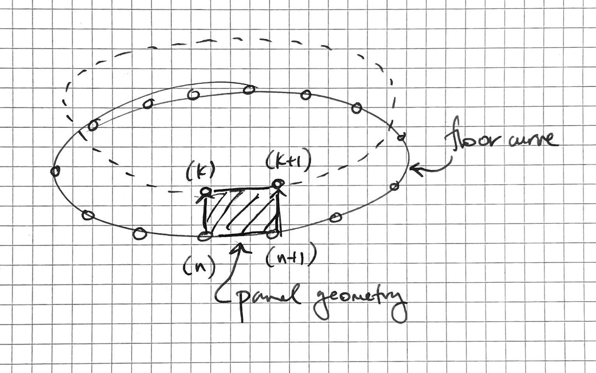

## Step 2: Make some points

To create the points, we will use the `Divide Curve` component, which we already saw in the first exercise. Let’s create a new `Divide Curve` component and connect its (C) input to the `Rotate` component’s (G) output which is storing all the curves representing the floor outlines. By default, this will create 10 points evenly distributed on each floor curve, but we can control the number of points created by connecting a number into the `Divide Curve` component’s (N) input.

Let’s say, however, that we don’t know how many panels each floor needs. Instead, we may want to specify the maximum size of any panel. We can build this into our definition by first using a `Curve Length` component to find the length of each curve, and then dividing that length by the maximum width we want for the panels (I’ll use 10'-0"). This division will give us the number of panels (and thus the number of curve divisions) we need to make sure our panel ends up the proper width.

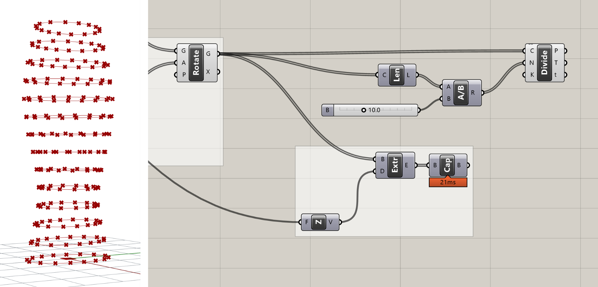

Because the length of the curves will not necessarily be evenly divisible by the target width of the panel, the division will most likely produce a decimal number. If you plug this number directly into the ’N’ input of the `Divide Curve` component, the component will automatically round to the nearest integer. However, depending on whether we round up or down, the final panel width may end up being slightly smaller or slightly larger than the target. To ensure that our panels are always no wider than 10'-0", we need to force the division to round up. We can do this with the `Round` component, which takes a decimal number and gives us three options for how to round it — Nearest, Floor (force round down), and Ceiling (force round up).

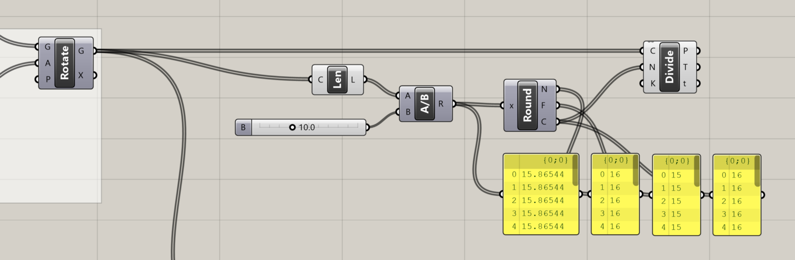

_Comparing the three outputs of the `Round` component_

If you hover over the ‘P’ output of the `Divide Curve` component, you will see that the data is organized as a DataTree (we reviewed Data Trees in the [last lesson](https://medium.com/intro-to-grasshopper/working-with-datatrees-179be560f086)). Instead of listing the actual data, the tooltip now lists the path and number of items in each branch of the DataTree. In this case, we have 14 branches in the DataTree (one for each floor of our building), with 16 points in each branch representing the 16 points generated by dividing each curve.

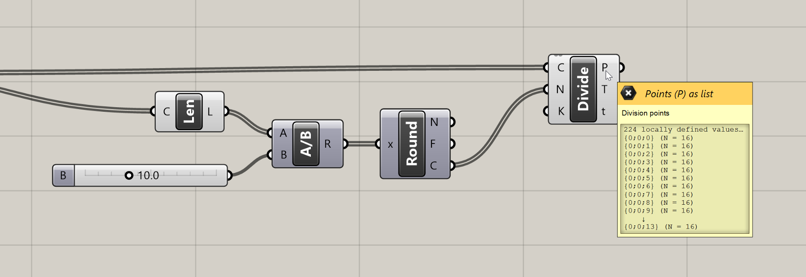

_Tooltip showing the structure of the DataTree produced by the `Divide Curve` component_

The DataTree was created automatically by Grasshopper because we supplied a List of Curves to the `Divide Curve` component which itself produces a List of Points for each Curve. The `Divide Curve` component runs once for each Curve and puts the resulting Points on a separate branch of the DataTree. Although DataTrees can be confusing at first, they are actually quite helpful for organizing data in proper hierarchies based on how the model is built. Without DataTrees, we would be stuck with one long list of Points after our division, which would make the rest of this exercise much more challenging.

> Note: it would be challenging but not impossible, and in fact before DataTrees were implemented in Grasshopper there were many workarounds for doing this using clever data manipulations. As an extra challenge, try flattening the set of points coming out of the `Divide Curve` component, and see if you can work through the rest of the definition while still generating the proper final output.

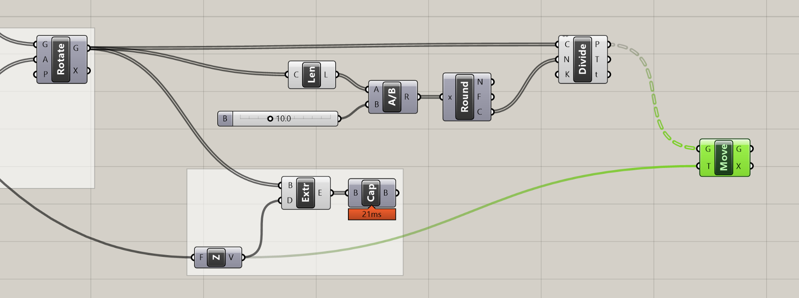

The points generated by the `Divide Curve` component will define the lower two corner points of each panel. To define the upper corner points we can use a `Move` component to create another version of the Points moved up to the top of each floor. We can reuse the `Unit Z` component we created previously for the extrusion to specify the translation vector of the move.

### Step 3: Create the panels

Now that we have the Points, we need to define the actual panel geometries based on those Points. To create a Surface object from four corner Points, we can use the `4Point Surface` component. This component has four individual inputs where we can connect the four corner Points to create a Surface. We can create all the panels of our building at once by supplying a list of Points to each input, but the lists have to be aligned so that the right Points are available for each panel as it’s being created.

Currently, we have two Lists of Points defining the upper and lower corners of each panel. If we iterate through each list simultaneously, this will give us the leading two Points of each panel. To define the other two points, we can actually reuse the same Lists of Points, since the trailing points of one panel become the leading points of the next.

However, to make sure the right points align for each panel, we first need to shift the Lists by one spot, so that the first panel actually gets the second point from each new List. To shift the Lists we can use the `Shift List` component, which will shift the items in a List to the left by the number of spots indicated in its Shift (S) input. Let’s create two new `Shift List` components and connect their (L) inputs to the outputs of the `Divide Curve` and `Move` components that are storing our point data.

The `Shift List` component’s Shift (S) input is set to 1 by default, which will shift the List one spot to the left, meaning the second item will now become the first. Since this is exactly what we want, we can leave the default value. Once the definition is complete, feel free to experiment with this input to see how the shift factor affects the way the panels are created. You can also try inputting negative values to shift the List in the other direction.

Now that we have our four sets of points for the four corner points of each panel, we can connect them to the `4Point Surface` component. This component expects you to enter the corner points in counter-clockwise order. Based on the following diagram we can connect the original Points to the (A) input, the shifted version of the original Points to the (B) input, the shifted version of the moved Points to the (C) input, and the moved Points to the (D) input.

When everything is properly connected you should see the flat panel geometries appear properly in the model. If you don’t see the panels or they appear twisted you may have input them in the wrong order. Make sure your solution matches the image below.

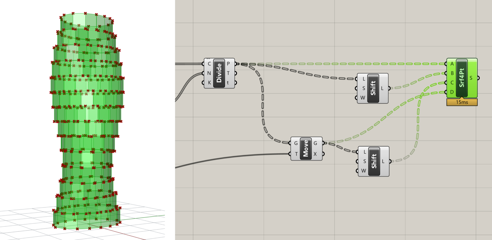

_Panel geometries created by the `4Point Surface` component_

You’ve probably noticed that the `Shift List` components also have a third input called Wrap (W) which specifies whether the elements moved off the end of the list should wrap around and be placed at the other end. In our case, we will leave this at the default ‘True’ because we want the first points in each list to wrap around to the end of the shifted Lists so they can be used to create the last panel on each floor. Try to set these to ‘False’ and you will see that the last panel on each floor will not be created correctly.

### Step 4: Create openings

Now that the basic panels are created, let’s add some detail by creating an opening in each panel. Our strategy for creating the openings will be to first scale each surface to make a smaller surface, then extract the edges of both surfaces and use the edges to construct a single surface with a hole in it.

To scale the surfaces, we will use the `Scale` component, which scales an object based on a center point and scale factor. Place a new `Scale` component on the canvas and connect its (G) input to the panel surfaces stored in the (S) output of the `4Point Surface` component. This will create a half-size version of the tower since the default scale factor is 0.5 and the default center point for scaling each panel is the model origin.

To scale each panel relative to its own center point, we need to first generate a set of Points at the panel centers and then pass these points to the `Scale` component. A good way to get the center point of a flat object such as a surface or closed curve is to use the `Area` component, which will compute the area of the object as well as its centroid.

Let’s create a new `Area` component and connect it to the panel Surfaces. You should see a Point object appear in the model at the center of each panel. Now let’s pass this List of Points to the (C) input of the `Scale` component. Each surface should now be scaled relative to its own center, with a smaller surface sitting on top of the original one. Since we’re using the same Surfaces we’re scaling to generate the center points, we can be sure that the number of Surfaces and Points will match and that the right Point will be used to scale each Surface. To finish things off, let’s make a new `Number Slider` component and connect it to the (F) input of the `Scale` component so we can control the scale factor (and thus the size of the openings).

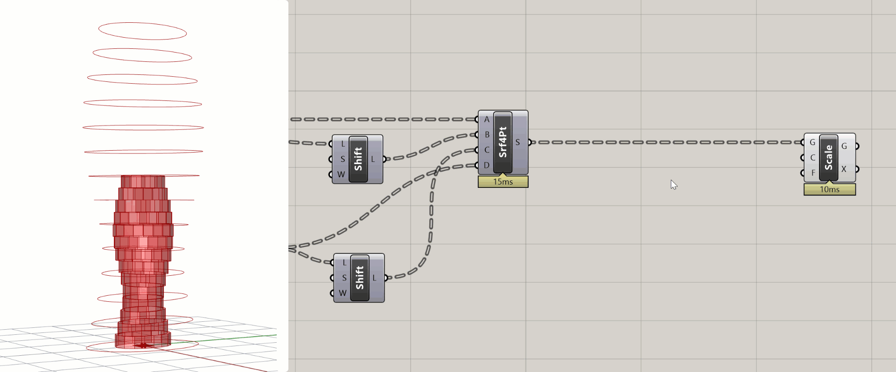

### Step 5: Rebuilding the panels

Once we’ve defined the scaled Surfaces, we can extract the edges of both sets of Surfaces so we can use them to define the final panel geometry.

To extract the edges of a Surface or Polysurface object, we can use the `Brep Edges` component. This component produces both the naked edges (En) which are on the boundary of a Surface or Polysurface object, as well as the interior edges (Ei) where two Surfaces are joined within a Polysurface. Since our panels are represented by singles Surfaces, we are only interested in the naked edges which form the Surface’s outer boundaries. Let’s create two new `Brep Edges` components and connect them to both the original and scaled Surfaces.

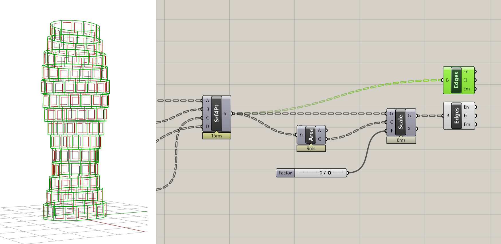

Next, let’s combine the two sets of edge curves into a single data stream using the Merge component. This component will combine multiple data sets into one based on the structure of the data coming in:

- Merging **single elements** will create a **List** with the elements ordered based on the order they were input into the component

- Merging multiple **Lists** will create one **List** with all elements ordered based on the order they were input into the component

- Merging **DataTrees** will create a new **DataTree** with elements combined in branches with the same path. Remember that a List is just a DataTree with a single branch, so if you combine a DataTree with a List it will put the List’s data on the default {0;0} branch of the new DataTree.

The Merge component supports an unlimited number of input streams and has a [zoomable UI](https://medium.com/p/1dc644e13212/#dc6b) which you can use to add and remove inputs. A new input will be automatically added every time you plug one in, which also speeds up the workflow. Let’s create a new Merge component on the canvas and connect to it both sets of edge curves.

Since our edge curve data is in DataTree format, it is very important that both DataTrees share the exact same structure, so that all the curves from one panel end up on the same branch. Some components may add extra levels of hierarchy to data as it’s passed through them, which can mess up the matching during Merge. To ensure that both inputs have the simplest possible DataTree representation, we can right-click on both inputs and select the ‘Simplify’ [filter](https://medium.com/p/179be560f086#5165).

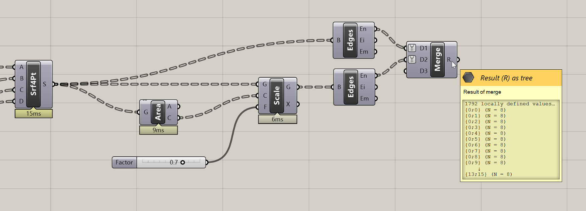

_Results of Merge operation showing DataTree with branches organized according to building floor and panel, with 8 curves on each branch defining the boundary edges of each panel._

Once we have all the panel boundary curves in individual branches of a single DataTree, we can pass them into a `Boundary Surfaces` component to construct the final panel geometry. This component is similar to Rhino’s PlanarSrf command. It takes in any number of co-planar flat curves and creates a single surface trimmed to the edges of all the curves. For curves completely contained within curves such as our example, it trims a hole within the larger surface.

Once we have all the panel geometries, the last step is to join all the panels on each floor together to create a single Polysurface for each floor. We can do this using the `Brep Join` component, which will take any number of Surfaces or Polysurfaces and combine them into a single Polysurface if they share a common edge.

Before we can join the panels together, we need to make sure that all the Surface geometries we want to join are located on the same branch. Remember that components are designed to take a certain number of items in each input. If a component’s input is designed to take one item and you pass into it a List or DataTree, the component will run once for each item. The `Brep Join` component is designed to take a List of Surfaces and join them all together. When we pass a DataTree of Surfaces, the component will run once for each branch, attempting to join all the surfaces contained in each.

Currently, each of our panel Surfaces are on separate branches, so nothing will happen if we try to join them. To get all the panels on one floor to be on the same branch, we need to remove the last level of hierarchy in the DataTree (based on how we constructed the model, the first level of hierarchy represents the floors and the second level represents the panels). An easy way to remove the last branch level of a DataTree is by using the `Trim Tree` component, which will merge outer branches of a DataTree based on the Depth (D) provided. The default depth is set to 1, which trims the most outer branch.

As an alternative, you can use the [`Path Mapper`](https://medium.com/p/179be560f086/#884f) component with the “Trim” preset. This will put all the panel geometries on the same floor on the same branch, going back to the DataTree structure we had originally (before the `Edges` components added a level of hierarchy). Now when we input the trimmed DataTree into the `Join` component, all the panel geometries will be joined into one Polysurface per floor.

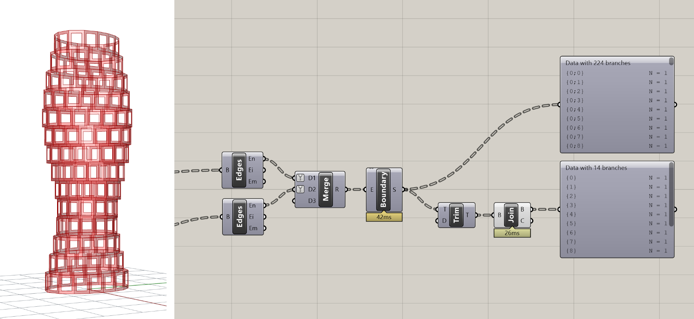

### Step 6: Create floors

Now that each floor’s facade geometry is defined, the last step is to rebuild the floor and ceiling of each floor so we can join it with each floor’s facade and end up with one joined Polysurface for each floor. In the [previous exercise](https://medium.com/intro-to-grasshopper/exercise-parametric-tower-part-1-bdbad26bc6ca), we used the [`Cap Holes`](https://medium.com/p/bdbad26bc6ca/#a9fb) component to automatically close planar openings in the extrusion geometry. This will also work here, but since our facade openings are also planar holes, the `Cap Holes` component will fill those as well.

Instead of capping the holes automatically, let’s manually build the new floor and ceiling geometries based on the same Points that define the corners of the facade panels. First, we will create the outline of the floors connecting the Points created by the `Divide Curve` component into a `Polyline` component, which will connect the points on each floor into a single Polyline. Make sure to set the `Polyline` component’s Closed (C) input to True so that a closed Polyline is created for each floor. Otherwise, you will be missing the final segment connecting the last point in each list back to the first.

A nice visual way to control Booleans in your definition is by using the `Boolean Toggle` Input component, which will create a new Boolean variable and allow you to toggle between True/False values by double-clicking on the label.

Once we have the boundary curve for each floor defined, we can use the `Boundary Surfaces` component to create a planar surface for each floor, and the `Move` component to move each floor up to form the ceilings. For the `Move` component’s translation vector we can reuse the same vector we used to create the top set of corner points for the panels.

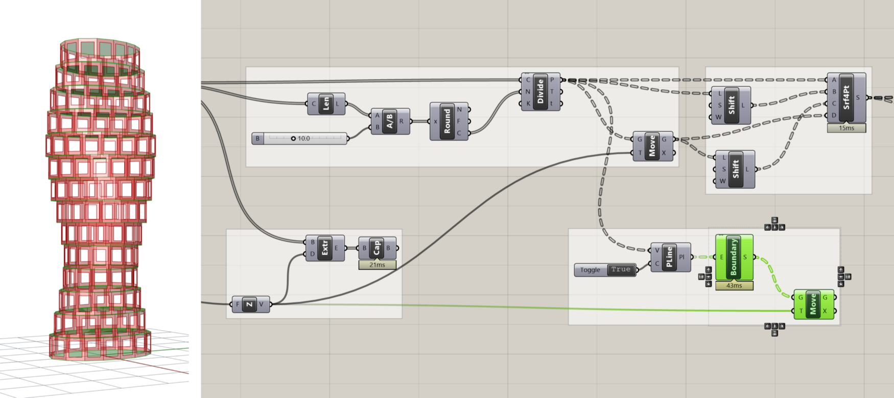

### Step 7: Join it all together

Now that we have the facade, floor, and ceiling defined for each level of the building, we can use the `Merge` and `Brep Join` components one more time to combine the data into one DataTree and merge all the geometries into one Polysurface per level. In order for this to work, we have to be sure that all the DataTrees going into the Merge component share the same structure — a branch for each level of the building with each branch containing all the geometry from that level. To make sure all the branches line up, you can apply the “Simplify” filter to each input of the `Merge` component.

If everything worked right, we should end up with one Polysurface for each level of the building. Since we used the same set of points to build all the Surfaces, we can be sure that everything will line up correctly and join together perfectly. Such is the beauty of computational design — it may take some time to build everything right, but once it’s built you can be sure that everything will function the way it’s supposed to. If you did get lost along the way or something didn’t turn out the way you expected, you can download a finished version of the demo [here](https://www.dropbox.com/s/3il58f39zml3tji/intro-to-gh_tower_2.gh?dl=1).

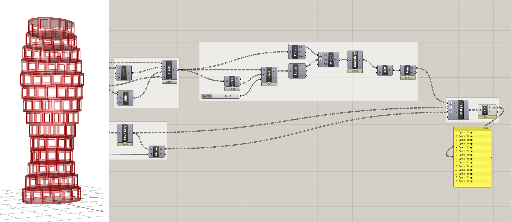

# Conclusion

In this exercise, we rationalized the tower geometry by generating a set of flat panel surfaces to approximate the curved shape of the tower. We also added an opening to each panel whose size can be controlled by a parameter. Spend some time experimenting with the model to see what kinds of variations and panel geometries you can create. In the next exercise, we will develop the tower further by creating a data-driven system for controlling the size of openings independently for each panel.

# CHALLENGE:

If you figured out the [last challenge](https://medium.com/p/bdbad26bc6ca#b260) by using a `Rectangle` component to replace the elliptical floors with rectangular ones, you may see an issue applying the paneling in this exercise. Since each rectangle is a single Curve, depending on how they get divided you could see that some of the corners get cut or chamfered. Can you think of a way to solve this problem and force the facade panels to always end at the corners?

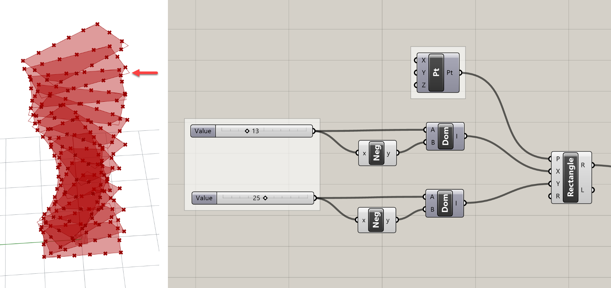
