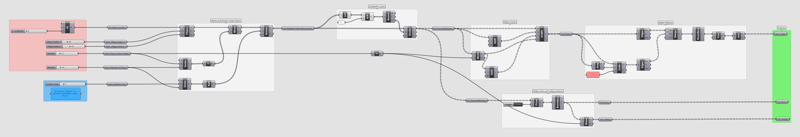
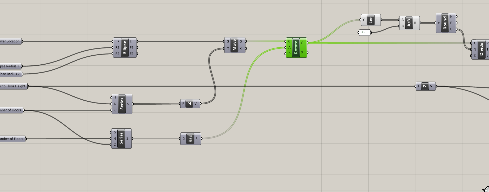

# Grasshopper Documentation Best Practices


_Documentation best practices applied to the parametric tower._

## Module Summary

Before we develop our parametric tower further, we are going to pause and introduce best practices for developing clean and clear grasshopper definitions through techniques for organizing, grouping, labeling and color coding.

## Why is this important?

You might be thinking, why am I taking a break from developing an awesome parametric tower just to organize and label my definition? That sounds _super boring_ and a waste of time. Much like in computer programming, maintaining best practices for clean and clear definitions is critical for building and maintaining complex parametric models, creating re-usable and modular definitions, and allowing for collaboration with others. Taking the time to implement best practices while your develop you definitions will also save you time and frustration later.

## Tutorial

The following sequence will take you through best practices for developing a grasshopper definition.

Follow these high level guiding principles as you work:

1. Model in straight lines that following the primary flow of geometry or data -- this allows you or a collaborator to easily follow the flow of your definition.
2. Give yourself plenty of space -- this makes it easier for you or a collaborator to make revisions or additions in the future.

Take a look at the intro image again for an illustration of straight lines and plenty of space.

### 1. Organize Inputs, Add Parameter Holders and Label


First, put all of your inputs in vertical alignment on the left side of the canvas. This includes pulling out any inputs you may have introduced later in the definition. Having all inputs in one place makes editing and combining with other definitions easy.

Next, put the inputs through a parameter holder of the appropriate geometry type, ie "Point," "Number," "Brep," etc. Name both the input itself (like the slider) and the parameter holder to reflect the input. Right click on the input and parameter holder to edit the name. (Right clicking on anything in Grasshopper will bring up a menu of options that includes editing the name.) For the parameter holder, keep the text for the geometry or data type, ie "Pt: Tower Location." We will also introduce labeled parameter holders throughout the definition in a similar manner. This makes the definition easier to revisit and more modular.


```
Tip
If you don't know (or forgot) where a particular parameter or component is on the toolbar ribbon
do a left mouse double click anywhere on the canvas to pull up a search option for the parameter or
component. Once you have found the component ctrl + alt + left click will show its location on the toolbar.
```

### 2. Group and Label Sequences of Components


_Before_


_After_

Next, group and label any sequences of components for which you can you can concisely describe their operation, ie "Moves and Rotates Tower Floors." Add labeled parameter holders to the outputs of the group.


_Before_


_After_

As you introduce parameter holders, more is better then too few. Having these are key to the modularity of your definition. In the example above "Pt: Floor Subdivisions" occurs twice right next to each other, which might have you scratching your head. This is because the same input goes into two different sequences of operations. Providing each with its own input allows you to move and modify them independently.

### 3. Organizing Outputs


Next, put all of the outputs into labeled parameter holders and pull all of the outputs into vertical alignment on the right. (More on the use of colored groupings in the next section.) Doing this for both the inputs and outputs makes it easier to cluster your definitions, making them modular and easier to integrate with other definitions in the future.

### 4. Colors & Notes


Finally, develop a set of colors for your groups and panels to indicate different categories of information, such as inputs, outputs, action items, intermediate steps, etc. In the two examples above green = outputs, pink = static inputs, blue = dynamic inputs and white = intermediate steps. Right click on a group or panel to change its color.

```
Tip
Matching colors can be cumbersome. Once you've developed color conventions,
Put examples of each group and panel in the upper left of each of your definitions.
To make applying a specific color faster, right click on the group or panel with the
color you want to match and select "make color default" or "set default color."
```

We've been labeling groups and parameters as we go, but also introducing panels with more detailed notes can be useful. In the example above we've added a note to explain the dynamic input.


Use group or panel colors within the body of the definition to call out specific items that may be important later. For example, we did not pull the Scale input into vertical alignment with the other static inputs to the left of the definition. Why not? In this case it is because we are going to modify it in a future tutorial. Because of that we have given it the "static input" color so that it is easy to find in the future.

If your completed definition isn't working as it should, here is a [completed grasshopper definition](https://github.com/GSAPP-CDP/Smorgasbord/raw/main/src/content/modules/4-grasshopper-intro/Definitions/4-7_Complete.gh) of this tutorial.

## Assignment

Develop your own color and naming conventions by applying these best practices to the parametric tower you have developed so far. There is no standard best practices in grasshopper. Use these as a guide to develop what works best for you.

## Bonus

It was years before the author of this module developed and enforced their own best practices. Below is an example of what can happen if you develop complex definitions without best practices and the result when you take _days_ to retroactively add them.


_Before_


_After_
