# Deriving Spatial Data

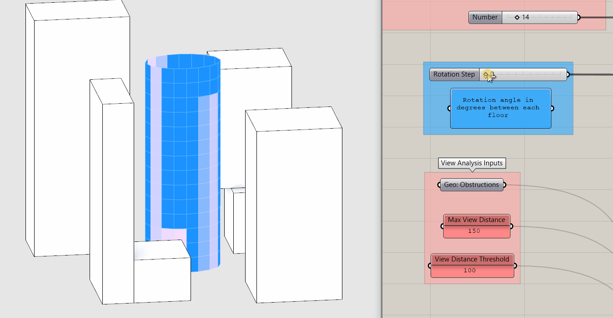

## Module Summary

Grasshopper is really good at two things: creating 3D parametric geometry and deriving spatial data. We've done the first so now we will move on to the second. In this module we will use ray casting to derive spatial data (views from our tower,) visualize it and create metrics.

## Why is this important?

Spatial data allows us to describe the built environment quantitatively and as a result, make decisions based on that data. For example, in the design of a building to achieve desired environmental performance or in public policy to ensure the desired outcome is met or in the creation of entirely new urban scale data sets to better understand out cities.

However, data is never neutral. Data has an author with their own goals and bias. Data can never describe anything completely resulting in abstraction and simplification, that while necessary, can be problematic. Unlike with other courses where you work with existing data, in grasshopper you derive your own spatial data so you must now work to understand and check your own bias and be critical of the simplification and abstraction you will be doing in deriving the data.

At this point you may be saying to yourself, "Yes, I agree that is all very important to consider when working with data, but I thought we were just going to be doing a simple view analysis of a tower?" As we go through the module you will see that even as something has simple as a view analysis needs to be approached critically.

## What are you goals? How would you measure them?

Before developing a tool in Grasshopper for deriving spatial data it is important to first define your goal, desired outcome, identify a way to measure the outcome, and finally, a design idea for developing it in grasshopper. So first, why would we be measuring views? For example, is it to maximize real estate value or for user comfort or as a proxy for increasing daylight access to reduce energy demand? Inherent in this process is also considering "who" the data is for. Let's keep this undefined for now so that we can continue to explore it as we develop the tool and metrics.

Next, how would we measure something qualitative like view? Or put another way, what is a good view? Is it what you can see? Or how open the view is? Or something else? For this exercise lets go with the openness of the view. How would we measure "openness of view"? Distance! What is the distance between the view, or a point in grasshopper, and the objects (geometry) in the view? Finally, what is a metric that describes this? We will develop two metrics through this module and discuss the benefits and limitations of each.

## Ray Casting

In order to measure distance we need two points, the point representing the viewer (we'll use the center point of the windows of our tower) and the point of intersection with object obstructing the view. What we are describing is called [Ray Casting](https://en.wikipedia.org/wiki/Ray_casting), a technique used in computer graphics, where rays are cast from a point to determine what is visible in order to graphically represent an image.

Grasshopper has two very similar components for ray casting `IsoVist Ray` and `Mesh Ray`. They both cast rays from a source to objects and return the point of intersection. IsoVist Ray outputs distance to intersection (Mesh Ray does not) making it better suited for our goal of measuring openness of view. You could complete this tutorial with Mesh Ray, but would require the added step of using a distance component to measure the distance between the source and ray intersection. Would you ever use Mesh Ray instead of IsoVist Ray? In some instances it _may_ run faster so if you are using IsoVist and it is running slowly, give Mesh Ray a shot.

## Tutorial

### 1. Create Source View Rays

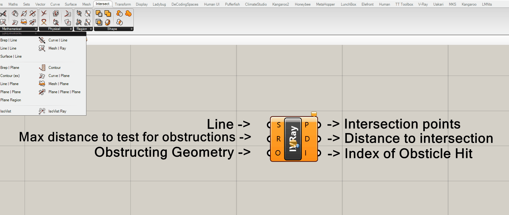

`IsoVist Ray` is the analysis tool that we will use to derive our spatial data so lets take a closer look at it.

Inputs:

- (S) "Sampling Ray" or more specifically, a line that starts at your view point (source) extending in the direction of your view.
- (R) "Sampling Radius" or more specifically, the maximum distance that it will cast the rays.
- (O) "Obstacle Outlines" or more specifically, obstructing geometry such as curves, meshes or breps

Outputs:

- (P) The intersection points with the obstructions. Rays cast that do not intersect with an obstruction with the sampling radius return points at the distance of the sampling radius.
- (D) The distance to the intersection with the cast ray. Similar to (P) rays with no intersection return the sampling radius distance.
- (I) The index (or location of obstructing geometry within a list) or -1 if no obstacle hit.

>Tip:
>
>The letters for inputs and outputs are not consistent across components. For example, sometimes P = Point and other times P = Plane. Or sometimes P = Point and S = Point. Don't use the letters as an indicator of geometry or data type. Always mouse over to check data or geometry types.

Lets create our inputs. First up, view rays. We will need a point to determine their start. We'll use the center of our tower panels so copy down the `parameter holder containing the vertical panels` from your parametric tower. These were created prior to creating the windows and should be untrimmed surfaces. (The windows are trimmed surfaces.)

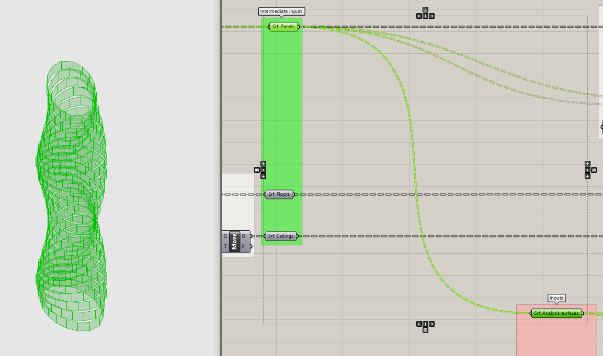

Next, we need to create our view rays using a `Line` component. There are two that create lines: between two points or based on a `start direction and length`. We don't know the end point (that is what the ray casting is for) so we will use the second one. The Line component is looking for a Start Point (S) a Direction vector (D) and a Length (L.)

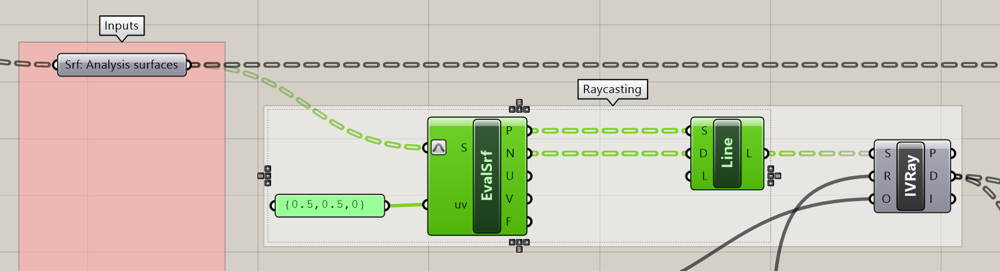

Previously we generated the center point of a surface using the Area component but that doesn't give us a vector. Luckily there is a component that does both! Get the `Evaluate Surface` component, which evaluates local surface properties, such as a point and normal vector) at {U,V} coordinates.

>Tip:
>
>There are two coordinate systems in Rhino and Grasshopper a global one and a local one. The global system is referred to and described by X,Y,Z coordinates. Remember when you made a point to as the input location for you tower? That was using the global coordinate system. Every piece of geometry has a local coordinate system that is independent of the global one and is referred to and described by U,V,W coordinates.

Evaluate Surface is looking for a surface (those are our vertical tower panels) and a UV coordinate. We need to specify the UV coordinate for the center of the surface. We could measure the height and length of each surface and divide by two, but that would be tedious. Luckily there is an option to `Reparametrize` geometry, which maps the local coordinate system to a domain of 0 to 1. If we do that we don't have to worry about the actual dimensions of each surface, 0.5 will always be half way.

Right click on the (S) input of the component to bring up the options menu and select "Reparametrize." Next put {0.5,0.5,0} into a panel and connect it to the (uv) input.

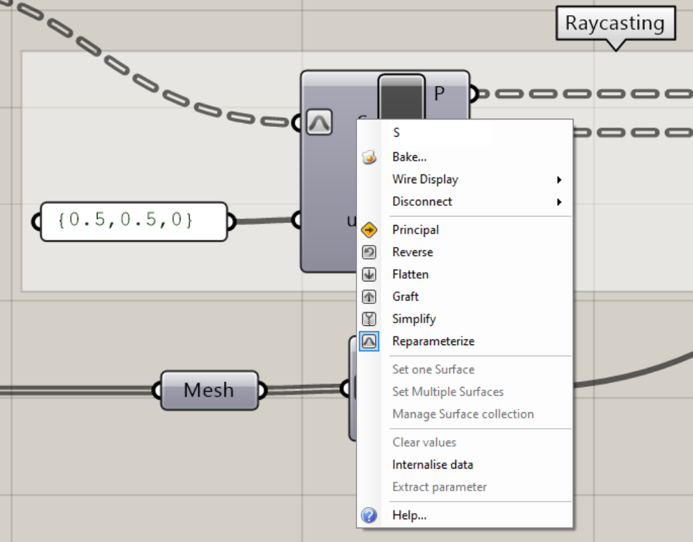

Next plug the points (P) in the start points (S) and the normal vector (N) into the direction (D) of the `Line` component. (The length of the Line doesn't matter.) Finally, plug the line into the sampling rays (S) of the `IsoVist Ray`.

### 2. Set Max View Distance & Add Obstructions

While our view rays were derived from our tower, the next two inputs for IsoVist Ray are entirely new. We need to add a maximum distance for rays to cast and the obstructions within the view. Model context buildings around your tower within Rhino and add to a geometry parameter holder (right click -> add multiple geometry.) Create a Panel with a number for your maximum view distance. Obstructions beyond this distance will not be included in the analysis. Remember to be enforcing best practices and place inputs all the way to the left and in vertical alignment with the other inputs. Add intermediate parameter holders and bring over to your view analysis tool.

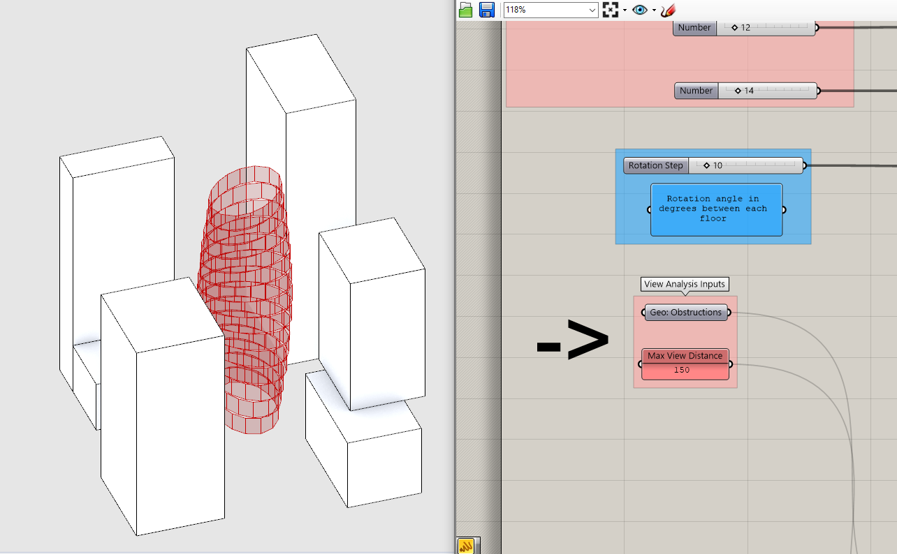

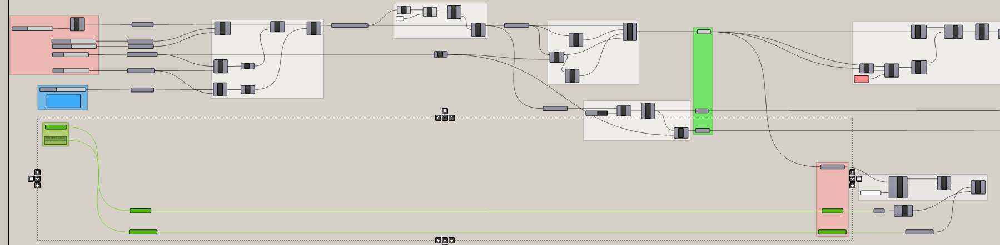

*Space and straight lines!*

 

While IsoVist Ray will accept any geometry as an obstruction, it runs faster and is less prone to error if you first mesh (run geometry through a Mesh parameter holder) and then join (Mesh Join) your geometry before plugin it into (O) of Isovist Ray. To avoid any potential data tree issues that may occur when incorporating this tool into other definitions in the future flatten (right click on (M) and select Flatten) before joining the meshes. Finally, plug in your maximum view radius into (R).

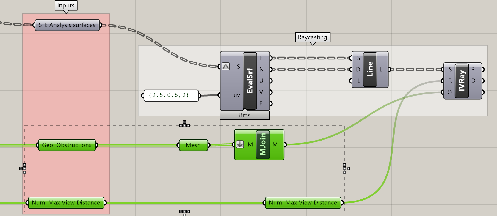

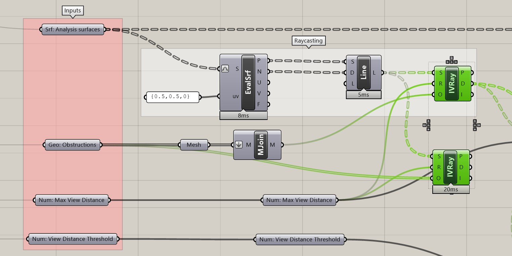

*Comparison of run time with and without the joined mesh. 20ms might not seem like it matters but in situations where you have more analysis points it will make a huge difference in calculation time.*

 

Finally, plug in your maximum view radius into (R) and we have our spatial data! Turn on the preview for IsoVist Ray to make sure that it is working correctly. Make sure obstructed views intersecting with the context and unobstructed view located at you maximum view distance.

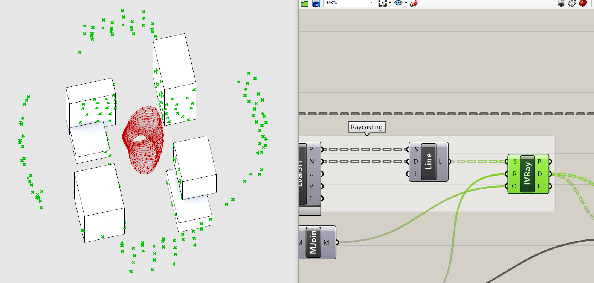

### 3. Visualize the Results

Now that we have derived our spatial data, time to visualize it. We are going to use the `Gradient` component to color the tower surfaces according their distance to an obstruction. Add a Gradient component to the canvas.

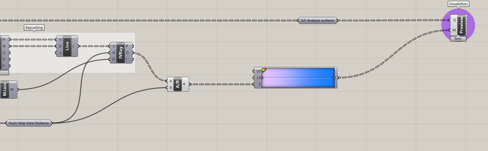

The Gradient component is looking for a lower bounds (L0) and upper bounds (L1) to locate your input values (t) on the color gradient. (L0) and (L1) are set to 0 and 1 by default, which will keep. That means we need to map our distance values to a domain of 0 and 1. We could use the Remap component to do this, but since we already know the bounds (0 and our maximum view distance,) it is easier just to use a `Division` component to divide the (D) output of the IsoVist Ray by the maximum view distance and plug it into (t).

The Gradient component has a number of presets to choose from (right click anywhere on the gradient to get to them) or you can customize the colors (right click on the black circle.) Add additional colors by clicking on the green to yellow to red gradient quarter circle in the upper right and dragging on to the main gradient. Similarly you can remove colors by clicking on the black circle and dragging it off the gradient. Double clicking on the black circle pulls up an additional set of controls of each color step.

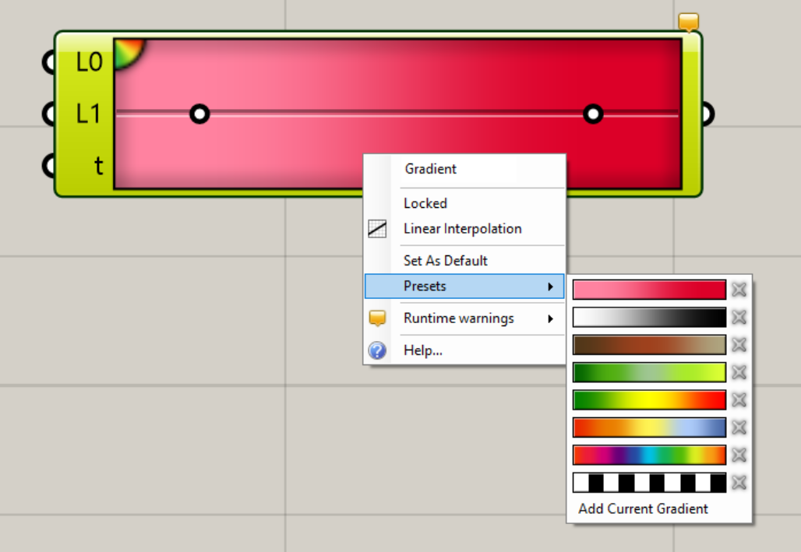

*right click on the gradient to pull up the presets*

 

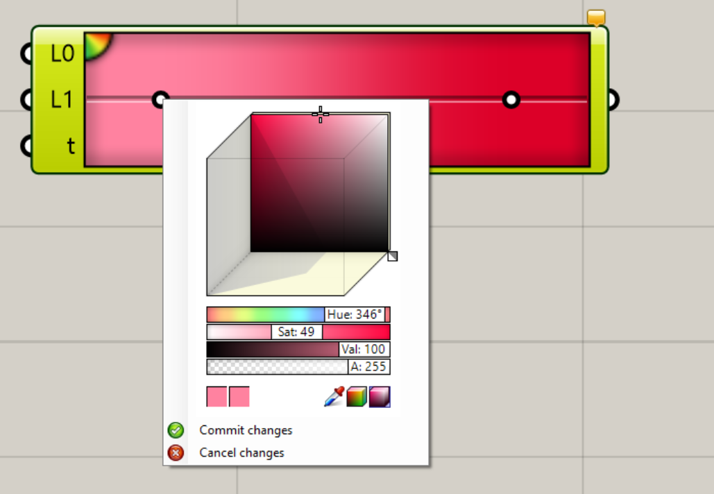

*right click on the black circles to change the colors*

 

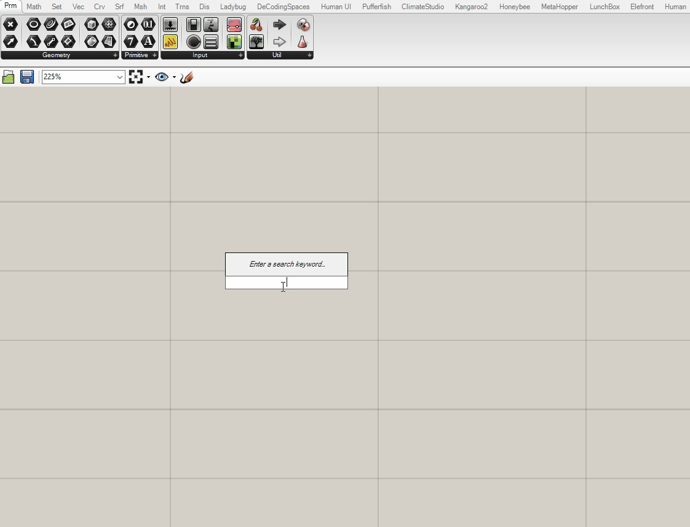

### 4. Create Metrics

Ok! We have derived our spatial data and visualized it. The last step is to create metrics that allow us to understand if we are achieving our stated goal. This brings us back to the discussion of bias and simplification that kicked of this module -- we'll create two metrics and discuss the uses and limitations of each.

But first, what is a metric? "I though it was either a n internationally adopted decimal system of measurement or a Canadian rock band founded from Toronto, Ontario?" It is both of those but in our case a metric is unit of measure used to quantifiably discribe the output of an analysis or simulation. To illustrate, lets take direct daylight, it is something what we can analyze, but still needs a metric to describe the output: ex. Average Annual Hours of Direct Daylight or Percent of Days with 3 or More Hours of Direct Daylight.

**Percent Average Open View**

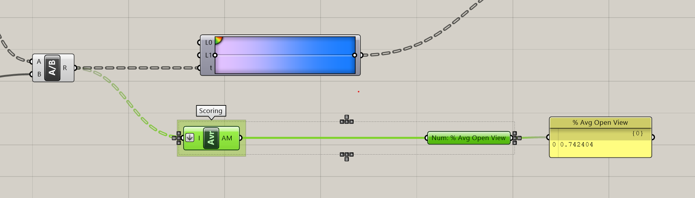

This one is relatively straight forward, it is the average of each individual percent open view from your tower. To create it, get the `Average` component and input the values coming out of the `Division` component (it is also going into the Gradient.) The values coming in are grafted, each on in their own branch. You'll need to flatten the data tree in order get the average of all values, otherwise it operates on each branch individually. Right click on (I) and select Flatten. Finally, add a parameter holder and panel as the output for this metric.

**Percent Above View Threshold**

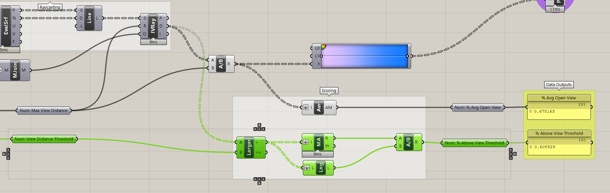

The other view metric we are going to create is the percent of the tower that has a view futher then a specified distance. This is establishing a minimum acceptable view distance. First, pick a distance and add it to a Panel to the left of your definition in vertical alignment with your other inputs. Add a line of parameter holders bring the value over to your view analysis tool.

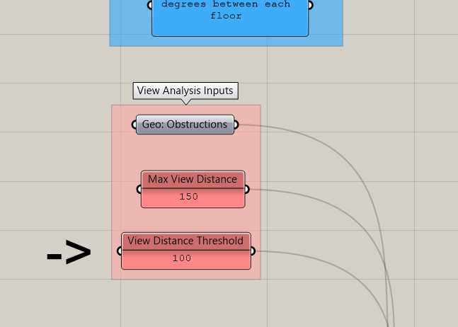

Next, get the `Larger Then` component and plug distance (D) from the IsoVist Ray into the (A) and your View Distance Threshold into the (B). This outputs in a boolean pattern where `True` is a value above your threshold and `false` is a value below your threshold. We now need determine what percent the true values represent of all the values. To do this we will count the number of trues and divide by the total number of items.

When boolean values are input into a component expecting numbers, grasshopper treats them as numbers with True = 1 and False = 0. Because of this we can use the `Mass Addition` component to add up all of the true values. Get the Mass Addition component and plug the `>` output in to Mass Addition, making sure to Flatten the input (I).

Next we will calculate the total number of items (the denominator in our metric) using the `List Length` component. Get the List Length component and plug the `>` output in to List Length making sure to Flatten the input (L).

Now that you have your numerator and denominator plug them into a `Division` component, add your output parameter and panels and you are done creating metrics!

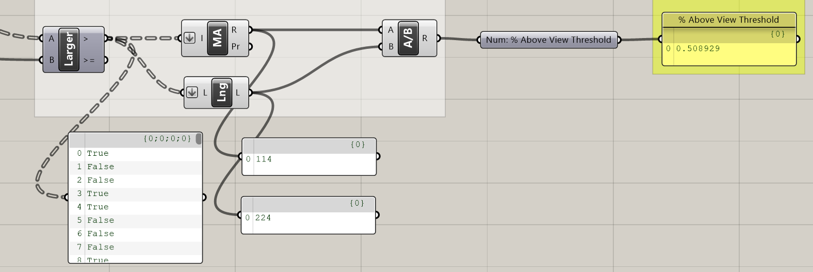

 

**Percent Average Open View vs Percent Above View Threshold**

Both of these metrics quantify view and are directly correlated why use one over the other if they both measure view? Before we continue, pause for a moment and move the `Rotation Step` input slider while taking note of how the two metrics change.

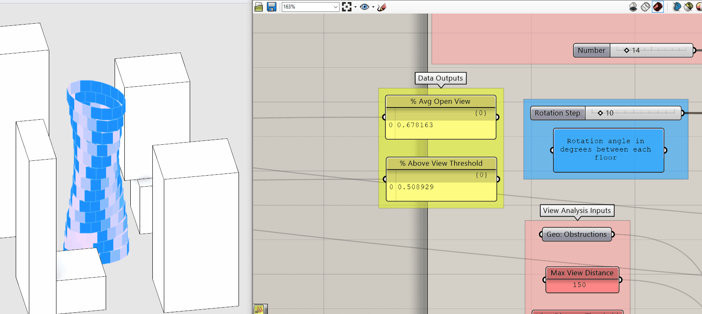

Again, they are directly correlated so why do we care about the difference? Because `Percent Average Open View` is an average you get no real sense of the distribution of the individual values. The same average could result from extremely low and extremely high values or values all in the middle. The is good if your goal is to maximize the views of the building overall but potentially at the expense of creating individual bad views.

`Percent Above View Threshold` creates a binary distribution, ie above or below a target value. This is good if your goal is to make sure that every window has a minimum quality of view, but once above that value, this metric doesn't change.

As you can see, depending on your goal and "who" this is for you may pick one over the other or use both. Do you want to maximize value overall or ensure a minimum quality for all? Either is going to come with limitations, the important part is understand those limitation and articulate them relative to your goal and the indented "who."

If your completed definition isn't working as it should, here is a [completed grasshopper definition](https://github.com/GSAPP-CDP/Smorgasbord/raw/main/src/content/modules/4-grasshopper-intro/Definitions/4-8_Complete.gh) of this tutorial.

## Conclusion

What started out as a pretty straight forward module, "Lets maximize views for our cool twisting tower!" turned out to be more about understanding bias, authorship, and simplification in deriving spatial data and creating metrics. This type of critical thinking should become second nature when working with spatial data. Establish goals, identify "who" you are designing for and articulate your own bias and the limitation of your approach. Speaking of limitations and simplifications, this view analysis has a _huge_ simplification. Did you spot it? Option 1 of the assignment for this module asks you to address the simplification.

## Assignment

Do one of the following:

1. One ray perpendicular to the façade does not come close to accurately describing the obstructions within a human field of view. It is a _huge_ simplification of an already simplified approach to quantifying view quality. Let’s fix it! (Or at least reduce the amount of simplification.) Use the rotate component that `Rotates an object about a plane` to rotate your current sampling ray to create more rays for each point to better cover a field of view. Use the `series` component to generate your rotation angles, ex. start the series at -60, step size 15, and count 9. The rotation component is expecting angels in Radians, if you followed the example in the previous sentence and are specifing degrees, right click on A and select "degrees." If your rotate rays don't look correct (see image below) take a look at your data tree structure -- you'll need to do some grafting to get everything to work correctly!

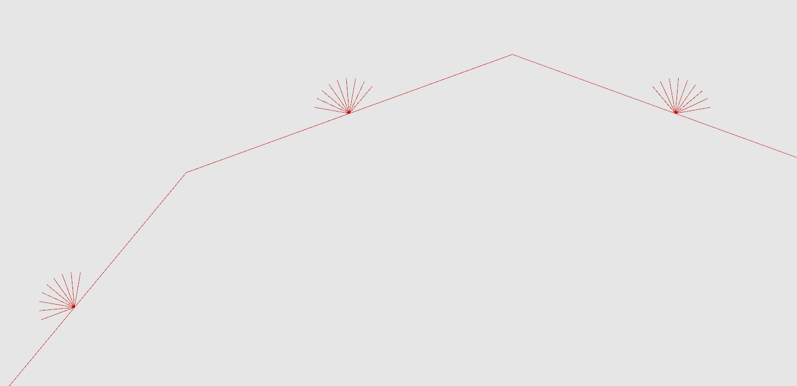

2. The module had you measure how far you can see, but what about measuring _what_ you can see? Modify your definition to analyze views to a specific object, like a landmark building, park or river. To start you will need to generate target points. Try subdividing a curve (ex. river) using `divide curve`. Next, you need to connect those points to create view rays. Take a look at the Line Component we did not use, the one that `creates a line between two points`. Try Mesh Ray instead of IsoVist Ray -- You'll want to use the "H" output, which is a boolean pattern indicating a hit or a miss. You can use `Mass Addition` to add up the number of hits, which is the number of points along your curve that are visible. Finally, don't forget that your tower is also an obstruction! Makes to take that into consideration. You might have to use the `Move` component to slightly move the points off of the building using the normal vector.

## Additional Resources

- ["Quantifying the Urban Experience: Establishing Criteria for Performance Based Zoning."](https://static1.squarespace.com/static/568ee2b4cbced6419694f1fc/t/5c37585f4d7a9c82b6128f70/1547130979391/Performance_Based_Zoning.pdf) Paper on deriving spatial data using grasshopper to establish performance based zoning regulations.
