# Parametric to Procedural

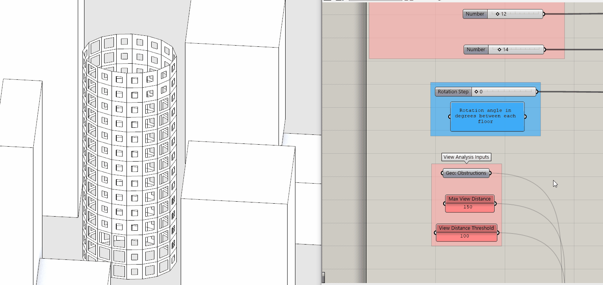

## Module Summary

So far we've created a tower with a direct relationship between the input (slider controlling rotation step) and the Output (rotation of each tower floor) of our parametric model. In this module we are going to introduce intermediate rules or _procedural relationships_ for generating geometry based on data, in this case relating the size of the windows to the view analysis from the previous module.

## Why is this important?

Strictly parametric modeling can only get you so far. By introducing procedural relationships into our grasshopper definitions we are adding intelligence (essentially designing algorithms) that is beyond what is possible just based on a set of inputs, such as geometry and number sliders. It will allow us to model complex systems not otherwise possible.

### What is procedural modeling and how is it different form parametric modeling?

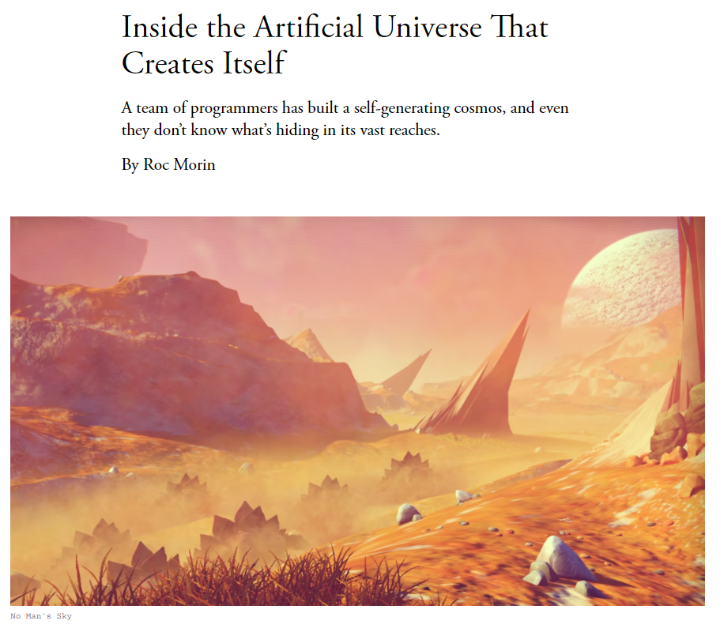

> _[Inside the Artificial Universe That Creates Itself](https://www.theatlantic.com/technology/archive/2016/02/artificial-universe-no-mans-sky/463308/)_

<br>

Procedural modeling or [procedural generation](https://en.wikipedia.org/wiki/Procedural_generation) is a technique of creating 3D models from a set of rules and is most commonly used in video games. It is how you get the infinite worlds in Minecraft or infinite galaxies with planets and their flora and fauna in No Man's Sky. These games have a random seed (number) as an input for each new world created from a complex set of rules for the generation of the elements that make each unique world. The game designers are not manually modeling each element of the world but rather designing the rules by which the world is generated given a set of inputs.

Sound familiar? But wait, isn't that what we've already been doing with our parametric tower? Yes and no. In our parametric tower there is a direct relationship between static inputs and the form. In a procedural model there are a set of intermediate rules that drive dynamic variation. This allows you to create complex variation from a relatively simple set of inputs.

Sounds confusing? Yeah, it is. You could probably argue that procedural modeling is just a type of parametric modeling, but lets illustrate with some examples of procedural relationships to clarify the difference.

_In an urban scale model having building density defined by the distance from transit is a procedural rule. The density is dynamically generated by each individual buildings' distance to transit, the closer the higher the density._

_In a urban scale model having the height of each building defined by the size of the floor plate to maintain a target gross floor area is a procedural rule. (ie the smaller the floor plate the tall the building.)_

_In a building scale model having the size of your windows defined by the quality of the view is a procedural rule. The size is dynamically generate by each individual windows view quality._

Sounds like our module? It sure is! Through this and future modules we will continue to introduce procedural relationships, driven by both data (as is the case with this module) and geometry to continue to illustrate the power of procedural modeling in creating complex systems.

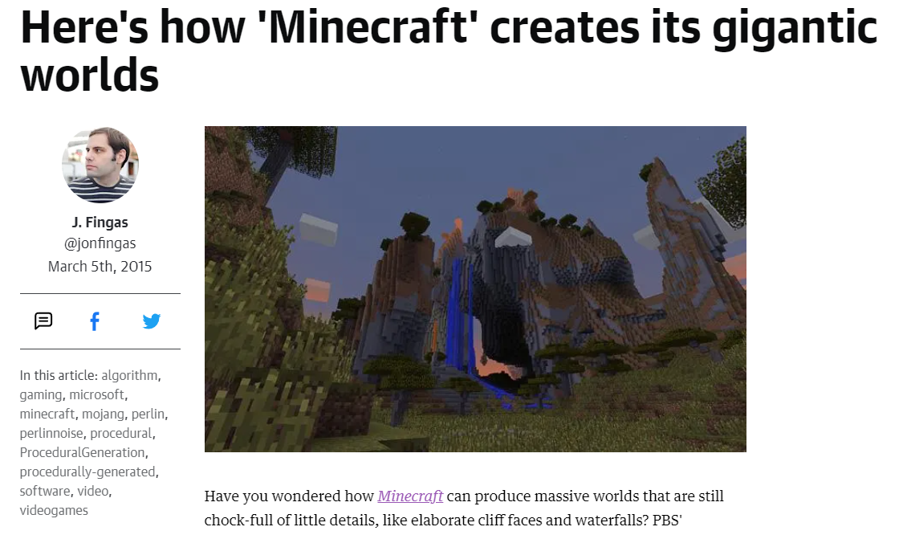

> _[Here's how 'Minecraft' creates its gigantic worlds](https://www.engadget.com/2015-03-04-how-minecraft-worlds-are-made.html)_

<br>

## Tutorial

### 1. Best Practices


House keeping! Lets do some clean up before we get started introducing procedural relationships. We are going to dynamically generate the size of our windows, which are created by scaling our vertical panels, so lets make room between the view analysis and the generation of our windows.

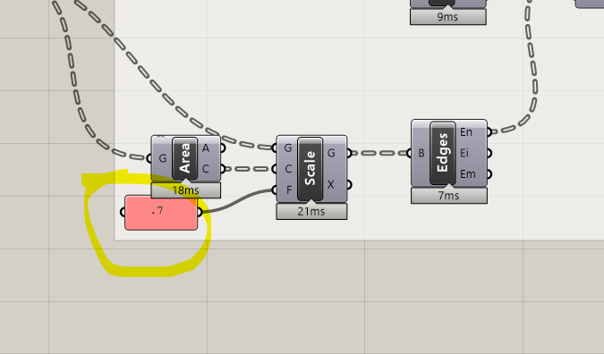

Pull the portion of the definition generating the windows to the right along with all outputs (view analysis included.) Introduce intermediate parameter holders along the way. By adding space and labeling groups previously it is relatively easy to add in new content to your definition. Continue to adjust spacing as needed as you go through the tutorial.

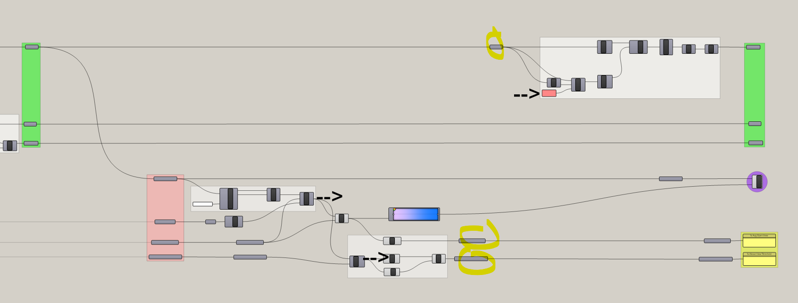

> _Intermediate parameter holders highlighted. "-->" indicates where we will be getting our data to procedural scale the windows_

<br>

### 1. Inputs

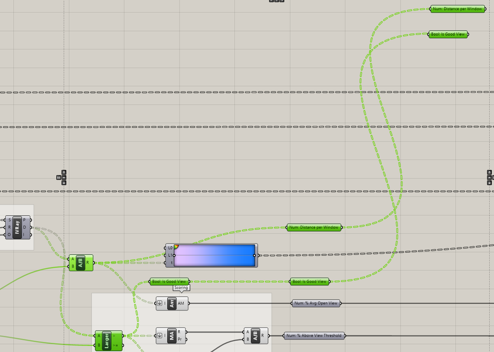

We are going to introduce two types of procedural generation, each based on the metrics created in the previous module. We will use the `% distance per window` coming our of the `Division` component and the `Is a good view?` boolean pattern coming out of the `Larger Than` component for our procedural modeling. Add labeled parameter holders and copy over to be in vertical alignment with the `Srf: Panels` parameter holder input of the group that generates the windows

### 2. Procedural generation based on view distance

The first procedural relationship will be driven by `% distance per window`. We will use the `remap component` to remap the 0 to 1 domain of the % distance values to a number of different domains.

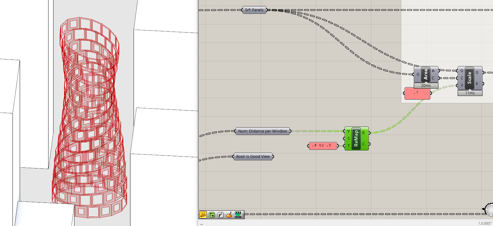

Add the Remap component to the canvas, plug the distance per window in the (V) input -- these are our values to remap -- and a panel with a domain of `0.4 to 0.8` in the (T) input. (S) is the looking for the source domain, however, the default domain is 0 to 1, which matches the domain of distance to view so we don't need to change any thing.

Next input the `remapped domain` (R) in the `scale factor` (F) of the Scale component. Windows with no views are scaled by 40% and windows with unobstructed views are scaled by 80% and all other windows are scaled proportionally to their remapped values along the 0.4 to 0.8 domain. Adjust the values in the domain to see how they control the size of the windows.

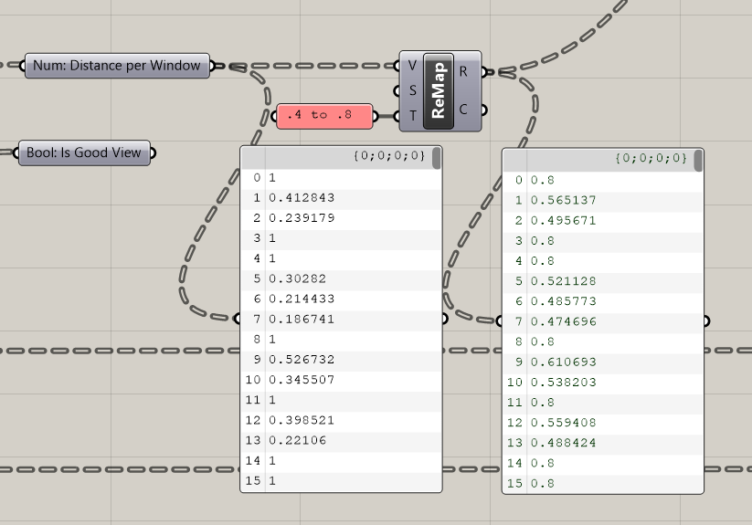

The domain we've choosen makes the assumption that a better view gets a bigger window. Good views drive value and glazing is expensive so why waste larger windows on poor views, right? But what if you wanted to increase daylight to rooms with poor daylight access and reduce solar heat gain to rooms with too much daylight access? (Open views are a reasonable proxy for daylight.) Lets reverse our domain to implement this procedural relationship. Edit the panel containing the target domain (T) from .4 to .8 to `.8 to .4`. Now the relationship has flipped! Worse views get a larger window and better views get a smaller one.

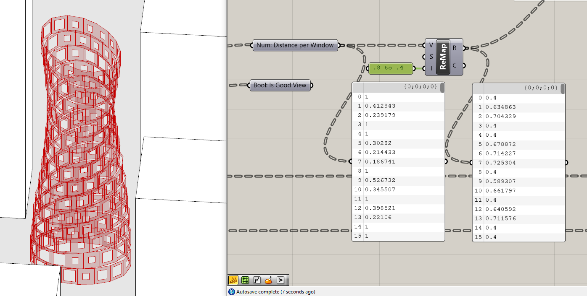

```
Tip
So far we have been visualizing our parametric tower window geometry using the red transparent material that
is the default in grasshopper. Lets introduce some visualization components to improve the representation of our
tower. First, add the 'Custom Preview' component to the canvas. Plug in the 'Brep: Walls' to the (G) input.
Next add a 'Colour Swatch' component and plug it into (M). You'll notice that it displays as a flat white
with no edges making it difficult to see. To remedy this add the 'Brep Edges' component and plug in
the walls. Hide the Brep Edges preview and plug the (En) and (Ei) outputs into a 'Merge' component. Make
a copy of the Custom Preview and Colour Swatch. Plug the merged Brep edges into the (G) and change their
color by right clicking on the white portion of the Colour Swatch to bring up a dialogue box.
```

```
Tip
Why did we Merge the Brep Edges? Why not just hold shift to add both to the Custom Preview. Using shift can
messy fast. It also makes it cumbersome to change the inputs if you need to later. As best practice, use the Merge
component to first merge multiple data or geometry sources rather the using shift.
```

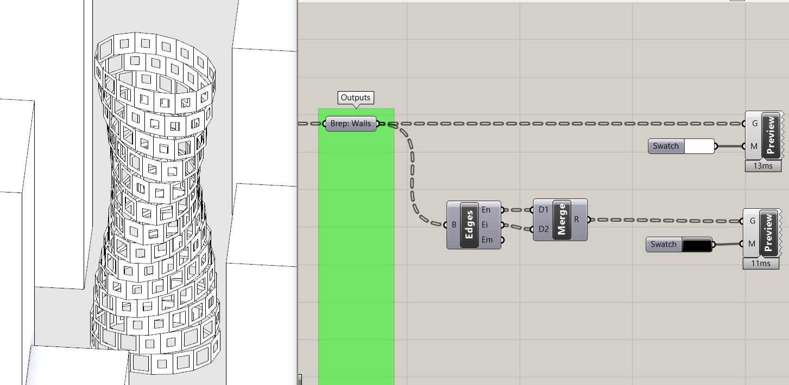

### 3. Procedural generation based on view distance threshold

In practice, having the amount of variation we have in our windows with the above method of generating windows would be prohibitively expensive to construct. Lets use our other metric, the one based on a view distance threshold to create two types of windows: one for windows below the threshold and one for windows above it.

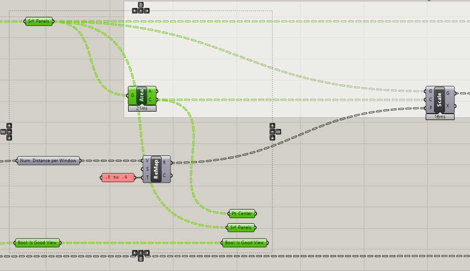

We are going to use `Dispatch` to separate our panels before scaling into two separate lists. `Scale` needs geometry (G) and a center point (C) so we will need to dispatch both the panels and their center points. Make parameter holders for each and bring them down to where you have `Bool: Is a Good View?`parameter.

Next we are going to use the Bool: Is Good View to Dispatch the Pt: Center and Srf: Panels. To maintain the order of the points and surfaces to correctly merge back with the rest of the definition we need to graft all the inputs: Points, Surfaces and Boolean.

```
Tip
Before making data tree changes (grafting, flattening, etc.) across multiple components or parameters
first lock the solver by right clicking any where on the canvas and selecting 'lock solver'. This is to
prevent grasshopper from solving before you finish making all the data tree changes. While it doesn't matter
in this case, doing this will prevent data tree mismatches that could cause Grasshopper to crash.
```

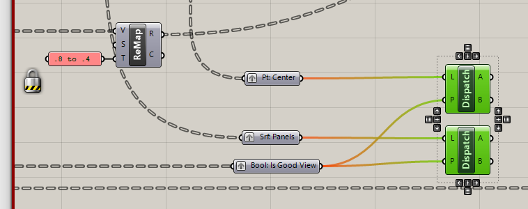

So why is it necessary to graft the inputs before dispatching? Doing this maintains an empty branch for items that have been dispatched. This way when we merge back together, we maintain the original order.

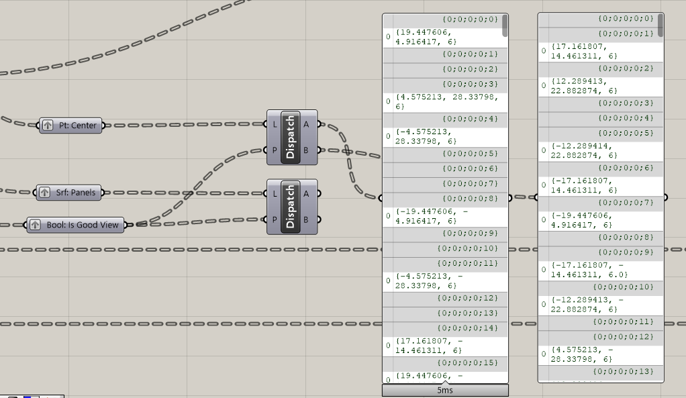

> _Check out the two sets of dispatched lists. (A) has empty branches where (B) has items and (B) has empty branches where (A) has items._

<br>

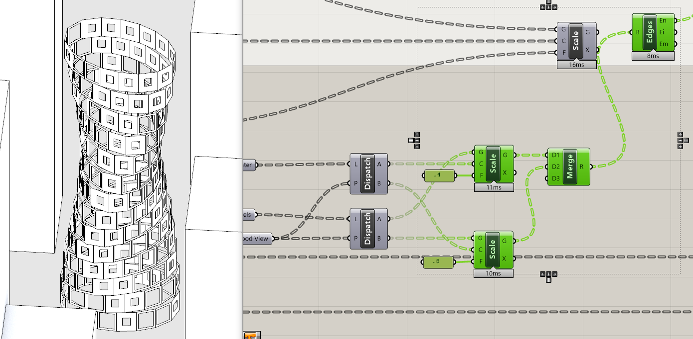

Finally, add two `Scale` components and plug the (A) outputs for the Surfaces and Points into (G) and (C) respectively of the Scale. Repeat for (B) outputs. Plug a panel with `.4` in the (F) input of the Scale for the panels with good views (A)and plug a panel with `.8` into the Scale Factor (F) for the (B) output. `Merge` the outputs of Scaling and replace the input to the `Brep Edges`

We've replicated the goal of the previous procedural rule -- good views get smaller windows and poor views get larger windows -- but with just two window types instead of dozens.

If your completed definition isn't working as it should, here is a [completed grasshopper definition](https://github.com/GSAPP-CDP/Smorgasbord/raw/main/src/content/modules/4-grasshopper-intro/Definitions/4-9_Complete.gh) of this tutorial.

## Conclusion

There was a lot of talk at the start of this module about the power of procedural modeling to realize complex systems, so creating dynamically sized windows might feel underwhelming. (We thought it was pretty cool.) Don't worry, through both of the second Grasshopper Intro sequences you will continue to _design_ procedural rules and develop complex models.

As you design procedural rules there will continue to be less and less of a direct relationship between the inputs and outputs, which obscures the assumptions you've made and potential bias in your model. Essentially creating a 'black box'. Diagram and document your procedural rules to make transparent the decision making and intent of your computational design model. This will also make it easier to return to and edit your definitions.

## Assignment

Try introducing another procedural rule. Use the `% distance per window` to procedurally scale the tower floors to create baloneys based on the average view quality of each floor. You'll need to change the `target domain` of the remmaper and determine a view score for each floor since you currently have scores per window. Compare the data tree structure for your `% distance per window` and your `Srf: Floors`. They match but have differen list lengths per branch. How can you aggregae the view scores?

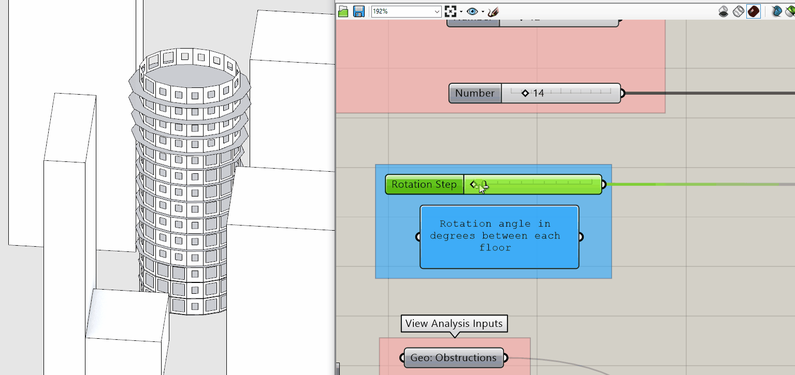

> _Floors at the top with better views get a larger balconey._

<br>

## Additional Resources

- [More on Procedural Generation in General.](https://en.wikipedia.org/wiki/Procedural_generation) There are not a lot of good overviews of procedural generation. This Wikipedia article is actually pretty good.
- ["How to Generate a Thousand Master Plans"](https://static1.squarespace.com/static/568ee2b4cbced6419694f1fc/t/5c78636b1905f46a4b109aa3/1551393648032/63_How+to+Generate+a+Thousand+Master+Plans-A+Framework.pdf) Outlines a computational urban design methodology, illustrating how procedural generation can be used to model a complex system (ie a neighborhood.)
