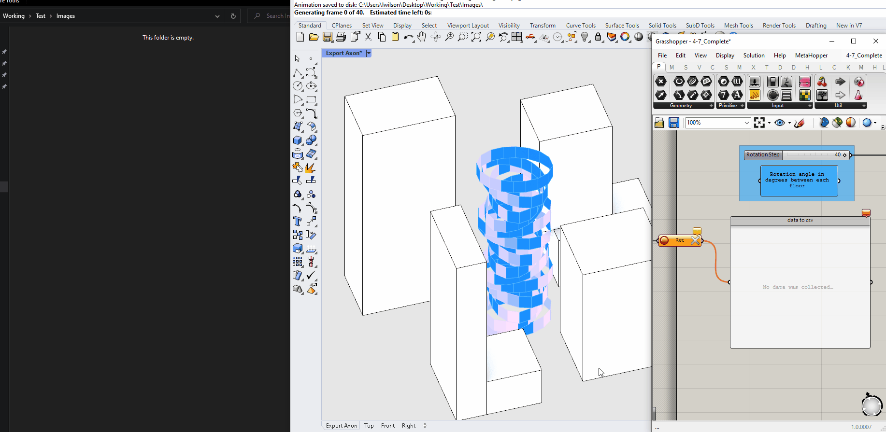

## Sequence Summary

This sequence of modules is an introduction to computational design through Grasshopper and will cover everything you need to know to get started with grasshopper, key terminology and definitions through the development of a parametric tower.

By the end of this tutorial you will use computational design modeling to facilitate informed, data driven decision making through the generation and evaluation of hundreds or thousands of design options of your parametric tower.

## Why?

Grasshopper transforms the spatial modeling capabilities of Rhino from a manual process to a computationally driven one through a visual programming language that is easy to learn and can bridge to other programming languages, such as Python and C#. We'll articulate and define the computational applications, such as automation, procedural generation, and simulation, as we work through this sequence.

## Modules

1. [Getting started with Grasshopper](https://cdp-smorgasbord.netlify.app/modules/4-grasshopper-intro/41-getting-started-with-grasshopper)
2. [Exercise: Hello Grasshopper!](https://cdp-smorgasbord.netlify.app/modules/4-grasshopper-intro/42-exercise-hello-grasshopper)
3. [Working in Grasshopper](https://cdp-smorgasbord.netlify.app/modules/4-grasshopper-intro/43-working-in-grasshopper)
4. [Exercise: Parametric tower (part 1)](https://cdp-smorgasbord.netlify.app/modules/4-grasshopper-intro/44-exercise-parametric-tower-part-1)
5. [Working with data](https://cdp-smorgasbord.netlify.app/modules/4-grasshopper-intro/45-working-with-data)
6. [Exercise: Parametric tower (part 2)](https://cdp-smorgasbord.netlify.app/modules/4-grasshopper-intro/46-exercise-parametric-tower-part-2)
7. [Documentation Best Practices](https://cdp-smorgasbord.netlify.app/modules/4-grasshopper-intro/47-documentation-best-practices)
8. [Deriving Spatial Data](https://cdp-smorgasbord.netlify.app/modules/4-grasshopper-intro/48-Deriving-Spatial-Data)
9. [Procuedural Modeling with Data](https://cdp-smorgasbord.netlify.app/modules/4-grasshopper-intro/49-Procedural-Rules)
10. [Creating and Exploring a Design Space](https://cdp-smorgasbord.netlify.app/modules/4-grasshopper-intro/410-Generating-Exploring-Spatial-Data)
