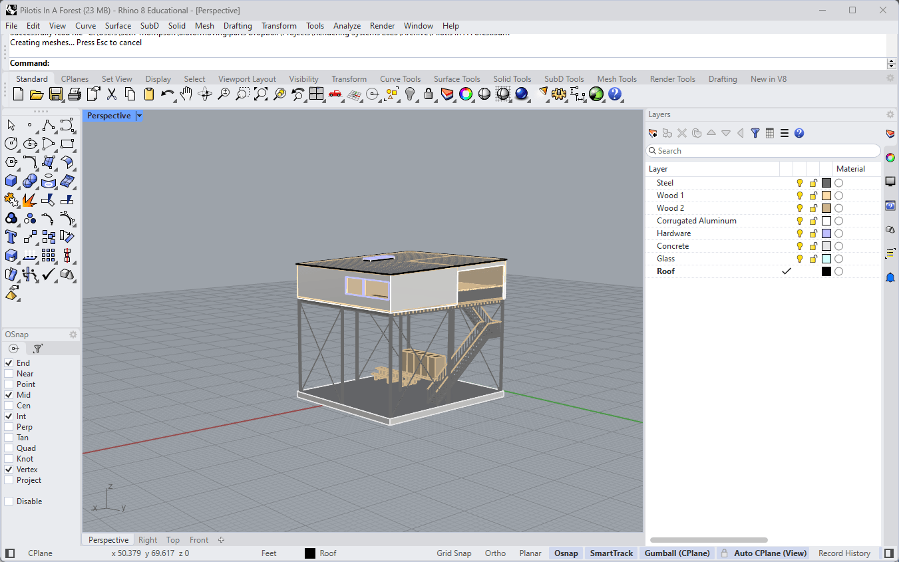
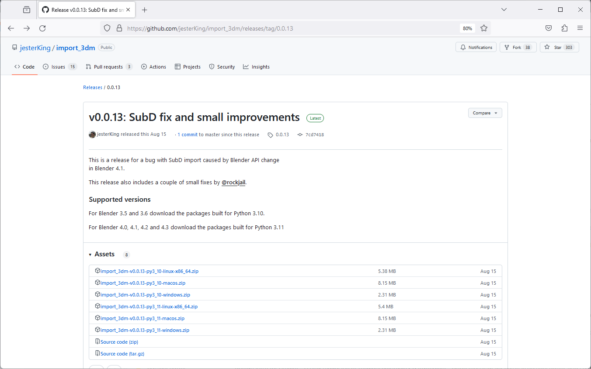
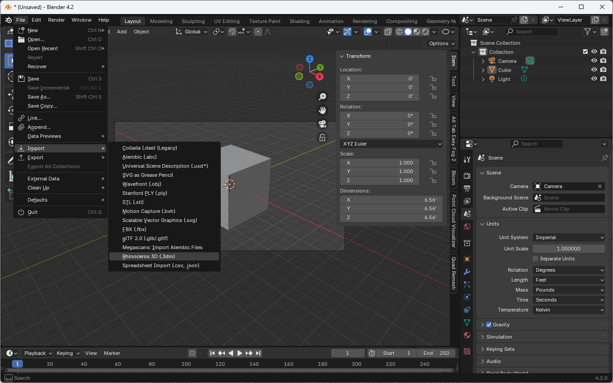
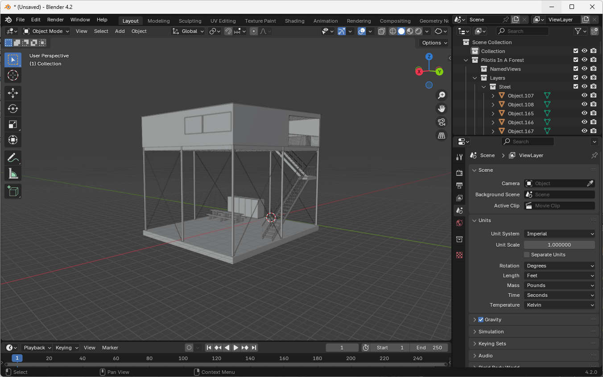
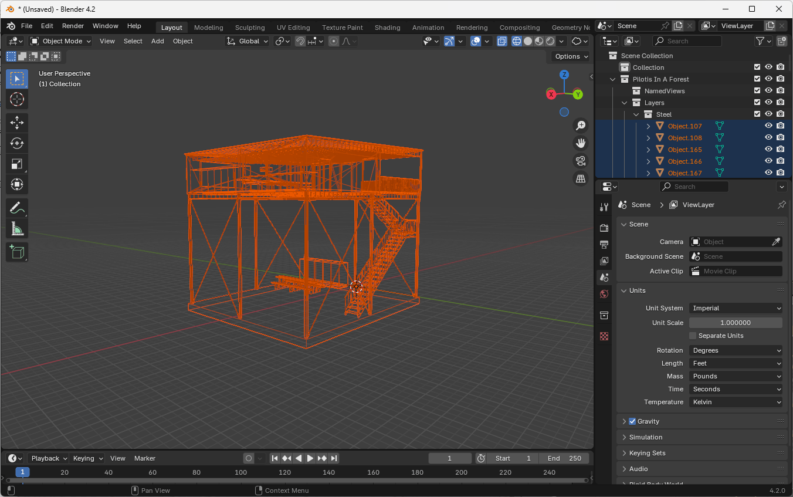
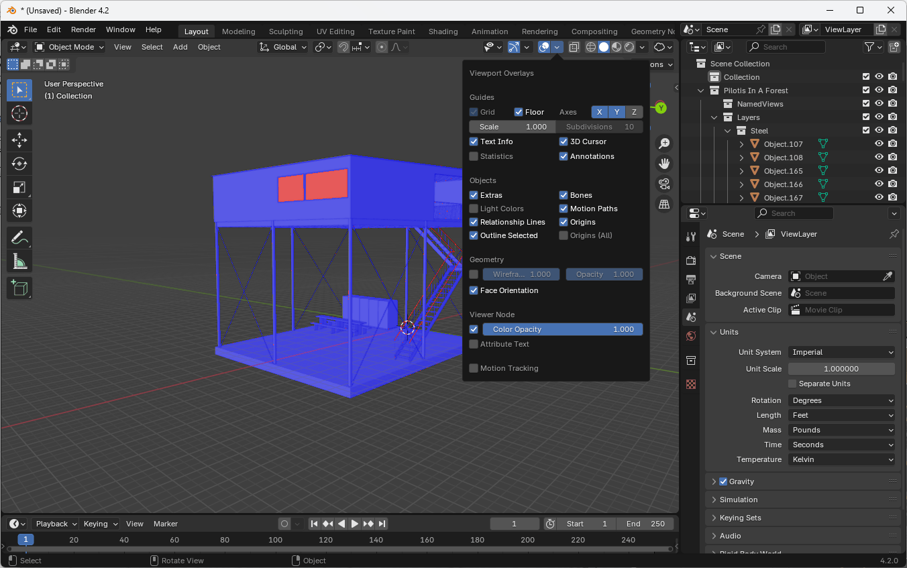
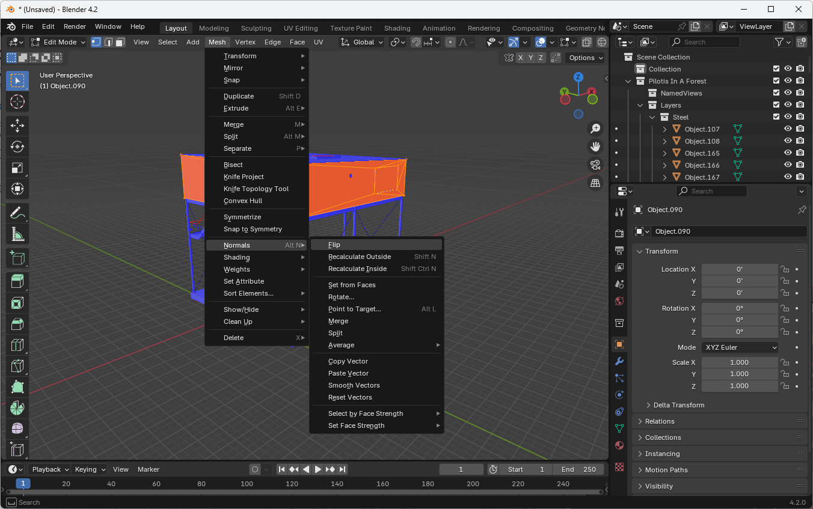
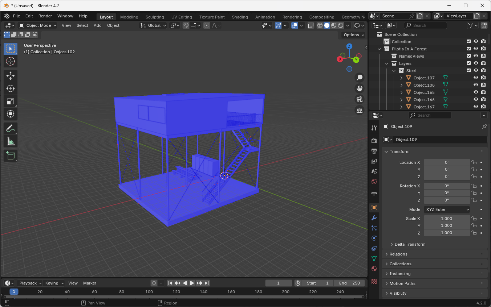

## Introduction

When importing models from CAD software like Rhino, which uses NURBS or Brep surfaces, into Blender, which uses polygon meshes, some conversion is necessary. NURBS or Brep surfaces are mathematically precise and continuous, while polygon meshes are made up of flat planes that can only approximate the original shape. This conversion from NURBS to mesh is inherently lossy.

To maintain the smoothness and curvature of the original NURBS surface, we can export additional information about the geometry called "surface normals", which describe the direction and degree of curvature at each edge between two faces.

We also want to preserve our CAD layers and materials during the import process to maintain a faithful representation of how the original model was organized.

## Importing from Rhino

Interestingly, Rhino internally converts its models to polygon meshes to power its viewport display. Conveniently, Rhino saves this mesh data inside the .3dm file. By reusing this internal "render mesh" data, we can preserve the representation of our geometry exactly as it appears in the Rhino viewport.

Fortunately, there is a free add-on available that allows us to do just this, called [import_3dm](https://github.com/jesterKing/import_3dm/).

### Preparing Your Rhino Model

This tutorial assumes that you have already modeled a scene in Rhino.

If you haven't done so yet, it's a good idea to separate different components of your model into different layers, either by function or by materials. For example, for a simple building, you might have a layer for the walls, a layer for the roof, and a layer for the interior fittings. For transparent objects like windows, you can either separate them on their own layer (and later apply a glass material in Blender to every object in the layer) or add a placeholder glass material to certain objects ahead of time in Rhino.

The import process will preserve these layers, as well as any materials that you have assigned in Rhino (although we will replace the Rhino materials with Blender versions later in the tutorial).

### Installing the Rhino to Blender Add-on

1. Visit the [import_3dm](https://github.com/jesterKing/import_3dm/releases/) GitHub releases page to download the add-on.
1. Download the appropriate version for your platform and your version of Blender.
    - For Blender 3.5 and 3.6 download the packages built for Python 3.10.
    - For Blender 4.0, 4.1, 4.2 and 4.3 download the packages built for Python 3.11
1. In Blender, go to Edit > Preferences > Add-ons.
1. Click on the down arrow in the top-right and select "Install from Disk". Choose the downloaded zip file in the file browser (do not unzip the file first).
1. Due to a quirk, you'll need to restart Blender after the initial installation.
1. After restarting, go back to the Add-ons section and enable the "Import Rhinocerous 3D" add-on by clicking the checkbox.

### Importing Your Rhino Model

1. Go to File > Import > Rhinocerous 3D (.3dm) and select your Rhino file.
1. Leave the default options and click "Import".
1. Your model should now be in Blender with correct scaling and organization!

## Importing from other CAD software

If you have a model in a different CAD format, you can accomplish similar results by exporting a Wavefront / OBJ (.obj) model. You may have to manually adjust the density of the polygon mesh and the translation of layers into OBJ groups. Ensure that you are exporting the "Normal" geometry or "Surface Normals" along with your mesh. Finally, note the scale of your model in CAD.

1. Import the OBJ file into Blender via File > Import > Wavefront (.obj).
1. Experiment with the options "Split by Object" and "Split by Group" to replicate the organization of your CAD file.
1. Adjust the "Scale" option based on the knowledge that the default unit in Blender is 1 meter. (If your CAD model is in feet, you'll need to scale by 1 meter / 3.28 feet or 0.3048 to ensure it is the correct size in meters.)

## Adjusting Units in Blender

The import process is usually able to preserve the correct scaling of your model. However, Blender's default unit is meters, so you may need to change the units in Blender to match your original intent.

1. Open the sidebar by pressing `N`.
1. In the Properties panel, go to the Scene tab.
1. Expand the Units section.
1. Change from Metric to Imperial if your Rhino model was in feet.

## Examining the Imported Geometry

1. Use the shading controls in the top right of the viewport, represented by icons of spheres with different treatments:
   - Solid view (default)
   - Wireframe view (shows edges, vertices, and faces)
   - X-ray mode (allows seeing through objects)
1. Observe that some objects may have irregular triangulation. This is normal for complex models and doesn't have an impact on the smoothness of the surface in the rendering.

## Checking Face Orientations

Rhino doesn't show the orientation of 2D surfaces, so it's difficult to tell which direction a surface is facing. This usually doesn't matter when modeling in CAD, but it can make a big difference when rendering, since the orientation of a surface dictates how it reflects light. We want to make sure that the faces of our model are all oriented correctly. (Generally, the faces of a solid object like a building should all be oriented outwards.)

1. In the Viewport Overlays menu, enable "Face Orientation".
1. Blue faces are facing outwards.
1. Red faces are facing inwards.

Generally, the outside of your model should be blue.

### Fixing Face Orientations

1. Switch to Edit Mode by pressing `Tab` or selecting it from the top-left dropdown.
1. Select all faces of an object by pressing `A`.
1. Go to Mesh > Normals > Flip to correct the orientation.
1. Repeat for all objects with red faces.
1. Switch back to Object Mode (`Tab`) between editing different objects.
1. Turn off the Face Orientation overlay when you're done.

Your model is now properly imported and oriented in Blender and you are now ready to consider lighting, camera placement, and rendering.