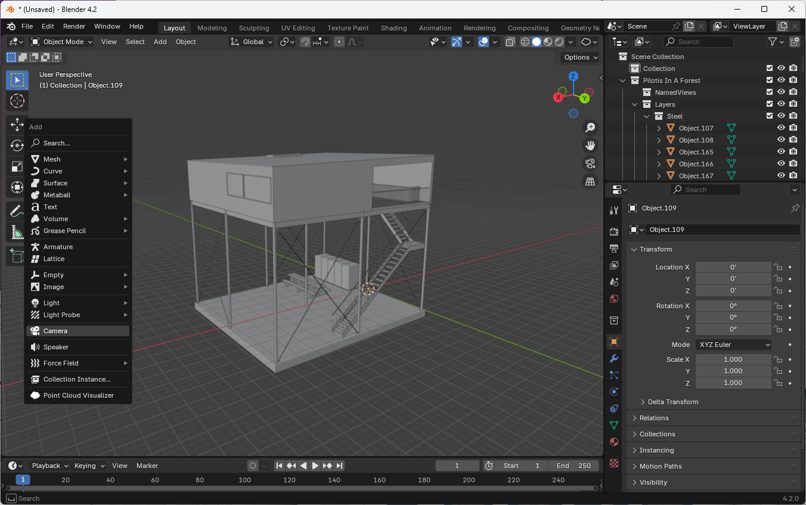
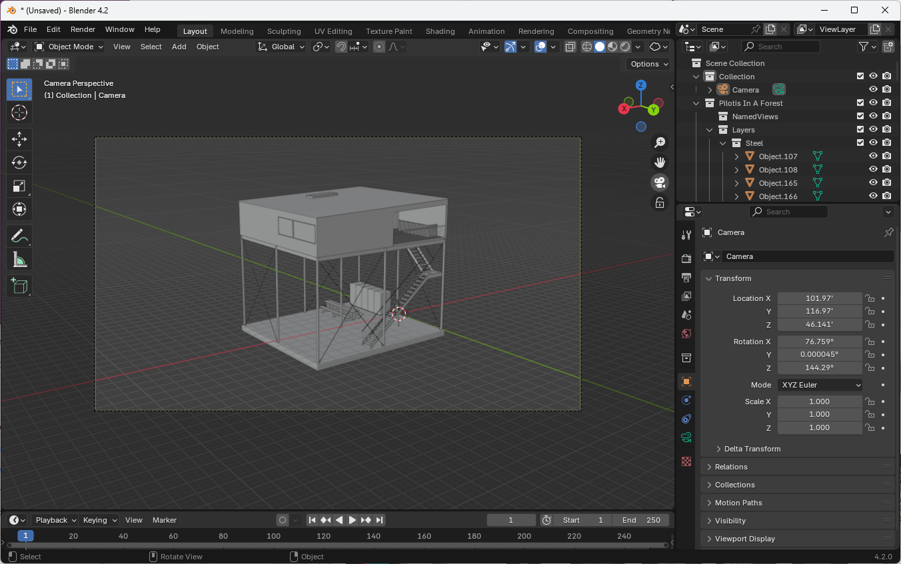
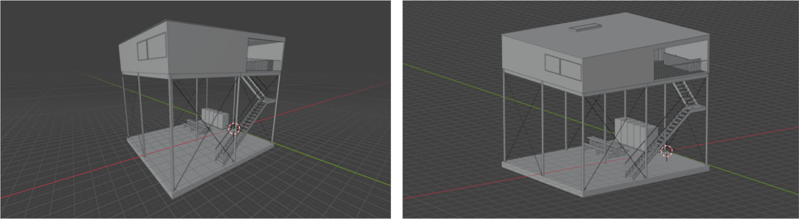
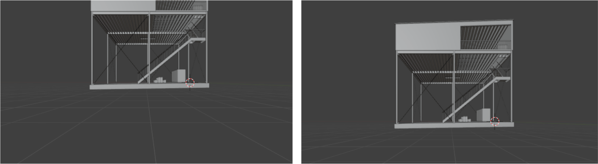
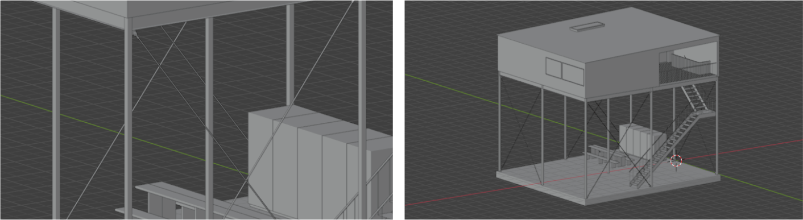
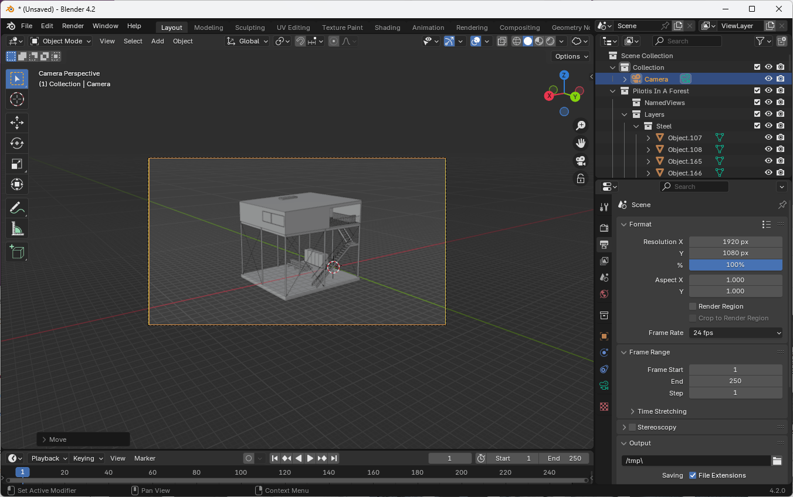
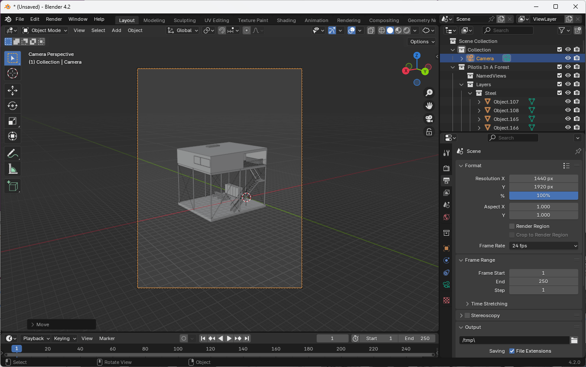
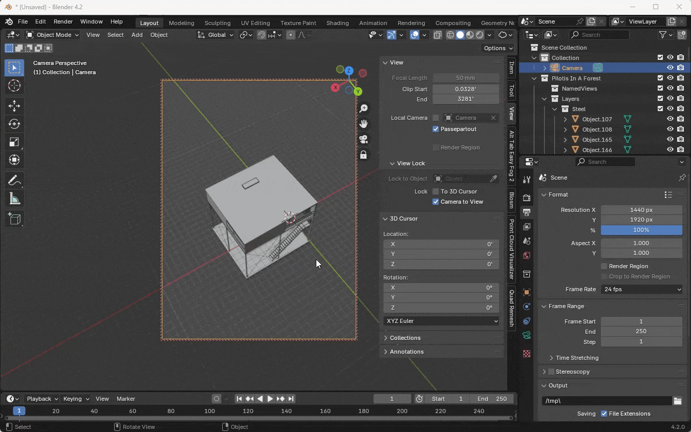
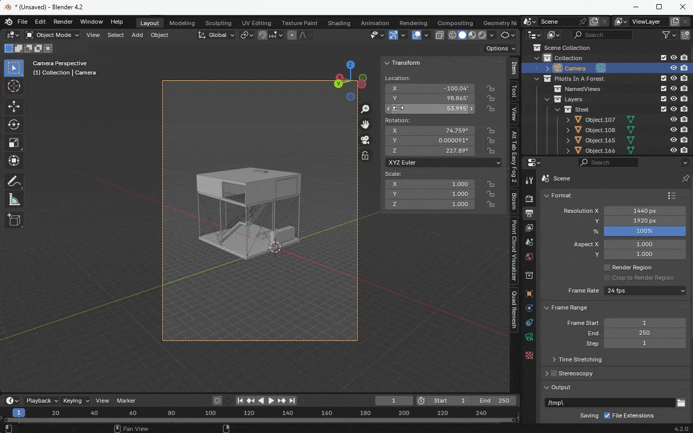
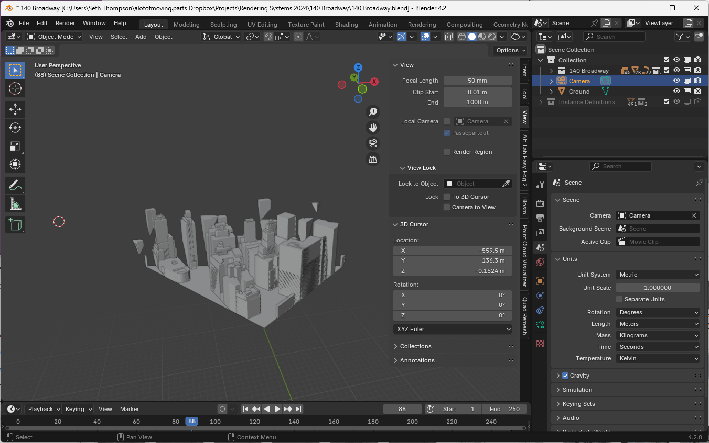

The foundation of the computational image is the vantage point of the viewer and the projection of the rendered scene onto the image plane. These attributes have a significant impact on the narrative and critical potential of the image.

Rendering builds on the long histories of projective representation of architecture in drawing and photography. We are interested in a unified understanding of these traditions that focuses on how to combine the freedom and expressive nature of drawing with the technical control and rigor of the architectural photographer's camera.

## Basic Camera Operations

Blender represents each view of a scene as a separate camera. You can have multiple cameras in a scene, and switch between each of them to render different views.

You can use [Pilotis In A Forest (Camera).blend (32.8 MB ↓)](https://drive.google.com/file/d/1AL-YVixtq6sEAIy0lkow90FkKft6gahC/view?usp=sharing) to follow along with this tutorial.

### Adding a Camera

1. Press `Shift + A` to open the Add menu
1. Select Camera from the list

Alternatively, use the menu: Add > Camera

### Viewing Through the Camera

- Press `Numpad 0` on the numpad to toggle between camera view and your current viewport
- You can also toggle camera view using the camera icon in the viewport header

### Switching Between Cameras

To switch between different cameras in a scene, click the green camera icon next to the camera's name in the Outliner. 

Alternatively, select the camera in the Outliner and press `Ctrl + Numpad 0` or go to View > Cameras > Set Active Object as Camera.

### Moving the Camera

1. Select the camera object
1. Use `G` to grab and move the camera
1. Use `X`, `Y`, or `Z` to constrain movement to a specific axis
1. Use `G` followed by `Z` twice to move along the camera's local Z-axis (forward/backward)

## Camera Properties

Access camera properties in the Properties panel under the camera icon when a camera is selected.

### Focal Length

The focal length of the camera determines the field of view, or the amount of the scene that is visible in the image. Focal length is usually measured in millimeters, a vestige of the physical dimensions of a lens attached to a 35mm camera.

*35 mm, wide-angle (left) and 200 mm, telephoto (right) lenses*

A smaller focal length will result in a wider field of view. Values in this range are sometimes called "wide-angle" focal lengths (5-35mm).
A medium focal length will result in a field of view that more closely approximates that of the human eye. For this reason, these focal lengths are sometimes called "normal" or "standard" focal lengths (35-70mm).
Larger focal lengths result in a narrower field of view, and are sometimes called "telephoto" focal lengths (85-300mm).

Changing the focal length of an image is equivalent to zooming in or out (or cropping the image). Therefore, a larger focal length shows less of the surrounding context around the subject, while a smaller focal length is useful for "fitting in" more of the subject's surroundings. These effects are useful for changing the spatial perception of the image. A larger focal length, with a narrower field of view will also have appear to perceptually flatten or compress the objects in the image, while a smaller focal length preserves or exaggerates the depth between objects in the scene.

Different focal lengths can be combined with moving the camera closer and farther away from the subject. By moving farther away from the subject and using a larger focal length, we can better preserve the subject's relative size to its surroundings, in expense for losing depth cues in the foreground. By moving closer to the subject and using a smaller focal length, we can show more of the subject's surroundings and separate the subject from its foreground and background, at the expense of distorting the subject's relative size to its surroundings.

You can change the focal length of the camera under the Camera tab of the Properties panel while the camera is selected.

### Shift

In architectural rendering, it can be desireable to create one-point or two-point perspective views that shows the architectural subject head-on. These views preseve either the vertical or horizontal elements of the subject (two-point perspective) or both the vertical and horizontal elements (one-point perspective). In order words, this kind of projection maintains perfectly vertical mullions on a facade or a perfectly horizontal entablature of a classical structure.

Fundamentally, these perspective views require the camera to be facing the subject head-on. If the camera is at ground level, this orientation will usually place the horizon line in the center of the image.

Camera shift allows us to recompose the relative position of the subject in the picture plane without changing the camera's position or orientation. In practice, this lets us position the camera to create the desired perspective projection, and then shift the image plane to compose the frame of the picture separately.

*No vertical shift (left) and vertical shift (right)*

In Blender, you can adjust the camera shift under the Camera tab of the Properties panel while the camera is selected, using the Shift X and Y parameters.

### Perspective / Orthographic

*Orthographic scale differences*

To switch between perspective and orthographic modes, use the Lens Type parameter under the Camera tab of the Properties panel. Orthographic projections are equivalent to an infinitely distant camera with a focal length of Infinity. Instead of lens parameters, orthographic cameras use an Orthographic Scale parameter to set the size of the view.

## Aspect Ratio / Resolution

The aspect ratio and resolution of the rendered image is controlled not by the camera, but by the scene's render settings.

*Resolution settings, under the Output tab of the Properties panel*

1. Go to the Output tab of the Properties panel
1. Set the Resolution X and Resolution Y to adjust the aspect ratio of your camera view
1. (Leave the Aspect X and Aspect Y at 1.0)

*Aspect ratio is controlled by Resolution settings*

For a landscape image with a 5:3 aspect ratio, you might set the resolution to 1920px × 1152px.

For a portrait image with a 3:5 aspect ratio, you might use a resolution of 1152px × 1920px.

To imitate the long traditional of film architectural photography with 4x5 cameras, you might choose a resolution of 1920px × 1440px for a 5:4 aspect ratio or 1440px × 1920px for a 4:5 aspect ratio.

## Usability Tips

### Aligning Camera to View

1. Position your viewport as desired
1. Select the camera
1. Go to View > Align View > Align Active Camera to View
1. Shortcut: `Ctrl + Alt + 0`

### Lock Camera to View

*Lock camera to view setting in the 3D Viewport sidebar*

1. In the sidebar (`N`), go to the View tab
1. Check "Lock Camera to View"
1. Now you can navigate in camera view, and the camera will update its position

### Precise Camera Positioning

*Editing transform values manually, for precise positioning*

Use the Transform panel in the sidebar (`N`) to input exact values for camera position and rotation.

### Recreating Specific Views

To recreate a particular view from a reference image:

1. Analyze the image for camera position relative to the subject
1. Set up your camera's position and rotation accordingly
1. Adjust the focal length to match the perspective distortion
1. Use camera shift to fine-tune the composition

Remember that extreme perspectives often use very wide-angle lenses (low focal lengths) combined with strategic camera positioning and shifting.

### Changing the Camera's Clipping Distance

Rendering accurate perspective views requires precise calculation of the distances between objects in the scene. Due to the inherent limitations of storing the positions of objects on a computer with finite precisions, it is possible to create scenes that are too small or too large for the default cameras to accurately render.

*City-scale model is too large for the camera to render accurately (before)*

If you import a model that is larger than 100 meters or small than 1 meter, it may be necessary to change the camera's clipping range to prevent image glitches.

*City-scale model with clipping distance of 1m - 100000m (after)*

The clipping distance of the viewport itself can be controlled using Sidebar. Tap `N` to open the sidebar, then click on the View tab, then adjust Clip Start and Clip End to the minimum and maximum distances between objects in your scene. Each camera must be updated similarly. Open the Camera tab of the Properties panel and adjust the Clip Start and Clip End to the same values.

The range between Clip Start and Clip End should be around a factor of 100,000 or 5 orders of magnitude. For city-scale scenes, you might set Clip Start to 1 and Clip End to 100000.