In order to create a realistic scene from a CAD model, we must bridge the virtual world of idealized geometric surfaces with that of the physical world, where surfaces are textured, irregular, heterogeneous, colorful, and constructed of different kinds of materials arrayed, composed, and layered in complex ways.

Rendering engines allow us to depict these complex surfaces by assigning a shader or material to each surface. The shader is a computational model that describes how light should interact with the surface. This model describes not just color, but properties like texture, roughness, reflectivity, metalness, and translucency.

This method of describing material qualities is called Physically Based Rendering or PBR. Any rendering engine that supports PBR materials will have some degree of interoperability with other PBR rendering engines.

You can use [Materials (Before).blend (36.4 MB ↓)](https://drive.google.com/file/d/1AScH2ZeBv1mKTx-9Xf1nFRWDN-Clb_60/view?usp=sharing) to follow along with this tutorial.

## Editing Materials

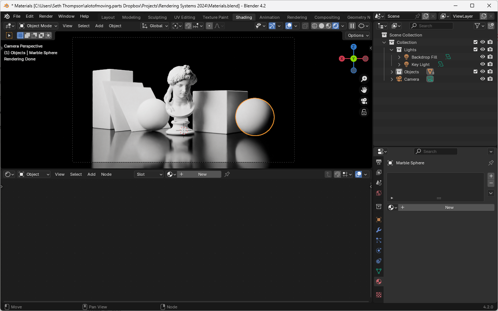

1. Switch to the Shading workspace at the top of the Blender interface
1. The bottom panel is the Shader Editor
1. Ensure that you are in Object mode, not World mode, in the top-left corner of the Shader Editor
1. Select the object you want to edit
1. Click the "+ New" button to create a new material
1. You can rename the material by clicking on the material name and typing a new name

### Understanding Nodes (Shader Editor)

Much as we edited the World environment shader using nodes connected to a World Output in the past lesson, we can edit our Object shader using nodes connected to the special Material Output node.

Similarly, the Background node of the World shader is analogous to a general-pupose material surface node called "Principled BSDF". (BSDF stands for Bidirectional scattering distribution function, a mathematical model for light interaction with surfaces. Principled refers to the fact that this BSDF combines a number of common BSDFs into a single node.)

By default, a new material will create a white Principled BSDF node connected to the Material Output node.

## Physically Based Materials

There are a number of standard PBR properties that we can edit in the Principled BSDF node.

- **Base Color** (the base color of the material)
- **Metallic** (the degree to which the material is a metal; usually 0 or 1, rarely in between)
- **Roughness** (the degree to which the material is rough or smooth)
- **Alpha** (the transparency of the material)
- **Normal** (the direction of surface curvature, to apply smaller adjustments on top of the normals already described by the geometry)
- **Transmission** (the degree to which the material transmits light; used for glass and other transparent materials)
- **Emission** (the degree to which the material emits light; when a material emits light, it overrides the other material properties)

In theory, these properties can be measured scientifically for real-world materials, but in practice you will likely use a combination of intuition and experimentation to achieve the desired look.

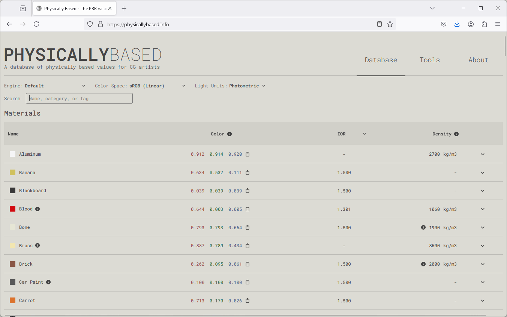

For a good starting point, you can consult the [Physically Based database](https://physicallybased.info/) website to get a sense of the typical values for a wide array of materials.

Note: Very few materials are pure black `(0.0, 0.0, 0.0)` or pure white `(1.0, 1.0, 1.0)`. Most real-world materials (even those that appear black or white) fall between `(0.05, 0.05, 0.05)` and `(0.8, 0.8, 0.8)`. This is why the default white base color is actually `(0.8, 0.8, 0.8)`.

### Plaster Material

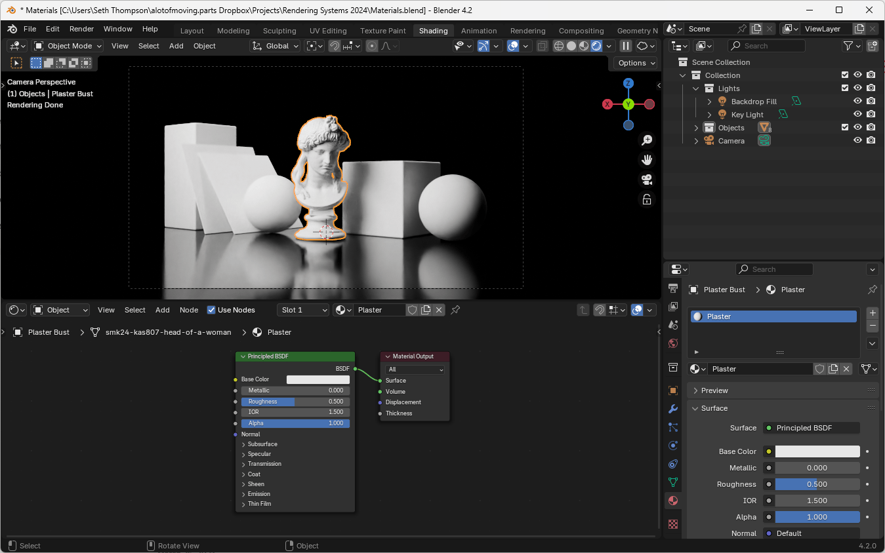

1. Create a new material and name it "Plaster"
1. Adjust the Principled BSDF shader:
   - Keep Base Color white
   - Set Metallic to 0 (a plaster surface is not a metal)
   - Set Roughness to 0.5 (plaster exhibits a medium level of roughness)

### Concrete Material

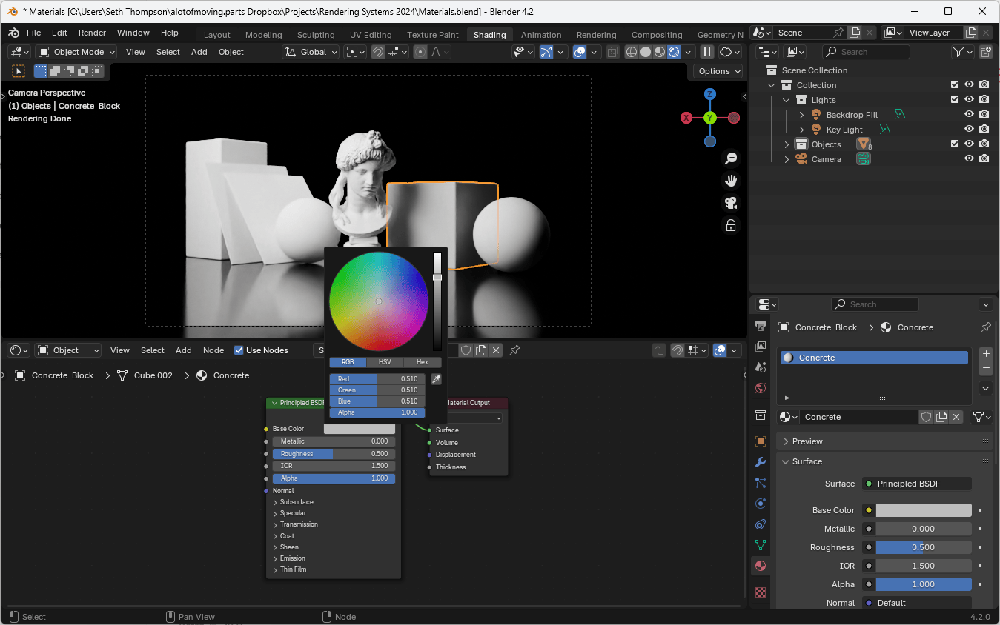

1. Create a new material and name it "Concrete"
1. Use color references:
   - Consult the [Physically Based database](https://physicallybased.info/) for a color starting point
1. Set the Base Color:
   - Use the RGB values from the reference (e.g. `(0.51, 0.51, 0.51)`)
4. Set Metallic to 0
5. Set Roughness to 0.7

### Brass Material

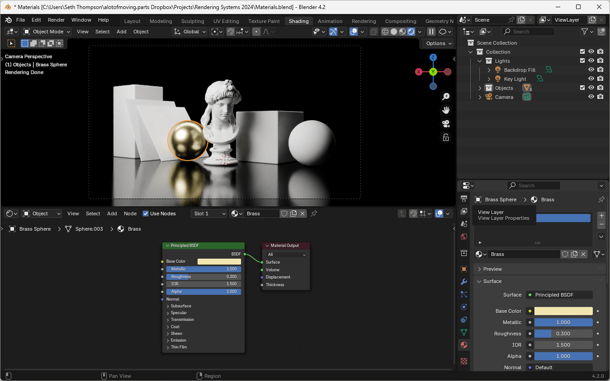

1. Create a new material and name it "Brass"
2. Set the Base Color using the [Physically Based database](https://physicallybased.info/) (e.g., `(0.887, 0.789, 0.434)`)
3. Set Metallic to 1
4. Set Roughness to 0.3

### Glass Material

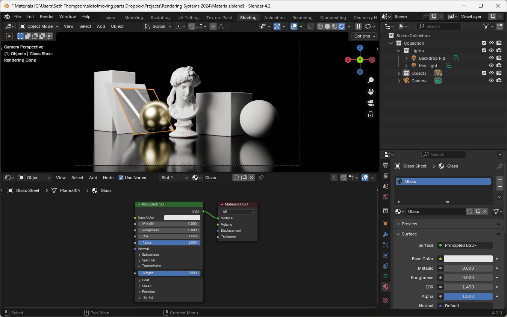

1. Create a new material and name it "Glass"
2. Delete the Principled BSDF node
3. Add a Glass BSDF node (Add > Shader > Glass BSDF)
4. Connect the Glass BSDF to the Material Output
5. Set Roughness to 0 (or very low)
6. Keep IOR (Index of Refraction) at 1.450 for typical glass

Note: Accurately rendering glass at architectural scale is computationally expensive. If your scene includes many glass objects, you may want to use a glass material that is optimized for [faster rendering](https://blender.stackexchange.com/questions/178419/archviz-glass-for-quick-renders-in-cycles). If you are rendering an interior scene and the windows are not directly in view, consider removing the glass material altogether.

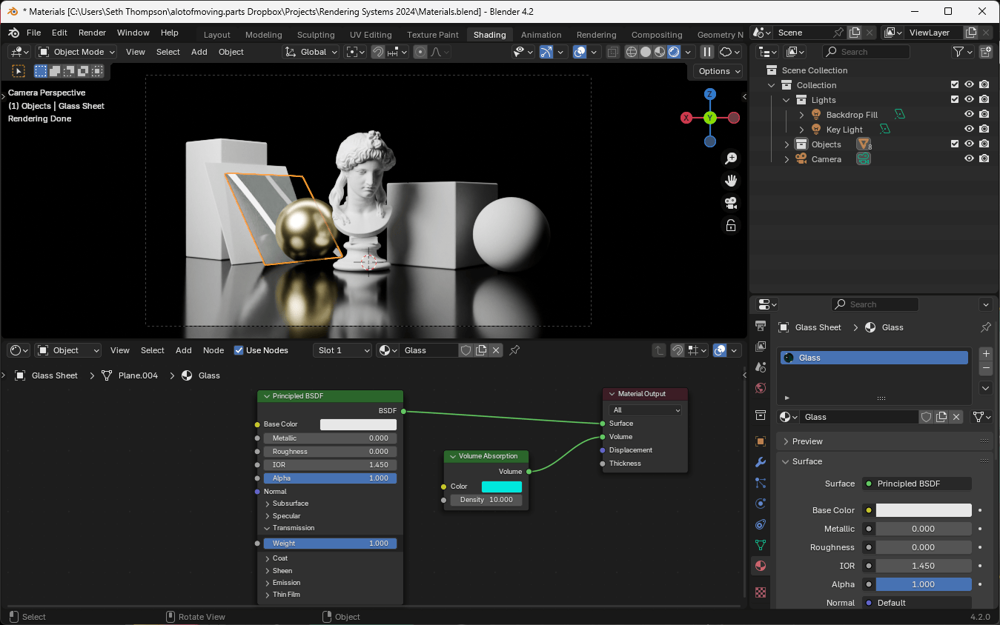

To add a slight tint:
1. Add a Volume Absorption node (Add > Shader > Volume > Volume Absorption)
2. Connect it to the Volume input of the Material Output
3. Adjust the Color and Density as desired

Note: Adding Volume Absorption will add significant rendering cost to your scene. Only use when necessary.

## Image Textures

Up until now, our shaders have been uniform, with shared material properties across every point on the surface.

In order to add detail and variation to our materials, it can be advantageous to use image textures to represent surface qualities. This is especially true when creating a wide array of architectural building materials with highly specific characteristics.

### Image Textures as Material Properties

Rather than describing a material property with a single numerical value, we can use an image texture as a database of sorts, to describe different values at different points.

Since the PBR model is a standard shared by many rendering engines, we can use image textures designed for any rendering engine (not just those advertised as being compatible with Blender).

Some resources for image textures include:

- [Poly Haven Textures (free)](https://polyhaven.com/textures)
- [Ambient CG Materials (free)](https://ambientcg.com/)
- [BlenderKit Textures (free)](https://blenderkit.com/textures)
- [Quixel Megascans (subscription)](https://quixel.com/megascans)
- [Poliigon Textures (subscription)](https://poliigon.com/textures)

PBR image textures are actually a set of multiple images, each of which describe a different property. Some material properties may go by different names, depending on the origin of the textures. In most cases, you can use the following textures interchangeably.

- **Base Color** (also known as "Diffuse", "Albedo", or simply "Color")
- **Metallic** (also known as "Metalness")
- **Roughness** (alternatively, a "Gloss" map can be inverted to represent roughness)
- **Normal** (must be connected to a Normal Map node to convert image to vector data)
- **Ambient Occlusion** (also known as "AO"; can be mixed into the Base Color with a Mix Color node, before being connected to the Base Color input)
- **Normal** (when give a choice, select "Normal (GL)" or "Normal (OpenGL)", not "Normal (DX)")
- **Alpha** (also known as "Opacity")

Note: Only the Base Color image texture represents a true color image. The other maps describe properties as numeric data values. When you drag an image into Blender, make sure to set the Color Space to "sRGB" for the Base Color image texture, and "Non-Color" for the other maps.

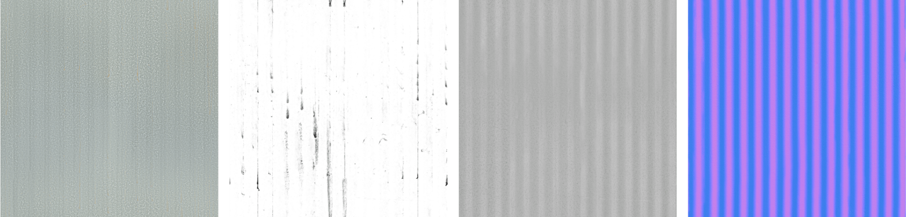
*Corrugated Metal textures (left to right): Diffuse (.jpg), Metalness (.jpg), Roughness (.jpg), Normal (.png)*

Let's download a set of [PBR textures for corrugated metal](https://polyhaven.com/a/corrugated_iron), from Poly Haven.

1. Visit the [Corrugated Iron texture page](https://polyhaven.com/a/corrugated_iron).
1. Select either 1K, 2K, or 4K resolution (depending on how close your camera will be to the material and how many materials you have in your scene).
1. Select either the Blend file (.blend) which will include a pre-configured material, or the Zip file (.zip) with Diffuse, Metal, Roughness, and Normal maps.

Note: Diffuse, Metal, Roughness maps may be any format including lossy images (.jpg, .png, .tiff, .exr, 8-bit). Normal maps should be a lossless format (.png, .tiff, or .exr, 8-bit). Displacement maps should always be lossless and high bit-depth (.exr, 16-bit or 32-bit).

Note: 4K textures require 4× the memory of 2K textures (which require 4× the memory of 1K textures). Use large textures sparingly, to avoid excessive memory usage.

### Texture Coordinates

Since our image textures are two-dimensional, but our scene is three-dimensional, we must determine a way to map the 2D image surface into 3D space. This mapping can be performed manually (through a process called UV unwrapping) or procedurally using a mathematical approach.

For many architectural applications, we can rely on the fact that many surfaces require uniformly-scaled textures applied to roughly rectangular shapes. We can therefore often skip the time-intensive process of UV unwrapping and instead use a mapping process called Box Projection.

#### Box Projection Coordinates

Box Projection applies a 2D texture to a 3D surface by mathematically projecting the texture onto the surface from all six orthogonal directions.

This mathematical approach provides uniform scaling across objects, ensuring that a brick texture, for example, applied to objects if different scales, will result in the same sized bricks on each object.

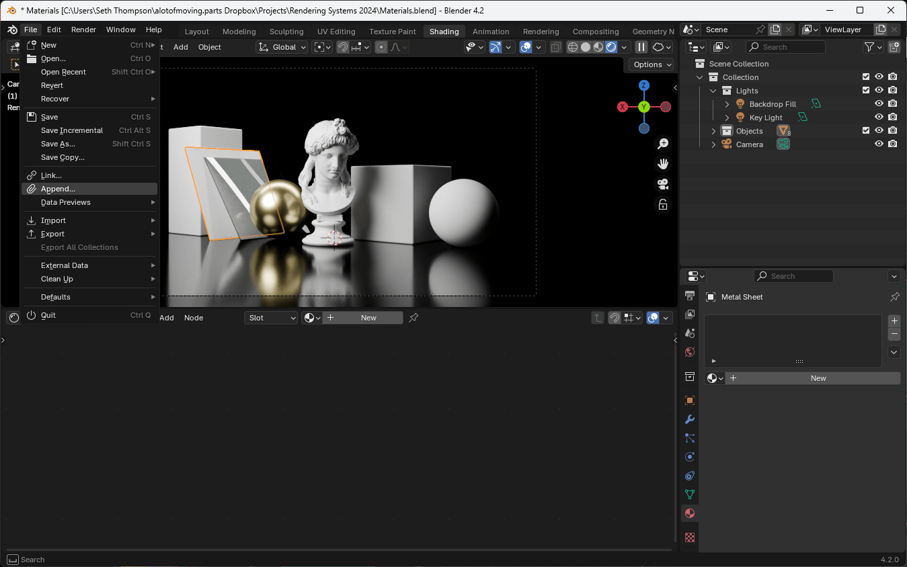

Blender doesn't support this kind of mapping natively, so we will import a special Node Group that contains the relevant nodes conveniently bundled together.

Download the [Box Projection.blend (942 KB ↓)](https://drive.google.com/file/d/1JQH2r8TAAHnK_i2ukAjmby64kZDCyxOv/view?usp=sharing) file.

1. Go to `File > Append` to add a Blender resource from another Blend file into the current one
1. Navigate to `Box Projection.blend` and open it (Blender will show the resources inside as folders)
1. Open the `NodeTree` folder to access Node Groups
1. Select the `Object Coordinates (Box Projection)` Node Group and click "Append"
1. Now, we can add this Node Group to any shader by going to the Shader Editor and selecting Add > Group > Object Coordinates (Box Projection)

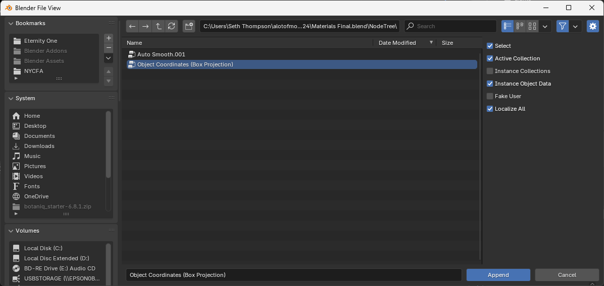

### Corrugated Metal Material (Image Texture)

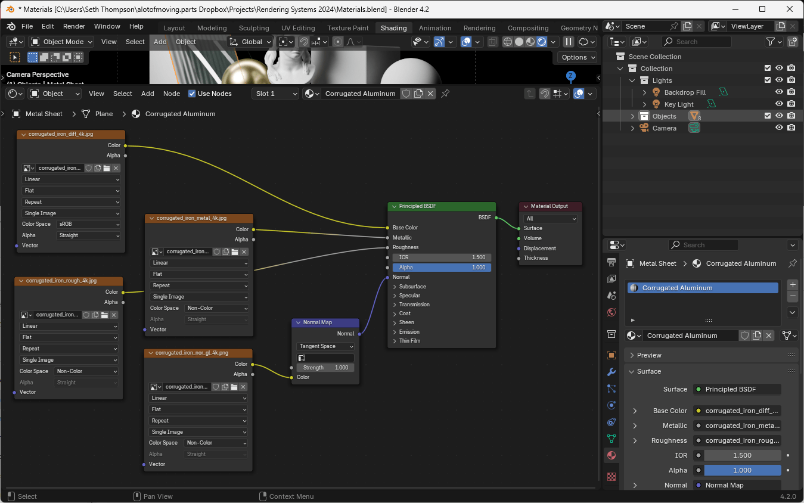

Finally, let's create a material using our knowledge of image textures, from above.

1. Create a new material and name it "Corrugated Metal"
1. Drag your image textures into the Shader Editor
1. Ensure the base color Image Texture node is set to Color Space "sRGB"
1. Change the other Image Texture nodes to Color Space "Non-Color"
1. Connect the Image Texture node outputs to their respective inputs on the Principled BSDF node
1. Add a Normal Map node between the normal map Image Texture and the Principled BSDF node

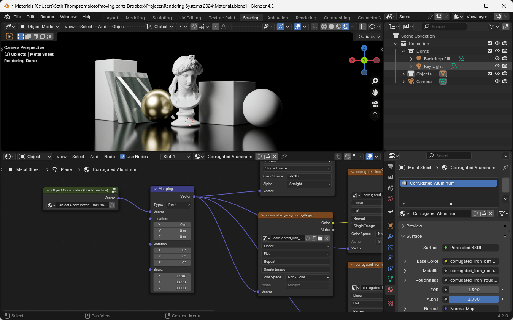

Next, add a Box Projection node group with Add > Group > Object Coordinates (Box Projection). (Make sure you appended the Box Projection node group to your scene above.) Connect the output of the Box Projection node to the input of *all* of the Image Texture nodes.

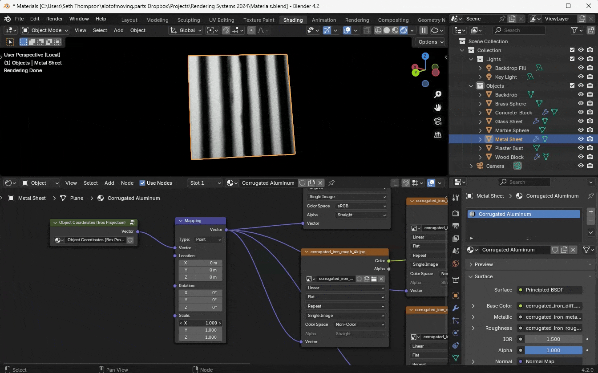

Finally, add a Mapping node between the Box Projection node and all of the Image Texture nodes. You can use the Mapping node to ajust the scale, rotation, and translation of the texture.

## Procedural Materials

The downside of image textures is that they are fundamentally limited by the size and extent of the image. Beyond the borders of the image, the texture is repeated. Even when the image is designed to seamlessly repeat, there can be visible repetition when viewed from a distance or when covering a large area.

The alternate to image-based textures is to build variation in the surface of the material using procedural textures.

Procedural textures are mathematically or computationally defined and offer infinite resolution and variation without repeating.

### Marble Material

To experiment with procedural textures, we will create a simple material representing polished marble.

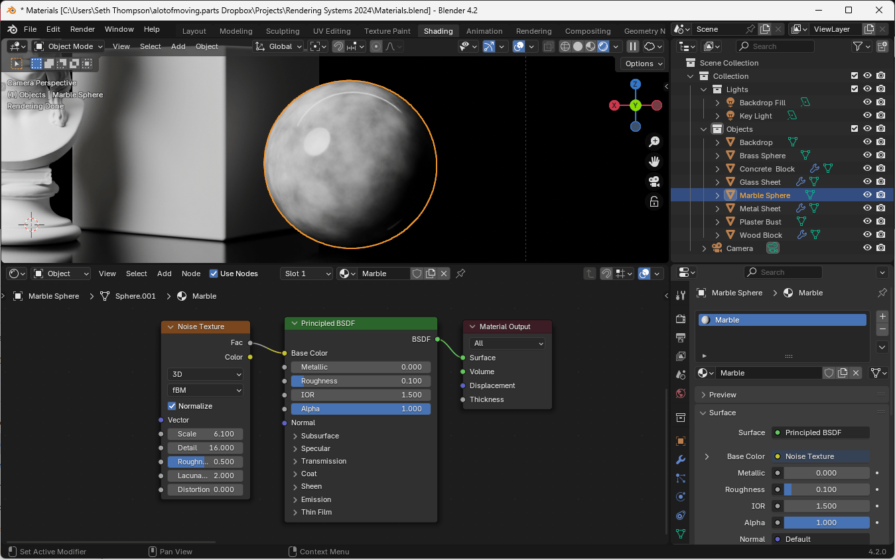

1. Create a new material and name it "Marble"
1. Add a Noise Texture node to the Shader Editor (Add > Texture > Noise Texture) and connect it to the Base Color input of the Principled BSDF node
1. Set the Roughness of the Principled BSDF to 0.1 to create a polished look
1. Experiment with different Noise Texture settings to achieve a marble-like pattern

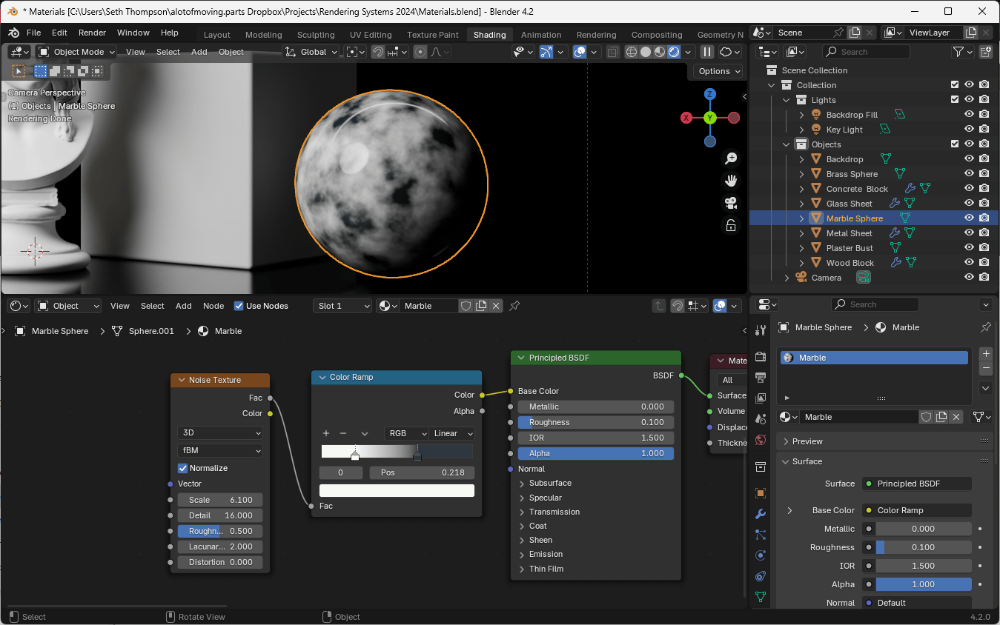

For even more control over the color of the marble, let's add a Color Ramp node between the Noise Texture and the Principled BSDF node.

The Fac output of the Noise Texture node represents a single value between 0.0 and 1.0. When interpreted as a color, this value produces a grayscale color. Color Ramp allows us to reassign this value to a spectrum of colors. Adjust the left-most slider of the Color Ramp to a light or off-white color. Adjust the right-most slider to a cool, dark gray color. Now move the sliders towards the middle of the color ramp to increase the contrast of the marble.

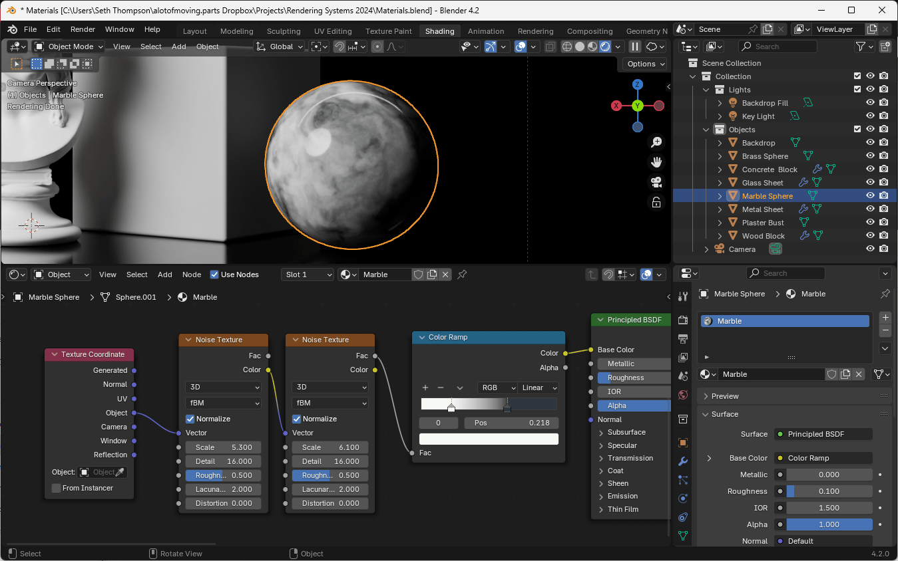

To create a more complex pattern, we can warp the texture coordinates of the Noise Texture node with a second Noise Texture. (This arrangement creates noise in the *spatial* domain, producing warps and folds in the pattern, not just color variations.)

Add a second Noise Texture node and connect the Color output to the Vector input of the first Noise Texture node. (This repurposes the RGB Color output of the first Noise Texture as an XYZ vector. Remember that RGB colors and XYZ vectors can be used interchangeably in shaders.)

### Wood Material

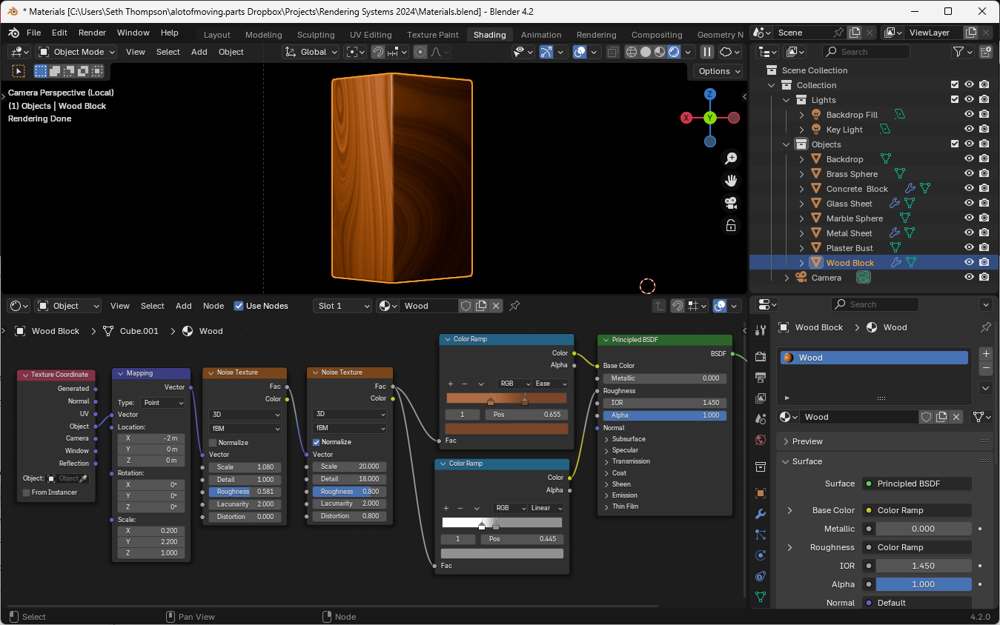

Noise Textures can be combined in various ways to create surprisingly complex patterns. We can approximate the look of wood by combining Noise Textures and stretching the coordinates in one dimension to simulate the appearance of grain. 

Follow the node setup in the image above to create a wood-like material. Adjust the Color Ramp color settings, the scale of the Mapping node, and the Noise Texture settings to change the color of the wood, the prominence of the grain, and the overall knotty appearance.

## Final Product

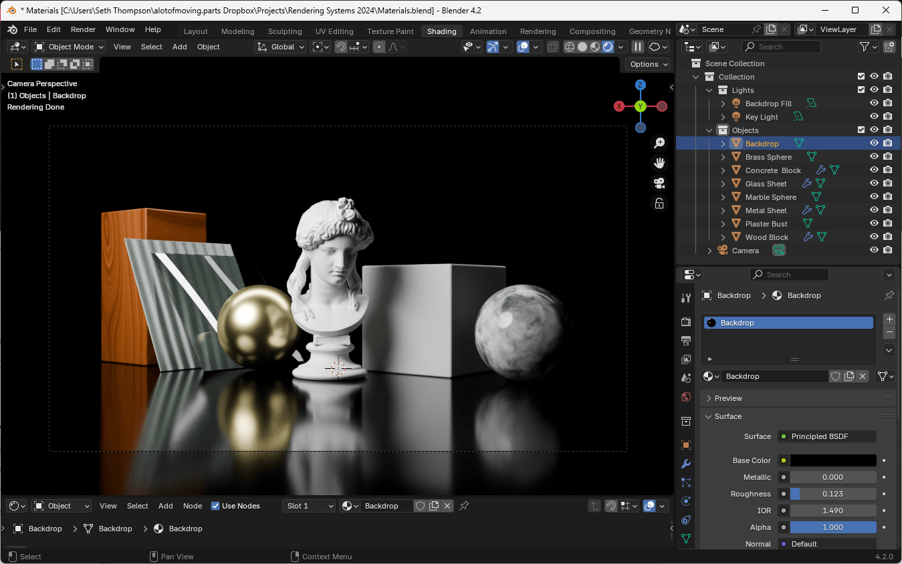

With just a few materials, we can already create an array of different objects with a variety of surface characteristics.

To access the final version of these materials, you can use [Materials (After).blend (63.1 MB ↓)](https://drive.google.com/file/d/1EhsrElE5Mnm3_oXdE0M_LWlGsn4ul6GD/view?usp=sharing).

## Non-Photorealistic Materials

Shaders are not limited to producing realistic or naturalistic materials. We can also create stylized or abstract materials using a set of techniques known as Non-Photorealistic Rendering or NPR.

If, for example, we want to create a material that highlights the edges of objects, we can rely on the fact that the Fresnel node changes value based on the angle of incidence of light. In other words, it produces a value closer to 0.0 when the surface is nearly parallel to the viewer and a value closer to 1.0 when the surface is nearly perpendicular to the viewer.

We can use the output of this node to change material qualities around the edges of objects.

### Edge Glow Material

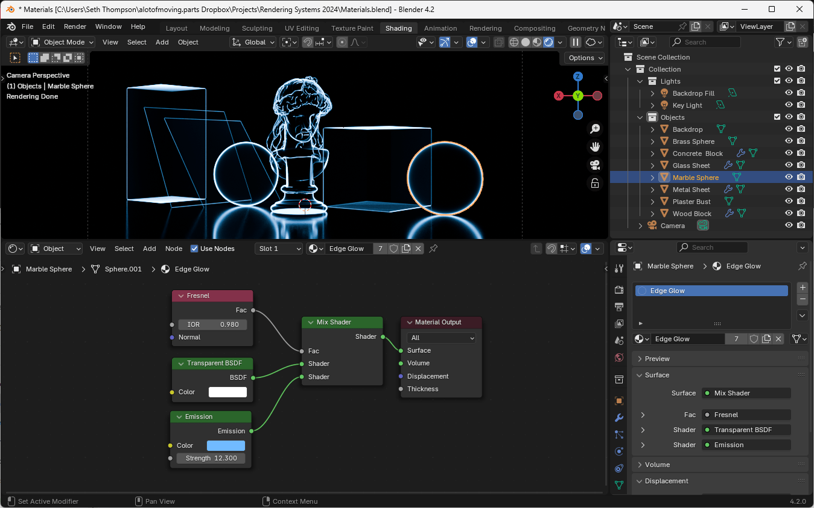

To construct this shader we will also use a Mix Shader, which allows us to blend between two materials based on the value of a scalar input.

1. Create a new material and name it "Edge Glow"
1. Add a Fresnel node with a value of 0.98 (changing this value will change the angle at which the effect is most pronounced)
1. Connect the output of the Fresnel node to the Fac input of a Mix Shader node (Add > Shader > Mix Shader)
1. Connect a Transparent BSDF node to the first input of the Mix Shader
1. Connect an Emission node to the second input of the Mix Shader
1. Change the Emission color to a vibrant color and the intensity to a very bright value, above 10.

## Images as Planes

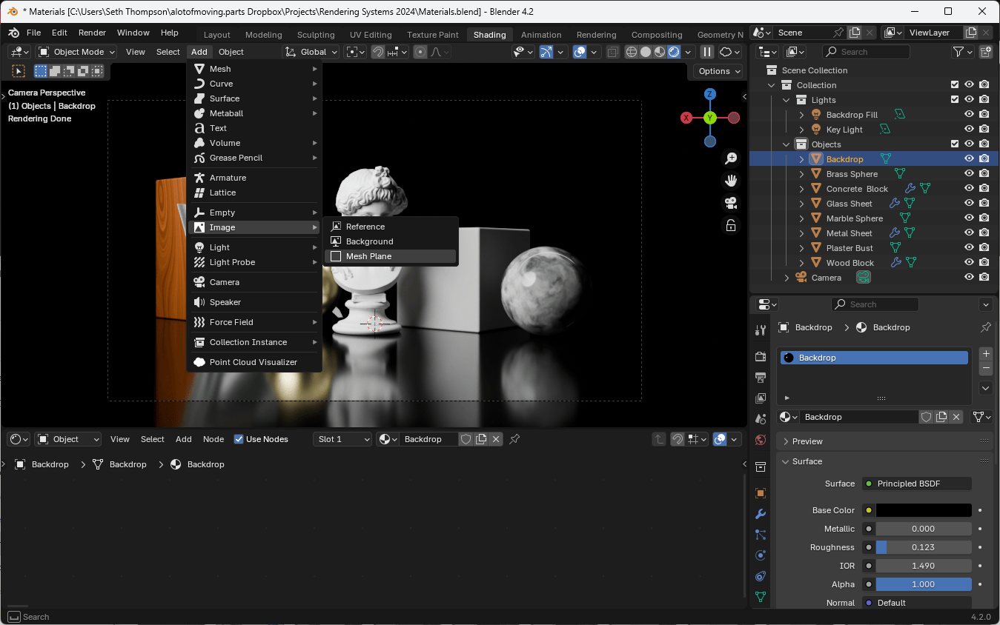

In order to represent a flat object with an image (such as a poster, a print, or a screen), you can import an image as a Plane and Blender will automatically add a Material with the image texture applied.

You can add an Image as a Plane by going to the 3D Viewport and selecting Add > Image > Mesh Plane. (If you don't see this option, make sure that you are using Blender 4.2 or later.)

In the options menu, you can change whether the image should be a diffuse surface or an emissive surface (meaning the image will emit light).

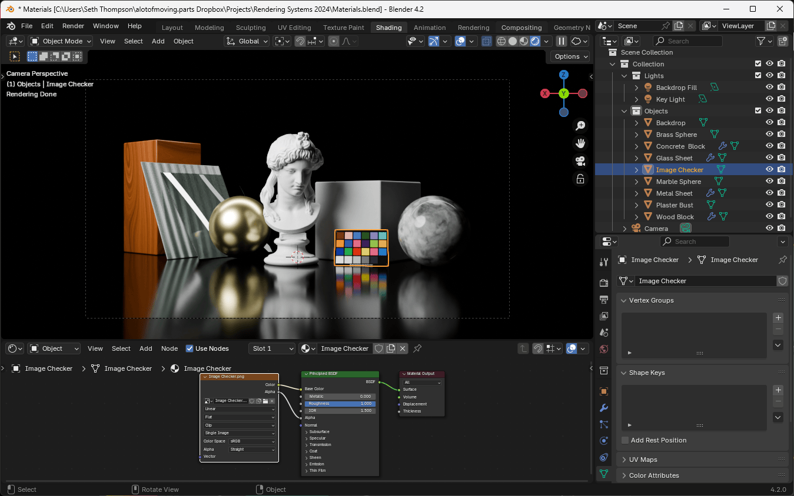

## Light as Material

The material system in Blender also allows materials to emit light. This is a powerful technique that allows us to create light sources from any geometry.

For example, to create a ring light, we can add a Torus mesh to our scene, and set its Material to an Emission shader.

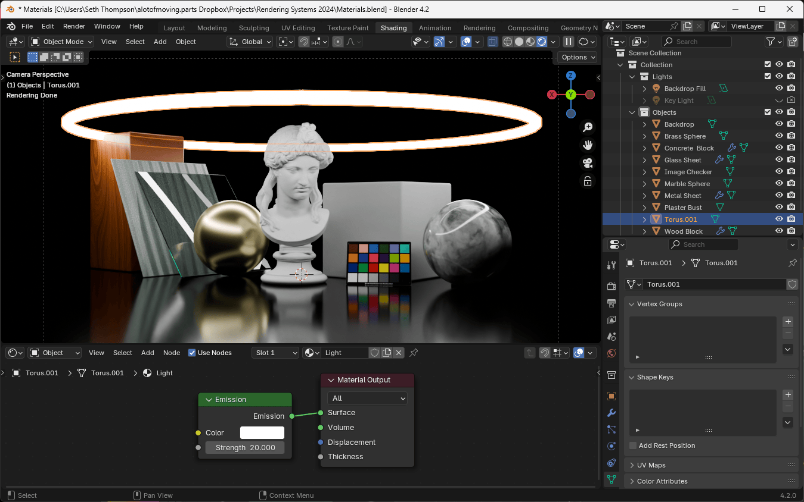

The Emission node allows you to control the intensity and the color of the light emitted by the material.

## Working with Materials

When working with a large scene, Blender has a slightly unintuitive method for applying materials to multiple objects. Rather than bulk-applying the material to all objects, you must first apply the material to a single object, and then link the material to other objects.

### Applying Materials to Multiple Objects

1. Select all objects you want to change (use `Shift` + click or select from the Outliner)
2. Make sure the object with the desired material is the active object (brightest yellow/orange outline)
3. Press `Ctrl + L` and choose "Materials" to link the material

To change multiple objects to a new material:

1. Select all objects
2. Change the material of the active object
3. Press `Ctrl + L` and choose "Materials" to link the new material to all selected objects

### Saving Materials

Blender only saves materials that are being used by objects in your scene. To keep unused materials, make sure at least one object uses that material before saving.

## Adding Materials to the Model

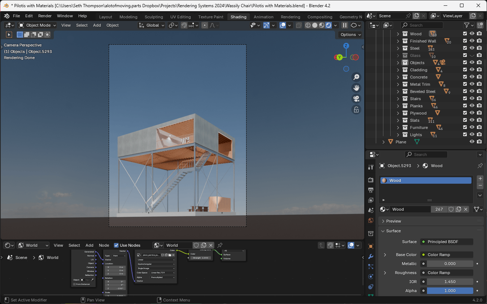

Using the materials we created above, we can now texture our model. After adding an HDRi image, we have the start to a very nice looking image.