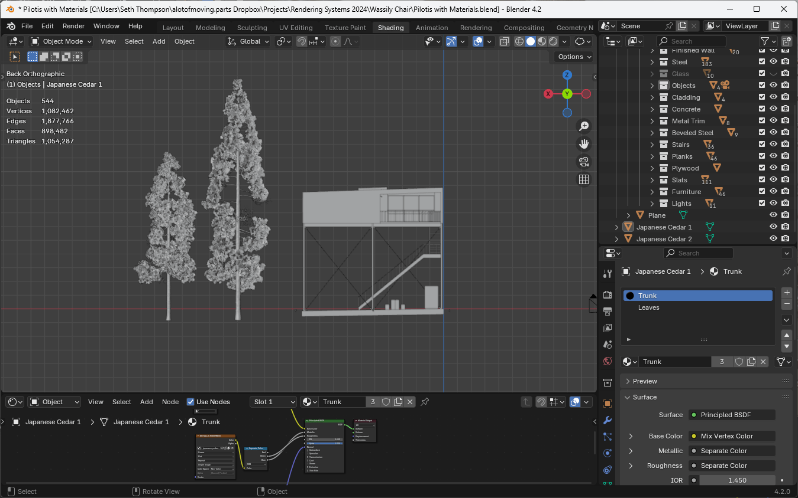
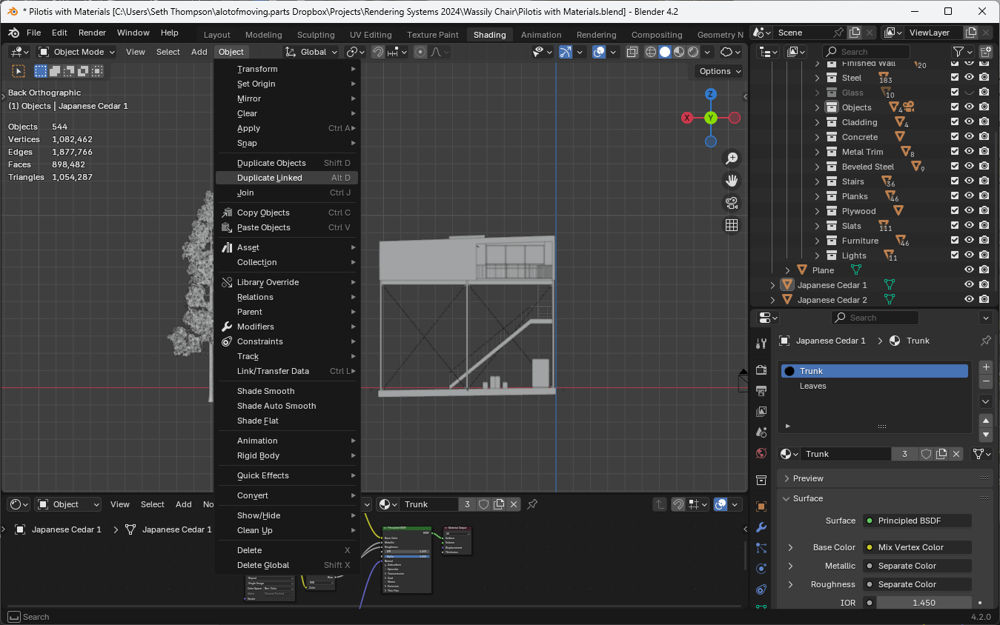
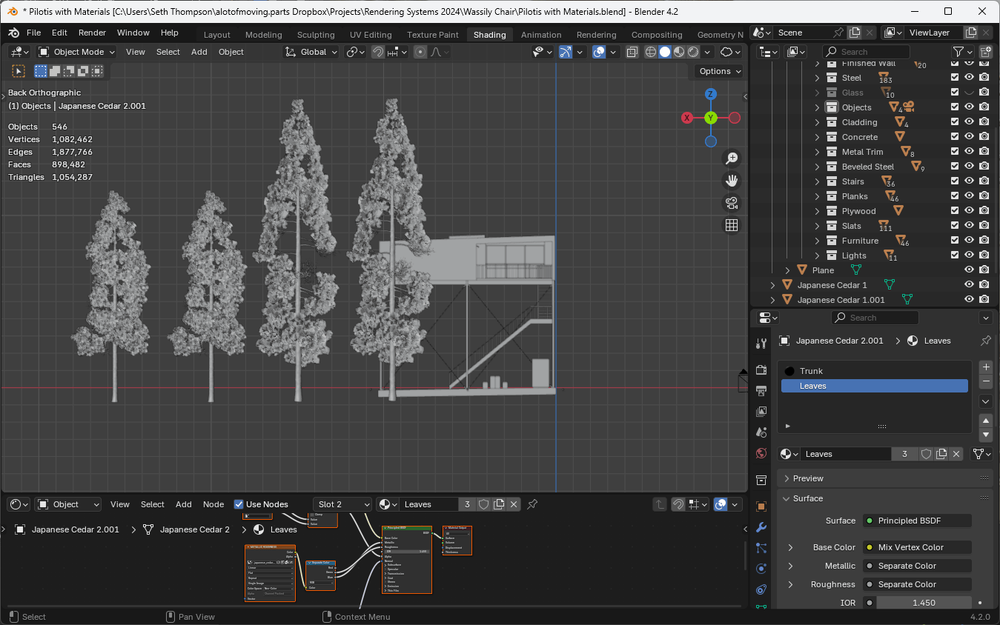
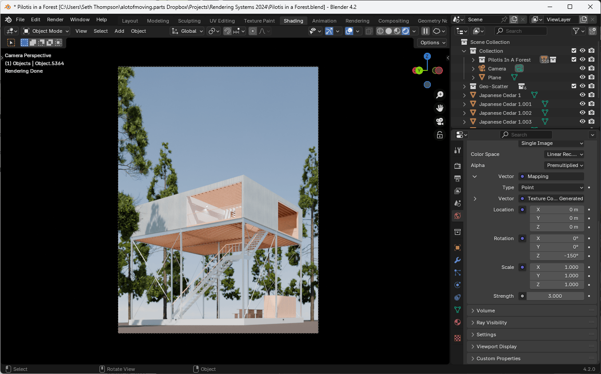
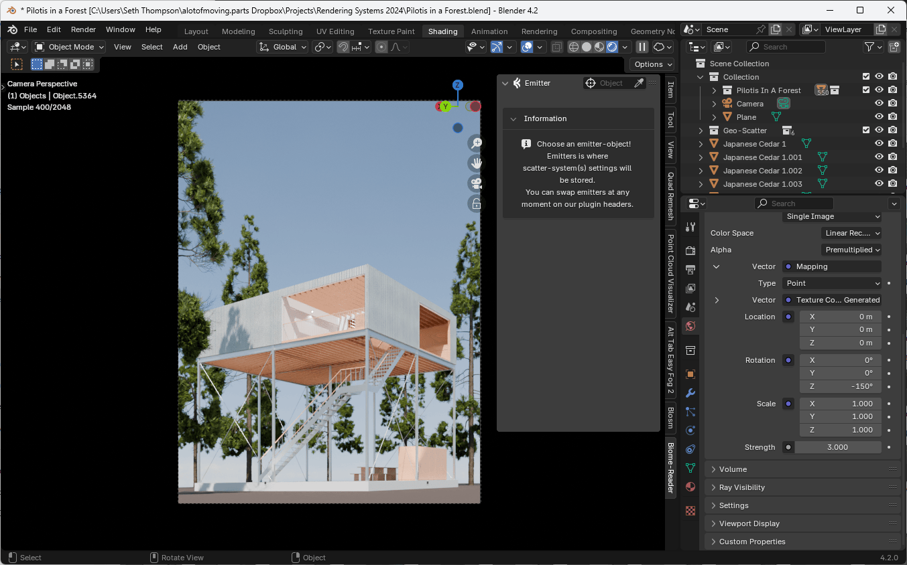
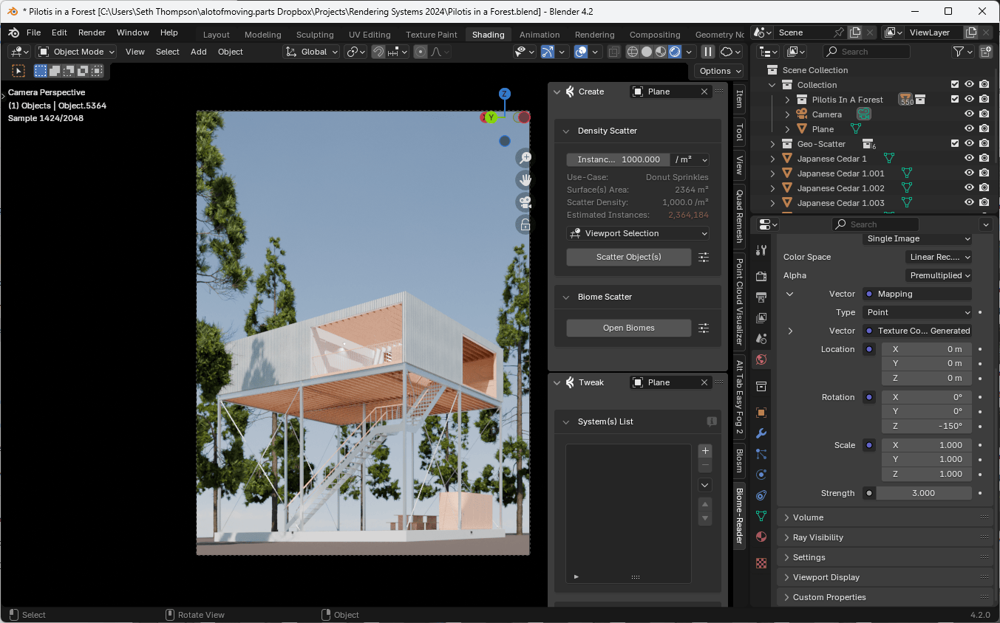
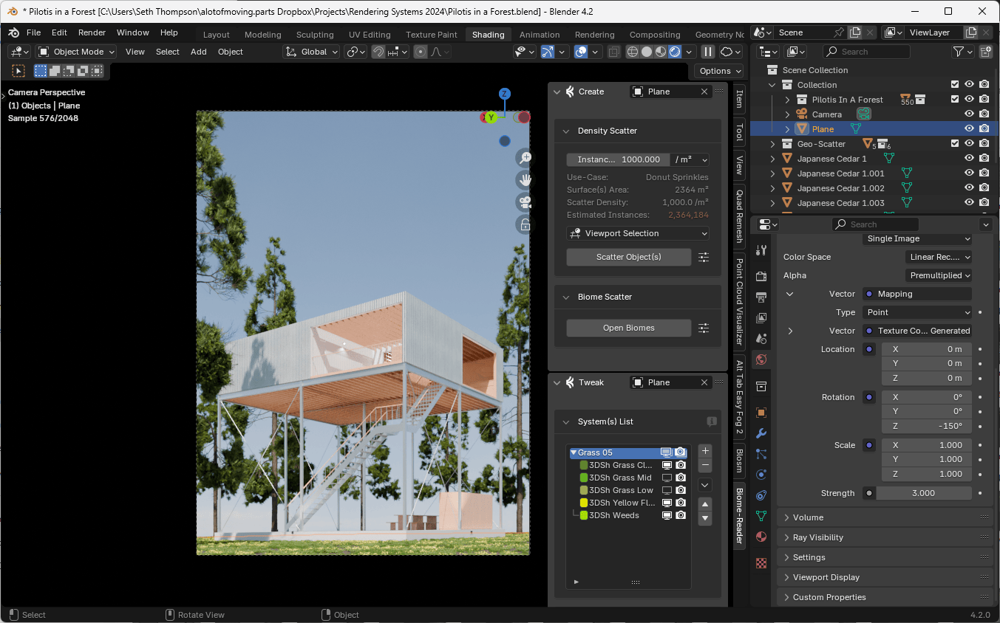
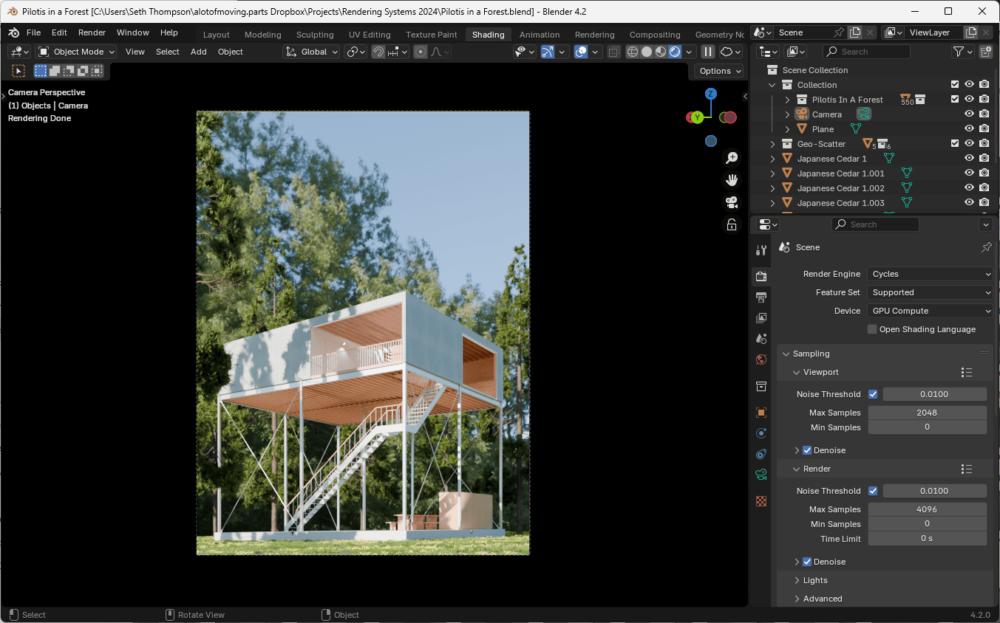

The environment, background, and details of a scene are necessary to help ground the subject in a particular context, setting, and scale. When producing renderings as critical and narrative devices, it is especially important to be intentional about constructing and depicting these elements.

This task is made particularly challenging by the fact that systems of 3D representation are particularly well-suited for depicting primitive geometric forms, and comparatively ill-suited for depicting complex natural forms.

Fortunately, we can leverage procedural authoring tools to help create the illusion of complexity, entropy, and organic growth.

You can use [Pilotis In A Forest (Environment).blend (155.1 MB ↓)](https://drive.google.com/file/d/1aOMBpknu-mUQKgjpcu4n46PONC8VfRW6/view?usp=sharing) to follow along with this tutorial.

## Vegetation

Modeling vegetation from scratch is a difficult task. For this tutorial, we will rely on the availability of a pre-made tree asset. You can also find a range of species of plants, including grasses, bushes, deciduous and evergreen trees, and plants available to download online.

If you are interested in creating your own vegetation, you can explore other computational tools that specialize in simulating natural forms, such as [The Grove](https://www.thegrove3d.com/).

Vegetation often has thousands or leaves, blades of grass, or other small elements, even in a single object like a tree. For this reason, vegetation can disproportionately increase the size of your file, the memory required to render the scene, and the time it takes to produce a render.

For this reason, renderings usually use a few individual objects, repeated with different transformations to create the illusion of complexity.

You can always hide elements of vegetation in your scene if they slow down your ability to work in the 3D viewport.

### Importing Trees

For this tutorial, we will use tree assets that you can access by downloading the following file, [Japanese Cedars.blend (167.2 MB ↓)](https://drive.google.com/file/d/1XKRvCt8catWvgcKXcanziq5yZT0a3F6K/view?usp=sharing).

Once you have downloaded a tree asset, you can import it into your scene in one of two ways:

If the asset is in .blend format:

1. Go to File > Append (or File > Link to created a linked reference to the file in the original file)
1. Navigate to your .blend file and select the Object directory
1. Position the imported object in your scene

Note: Linking a file allows you to update the original asset, and Blender will automatically update all linked copies of the asset. Appending a file creates a copy of the original asset, and changes to the original asset will not be reflected in the copy.

If the asset is in another format, such as Wavefront (.obj), FBX (.fbx), or GLTF (.glb or .gltf):

1. Go to File > Import and choose the appropriate format (e.g., glTF)
1. Select the file
2. Adjust rotation and scale if necessary using the `R` and `S` keys

### Importing Cutouts

In the far distance, you may also use 2D cutouts of trees, bushes, or other plants, to create the illusion of density without adding additional geometry to your scene.

You can find many tree cutouts on websites online, including sites such as [Meye](https://meye.dk/).

Cutouts can be imported as planes with Add > Image > Mesh Plane.

### Creating Instances (Linked Duplicates)

To create an abundance of vegetation with a small number of starting objects, you can use the Duplicate Linked command Object > Duplicate Linked (or `Alt + D`) to create a copy of the object that doesn't take any additional space or memory.

These linked copies are called "Instances" and are particularly efficient for GPU hardware rendering (which can handle thousands of instanced objects as long as they all refer to the same underlying geometry).

You can see from Blender's statistics (turn on statistics via the Viewport overlay menu in the top left of the 3D Viewport) that the number of instances doesn't change the overall polygon count or filesize of the scene.

### Manual Placement

You can place large objects, such as trees or furniture, manually, by selecting the object and using the `G` and `R` keys to move and rotate.

Rotating and scaling objects (and instances) can help hide the fact that the same tree has been duplicated multiple times.

Depending on your camera angle, you may be able to create the appearance of abundance using only a handful of objects, positioned strategically.

## Procedural Scattering

Outdoor ground surfaces are often complex biomes of different species, rocks, and other elements. A texture (even a texture with surface imperfections or variations) is often not sufficient to create a convincing representation of a natural environment.

At the same time, smaller objects, such as grasses, bushes, or rocks, are too numerous to place manually.

Procedural scattering allows us to place collections of small objects programatically across large areas, using rules and patterns to determine where and how they should be placed.

Blender has a sophisticated procedural tool called Geometry Nodes built-in. While a complete Geometry Nodes tutorial is beyond the scope of this material, you can find many tutorials online and in the [Blender documentation](https://docs.blender.org/manual/en/latest/modeling/geometry_nodes/index.html).

Instead, we will rely on a free addon called [Biome Reader](https://www.geoscatter.com/download.html) to help create procedurally scattered biomes. (The paid version, GeoScatter, has additional features that may be useful for further work.)

### Biome Reader

1. Download the Biome Reader addon from the [GeoScatter website](https://www.geoscatter.com/download.html)
1. After entering your email, you will receive a download link

### Creating an Emitter

1. Select a surface to scatter objects onto
1. Open the Biome Reader panel in the Sidebar (press `N` to open the Sidebar, then look for "Biome Reader" as a vertical tab along the right edge)
1. Select the picker tool at the top of the Biome Reader panel
1. Set the Emitter object to the surface you want to scatter objects onto

### Scattering Objects

1. Update the desired density of objects in the Emitter panel (remember the more objects you scatter, the more of an impact on your system performance and rendering time)
1. Click Open Biomes
1. Select a biome
1. Click Scatter

## Adding Abundance with an HDRi

You can also create an intentional environment for your scene by using an HDRi image with scene-specific details.

For example, instead of a pure sky, you can find an HDRi image that includes natural context appropriate for your scene, such as a forest.

Download the 2K, 4K, or 8K version of the [Meadow 2 HDRi](https://polyhaven.com/a/meadow_2) from Poly Haven and add it to the World shader, following the instructions in the Lighting module.

Note: Depending on the focal length of your camera, you may need a higher resolution HDRi image to avoid obvious pixelation. (As your focal length increases, the field of view decreases, hence the need for a higher resolution HDRi to fill the frame.)

Remember that there is no such thing as a "generic" image of a particular environment. Your HDRi will contain specific details that affect the context of your final rendering. Consider where the HDRi image was taken. Was it in a tropical environment or a temperate environment? What part of the world does it depict? What species of plants are present? Are there any man-made structures? Are they specific to a particular place or way of building? How does the inclusion of these elements affect your scene?

