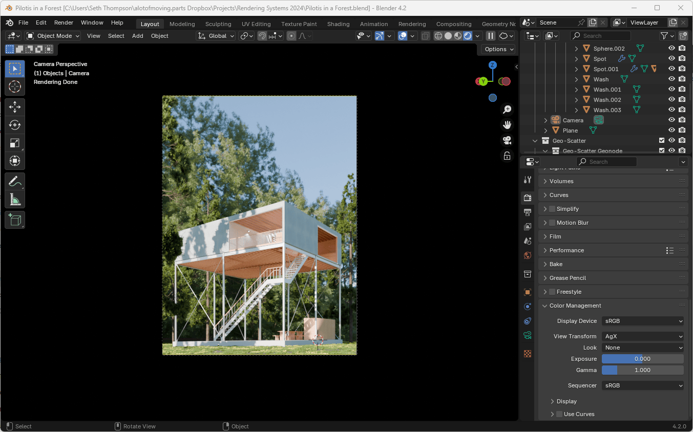
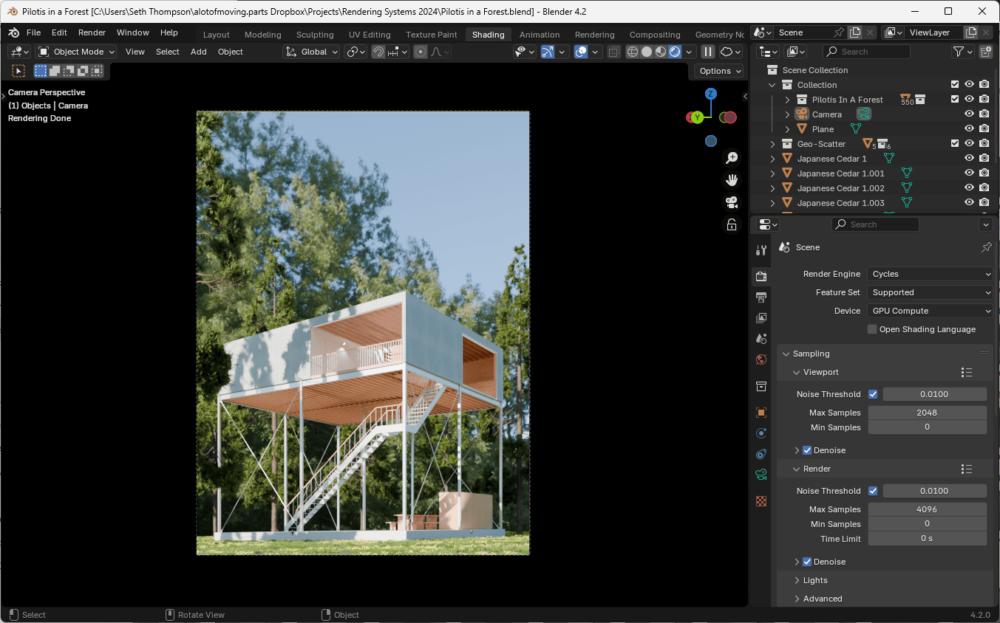
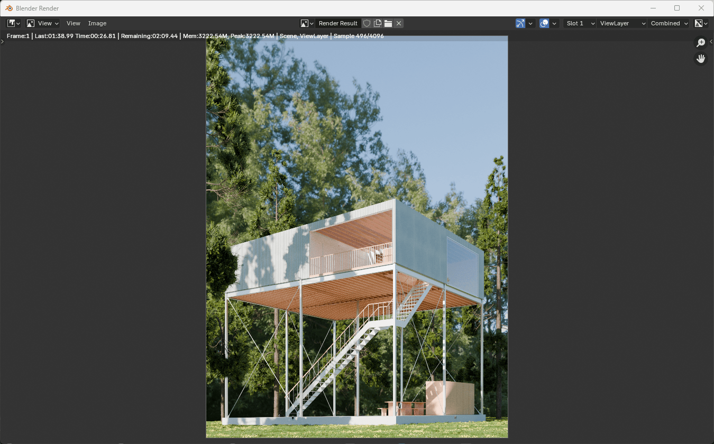
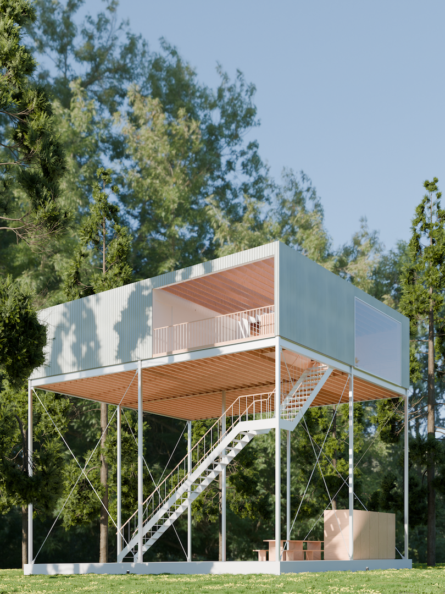

After composing your scene in the 3D Viewport, the final step is to render your image at a higher resolution and quality.

You can use [Pilotis In A Forest (Rendering).blend (402.3 MB ↓)](https://drive.google.com/file/d/16AFj6BMU-4oOydYxO4n0nnxMmXAepTef/view?usp=sharing) to follow along with this tutorial.

## Color Management

Before rendering, you should make a double check the overall exposure and color of your scene.

1. Navigate to the Render tab of the Properties panel
1. Under the "Color Management" section at the bottom of the tab, check the Exposure setting.

If your scene is too dark or too light, you can adjust the Exposure value here.

This area also controls the tonemapping and color management of your final image. You should generally keep these settings at their default values. (macOS users may need to switch the Display Device from "sRGB" to "Display P3" if they have a wide-gamut color monitor.)

The Look setting allows you to change the default contrast applied to your image. You can experiment with "High Contrast", "Punchy", or "Grayscale".

Remember that you can also adjust the color of your image after it has been rendered. Generally, it is preferable to make a more "neutral" rendering, since it allows the greatest flexibility in editing after the fact.

## Rendering Settings

1. Navigate to the Render tab of the Properties panel
1. Ensure that the Render engine is still set to Cycles
1. Under Device, choose either CPU or GPU Compute based on your hardware (GPU is usually faster if you have a dedicated GPU. On a laptop, CPU may be faster).

As a path-tracing renderer, Blender's Cycles engine progressively improves the quality of the image as it renders more and more rays, or samples, of light.

With only a few samples, the image will appear noisy and grainy. As the number of samples (and rendering time) increases, the fidelity, smoothness, and quality of the image will improve. This process is asymptotic: as the number of samples increases, the quality will continue to improve, but at a diminishing rate.

Since the number of samples that will yield a desired quality is variable depending on the arrangement of the scene, Blender offers a Noise Threshold setting, which will stop the rendering process once the noise level is below the threshold.

Genrally you can keep the default value of `0.01`, but feel free to raise this value if you would prefer a faster render, at the cost of image quality (or lower the value to increase the quality of the image at the cost of additional render time).

1. Make sure Render > Denoise is checked.

Given that path-traced images are inherently noisy unless rendered with a very high number of samples, Blender also offers the ability to use an algorithm to Denoise the image after it has been rendered.

The Denoising process is a post-processing step. It can be a helpful tool to reduce rendering times, but keep in mind that it is a lossy and imperfect process. Sometimes denoising produces undesireable artifacts or over-smoothes a rough surface. For best results, check that Denoising is set to use Albedo and Normal Passes.

## File Output

1. Navigate to the Output tab of the Properties panel
1. Set the File Path in the Output section to a directory of your choosing.
1. Change the File Format to PNG or JPEG if you don't plan to make any major adjustments to your image after rendering. Select OpenEXR if you plan to do color grading or other compositing after the fact.

Alternatively, you can skip setting up the Output settings ahead of time, and save to a different format in the Render window below.

## Render

Select Render > Render Image or press `F12` to start the render.

The render will proceed in a new window. You can not edit the original scene after you start rendering.

If you press `Esc` while rendering, the render will stop in place. (So be careful not to accidentally press `Esc` unless you want to finish the render early.)

After the render is finished, your image will be saved to the path you specified in the Output tab. If you didn't specify a path, you can also save the image manually with Image > Save.

Congratulations! You've just made your first render.

