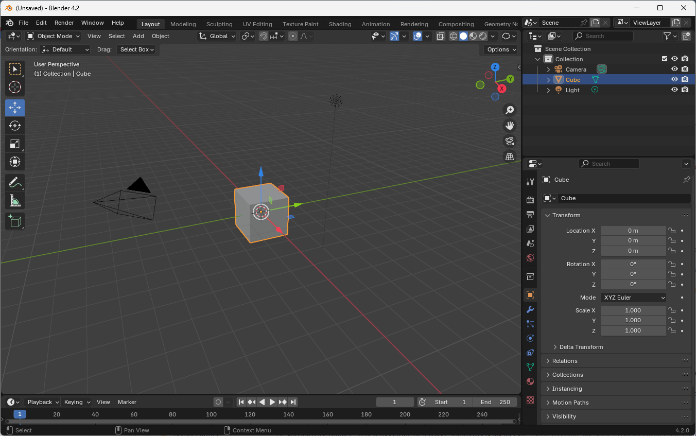

## Sequence Summary

This sequence introduces the basics of architectural rendering with Blender, an open-source application for 3D modeling, animation, and rendering. Blender can be used in a variety of ways: as a photorealistic path-tracing renderer, a realtime renderer, a procedural modeling tool, and a swiss-army knife for creating, transforming, and exporting 3D models. We will touch on a few of these use cases, but our primary focus will be on using Blender to create visualizations of the built environment.

## Beyond Photorealistic Rendering

Although Blender can be used to produce traditional photorealistic architectural renderings, we will focus on how to use the medium of rendering to experiment with the limits of perspectival representation. Our goal is not to reproduce the existing conventions of architectural photography, but to invent new ways of representing the built environment by combining light, camera projections, materials, and data in visually inventive and theoretically rigorous ways.

## Why Blender?

Blender is a free and open-source software application with a very active developer community. Its path-tracing renderer is competitive with commercial offerings like V-Ray and Corona, but it also has a realtime rendering engine that is closer in functionality to Unreal Engine or Escape. Ultimately, Blender is a flexible tool that encourages experimentation, understanding of the underlying principles of rendering, and interoperability with other tools.

Blender also has a large community of users and content creators who produce resource, tutorials, addons, and assets (many of which are free).

Most importantly for computational designers, Blender is deeply procedural, extensible with a Python API, and able to be run from the command line or in the cloud with minimal setup.

## Blender Basics

### Getting Started

*Blender 4.2 Splash Screen*

1. Download Blender from [Blender.org](https://www.blender.org/). This tutorial should be compatible with any version of Blender above 4.2.
1. Upon opening Blender, you'll see a splash screen with new artwork for each release. Click anywhere to start editing.

### The Interface

When you first open Blender, the interface can seem complex, but don't worry - there are only a few panels that you need to understand to begin working with the software.

Blender's UI consists of adjustable panels (called Areas) that can be rearranged and hidden. The tabs at the top of the screen allow you to switch between different Workspaces, or arrangements of panels suitable for different tasks. 

- Layout (default)
- Sculpting
- Texture Painting
- Shading
- Rendering
- Geometry Nodes

For now, stick with the default "Layout" view.

*3D Viewport (main window), Outliner (top right), and Properties panel (bottom right)*

The 3D Viewport (main panel) is your primary view of your scene. The Outliner (top right) displays your scene hierarchy, similar to Rhino's layers pane. The Properties panel (bottom right) shows settings for your currently selected object or element.

The Sidebar (right of the 3D viewport, press `N` or View > Sidebar to open) shows the selected object's position, rotation, and scale, along with other viewport-related tools.

The general workflow is to select objects in the outliner or 3D viewport, and then adjust their properties in the properties panel.

#### 3D Viewport

The 3D viewport is the main view that displays the scene you're creating. By default, you'll see three objects:

- A cube in the center of the screen
- A circular object with a line (point light)
- A camera (represented by a gizmo showing its position and direction)

### Basic Navigation

The 3D viewport supports the following navigation methods:

#### Orbiting

- Hold down the middle mouse button and drag
- For laptops: Hold `Alt + Left Click` and drag

#### Panning

- Hold Shift + middle mouse button and drag
- For laptops: Hold `Alt + Shift + Left Mouse Button` and drag

#### Zooming

- Scroll the mouse wheel

#### Centering View on an Object

1. Select the object
1. Go to View > Frame Selected
1. Alternatively, press the `.` key on the numpad
1. For laptops without a numpad: Press Tilde (`~`) to open the navigation shortcuts, then select "View Selected"

#### Orthographic Views

To align your view to orthographic projections:

1. Use the 3D gizmo in the top right corner
1. Or use numpad shortcuts:
   - `Numpad 1`: Front view
   - `Numpad 3`: Side view
   - `Numpad 7`: Top view
   - `Numpad 5`: Toggle between perspective and orthographic views

### Basic Operations

#### Moving Objects

1. Select the Move tool from the toolbar on the left
1. Use the gizmo arrows to move along specific axes
1. Alternatively, use the keyboard shortcut `G` (for grab)
   - After pressing `G`, move your mouse to the desired location
   - Left-click to confirm the new position
1. For precise movements:
   - Press `G` followed by `X`, `Y`, or `Z` to constrain movement to that axis
   - You can also type a number after selecting an axis for exact positioning

#### Rotating Objects

1. Select the Rotate tool from the toolbar
1. Use the gizmo to rotate around specific axes
1. Or use the keyboard shortcut `r` (for rotate)
   - Follow with `X`, `Y`, or `Z` to rotate around a specific axis
   - Double-tap an axis letter (e.g., `XX`) to rotate around the object's local axis

#### Scaling Objects

1. Select the Scale tool from the toolbar
1. Use the gizmo to scale along specific axes
1. Or use the keyboard shortcut `S` (for scale)
   - Follow with `X`, `Y`, or `Z` to scale along a specific axis

### Camera View

1. Click the camera icon in the top right corner to toggle camera view
1. Or press `Numpad 0`
1. To align the camera with your current view:
   - Position your view as desired
   - Go to View > Align View > Align Active Camera to View
   - Or use the shortcut `Ctrl + Alt + Numpad 0`

### Rendering

1. Go to Render > Render Image in the top menu
1. Or use the shortcut `F12`
1. The render will open in a new window
1. Once a render has started, you can not edit the scene until the render is complete
1. You can save the render to a file by clicking Image > Save As...
1. Alternatively, you can cancel the render by pressing `Esc` or closing the render window

We will learn more about rendering settings and techniques in a later module.

### Additional Panels

#### Outliner (Top Right)

- Displays the scene graph
- Organize objects into collections (folders)
- Toggle visibility of objects using the eye icon
- Control render visibility using the camera icon

#### Properties Panel (Bottom Right)

- Contains various panes for scene, collection, and object properties
- Grouped by scene-wide, collection, and object-specific properties

#### Sidebar (Right side of 3D Viewport)

- Access by pressing `N` or View > Sidebar
- Displays transform details of the selected object
- Useful for precise positioning and scaling

### Changing Units

1. Go to the Scene properties in the Properties panel
1. Under Units, change the Unit System (Metric or Imperial)
1. Adjust Unit Scale if needed when importing models

Practice these operations and familiarize yourself with the interface to become more comfortable with Blender's basic functionality.