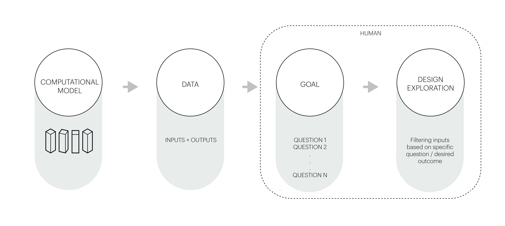

# What is a Computational Design Model?

## Module Summary

Before we jump in to building a computational design model in grasshopper we first need to understand what computational design modeling is, why it is important, and position it relative to other related terms and methods.

## Computation in Architecture

*Much of this module has been adapted from the author's own work, "Computational Urban Design: Methods and Case Studies," expected publication in 2023.*

Computation in architecture first manifested with the transition from physical to digital production with Computer Aided Modeling (CAD) and 3D modeling software. Over the past 20 years the accessibility of computer programming and parametric modeling has advanced the use of computation from what had first be focused on production to automation and generation resulting in an unprecedented level of unbridled technocratic optimism. This sequence focuses on the generation aspect of computation in architecture.

>Note:
>
>Computation in architecture and computational design modeling are much deeper areas of study then this module can cover. This module is focused introduction to terms and topics directly related to the application of computational design modeling within Grasshopper.

That technocratic optimism is due to the power of computation to generate seemingly infinite spatial configurations. With infinite possibility we should be able to solve problems not possible through human driven design right? Yes and no. A purely computational driven generative approach to design abdicates the agency of the designer's judgement and knowledge of design within the process. A computer on its own is actually pretty dumb. The real power of computational generation in architecture comes when the designer takes agency and responsibility for the design and outcome of the computational process.  

That last point may seem obvious since you are the author of any computational design process you develop and therefore have agency over it, but it is easy to think of it as the computer generating design options rather then you designing a set of instructions for the computer to execute. In other words, you are telling the computer what to do and not the other way around.

## Terminology

There is a set of remarkably similar, yet necessarily distinct vocabulary often used interchangeably in the computational design practice, usually to the detriment of the subject. Therefore, it is imperative to clarify and make precise the lexicon that will be used throughout this sequence.

`Parametric design` can be understood as designing within a set of parameters. An easy architectural example would be a parametric façade that allows the designer to vary the height, depth, and number of panels by changing a set of input variables. Simply put, a “parametric” model is: a set of inputs that can vary, a defined set of rules that interprets the inputs, and the resulting output of the rules.

`Computational design` can be understood as harnessing the power of the computer to do what it does best: compute large sets of equations to produce new data. Whereas parametric design explores the options made available by its inputs and parameters, a computational design flow returns data and analytical insights such as daylight levels, outdoor comfort, or floor areas. Simply put, a `computational design model` is a parametric model that generates new information about the performance of every design option. The collection of the design options is the `design space`.

`Generative design` focuses on producing new design possibilities. In practice, it is frequently used to mean the exploration of a subset of the design using statistical models, such as evolutionary solvers, to identify optimal design solutions. Whereas the design space of a computational design model is necessarily limited (since every option must be tested), the size of the design space of a generative design model is potentially limitless, and instead uses statistical methods to explore subsets of the design space to produce or generate unexpected results.

>Parametric Design = Defining a set of rules to manipulate geometry or data.
>
>Computation Model = Testing all options of a small design space.
>
>Generative Model = Testing some options of a large design space.

*Computational Design Model testing different block sizes.*

## Anatomy of a Computational Design Model

In this section, we outline a step-by-step process for how to generate a computation design model. It is worth noting that the process for constructing a thoughtful computational design model is slightly different from the order of its operations. The image below shows the order of execution of the model where a list of inputs feeds into a procedural model, which then generate outputs. This a general approach  established through the authors own work, however, that are ["other approaches to constructing computational design models"](https://link.springer.com/book/10.1007/978-3-642-23435-4?page=1#toc).

**1. Asking the right questions.**

The computational design process relies heavily on human intelligence. In fact, the most crucial and difficult step is to articulate the objectives and constraints of potential designs. As an intuitive example, a designer might wonder how various schemes affect one's desire to occupy the public realm on the ground plane -- a nebulous question. A central challenge to computational design is that the questions are frequently asked in a subjective manner. In this example, we shift the question in a more quantifiable direction: *how does the buildings’ height and massing affect direct sunlight to streets and parks?*

The questions asked often reflected the value of the designer and the client, so it can become a source of bias. Therefore, asking good questions is imperative to building effective computational models. It is an exercise of balancing many desired outcomes and making trade-offs. Below, we offer a list of questions that can help guide the process of framing a hypothesis.

- Does the question involve metrics that are quantifiable?
- Who benefits from this question?
- Does the question revolve around quantities that have a demonstrable correlation?
- Does it include spatial attributes to test?

>Make your own model!
>
>Try posing your own question or hypothesis so that you can sketch out a computational design model as we go through these steps. Don't worry about the scale, subject, or seriousness of your question – make it about something you know well, like your apartment, commute, or local park.

**2. Output.**

Outputs measure certain aspects of the design. After having established a question or a set of questions, the output to be measured should be evident. Defining the output further means defining details of how certain quantities will be measured. More importantly, in most design cases, the output formulation helps the designer articulate trade-offs, link form to performance, and explore scenarios among design options. Below is a list of questions to help the reader derive specific outputs from the hypothesis

- Do the outputs have units?
- Are the outputs conveyed in a format that is easily understandable?
- If the outputs are percentages, is it clear what the denominator is?
- Do the outputs link performance (or other quantifiable metrics) to form?

>Make your own model!
>
>How would you measure the outcome of your question? Or put another way are their criteria that would let you identify if met the goal of your hypothesis.

**3. Input.**

Inputs describe the design possibilities in quantitative ways. We reconsider the example question from above: *how does the buildings’ height and massing affect direct sunlight to streets and parks?* Here, there are two distinct attributes that the designer is interested in changing: (a). the height of buildings and (b). the building massing.  

The possible heights are lower bounded by the needed area and upper-bounded by, typically, a zoning envelope. However, within the range, there is an infinite number of options that can be tested. It is obviously not practical to do so. For the moment, we shall assume that the possible range of height is between 100m and 150m, and we will sample at 10-meter increments. This produces a set of six different height options to consider for testing daylight hours. With only a handful of variations, the designer could manually evaluate each option.  

What if the designer has three different massing strategies (e.g. a circular floor plan, a square one, and a hexagonal one) to test? Since height is still a variant, there are now 18 different geometries to evaluate. The image below shows the totality of these options. At this scope, quantitative evaluation is still doable manually, but it is certainly becoming cumbersome! Moreover, when we extend this example to a district master plan with just 20 buildings, the design space balloons to *18^20 = 12,748,236,216,396,078,174,437,376 options!*

It is certainly tempting, with the aid of increasing computational power, to test out thousands, if not tens-of-thousands of options or to let generative design algorithms freely explore a design space with millions of options. However, this is frequently a misuse of the intelligence of computational design. As shown in the example above, an increase in variables quickly increases the size of the overall permutation of design possibilities. However, in practice, not all options are created equal, and we can leverage this aspect to reduce the size of computational models. Techniques for reducing the design space size include testing which inputs are the most sensitive to the outputs through manual adjustment, changing step size accordingly, and identifying inputs that can be translated into procedural rules.  

>Make your own model!
>
>Now that you have a hypothesis and a way of measuring the outcome what inputs do you need to test your hypotheis?

**4. Procedural Modeling.**

Once the desired question is identified and outputs defined, a procedural model is set up to produce the geometry. At the scale of the master plan, the example from above becomes less strictly reliant on predefined inputs such as building height and floor plate type and more affected by procedural rules. Density distribution, types of park space, and the grid style all have more meaningful relationships with a typical design goal at the urban scale. For instance, the previous sections focused on individual floor types (square, circle, and hexagonal). However, how feasible a floor type can be is dependent on a variety of factors such as parcel size and relationship to other buildings. As such, it is important to determine, usually with the experience of a designer, the set of rules that define the procedural model. Rather than permutating upon floor types, the designer can set the input to be a desired total area for the geometry to be created procedurally. As a simple example shown in the figure below, given three parcel types, procedural rules determine if the lot size is:  

1. Too small to be a building and more suitable for a parklet.
2. Apt for a point tower.
3. Too large for a point tower with a reasonable floor depth and more suitable for a courtyard building with outdoor space.

In this process, procedural rules in essence define building types, and the experience of a  designer is central to the definition of said rules. With this refinement, the fixed building types used as inputs from the previous step are replaced with procedural knowledge of what building types are appropriate given use, density, and proximity to parks, etc.

>Make your own model!
>
>This one can be a bit tricky to do abstractly, but think about rules based on your own experience. For example, if you model is about your commute, a procedural rule could be that you always walk on the sunny side of the street. (This assumes that the start of your commute is an input and that the route is procedural generated) Or if it is about your apartment it could be that the bathrooms are always located off the bedroom. (This assumes that the bedrooms are an input and the bathrooms are procedurally generated.)

**5.  Data analysis to design insights.**

Designing neighborhoods and buildings requires balancing many pieces of information at the same time. Unfortunately, humans are rather bad at processing high-dimensional information. After the computational design model is finished, one is confronted with the task of making sense of the data from potentially thousands of options to make design decisions.  

Parsing trends and differences among design options become an important task. When exploring the results of a computational design model, consider the following:
1. Most often there will not be a single, optimal design solution but rather many options that perform well but have trade-offs. As you explore the results establish different scenarios, for example the priorities of different stakeholders, and filter the results for each. How does the outcome change when you have different priorities?
2. Are any outputs directly or indirectly correlated? What are the trade-offs in prioritize high values for different outputs?
3. As you sort and filter for high performance, what is the nature of the remaining values of inputs? Examine the remaining range of each input. A limited range suggests that input needs to be relatively fixed to produce the desired outcome. A large range suggests that input has little impact on the desired outcome.
4.  Based on insights from the above points, can you diagram the range of design variability that would produce the desired outcome?

>Make your own model!
>
>Without actually running out your model you don't have data and results to explore, so instead speculate on the outcome if you did.

## Assignment

Read the papers linked in the additional reading and begin to formulate your own critical position on the terms and methods that surround computational design modeling.

## Additional Resources

- ["Design Modeling Terminology"](https://archinate.files.wordpress.com/2018/06/dstasiuk-design-modeling-terminology1.pdf)
- ["How to Generate a Thousand Master Plans"](https://ui.kpf.com/simaud-2019)
- ["Computational design in architecture: Defining parametric, generative, and algorithmic design"](https://www.sciencedirect.com/science/article/pii/S2095263520300029)
