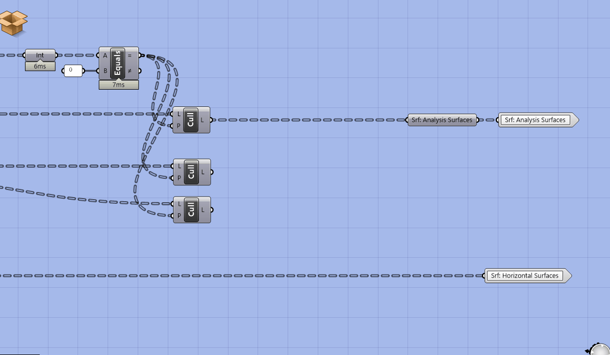

# Building Custom Analysis Tools

## Module Summary

This module introduces subdivisions techniques for surfaces and breps (solid objects.)

## Why is this important?

In the `Intro to Grasshopper` sequence the input for the view analysis tool was generated as part of the creation of the geometry of the tower and specific to that model. We need generalized subdivision tools so that we can get the proper inputs for analysis tools. By developing a standardize subdivision method (as opposed to one specific to our geometry generation) we can apply any grid based analysis to any geometry.

## Tutorial

This tutorial has three sections:

1. How to subdivide surfaces for analysis.
2. How to subdivide breps for analysis.
3. How to subdivide trimmed surfaces

### 1. How to subdivide surfaces for analysis

We are going to develop two geometry subdivision tools, one for surfaces (ie parks, streets, plazas) and one for breps (i.e. buildings.)

The core component we will be using to do subdivision of geometry is the `Isotrim` or `Sub Surface` component, which is looking for a `surface (S)` to subdivide and a `2-dimensional domain (D)` to divide the surface by. (The component is called Isotrim, so that is what you would use to search for it, but is labelled as Sub Surface so that is how we will refer to it in this module.)   

>Reminder:
>
>Make sure to continue to apply the Grasshopper best practices established in the Intro to Grasshopper sequence.

1. Create a surface in Rhino.
2. Add the surface to a `surface parameter holder` in grasshopper (right click "Select One Surface",) and label the parameter holder.
3. Copy the parameter holder,  plug the original into the copy (we need this for clustering later,) and plug into the `(S) input of SubSrf`

*Ok, yes, we want to subdivide a surface so I get that we need to input a surface, but why a 2-dimensional domain and what is that even? Can't we just input a subdivision size?*

Unfortunately not. Remember the discussion of `global vs local coordinate systems` from Deriving Spatial Data module? SubSrf is looking for us to provide the subdivision as a domain in U and V coordinates for the coordinate system of the geometry to subdivide. Luckily grasshopper has a component that does just that! Add the `Divide Domain^2` component (make sure to get the one that generates a 2-dimensional domain) and plug into the (D) input of SubSrf.

*If you plug in the output of the Divide Domain^2 component you can see the domain of local UV coordinates that is created.*

Our surface is now subdivided! That was easy and now we can move on to creating the brep subdivision tool, right? Nope. Can you spot what is wrong?

-

-

-

-

-

-

-

-

-

-

If you guessed the default subdivision values of 10 you are correct! We need dynamically generated subdivision values that maintain a target subdivision *size* regardless of the dimensions of the input geometry. If you were to input other geometry into this current definition, each would be subdivided into 100 (10x10) surfaces. For our analysis tools we need surfaces of (relatively) equal size, otherwise smaller analysis surfaces would disproportionately effect the metric output.

We are going to use the `Dimensions` component to measure the dimensions of our input surfaces and then the `Division` component to divide those dimensions by a target subdivision size. While adding these components to your definition, make sure that you maintain the correct flow of U and V from Dimension through Division and into Divide Domain. If your resulting subdivision is not even this is likely where something has gone wrong.

1. Add a panel with your target subdivision size.
2. Create an input integer parameter holder.
3. Plug "Srf: For Subdivision" into a `Dimensions` component.
4. Get two `Division` components. Plug the subdivision size into (B) and plug the (U) output from the Dimension component into (A) for one and (V) for the other.
5. Plug the two Division components into the (U) and (V) inputs of the `Divide Domain^2` component.  

>Tip:
>
>Grasshopper uses the same units as your Rhino file so it is important to understand which units a definition is assuming before applying to another Rhino file. If the example above was developing a Rhino  file in meters and you apply it to another that is in millimeters you would get 1000000x more subdivided surfaces and likely crash Rhino!

The Dimension component outputs one dimension for U and one for V. But what if you surface has parallel sides with un-equal length? In that instance you will get subdivided surfaces that range from smaller then your target subdivision size to larger, which is something we want to avoid. Take this into consideration and try and generate input surfaces with relatively even lengths of the pairs of parallel edges.

The next step is to get this tool capable of handling multiple input surfaces. Model additional surfaces in Rhino and add to your srf input parameter holder.

You'll notice that multiple surfaces it doesn't work as intended. This is because the Divide Domain component is outputting a data tree structure with a branch for each input surface compared with the flattened list of surfaces going into SubSrf, which doesn't know how to handle the mismatch in data tree structures. This has an easy fix, just graft the srf input parameter holder to get a matching data tree structure.

>Tip
>
>Definitions often behave differently for one input then it will with more then one input. Before you get too far into the development of any definition that will need to handle both conditions make sure to test to make sure that both work. If they don't, you need to identify the location where a data tree mismatch occurs and use the Path Mapper to accommodate data tree structures that work for both conditions.

Finally, make a copy of you definition, add a second output srf parameter holder and cluster the subdivision portion. Now you have an easy to re-use surface subdivision tool! (We'll use the un-clustered version to develop our brep subdivision component)

### 2. How to subdivide breps for analysis

Now we are going to adapt our surface subdivision tool to handle breps. Our tool requires surfaces so we will need extract the surfaces from breps.
1. Model a few breps (solid objects) in Rhino. (The `Box` command is the quickest way to get input geometry.)
2. Move your definition to the right on the canvas to make room.
3. Created a labeled `Brep parameter holder` and add your breps from Rhino.
4. Add a `Deconstruct Brep` component and plug the brep parameter holder into it. This deconstructs or explodes a brep into (F) Faces or surfaces, (E) Edges or lines, and (V) Vertices or points.

Our brep is now subdivided! All done, right?

Depends. Is the analysis you want to run applicable to every surface of a building? Likely not. In the case of the previous tutorial we were analyzing views, which should be applied to vertical surfaces (i.e. windows) and not horizontal surfaces. In the case of the subsequent tutorial we will be analyzing daylight, which could be applied to both vertical or horizontal surfaces but for different reasons. For example, it could be applied to vertical surfaces if the intent is to reduce heat gain during hot months or to the roof as a proxy for energy generation from photovoltaic cells. Both of those would use the same analysis (direct daylight) but different metrics. We need to separate horizontal surfaces from vertical surfaces.

Do do this we are going to evaluate the orientation of each surface based on its normal vector and use its orientation relative to the Z access to sort between the two.
1. Make some room between your initial inputs and you inputs to the surface subdivision portion of the grasshopper definition.
1. Get the `Evaluate Surface` component. (We used this before to get the normal vectors for the view analysis in the Grasshopper Intro Sequence.)
2. Now we want just the Z value of the vector. Plug the (N) normal vector output of evaluate surface into a `Deconstruct Vector` component. This outputs the X, Y and Z values of the vector.
3. We want to filter out horizonal surfaces, which point up (Z = 1) and down (Z = -1.) To catch the surfaces pointing down, plug (Z) into an `Absolute Value` component.
4. If we just wanted surfaces that were exactly horizonal, we could use an Equals component to generate a boolean pattern for any value that equals 1. However, this is pretty rigid and wouldn't account for angled roofs. Lets use a `Smaller Then` component to catch all surfaces that are primarily horizontal. Plug the output of Absolute Value into (A) and a panel with a threshold value, lets use .9 for now, in (B).
5. Now that we have a boolean pattern describing vertical surfaces (true) and horizontal surfaces (false,) we can use `Dispatch` to sort the surfaces into those two categories. Plug your surfaces (F) from Evaluate Surface into (L) and either of the outputs from Smaller then into (A.)
6. Plug output (A) of dispatch in the `Srf: For Subdivision` parameter holder. Now you have just the vertical surfaces being subdivided.
7. Make a surface parameter holder for the horizontal surfaces and add it as an output at the end of your definition. This can be used either for visualization or to subdivide for analysis.

Now that you brep subdivision tool is complete, make it into a clusters so you can easily re-use just like the surface subdivision tool.

*Subdivision of just vertical surfaces.*

### 3. How to subdivide trimmed surfaces

The two subdivision methods we have created only work for untrimmed surfaces, like those generated from boxes or extruding curves. However, it doesn't work properly on geometry with trimmed surfaces, such as when you use a boolean operation. To illustrate the issue and generate a massing with trimmed surfaces, model geometry to subtract out of your massing and use the Rhino command `Boolean Diffeence` to boolean them out. Once you do, you will need to right click on your Brep input in grasshopper and set multiple breps to input your new massings.

IsoTrim is subdividing the original, untrimmed surfaces, in this example the two spheres we booleaned out. 

Next double click on the center of your cluster to edit it. Move your outputs to the right to make room for new components.

We are going to remove (or cull) the subdivided surfaces that are not coincident with our original surfaces. To do this we need some way of measuring the distance between the original surfaces and subdivide surfaces so that we can keep the subdivide surfaces that have a distance of 0. There is no component that measures the distance between two sets of surfaces but there is one that measures the distance between points and any geometry. 

First, we need to generate the center points of our subdivided surfaces. Get an `Evaluate Surface` component. Right click on `S` and `Reparametrize'. Next plug a panel in `UV` with `{0.5, 0.5, 0}`. (Same method we used as part of the view analysis in the Intro to Grasshopper sequence.)

Next, copy over the parameter holder with the original surface (before they are subdivided.) Plug the surfaces into `G` of a `Pull Point` component and the output of the evaluate surface into `P`. Pull point returns the distance between a set of geometry and a set of points. 

Now we want to generate a boolean pattern where true is a distance of zero between the points and the surfaces. Get `equals`, run the distance values through an integer parameter holder, and plug into the equals component. *Why add the integer parameter holder?* It turns the distance values into an integer (as opposed to a string with potentially lots of decimal places) to catch very small distances that may be slightly above 0 but that are essentially coincident with our original surfaces.

Next, plug the boolean pattern into the `P` input of a `Cull` and our subdivided surfaces into `L`. This removes all of the surfaces that are not coincident with our original surfaces. However, as you can see with the example below it is not an exact match as you may have some surfaces that overlap your original geometry. However, this won’t impact the analysis. Additionally, you can adjust the subdivision resolution to get a better fit.

Copy `Cull` twice and plug in the `Points` and `Normal Vectors` from the evaluate surface. We want to output these as part of the cluster as many analysis tools (like the view one from the Intro to Grasshopper sequence) need points and normal vectors.

Next, we want to add an input for slightly moving the points off of the surfaces using the normal vector. This is for when we do an analysis (like direct sun in the next module) that needs to account for the sun blocked by our own design so that the points that get analyzed are not exactly coincident with the building. 

Get a `Move` component and plug the culled points into `G`. Next, plug the culled normal vectors into the `V` input of an `Amplitude` and a number parameter holder into the `A`. Plug the output of the amplitude into the move component and add a cluster `input` into the number parameter holder that is setting the amplitude of the vector so that we can control how far the points are moved outside of the cluster.

Add labeled parameter holders and cluster `outputs` for the new outputs.

Save and exit the cluster, add a panel input for the distance to move the points and we are all done!

## Conclusion

You'll use these two subdivision components to generate the geometric inputs for analysis tools you will develop in the next Module.

It is important to note that this subdivision technique is limited to `Untrimmed Surfaces` only. (Try plugging in a trimmed surface and you'll see why.) If you want to analyze breps that contain `Trimmed Surfaces` (which are generated with certain geometric operations such as boolean difference) you will need to develop other subdivision methods. But don't worry, you wont encounter trimmed surfaces during this sequence.  

## Assignment

Add the workflow for subdividing trimmed surfaces, moving points, and extra outputs to your cluster for subdividing surfaces.
