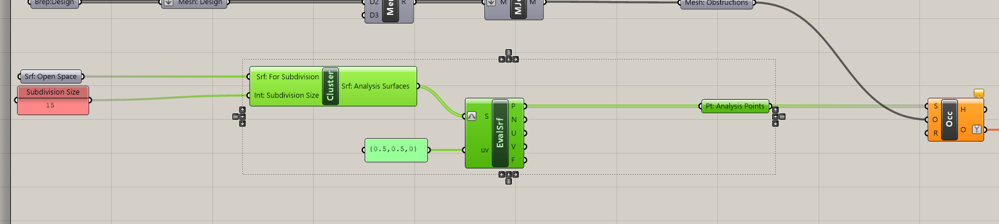
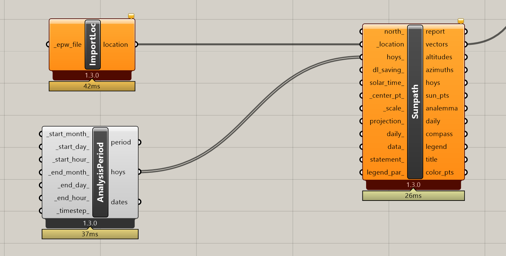

# Building Custom Analysis Tools

## Module Summary

This module expands on the methods for building custom analysis tools in Grasshopper introduced in the `Deriving Spatial Data` module in the `Intro to Grasshopper` sequence by working with Grasshopper plugins to develop a direct sun analysis tool. If you haven't done the Deriving Spatial Data module make sure to review it before diving into this one.

## Why is this important?

Refer to Deriving Spatial Data module in the Intro to Grasshopper sequence.

## Tutorial

This tutorial has two sections:

1. How to install Grasshopper plugins.
2. How to build a direct sun analysis tool.

### 1. How to install Grasshopper plugins

One of the biggest resources for Grasshopper is a very large community of people building  plugins for Grasshopper that greatly extends its functionality. The are over 700 plugins available for Grasshopper on [Food 4 Rhino](https://www.food4rhino.com/en/browse?searchText=&sort_by=its_field_downloads&items_per_page=10), from physics engines to evolutionary solvers to environmental simulation. If you are trying to do something in Grasshopper and it is not possible with native components there is likely a plugin that has the needed functionality.

While we are going to use the Ladybug plugin for this module, it has an a-typical installation process so lets install one with a typical installation to get an understanding of the process. (If you don't yet have a food 4 Rhino account, make one now.)

Let's install [Human](https://www.food4rhino.com/en/app/human), a plugin with a range of really useful components from rhino display customization to geometry generation.

Scroll down on the page till you get to the Downloads section. Food 4 Rhino does not always list plugin versions from newest to oldest so make sure to download the newest one, which may not be at the top. This will download a `.gha` file.

 Windows automatically blocks certain features of files downloaded from the internet, which can cause those definitions to not function. To prevent this right click on  human.gha file and select properties. In the lower right you should see `Unblock`. Click the box next to it and hit apply. (Not all grasshopper plugins will be blocked so if you don't see an option to unblock, that is ok.)

>Tip:
>
>If the grasshopper plugin that you download is a zip file, unblock it before unzipping. This will apply the unblocking to all the files in the zip folder preventing you from having to unblock them one by one.

Now you need to copy the plugin over to the folder that Grasshopper pulls plugins from. In grasshopper go to `File` from the top drop down menu, go to `Special Folders` and select `Components Folder`. Copy the human.gha file into the folder that opens. You will need to restart Rhino, but once you do you will now have `Human` as a tab in your Grasshopper components ribbon.

Finally, lets install Ladybug. [Download it from Food 4 Rhino](https://www.food4rhino.com/en/app/human), unzip it and follow the [instructions for installation here](https://github.com/ladybug-tools/lbt-grasshopper/wiki). What is Ladybug? From the developer: ["Ladybug performs detailed analysis of climate data to produce customized, interactive visualizations for environmentally-informed design."](https://www.ladybug.tools/ladybug.html) While we are only going to use it to get sun paths from weather files it does much, much more then that. Check out [their resources page](https://www.ladybug.tools/resource.html#ladybug) for tutorials on other features.

### 2. How to build a direct sun analysis tool: Inputs

Similar to the View Analysis tool we built in the Deriving Spatial Data module, this tool is also all about what can and cannot see -- in this case the sun. How ever instead of IsoVist Ray or Mesh Ray, `Occlusion` is going to be the core component that we will build from to create our direct sun analysis tool.

>*But wait, Ladybug comes with a sample file called "direct_sun_study.gh," why do I have to build my own version?*

>Good question! There are a couple of reasons. First, while you shouldn't replicate something that already exists, building custom tools from scratch or customizing existing tools is a really useful skill and mindset to develop. Next, Occlusion is a really good utility component to get familiar with. Finally, the Ladybug version is doing more then we need and as a result is slower then using Occlusion. At the scale of a building that time difference wouldn't matter, but at an urban scale generating hundreds of options milliseconds matter.

Occlusion is looking for:
- Sample points for testing (S). These will come from the subdivision clusters we built in the previous module.
- Obstructing geometry (O). This is the context *and* your design massings because they will also obstruct the sun.
- View rays (R) or vectors. We are going to use Ladybug to get these from weather data.

And outputs:
- Number of occluded rays per sample (H) or how many of your input vectors are blocked by obstructions.
- Occlusion topology for ever individual sample (O) or a boolean pattern where True = blocked vector and False = unblocked vector.

We'll start with the `(O)` inputs for Occlusion.

1. Model geometry in Rhino for analysis if you have not yet: Context, a design massing  and a surface for analysis (ie a park.) Refer to the module intro animation as a reference.
1. Place your obstructions (context) in a Geometry parameter holder and plug into a mesh parameter holder. If you have a complex context you may want to use the Mesh Brep component to control the size of the mesh. Flatten along the way to remove an data trees. At the end of this we want a single, joined mesh.
2. Repeat for your design massing.
3. Merge and join the context and design meshes.
4. Add a labeled parameter holder and plug into `(O) of Occlusion`.

*Context (grey,) a design massing (white,) and a suruface for analysis (green).*

 
 

Next, we will add the `(S)` input for Occlusion.

1. Input your surface for analysis (park) from rhino into the surface subdivision cluster you made in the previous tutorial.
2. Occlusion is looking of `Sample Points` so plugin the points from your subdivision cluster. *The screenshot above was generated before the point generation was added as part of the previous tutorial. No need to add it, just use the points from the cluster.*
3. Add a labeled parameter holder and plug into `(S) of Occlusion`.

Finally, we will use `Ladybug` to get the `Sun Vectors` from a `Weather File` for the dates we want to analyze direct sun. From Ladybug we will use `Sunpath` which needs a location and a date + time range to generate sun vectors. Get the `Sunpath` component and plug `Import Location` in  "\_location" and `Analysis Period` into "hoys_".

To determine the location `ImportLoc` needs an `epw` weather file. Over 2,400 hundred cities have weather files containing annual climate data that is necessary for almost all environmental analysis. The developers of Ladybug have created a [web map aggregated global weather data.](https://www.ladybug.tools/epwmap/) Use the web map to navigate to any city, download the weather data and un-zip it. We will be using the `.epw` file contained in the unzipped folder. If a city has multiple weather files available (like NYC in this example) first choose the one that has the condition most similar to the one you want to analyze. For example, we chose the Central Park weather data because we want to analyze a park in an urban condition. Next, choose a TMY3 weather file if available. TMY or [Typical Meteorological Year](https://en.wikipedia.org/wiki/Typical_meteorological_year) represents a statistical average of at least 12 years of collected weather data that represents long term trends. TMY3 is the most current TMY.

>The author of this module dabbles in environmental simulation but is not an expert. Links to resources developed by experts are provided in the additional resources section at the end if you want to dive deeper.

Next, add a `File Path` parameter holder, right click on it, select "One Existing File Location", and navigate to the epw file you just downloaded. Plug this into ImportLoc.

Now we need to set the time range or analysis period that we want to generate sun vectors. The image above may look a bit complicated, but is pretty straight forward once we break it down. While we are going to set an analysis range by picking one day per month, Ladybug can do  continuous periods, however, we need analysis tools that will run really fast for our computational design model so we will pick key days based on our goals. Depending on your goal a few days or even one day may be as good as measuring many days. For example, if your goal is making sure trees are getting enough direct sun for healthy growth, you only need the first day of the growing season for your tree species. If it is getting adequate direct sun on the first day it is guaranteed to get direct sun for the rest of the growing season as the sun is only getting higher through the growing season.

For our tool, lets pick comfortable outdoor spaces as our goal. To achieve it we need to analyze for months where direct sun makes the difference in feeling comfortable. (Ie without it you would feel too cold.) In NYC these months, often referred to as the "shoulder season" are March, April, and May. While sun is beneficial before March, it is still too cold to be comfortable even with sun and after May direct sun starts to have a negative impact on comfort.

1. Add 3, 4 and 5 to a panel, right click and select "Multiline data", and plug into an `integer` parameter holder. Plug the parameter holder into both `_start_month_` and `_end_month_`.
2. Repeat the same steps for selecting a day (just one day,) and plug into both `_start_day_` and `_end_day_`.
3. Select a start hour and plug into `_start_hour_`. Pick your hour range based on the times people would want comfortable outdoor spaces. In this example we are going to use 8am to 6pm, however, if designing in a commercial district you might just focus on lunch time.
4. Repeat the same steps for `_end_hour_`.
5. Select a time step. For Ladybug the time step needs to be an integer that evenly divides 60. It is the number of times per hour that you want sun vectors: 1 = every 60 min, 2 = every 30 min, 5 = every 12 min, etc. Start with 1 while building the tool and calibrate it once you have applied the tool to the geometry you will develop in subsequence modules. Increase the resolution as long as it doesn't dramatically slow down computation time. This will make it more sensitive for changes in form.
6. Subtract the End Hour from the Start Hour and add 1 to the result. This is the number of hours you are analyzing and will be used when we create metrics later.

Plug a `Param Viewer` into the "hoys" output to check if everything is working correctly. Your output should match the output in the image above: three branches (one day for each of the  three months) and 11 items in each branch (one vector for each of the 11 hours in your time range.)

### 3. How to build a direct sun analysis tool: Visualization

Now that we have all the inputs for Occlusion we need to process the outputs to create visualization and metrics.

We are going to use the `(O)` output from the occlusion component, which is a boolean pattern where True = blocked vector and False = unblocked vector. To create our visualization and metrics we want the % of time in direct sun for the analysis period.

1. Right click on `(O)` and simplify. This isn't strictly necessary, but removing unnecessary paths makes understanding and working with data trees easier.
2. Since we want % of time in direct sun we need to flip the boolean relationship of the output so that True = Unblocked vector. Use a `Gate Not` component to do this.
3. We need a data tree structure organized by our input points so we can create the % per point. In this example we have 160 points so what we need is 160 branches each 33 items (the number of hours tested), but what we have is 480 branches each with 11 items. The data tree structure we have is first (the 3 days tested) and then (the 160 nalysis points.) We will use the `path mapper` to manipulated the data tree to get the structure we need. Plug the output of Gate Not into a path mapper, right click, and select `null mapping`. This just seeds path mapper with the current data tree structure and doesn't do anything yet. What we need is the data tree organized by the second path, which is our points. Double click on path mapper to open the editor and change the target to `{B}`. You should now have a data tree with branches equal to the number of analysis points.

&nbsp;&nbsp;&nbsp;&nbsp;&nbsp;&nbsp;&nbsp;&nbsp;&nbsp;&nbsp;&nbsp;&nbsp;&nbsp;&nbsp;&nbsp;&nbsp;&nbsp;&nbsp; 

4. Use `Mass Addition` to add up the number of True's and `List Length` to get the total number of vectors analyzed. Use a `Division` component to divide the output of Mass Addition by the List Length to get the % of time in direct sun per analysis point. You should now have a data tree with a branch for each of your analysis points with one item in each branch.

Now that we have processed the output from Occlusion into a score, we are going to use that to create our visualization and then metrics, both in a method very similar to the Deriving Spatial Data module. For the visualization we are going to visualize number of hours of direct sun per analysis point.

1. Copy and move forward the labeled parameter holder for the `Number of Hours Tested` created previously.
2. Multiple the number of hours tested by the output of the division component. This translates `% direct sun` into `Average Direct Sun Hours` for the days tested. We could use the % metric for the visualization, however, it is useful to be able to set thresholds for both visualization and metrics based on number of hours of direct sun.
3. We are going to want a `minimum direct sun hours threshold` so that we can easily identify areas not meeting the minimum and to create a threshold based metric. Create an input panel with a minimum threshold, 3 hours is a good place to start, and plug into a labeled parameter holder.
4. Get a `Gradient` component and plug the minimum threshold into `(L0)`, a reasonable upper limit into `(L1)`, and the `Average Direct Sun Hours` into `(t)`. What is a reasonable upper limit? There are two factors you should consider in picking one. First, it should not be less then or equal to the total hours tested (11) and second, provide a reasonable range of visual variation so that has you analyze various design option the visual output is illustrating changes in performance. In this example we chose 8 hours, which is less then hours tested and has a good range of variation in the visualization.
5. Double click on the left most black circle on the gradient component to bring up the Gradient Editor. (The functionality of Gradient is explained in the Deriving Spatial Data module.) Change `Coulor Left` to be visually different from Colour Right. This will create a break in the gradient for anything not meeting the minimum direct sun hours.

6. Add `subdivided surfaces` (the output from your subdivide surfaces component) and `gradient output` into a `Preview` component. Label and group colors per documentation best practices.

Check the visual output in Rhino to make sure everything is working correctly. If it is all one color, try flipping the surfacer in Rhino. The direction of the surface need to face up, or in the positive Z direction. You can use the `dir` command to check direction and `flip` to flip if pointing the wrong way.

### 4. How to build a direct sun analysis tool: Metric

Finally, We are going to create three metrics following the methods covered in the Deriving Spatial Data module:

1. **Average Direct Sun Hours:** plug direct sun hours into `Average` and flatten.
2. **Average % of Day with Direct Sun:** plug the % direct sun into `Average` and flatten.
3. **% Above Minimum Direct Sun Threshold:** plug direct sun hours into `A` of a `Larger Then` component and the minimum direct sun hours threshold into `B`. Flatten the output (either > or >= is fine to use.) Use `Mass Addition` to add up all the true values (which are analysis points that meet or exceed the minimum threshold,) use `List Length` to get the total number of analysis points, and then divide the output of the Mass Addition by List Length to get the percent of the analysis surface above you direct sun minimum threshold.
4. Add labeled parameter holders, output panels, and colored groups.

Finally, make sure you have all the inputs and outputs of your direct sun analysis tool properly labeled and `Cluster` it so that it is easy to reuse. Make sure to keep the surface subdivision outside of the direct sun tool cluster since you will likely use it as an input for additional analysis tools.

*Complete, but unclustered definition.*

## Conclusion

Beyond the usefulness of this particular tool, this Module continues to introduce and reinforce techniques and concepts of custom tool building. This skill allows you to create tools that allow you to measure outcomes to determine if you have meet your target goals.

Additionally, environmental simulation, normally the domain of engineers, is an incredible important tool in addressing climate change and one that is easily accessible through grasshopper. This Module has barely touched on the subject of environmental simulation so check out the additional resources to learn more.

## Assignment

1. Apply this tool to a building using the building subdivision cluster from the previous Module. Create a new metric specific to daylight building performance. For example, in a climate like New York there are [months were direct sun is beneficial for reducing heating load and harmful when it increases cooling loads.](https://www.weather.gov/key/climate_heat_cool) Can you create a metric or metrics that measure for this? Do you need two different tools? (Yes!) To do so, first you'll need to identify the months were sun is beneficial (cold months) vs when it is harmful (hot months.) Next, you'll want to establish a threshold, minimum number of hours of direct sun during cold months and minimum hours of *shade* during the hot months. To determine the hours of shade delete the `Not` component we were using to invert the boolean pattern coming out of the Occlusion component.
2. Next vary the building design in Rhino and record the metric outputs. Can you identify performance trends? Are their trade-offs between building and open space performance?

## Additional Resources

- [Short video on building custom analysis tools in grasshopper.](https://www.youtube.com/watch?v=OASSPcsz8mo)
- Ladybug [resources page](https://www.ladybug.tools/resource.html#ladybug) for tutorials on other environmental simulation features.
- The Sustainability Design Lab at MIT [has resources on environmental simulation.](http://web.mit.edu/sustainabledesignlab/teaching_resources.html)
- [Edx course on sustainable design.](https://www.edx.org/course/environmental-technologies-in-buildings)
