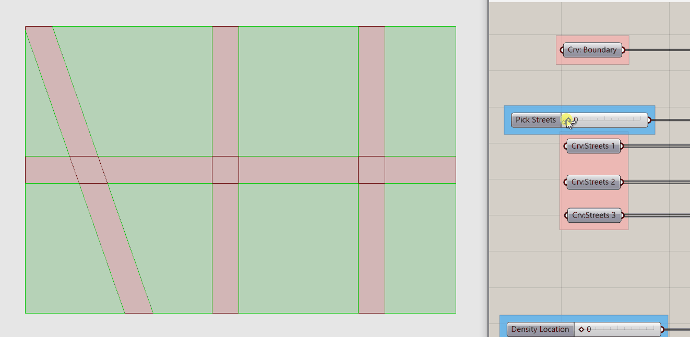

# Parametric Streets, Blocks, and Parcels


## Module Summary

As covered in the `What isa  Computational Design Model?` module a computational design model has three parts: Inputs, Procedural Modeling, and Outputs. We have our outputs, Views (from the Deriving Spatial Data module,) Direct Sun to Open Spaces for Thermal Comfort, and Direct Sun to Buildings for Heat Gain. In this module we will develop half of our inputs and procedural rules by creating parametric streets and blocks and procedurally creating parcels.

## Why is this important?

Creating inputs and procedural rules for geometry generation are a key component for a computational design model. Being thoughtful about establishing the inputs can be challenging, but is critical in generating a design space that covers a range of design variation that can answer the question you want to explore and achieve your goals.

*But wait, we are nearly half way into this Sequence and haven't established a critical question or goals?*

Great point! Lets do that now.

## Asking the right question

Lets start by refreshing ourselves on the list of questions for helping to frame a hypothesis from the `What is a Computational Design Model?` module:

- Does the question involve metrics that are quantifiable?
- Does the question revolve around quantities that have a demonstrable correlation?
- Does it include spatial attributes to vary and test?
- Who benefits from this question?

What are some questions we could use an urban scale model to explore?

"How to create more affordable housing?"

This is a great goal, but we don't have the tools to do financial modeling or background knowledge to understand the mechanisms by which affordable housing is created. However, if we reduce heat gain during the summer and increase it during the winter heating bills would go down, so this could be an option.

But we also want a question that includes spatial attributes to test, which this does not.

 "What street grid and distribution of density result in energy efficient buildings while creating comfortable outdoor spaces?"

- Does the question involve metrics that are quantifiable? *Two types of direct daylight metrics, check.*
- Does the question revolve around quantities that have a demonstrable correlation? *Comfortable spaces relative to heat gain, check.*
- Does it include spatial attributes to vary and test? *Street grids and density distribution, check.*


Now, who benefits from this question? Certainly the people occupying the buildings and open spaces. Who are some other stakeholders? How about developers (who are necessary to get the buildings built) and the city government (who would approve the project)? Would a developer benefit from our question? Not really. They don't pay for heating and cooling so unless they have a sustainability agenda may not be motivated to create energy efficient buildings. What increases the value of a development? Views! Great, we've already got a tool for that. You don't necessarily need to formulate a question that covers all stakeholders and metrics so lets add view analysis as an output but keep our question as it is. What does a city government benefit from? Most have energy reduction goals so reducing heating and cooling loads would serve to help achieve that goal.

 We've now got a question that meets our criteria for a critical hypothesis that is suited to explore with a computational design model.

## Tutorial

This tutorial has three sections:

1. Inputs
2. Parametric Street and Block Generation
3. Procedural Parcel Generation

Before we get started, install the [Decoding Spaces](https://toolbox.decodingspaces.net/download-decodingspaces-toolbox/) grasshopper plugin.

### 1. Inputs

Our question establishes our inputs: Street Grid and Density Distribution. There are two approaches to creating inputs. The first is to create them parametrically, for example having a slider that dynamically changes block size or another that rotates the street grid. The second is to manually model the geometry in Rhino and use a slider + list item to select between the options. Most often a mix, some inputs parametrically generated and some manually modeled, is best. Deciding which approach to use takes your judgement as a designer to understand the amount of variability necessary to produce a design space suited to answering your question.

```
Tip
When first starting with Grasshopper it is tempting to use it do to everything. Why would you ever model
anything manually in Rhino again when you could use Grasshopper to automate it? Creating even a simple
Grasshopper definition can be time consuming and it is not easy to include all the design variation
that you might want, which would be straight forward to model in Rhino. If you find you self struggling
to get Grasshopper to do everything you want, pause and consider if you could accomplish the same task
in Rhino.
```

We are going to use manually modeled inputs for street grids and density distribution. Why not generate them parametrically? In Rhino we can easily draw very different street grids that cover a wide range of approaches, which would be very time consuming to do parametrically in grasshopper.

In Rhino:
1. Draw a `site boundary` for your model. It should be large enough to cover a 8 - 16 city blocks -- think a small neighborhood. You can certainly go larger, but not much. If you go much larger you'll run into several issues. First, it takes much longer to run out your design space (think days rather then hours) and second, it gets harder to relate form to performance when you have hundreds of buildings instead of dozens. (This second point will become more evident when we explore the results from our design space in a subsequent module.) In this example we are using a site of 1,125 ft x 750 ft.
2. Draw `street centerlines` for three street grids. In doing so consider what you think will have an impact on the outputs? Block size? Orientation? Proportion? Regularity vs irregularity?
3. Draw three sets of geometry that represent the `focus of high density`. Buildings will have a higher density (be taller) the closer they are to this geometry. These can be any type of geometry; in this example we are using a point in the center, a line on the north edge, and two points on opposite corner.


>*Site boundary and street centerlines.*


>*Locations of density peaks.*


>*Inputs.*

4. Add the site boundary to a labeled curve parameter holder. (Right click -> select geometry)
5. Create a labeled curve parameter holder for each of the three street grids.
6. Create a slider with a range of `0 to 2`. We will use this to select between the three streets grids.
7. Add a `Stream Filter` component. Stream Filter is a really useful component that allows you to select between groups of geometry or data (ie different streams.) Plug the slider into (G), which is the index of the stream you are selecting (the numbered inputs below.) Plug in each of your street curve parameter holders into (0), (1), and (2) inputs respectively. You'll need to zoom into Stream Filter to get the `+` toggle for adding the (2) input.


8. Repeat steps 5 - 7 for the sets of density location geometry except use `Geometry Parameter Holders` instead of curve parameter holders. This is because we can use any type of geometry for the density peak. We are using points and curves, but you could also use surfaces and breps.
9. Turn on the preview for parameter holders coming out of the two Stream Filters. Move the slide for both sets of inputs to confirm that they are selecting the correct sets of geometry.


### 2. Parametric streets

Now that we have our inputs from Rhino in Grasshopper, the next step is to use the street centerlines to create blocks and streets. We are going to offset the street centerlines based on a target street width, use them to split the overall site, and then filter between blocks and streets.


We are going to work backward from `Split Surface` which is looking for a surface to split `(S)` and curves to split it with `(C)`.


1. Copy over the parameter holder for your `site boundary` and plug it into `S`. (Grasshopper will convert to a surface as long as your site boundary is a closed, planar curve.)
2. Plug your street centerlines into `C` of `Extend Curve` and a panel with a value equal to half of your target street width into `L0` and `L1`. (In the example we want a 70 ft street width so we are extending the curves by 35 ft.) We are extending the street curves so that they will extend past the site boundary when we offset them in the next step.
3. Plug the output of extend curve in `C` of an `Offset` component and graft `C` (right click -> graft.) Plug in a panel with two values, half the street with and negative half the street width, into `D`. This will offset the street on both sides equally. Make sure to right click on the panel and select `Multiline Data` so that Grasshopper knows to treat data as separate items. In this example we are using -35 and 35.
4. We could just flatten the output of the offset and use these lines to split our site boundary, however, we also need some way of sorting between streets and blocks so we are going to loft the curves first, which will be used to also filter later. To do this we need a data structure with each pair of street lines in a branch together, however, the output of offset puts each curve in its own branch. Use a `Trim Tree` component to go one level back on the data tree path to get a structure with pairs of curves in each branch. Plug the output of this into a `Loft` component.
5. Flatten the output of loft and plug it into `C` split surface.
6. As a check to make sure everything is split correctly, bake out the geometry of the split surface into Rhino. You should have surfaces for blocks, streets, and street intersections. If you get multiple or overlapping surfaces, chances are that you have a data tree issue. Make sure loft is flattened and that the trim tree is outputting the correct data structure. Use a `param viewer` to check the data tree structure at each component to check for any issues.

Next we are going to use the lofted street lines to sort between the streets and blocks by measuring the distance between the two sets of geometry. We are going to measure the distance between the loft street lines and the split surfaces. When there is a distance of 0, we know that those are the streets and can filter those out of the split surfaces. Everything that remains is a block.


1. Get the `Area` of the split surfaces to generate their center points.
2. Use `Pull Point` to get the distance between the lofted street lines (G) and center points of split surfaces (P). Pull point returns (D) the distance between the closest geometry that pulls (our lofted streets) and the input points (center of the split surfaces.)
3. The distance between the center point of the streets of the split surfaces and the lofted surfaces will be 0 since they are coincident. Use `Equals` to create a boolean pattern to dispatch between streets and blocks. Run output (D) of the pull point through an `Integer` parameter holder and input into (A) of equals. Input a panel with a value of 0 into (B.)
4. Use the output of equals to `Dispatch` the split surfaces between Streets, True = A, and Blocks, False = B.
5. Do a visual check: cycle through all street centerline inputs to make sure everything is working correctly. Add labeled parameter holders.

```
Tip
Why did we run the output of the pull point through an integer parameter holder? Shouldn't 0 = 0?
Not always. For Real numbers Grasshopper use the unit tolerance of your Rhino file which is usually
many decimal places. So while Grasshopper might show two numbers as 0, there might be slight differences
that are not visible in grasshopper that would cause Equals to not work as expected. Turning a Real (or Floating Point)
number into an Integer removes all decimal places.
```


>*Visual check to make sure everything is working properly.*


>*Overview of block & street generation with sorting*

### 3. Procedural Parcel Generation

Finally, we are going to use the `Parcels` component from `Decoding Spaces` to generate our parcels. We will use our density location inputs to procedural determine parcel size: higher density = larger parcels, lower density = smaller parcels.


The `Parcel` component needs polylines as an input so we need to rebuild our blocks to ensure that any geometry input is a  polyline:
1. `Explode` the blocks.
2. Input the (S) line segments from the explode component into (C) of `Rebuild Curve`. Input a panel with a value of 1 into (D) degree of curve. This will rebuild the input curves as polylines (which have a degree of 1.) *Why did we explode the block first?* We want to maintain the corners of our block so by exploding it we get curves for each side. Try inputting the block into the rebuild curve component without exploding.
3. Input the rebuilt curves into `Join Curve` to reform as a closed polyline.
4. Input the joined curves into `P` of the parcel component and graft the input (P.) Why graft? We are going to procedurally generate parcel width based on density location and need to make sure we match the two inputs correctly. The order of the two sets of inputs should be maintained even without grafting, however, this adds structure that will account for any changes that may occur to cause a mismatch between the two inputs.


Next we need to procedurally generate parcel size relative to density distribution. The parcel component has a target width, rather then area, so we will procedurally generate parcel widths since there is a direct correlation between width and overall size. We are going to measure the distance from our blocks to our density location geometry and remap the values to a target parcel width domain:
1. Input (V) vertices from the exploded blocks into (P) of `Pull point` and the `Geo: Density Location` into the (C.) This is the geometry you modeled in Rhino as locations of high density.
2. Pull point will return the shortest distance between each input point (P) and every input geometry (G.) If you have one piece of input geometry you get one value, if you have three you get three. We want the smallest value, ie the distance from a block to the closest piece of density location geometry. Use `Sort List` to short (D) distance and use `List Item` to get the shortest distance. (List item defaults to selecting index 0, so if you want the first item in a list you don't need to change anything.) `Flatten` the output of the list item.
3. Plug the output of list item into (V) of `Remap Numbers`. Remap needs a domain for the source values. Plug list item into `Bounds`, which creates a domain based on the minimum and maximum values in a set, and plug into (S) of remap surface. Next we need to define the domain we want to remap our distance values to, ie parcel widths. Since we want parcels closer to our density geometry to be larger, we need to a domain that goes from large to small. In this example we are using a domain of `125 to 50` as the target (T) domain to map the distance values to.
4. `Graft the Parcel Width (PWT)` input of the Parcel component and plug in the remapped values.
5. Do a visual check: cycle through all street centerline inputs to make sure everything is working correctly. Add labeled parameter holders.

To wrap up, add labeled parameter holders, colored & labeled groups, and notes. (Refer to Grasshopper Best Practices module in the Intro to Grasshopper sequence.)  Don't cluster anything yet. We will do that at the end of the next module when we complete our inputs and procedural modeling.


>*Visual check to make sure everything is working properly.*


>*Overview of completed definition. What are all those components in the upper left?* I don't remember adding those? *Correct! Those are part of the assignment.*

## Conclusion

Before building a computational design model establishing a question or hypothesis to test is critical. It provides a conceptual framework that guides the development of your model and introduces your agency into the process. Similarly, determining which inputs are manually modeled in Rhino (in our case streets and density location) vs parametrically generated in grasshopper (none so far) requires the judgement and agency of you as a designer. What is the range of design variation that is necessary to answer your question?

You'll also notice a lot of workflows repeating from previous modules and sequences: dispatching geometry & data, remapping domains, using pull point to measure distances, and trim tree to adjust data tree structures. And a theme in how we build portions of a definition. We first identify what we want to do (such as create streets and blocks,) the component that accomplishes the task (Split Surface,) and then we work backwards to generate the geometry and/or data necessary for that component. We did a similar process for the Parcels component.

In the next Module we will complete the inputs and procedural modeling by using the density location geometry to procedurally generate building types at different densities (ie heights) and introduce an input to control the degree of density variation.

## Assignment

1. Revisit the question formulated at the start of this module and revise based on your goals for an urban scale computational design model but keep it to a question that can be answered using the tools available: different types of direct daylight and views.
2. More inputs! Add two additional street centerline inputs and two additional density distribution inputs to better align with your re-formulated question. Think about neighborhoods you know that work well. What sort of street grid and density distribution do they have?
3. *My visualization doesn't look nearly as good as the intro animation. What's up with that?!* Taking the additional time to make the output of you model visually clear helps yours and others ability to easily understand the results and link performance to form. Create a custom preview for the streets, parcels, and parcel outlines. Offset and fillet the blocks to create sidewalks. You'll need to strategically move up some of the geometry to avoid overlapping geometry. Edges of meshed geometry do not show up in a custom preview so if you don't want to visualize the edges or want to give them a different color from the solid geometry, mesh them before visualizing. Example visualization set up below.  


## Additional Resources
- [Wikipedia article on street grids.](https://en.wikipedia.org/wiki/Grid_plan) Useful overview of street grid types, sizes, and orientations.
