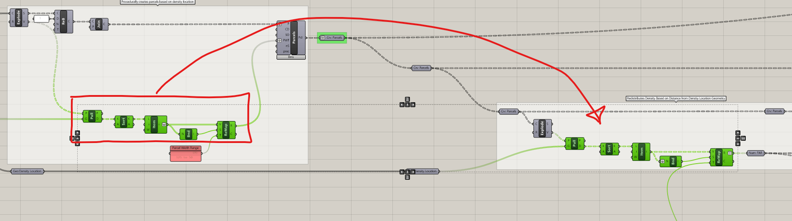
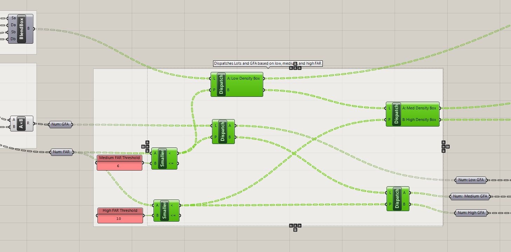

# Procedural Density and Building Types


## Module Summary

In this module we will complete the inputs and procedural modeling portion of your Computational Design Model by using the density location geometry to procedurally generate building types at different densities (ie heights) and introduce an input to control the degree of density variation.

## Why is this important?

This modules expands on the concepts and techniques cover in the previous section with a focus on developing the procedural generation. Again we will need to be critical about what inputs we design manually in Rhino vs parametrically in Grasshopper. Finally, this module is important because it further reinforces your agency as a designer in the design of building types to be mapped within your parametric street grid.

## Tutorial

This tutorial has five sections:

1. Procedurally generating building density based on the density location geometry.
2. Turn parcels into "Boxes."
3. Sorting between low, medium and high density parcel "Boxes."
4. Design and Prep Building Types.
5. Morphing manually designed building types into low, medium, high density "Boxes."


This module uses `Box Morph` to Morph or Map source geometry (buildings we design in Rhino) into the parcels we developed in the previous module. The basic workflow is very straight forward (as pictured above.) Box morph is looking for `Geometry to Morph (G)`, a `Source Box (R)` which is generated using `Bounding Box` (right click in the center and change to `Union Box`,) and a `Target Box (T)` to morph the source geometry into, most often generated by using `Blend Box` to create a box between two surfaces. In the example above we subdivided two lofted surfaces to make blended boxes as our target.

This process is conceptual similar to the remapping of numbers from a source domain to a target domain, but in this case remapping (or morphing) geometry from a 3D source domain (a box around geometry) to a 3D target domain (a collection of boxes).


>*Complete definition.*

This Module builds off of the previous one and has a number of parts making it potentially confusing to follow where everything is located on the Grasshopper canvas. Take a movement to review the completed definition above, specifically where this module picks up and the sequence of the tutorial.

### 1. Procedurally Generating Density

First, make sure that the parameter holder for the parcels generated in the previous module is grafted.

We are going to procedurally generate building density based on the distance from each parcel to the density location geometry. We will use the exact same set of components that we used to procedurally generate the parcel widths from the previous module. Copy the components highlighted in red below. `Explode` the parcel curves and plug the `Vertices` in `(P) Pull Point`.




Next, we need to translate the FAR into the gross floor area we want for each building.
1. Get the `Area` of the Parcels.
2. `Multiply` the area (A) by the `Num: FAR`.
3. Add labeled parameter holders.


In the previous module we used a static domain to map the distance values to parcel widths. We are now going to create a dynamic domain to map the distance values to building density to control how much overall density variation from none (flat or even density) to a sloping of density from low to high. First, establish the inputs that will control the dynamic density distribution:
1. Make a panel with the overall average density or FAR for your model. FAR or Floor Area Ratio is the ratio of Build Area to Parcel Area and is a common unit used to describe and regulate density. `FAR = Building Area / Parcel Area`. In this example we are using an average FAR of 8. See the table below for the FAR of different neighborhoods in New York.
2. Make a panel with 5 values that will represent the amount of density variation on a scale where 0 = even distribution to 1 = a density range that goes from 0 FAR to 2x your target FAR. Pick values between 0 and 1 (but not 0 and 1.) Make sure to right click on the panel and select `Multiline`. This might seem confusing now, but will be clear once this is built out and you can move the slide and see the result.
3. Make a slider with a range of `0 < 0 < 4`. Plug the slider into (i) of `List Item` and the Density Distribution values into (L.)
4. Add labeled parameter holders and colored panels as you go. Copy the `Num: Avg FAR` and `Num: Density Distribution` parameter holders over to where you are remapping distances to densities.


New York FAR examples:

| Neighborhood      | FAR |
| ----------- | -----------: |
| Greenwich Village      |  5.3       |
| Tribeca   | 7.0        |
| Upper East Side   |  7.1        |
| Flatiron   | 8.0        |
| Financial District   | 18.0        |


Next we are going to use the Density Distribution Factor to create the FAR domain that we will remap the distance values to. The domain will center on the Average FAR value (in the example 8) and as the factor increases we will expand the range of the domain to get more variation. Ex from a domain of 7 to 9 FAR to a domain of 2 to 14 FAR.
1. `Add` 1 to the Density Distribution Factor.
2. `Subtract` 1 from the Density Distribution Factor.
3. `Multiply` the above outputs by the Average FAR.
4. Input the larger of the two values into `A` of a `Domain` component and the smaller of the two values into `B`. Why do we want a domain that goes larger to small? Because we want density to higher the closer a parcels is to our density location geometry.
5. Input the domain into `(T)` of the `Remap` component.


### 2. Turn Parcels into "Boxes"

Next, we are going to turn our Parcels into "Boxes" that will describe the 3D space we want to morph our manually model building types into.


This step is very straight forward:
1. `Move` the parcels in the Z direction using a `Unit Z` component by any distance. The initial size of the box doesn't matter as we will scale our buildings using our procedurally generated density after we morph the buildings into the target Boxes.
2. Get a `BlendBox` component and plug the parcels into `Sa` and `Da`, and the moved parcels into `Sb` and `Db`

```
Note
For some reason there is no parameter holder for Boxes. (The "Box" parameter holder puts a box around the
input box rather then maintaining the input box.) This is one of the few times where we wont be introducing labeled
parameter holders. Instead we will be labeling outputs and inputs of the components that we are passing the boxes through.
```

### 3. Sorting Between Low, Medium and High Density Parcel "Boxes"

Next, we are going to establish thresholds between low and medium, and medium and high density that we will use to sort our source boxes and target density values by.




1. Create a panel with a medium density threshold (lower then the average density) and a panel with a high density threshold (higher then the average density.) Once you complete this sequence you will want to vary the density distribution, density location, and street grid inputs to help calibrate these thresholds. In this example we are using 6 for the threshold between low and medium and 10 for the threshold between medium and high.
2. Plug `Num: FAR` into (A) of `Smaller Then` and the medium density threshold panel into (B)
3. Repeat the above step for the high density threshold panel.
4. You are going to do two sets of `Dispatches` using the two boolean patterns you just created. Plug the parcels into `(L) Dispatch` and the medium density threshold boolean into `(P)`. Right click on the (A) output and label as `A: Low Density Box`. The parcels should be grafted at this point, so if they are not, graft them now.
5. Plug the (B) output into another `Dispatch` and label the two outputs as `A: Medium Density Box` and `B: High Density Box`.
6. Dispatch `Num: GFA` in the same way (steps 4 and 5) but end with labeled parameters instead of changing the name of the outputs.


*Both `Num: FAR` and `Num: GFA` should be grafted lists. If there is an issue with the dispatching of the various items, double check to make sure both of these values are grafted.*

### 4. Design and Prep Building Types

Model low, medium, and high density building types in Rhino. Make sure to include a parcel boundary. We'll need that to properly establish our source boxes. Don't make the buildings complicated, started with extruded boxes. Do not union the buildings. Doing so will create trimmed surfaces, which our subdivision tool cannot subdivide.

Place each building and parcel into a labeled `Geo` parameter holders.


1. Copy over the geo parameter holders for each building to be vertically in line with the components from the previous step.
2. Plug each building geometry (including the parcel) into a `Bounding Box` component. Bounding box will default to creating a box for each individual geometry, however, we want one box that encompasses all the geometry. Right click on the center of the component and select `Union Box`. Label the top output to reflect the building type box
3. We needed the parcel geometry to generate our source boxes, however, we don't want to include it in the geometry we morph so we need to remove it. Use the `Sort By Type` component (included with the Human plugin which we installed two modules ago) to get just the `Breps` and place in a labeled parameter holder.


### 5. Mapping Building Types by Density

Finally, we are going to morph our buildings into our parcel boxes and scale them to the target GFA per parcel generated previously. The trickiest part here will be making sure everything is plugged in correctly. We are going to start with the low density buildings. Once you complete the below steps you will copy and repeat for the other two building types.


1. Get a `Box Morph` component (finally!!) and plug in your low density building geometry into `(G)`, the source box into `(R)` (this is the bounding box around the manually modeled Rhino geometry,) and the target low density box into `(T)` (this is the one we sorted in step 3.) Take a look at Rhino, you should see all of the parcels below your medium density threshold are now populated by your low density building type. *If you don't see any, don't panic!* It could be that you don't have any parcels actually below the threshold. Adjust the `Density Distribution Factor Slider` to select the highest value, likely 0.9 if you are matching this tutorial. This should ensure that you have parcels in each of the three density categories.
2. Next we are going to scale the buildings to meet the GFA we procedurally generated and sorted in step 3. Use `Scale NU`, which allows you to scale geometry non-uniformly in any direction, in our case up or `global Z`. Plug the output `G` of the Box Morph into `G` of Scale NU.
3. Now we need to calculate how much we need to scale the buildings to match the target gross floor area (GFA.) We are going to scale the buildings by the ratio of their volume to the volume of a building with our target GFA. Plug the output `G` of the Box Morph into `G` of `Volume`.
4. Plug volume into `Mass Addition` since we need to have the total volume for each building, rather then the volume for each part of the building.
5. Now we need to calculate the volume we want to match. To do this we need to multiply the target GFA, `Num: Low GFA`, by a typical floor to floor height, in this case 12. Volume is 3-dimenionsal: length x width x height. GFA is 2-dimentional, length x width, multiplying by a typical floor to floor introduces the third dimension and gets us to a volume to match.
6. `Divide` the target low volume by the volume of your morphed geometry and plug the output into `(Z)` of Scale NU.
7. To check to make sure it worked correctly, get the `volume` of the scale geometry and compare with the volume generated by multiplying the target GFA for the floor to floor height
8. Copy the above sequence of components twice and apply to the medium and high density inputs. It can be easy to plug in the wrong inputs, especially when we can't but the boxes in a labeled parameter holder, so be careful and patient. Refence the second and third images below to help get everything plugged in correctly.
9. Input the three scaled building types into a `Merge` component and add a labeled parameter holder

```
Note
Floor to floor heights typically vary by program and when a building was built. Floor to floor heights are primarily a function of two items:
1. Distance between elevator core to exterior. The further the distance the deeper the structure required to span.
2. Mechanical system needs. Programs with high occupancy or need to exchange air more quickly (like hospitals) need deeper ducts.

Here are some typical floor to floor heights by program for contemporary buildings:
 - Ground floor or retail:    18 ft
 - Office:                    14 ft
 - Hotel (rooms):             10 ft
 - Hotel (amenities):         20 ft
 - Residential (rental):      10 ft
 - Residential (condo):       12 ft
 - Residential (amenities):   20 ft
 - Manufacturing or Hospital  20 ft       
Contemporary can and do vary from those listed above, but this is a good starting point.
```


**Limitations with Box Morph**

You might have already noticed that some of your morphed geometry is exceeding the parcel boundaries. This is because blend box requires relatively orthogonal grids in order to create boxes that exactly match the parcels. You may need to adjust your street grid inputs to avoid creating buildings that extend past the parcel boundaries. Review the images below for grids that work incorrectly and correctly. Curved streets in particular don't work will with this method. Below are two examples of grids that don't work and one that works.


**Check to make sure everything is working correctly**

Vary each input slider and visually check the results in Rhino. Do you have lots of overlapping or missing geometry? If so, something is likely not working properly. It is likely one of two issues:
1. Mismatch between data tree structures at some point, or
2. Something is plugged into the wrong component.
To trouble shoot both, start at the end of your definition and use `Param Viewer` to track data structures backward through the definition to identify where a mismatch first occurs. (At the end you should have a number of branches equal to the number of parcels.) Turn off the visualization of the final, merged buildings and as you work backward visualize components one at a time to narrow down where the issue may be. For example, visualize the `Non-Uniform Scale` of the building types one at a time. Click on or select components to highlight connections and make sure that the inputs and outputs are correct. Finally, refer to this [completed definition](definitions/5-5_Buildings_Density.gh) to help trouble shoot.


## Conclusion


We've now built a pretty complex grasshopper model and embedded a lot of assumptions and as a result our own bias into the inputs and procedural rules. This is inevitable in the creation of computational design models so we need check our own bias through asking questions like, "Who is this benefiting?", document what is assumed, for example decisions for pairing which building types with which densities, and expose the limitations of the model overall, for example the limitations of box morph or the analysis tools. It is as important to be clear and state what your model *does not do* as it is state what your model does do. For example, our model cannot use curved streets or street grids with angles far off 90 degrees. All of this takes your agency and requires you to be critical of the models you develop. Learning new techniques while also being this critical of the methods may seem like too much, "Just let me learn grasshopper first please!" but doing both now will only make your work better.

## Assignment

Now that you have the inputs and procedural generation portions of your computational design model complete it is time to make sure that you are getting a range of design variability that will allow you to properly explore your question or hypothesis. Vary each input slider and make sure that each is producing urban design options that have a difference that will make a difference for your question. For example, will the street grids or density location geometry produce meaningfully different performance in daylight to open spaces? Are your building types going to produce differences in views relative to density variation? Revise and calibrate your inputs. We will repeat this process again in the final two modules. Evaluating your model and iteratively revising your inputs is an important process in developing an effective computational design model.
