# Putting Everything Together
### ***Troubleshooting when everything breaks***

<Br>


## Module Summary

In this module we are going to pull all the pieces of our computational design model together by applying our analysis tools to our inputs and procedural model.

While this all may seem simple, "I'm just putting together all the pieces I've already built," a lot can go wrong, especially with data trees. Introducing concepts and techniques for troubleshooting grasshopper will be the primary focus of this module

## Why is this important?

Learning how to troubleshoot you definition when it is not working correctly is an incredibly important skill to develop.

## Tutorial

This tutorial has four sections:

1. Clean up and cluster inputs and procedural model.
2. Apply Daylight Analysis to Streets.
3. Apply Daylight Analysis to Buildings.
4. Apply View Analysis to Streets.

The majority of this module is applying our previously built analysis tools one by one to our procedural model and troubleshooting along they way. One issue that you will notice is that none of our tools initial work once applied. This is because the data tree structure in our procedural model is different from the data tree structure of grasshopper definitions where we originally made these tools. This is very common and you should not be surprised, and even expect, to run into data tree issues when combining multiple grasshopper definitions. However, as we address the data tree issues for this new structure, it will make each analysis tool more robust and reduce the chance that that this will happen in the future.

At each step of this process you should be reviewing the visual output of each analysis as you apply them. Does the visual output make sense relative to what is being measured? It can be easy to just assume that the analysis is correct if you are getting color variation in the output and move on, however, really examine it first. Is there the most sun where you would expect it? Are there open views where their are few obstructions?


>*Complete definition.*


### 1. Clean Up Inputs and Procedural Model

Before we start applying our analysis tools we need to clean up and cluster our inputs and procedural model. To start we are going to pull out all of the inputs that we have through out our definition.

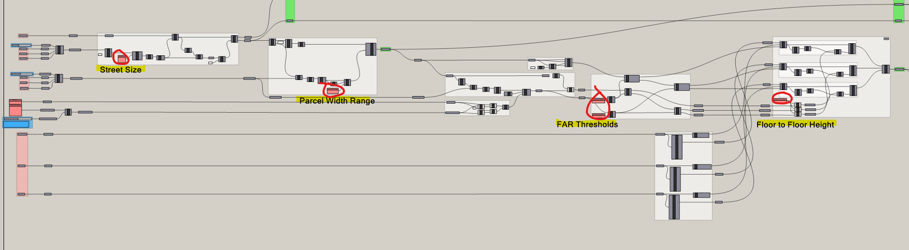

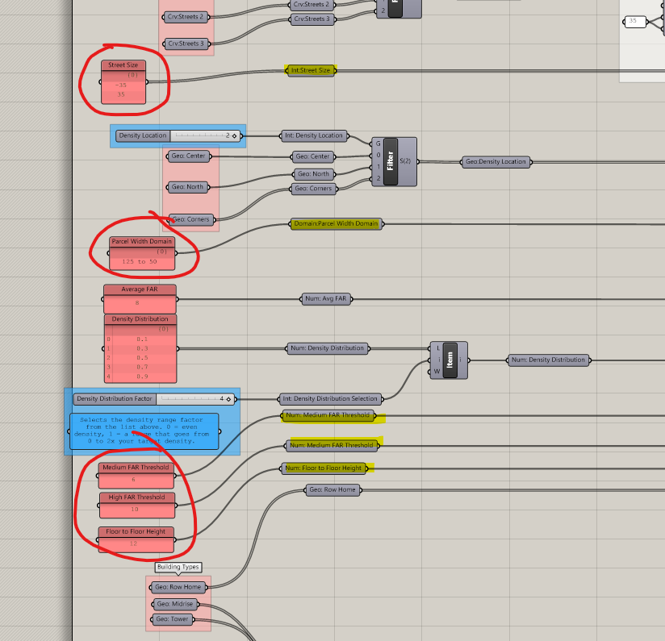

1. Move the inputs for Street Size, Parcel Width Range, Medium FAR Threshold, High FAR Threshold, and Floor to Floor Height to the left side of the canvas to be in vertical alignment with the other inputs.
2. Add intermediate, labeled parameter holders for each. They should be in a straight line with the components they are connected to on the right, but don't worry about keeping straight lines with the input on the left. Once we cluster this visual connection goes away.

Next we are going to create two clusters, one for the street grid, and one for the buildings. Why not one? You certainly could make one cluster and it would clean up the final definition. However, by making two it easily allows you to copy the street cluster over to a new definition and generate buildings in an entirely new method.

```
Tip
Reusability is one reason to have multiple clusters. Separating out computationally heavy processes is another.
For example, if you had a particularly heavy analysis tool, you may not want to make it one cluster. Why not?
Any edit or change will trigger it to solve and disrupt your work. If you cluster the analysis separately from the
visualization and metric generation your could adjust inputs like threshold and epw files or gradient colors with waiting
for the analysis to solve each time you make a change. In our case, each analysis solves quickly enough that we do not
need to separate them.
```

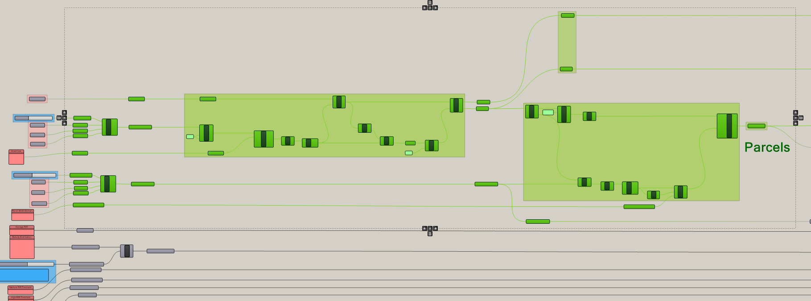

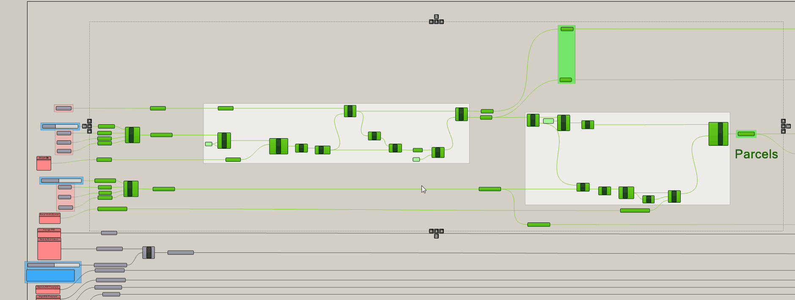

3. Next, select all of the portions of the street grid to cluster. These should include the labeled parameter holders at the start and end of the sequence but exclude the initial inputs on the left. Once selected either `right click` or `middle mouse wheel click` and select `Cluster`.
4. Right click on the center of your new cluster and label it "Street Grid."

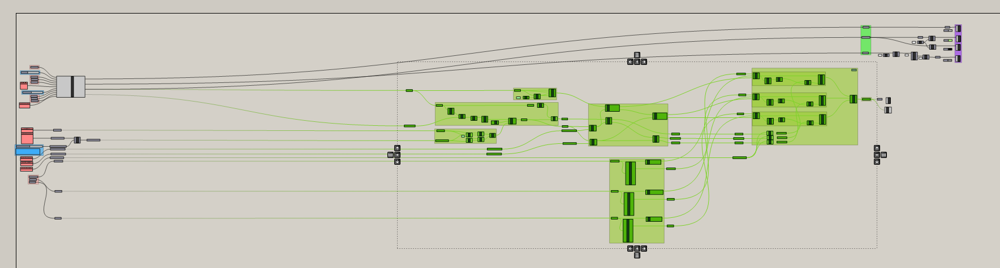


5. Finally, repeat the same process for the building generation portion of the definition. Move clusters and outputs next to inputs.

### 2. Daylight to Streets
<Br>

**THIS IS REALLY IMPORTANT**

When combining grasshopper definitions it is very common to have a mis-match in data tree structures that can result in a very long computation time or even cause Rhino to crash. Before starting to put everything together, save you grasshopper definition!

Next, in this situation or in others where you are making multiple connections at once, lock the solver (right click or middle mouse click) before you start and unlock only after everything is plugged in. Doing this has two benefits. First, it keeps grasshopper from solving in between each change -- saving you time, and second, it prevents a potential data tree structure mismatch from occurring during the process.


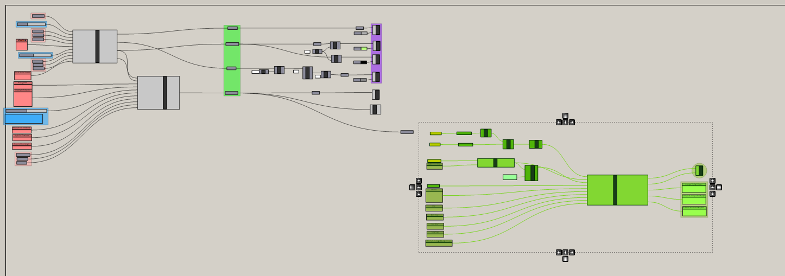
>*Daylight definition from "Analysis Tools" module.*

Now we are ready to start applying our previously developing spatial analysis tools (daylight and views) to our parametric urban design model.
1. Start by copying over you Daylight Analysis definition and placing it to the right of the geometry generation.
2. `Save` and `Lock the solver`!
3. Plug in the `Buildings` (output from geometry generation to the left) into the `Brep: Design` input and your `Streets` into `Srf: Open Space` input. Currently we don't have a context so we've `Disabled` this input.
4. Change the input of `Subdivision Size` to a value that will run quickly. In this example we are using 15 ft. This is so that if something goes wrong grasshopper will solve quickly making  troubleshooting easier. In the next module we will increase the resolution.
5. `Unlock the Solver`

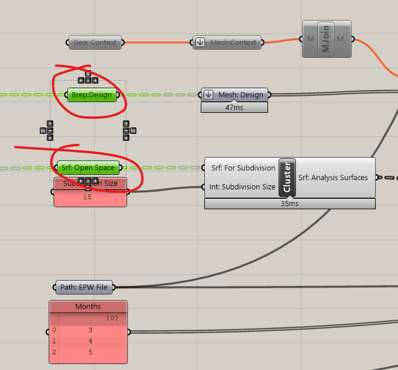

Take a look at the visual output in Rhino. Does it look similar to the image below? There are two issues that immediately jump out. First, the subdivision covers the full extent of our site rather then just the streets. This is because our subdivision works on `untrimmed surfaces` and out streets are `trimmed surfaces` of the overall site boundary. Second, it is all one color. If working correctly we would see variation. This is likely because of a `data tree issue`.

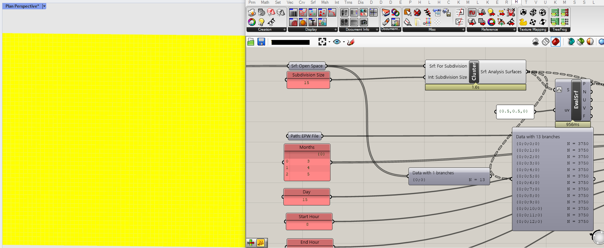

Lets start by rebuilding the streets:
1. `Explode Curve` the streets.
2. Input the `Segments (S)` into a `Join Curve`.
3. Input the joined curves into a `Boundary Surface` to turn back into surfaces.
4. Add a labeled parameter holder and plug into `Srf: Open Space`
This process effectively removes the history of the surface generation from the original site boundary. Often times exploding geometry and then rebuilding it through joining curves (as in our case) or lofting is the solution to similar issues.

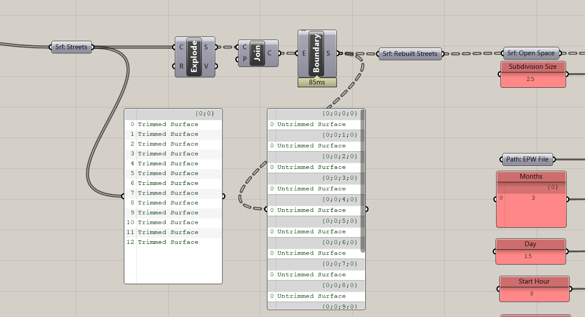
>*Trimmed surfaces come in but they don't come out.*

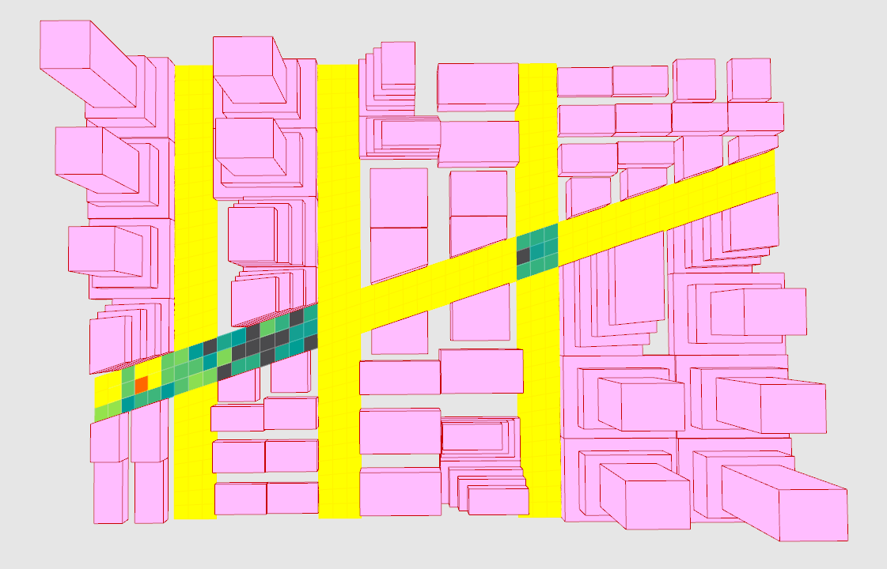

Take a look at the visual output. Does it look correct? Are areas you would expect to get more direct daylight getting it? In our case (above) we are now starting to get some color variation but the results don't make sense. We would expect to see red (most sun) at intersections or adjacent to low density buildings. When you see incorrect visualization like this it is almost always a data tree issue.
5. Double click to the center of the daylight cluster to edit it.

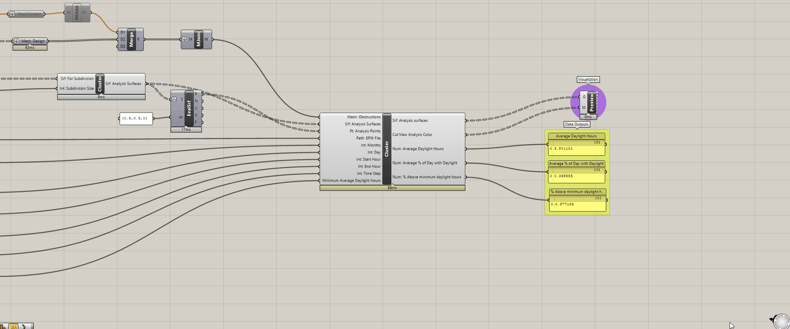

6. Similar to the troubleshooting advice in the previous module we are going start at the end of the definition and use `Param Viewer` to track data structures backward to identify where a mismatch first occurs. Plug a param viewer into the Analysis Surface and View Analysis Color outputs. They should match, have a list length equal to the number of analysis points, and be grafted (one item in each branch.) In our example we have one with 396 branches and one with 57.

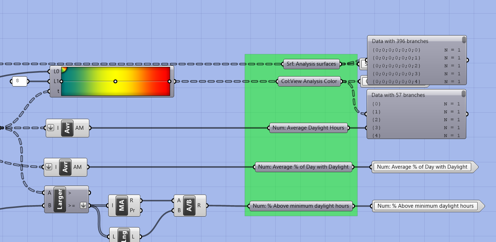

7. Move backward through the cluster comparing data trees using the Param Viewer. In this example the analysis points are coming in with 13 branches, one for each street segment. In the previous development of this daylight analysis tool we only had a single input surface. Moving from one input to more then one input will change the data tree structure and will cause a definition that was working in one context to fail in another.

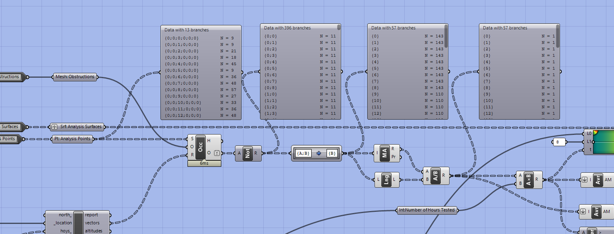

8. The input data tree structure is pretty complicated. Right click on the input analysis point parameter holder and `Simplify` it. Simplifying has removed extraneous paths, making it easier to understand the structure, but now we are not getting an output from the `Path Mapper`. This is because it is looking for an `{A;B}` data tree structure but is receive an `{A;B;C}` structure, which we have not provided have instructions on how to map.

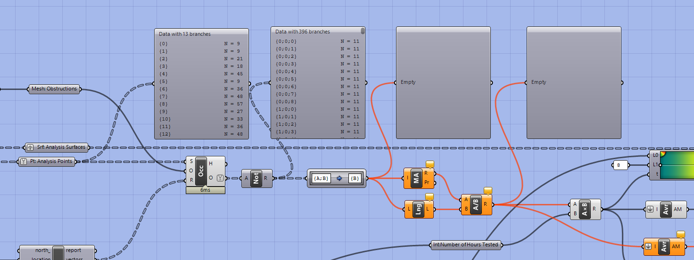

9. In this instance there are a couple fixes to consider. First, is to add a row to the path mapper to accept the new data tree structure, ie `{A;B;C}`. Second, is to graft the input (this should be the last one to try). Finally, is to flatten the input. Which should we try in this instance? Flattening is the easiest, but isn't a solution if you need to maintain the tree structure. Luckily in this instance we don't care about maintaining the data tree structure, so lets flatten! In this case we don't need to try those other options, however, we may need to at some point. (Foreshadowing!)

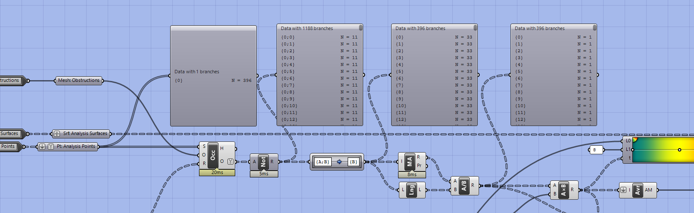

10. Exit the cluster and do a visual check of the output. Does it look correct? Are areas you would expect to get more sun getting more sun? Yes? Fantastic!

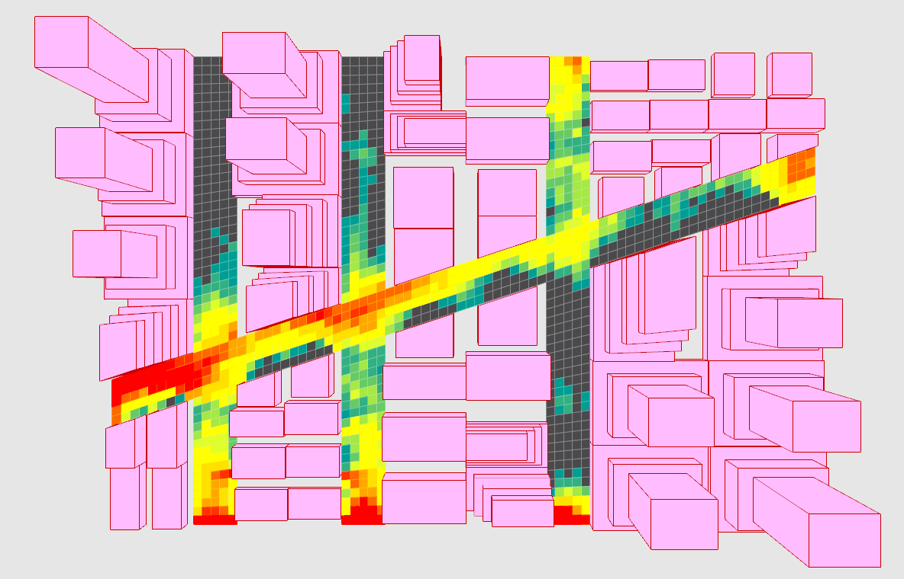


### 3. Daylight to Buildings

*One analysis tool down, two to go!*

Now we are going to apply the direct daylight tool to the buildings. This was the assignment for the Building Custom Analysis Tools module, however, in case you didn't get through it, we will go through the process now.

1. Copy over the Building Subdivision Cluster you developed previously and input your buildings.
2. Adjust the subdivision size to be a large value. In this example we are going to use 24 ft, but that still generates nearly 5,000 analysis surfaces so you may consider using a larger value as you work through this module to keep computation time down.

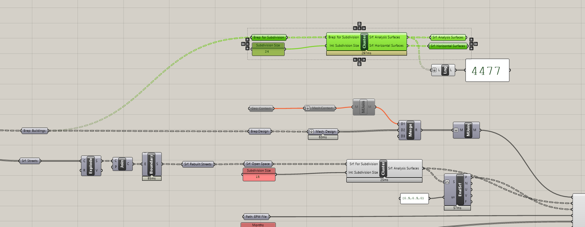

Before we proceed, what is the goal of analyzing daylight to buildings? Do we want to maximize it? Do we want to minimize it? It depends on the climate and our desired outcome. Do we want to increase interior daylight? Or decrease energy consumption? Or both? Because increased daylight will be directly correlated with open views (which we will be adding in the next section,) lets adapt this tool with the goal of decreasing energy consumption. This is dependent on the climate. In New York City direct sun is beneficial in the cold months (reduces heating load) and harmful in the hot months (increases cooling load.) Again, since we already have an analysis tool that is directly correlated with increased direct sun, lets a adapt this to focus on reducing direct sun during hot months.

```
Tip
In practice, shading devices are very effective for reducing unwanted direct sun during hot months which lessens
the importance of it for developing simple massings. If you were to continue to develop this computational design
model, your could consider using this tool to procedurally generate shading devices based on daylight hours and
orientation. For this exercise minimizing direct sun during hot months is useful because it is indirectly correlated
with open views, which we will use to illustrate and discuss trade-offs when we generate a design space in the next module.

```
1. Copy the cluster and  unique inputs of the Daylight Analysis tool. Don't copy inputs that they both will share: EPW file and obstructing geometry. Everything would still work if you did copy those, however, it is best practices (and saves on computation time) to reduce redundancy.
2. Before inputting the subdivided buildings and obstructing geometry, lets adjust the inputs for goal. We want to analyze direct sun for months were it will increase cooling loads (6 - 9.) To keep the analysis running quickly while we get this set up, lets go with just one month for now -- June (6). No need to change the rest of the inputs right now.

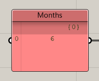

3. `Save` and `Lock the solver`!
4. Our tool needs analysis surfaces and points so copy the `Evaluate Surface` generating the points for the streets and input the subdivided building surfaces.
5. Input `Subdivided Building Surfaces`,  `Subdivided Building Points`, and `Obstructions` into the copied daylight cluster.

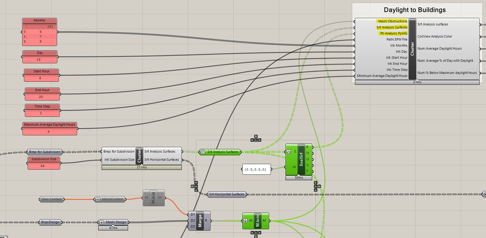

Do a visual check of the output. Does it look correct? In our case every surface is gray, indicating it is receiving less direct sun then our minimum threshold, however, because we have no context we know that portions of our buildings should have full sun exposure. Jump back into the cluster. This next series of steps will be similar to what we went through in the previous section.

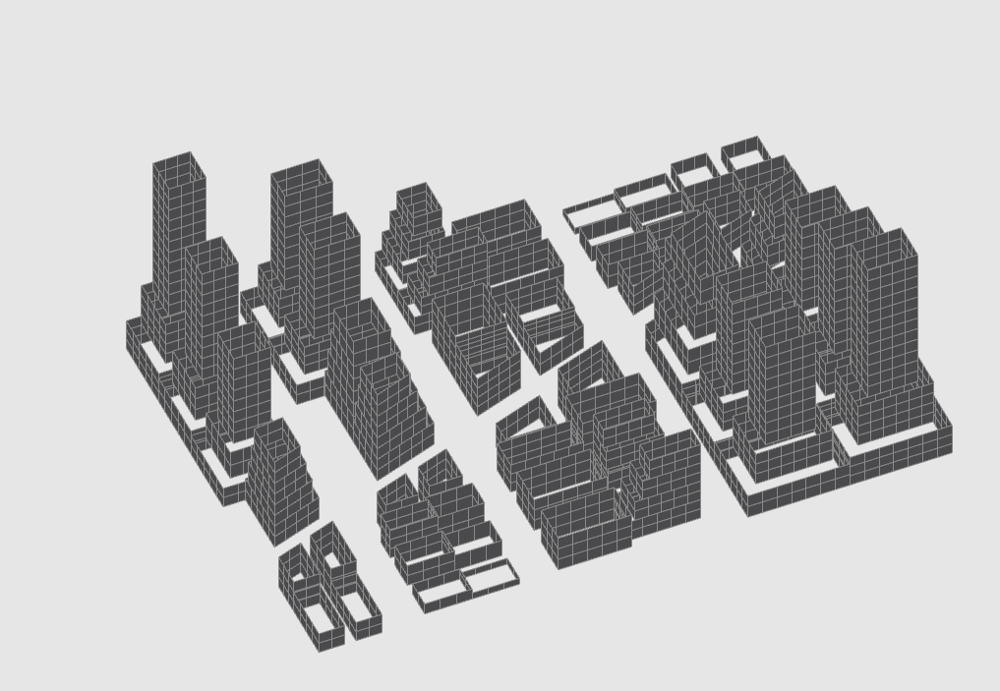

6. Right away you should see that the output for the path mapper is empty. This is because we are inputting a tree with a structure that doesn't match what the path mapper is expecting. Our tree structure changed because we are now only analyzing for one month. Since we have one month the structure is `{A}` instead of `{A;B}`. You could exit now and just change the input for two months and it would solve this issue, however, adding a fix now makes this tool more robust for future use.

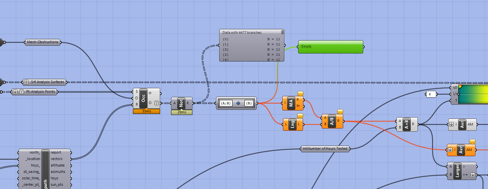

7. Double click on the `Path Mapper` and add a second mapping: `{A}` to `{A}`. *Wait what? We didn't change anything?* Yup! This is the structure we want, which is organized by analysis points. When you have more then one month you have a tree structure organized by Month and analysis point so you need to map it to be just by points, which we don't need to do here. (All of this data tree stuff may still seem confusing and opaque, but keep at it and will click at some point.)

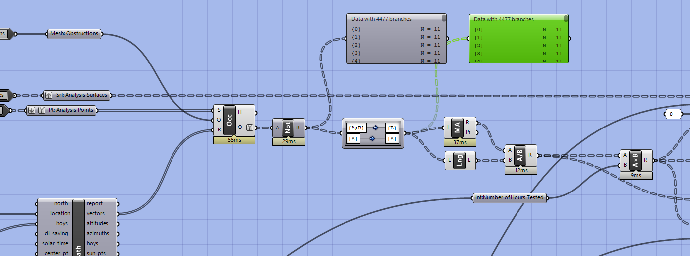

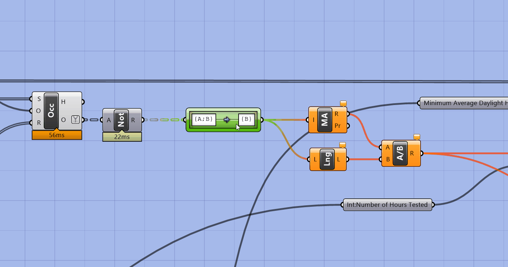

Exist the cluster and do a visual check of the output. Working correctly? We are now getting color variation, but it is still not correct. Back to the cluster!

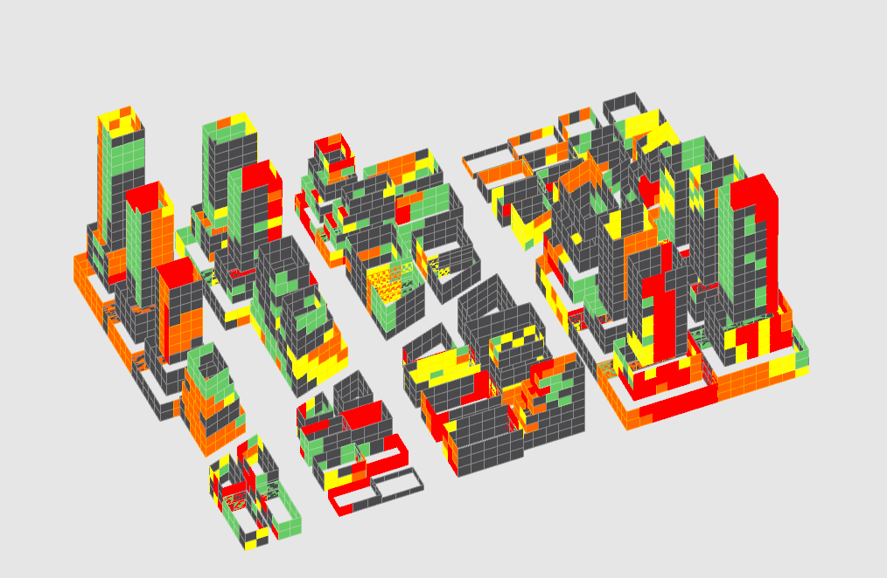

8. Lets compare the `Srf: Analysis Surfaces` and `Col: View Analysis Color` outputs using `Param View`. They have the same number of branches, each with one item, which is what we want so what is wrong? Take a closer look at the two sets of paths. While the analysis surfaces do have the correct number of branches they are structured differently then the analysis colors, which is causing the mismatch.

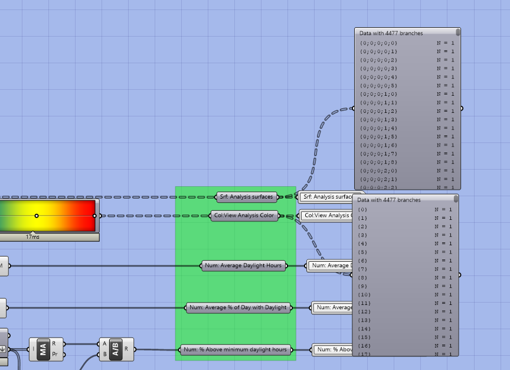

9. This one is a pretty straight forward fix, and similar to the previous section. `Flatten` the analysis surfaces coming into the definition and `Graft` them on they way out. Flattening removes any structure and the graft creates the structure that matches the analysis colors. In doing this you may have noticed that we are not actually doing anything with the surfaces in the cluster so may be asking why we have them in here. The answer is that they don't need to be in the cluster at all! However, functionally, it doesn't matter so we will leave them here for now.

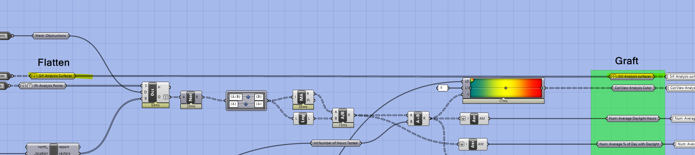

10. Visual check! Looks correct, awesome! All done? Not quite. Currently the metric output treats more sun as good but in this instance we want to reduce direct sun. To finish this tool we need to adjust the metrics and calibrate the inputs.

*If you got to this point and your visual output is still incorrect, [jump to step 21](#move) of the view analysis tool section. It covers a fix that happens with some geometry and is likely the solution if you are still having issues.*

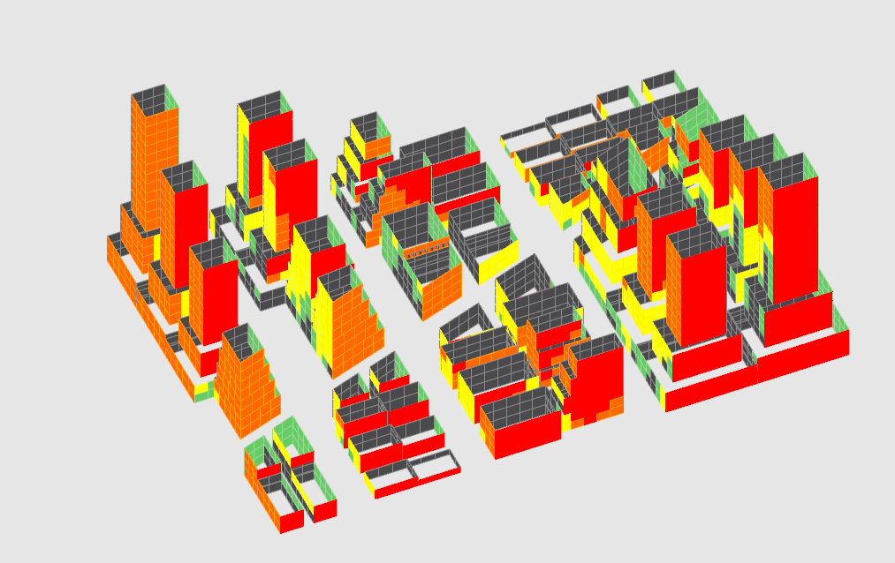

11. Before we make further changes we need  to `Disentangle` the two clusters. If you remember from the intro sequence, copies of Clusters act as instances, meaning that when you edit a Cluster and save changes, the changes are updated in every instance of that Cluster. We are  changing how the metrics are derived so we need to separate or "Disentangle" the two clusters. If you mouse over the center of the cluster it will tell you how many times it occurs, in our case twice. Right click the cluster and select `Disentangle`.

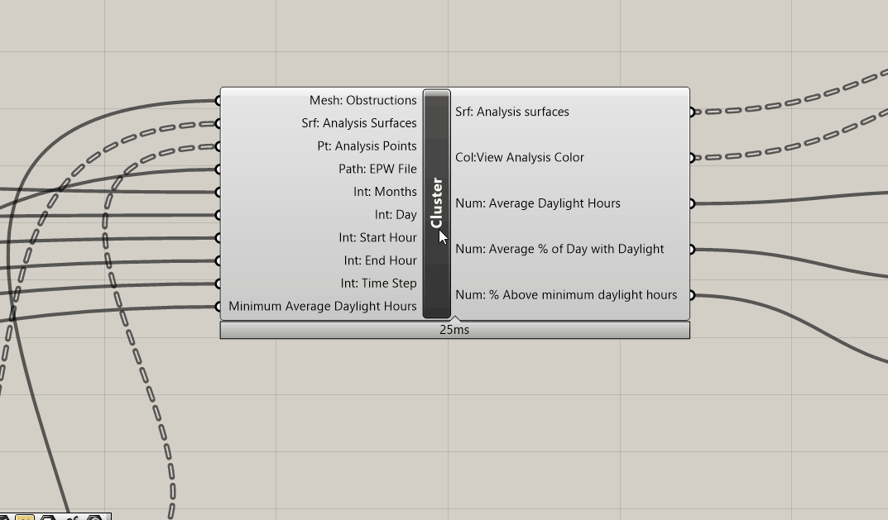

Before jumping into the cluster to revise the metric calculation, lets revisit our inputs. (We'll come back to calibrate these a couple of times.)

12. First, since we are going to be analyzing summer months (which have more daylight hours) we want to increase the time duration to start at 6 and end at 20. Next, since we want to minimize direct sun hours we want a maximum threshold instead of a minimum.
13.  Change the minimum average daylight hours to `maximum average daylight hours` to 8. We are going to use this value as a threshold for which we want to maximize the amount of building receiving less then 8 hours of direct daylight.

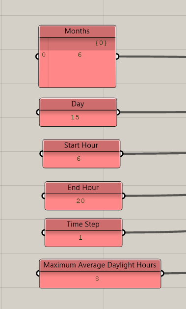

Once you adjust the inputs you may notice that the analysis is no longer working correctly. Lets jump into the cluster to figure out why and start to revise the metric outputs. You'll notice that the `Gradient` component is not producing any values. This is because we were using our minimum average daylight hours (now a maximum) to set the lower limit of the color gradient `(LO)`, which is equal to the upper limit `(LO)` we set of 8. That means that the gradient has a domain of 0 to 0.

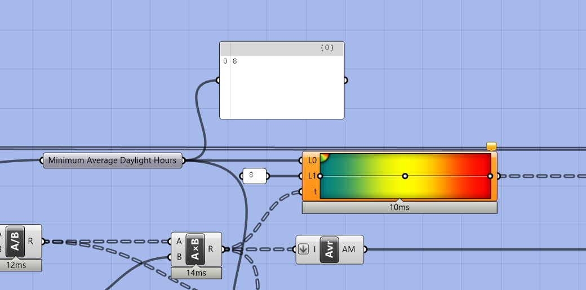

14. To fix this first set the lower limit of the color gradient `(LO)` to 1. Visually, this tool will still display areas with less then this value as a different color.
15. Plug the minimum average daylight hours (now a maximum) in the upper limit `(LO)`.
16. Double click on the right most black circle to pull up the gradient editor. Change the color left so that there will be a visual break with the color right. In this example we are leaving the color right as red and changing the color left to orange. Now anywhere over our threshold will be red.

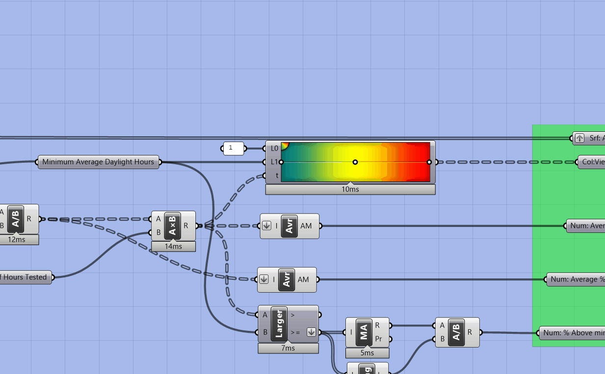

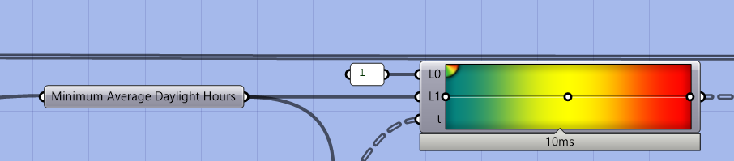

17. Next we need to flip how the % threshold metric is calculated. Replace the `Larger Then` with a `Smaller Then` component. Now the `true` boolean values will be for analysis points with less then our maximum sun threshold, creating a new metric, "% of building façade below maximum direct sun threshold."
18. Rename associated parameter holders and panels.

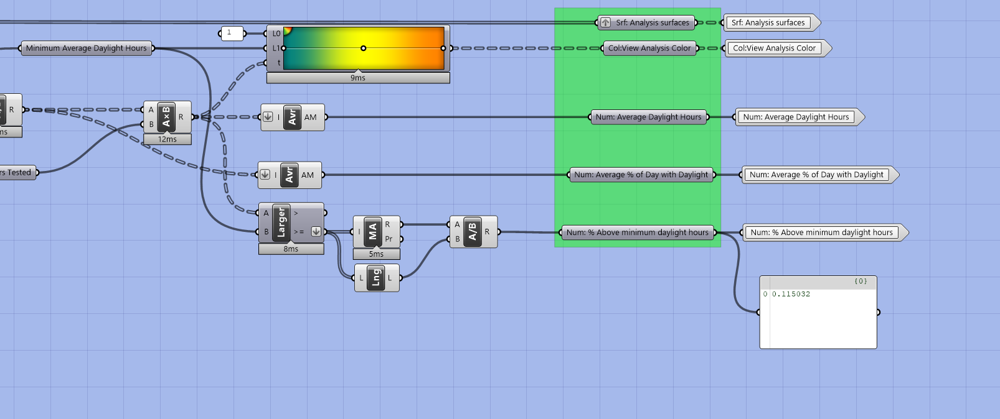
>*Before metric calculation adjustment*

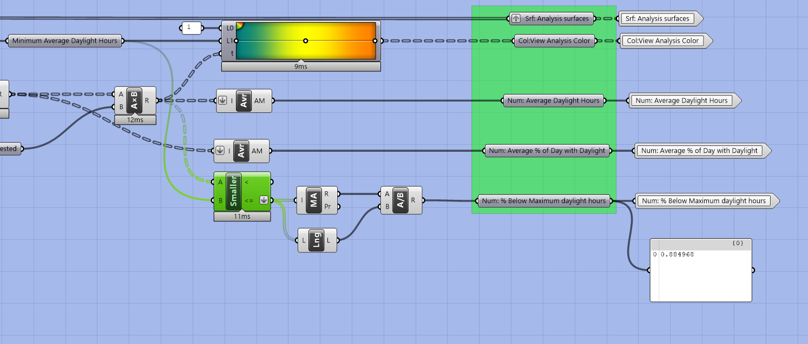
>*After metric calculation adjustment*

Finally, we are going to calibrate our analysis period and maximum direct sun hour threshold to achieve better visual output. Analysis tools have two outputs: a metric and a visual map of performance. The metric allows you to compare performance between multiple design. The visualization allows you to understand how a specific design is performing. You can quickly assess what portions of the design are performing well or poorly and evaluate what spatial attributes of the design are resulting in the performance. For example is it towers that are close together blocking views? Or the angle of the street allowing for more direct sun? Or put another way, the visual output is how we can use the analysis to inform design changes to improve performance.

For the visualization to be effective there needs to be meaningful variation -- a visual difference between poor performance and good performance. However, it is important to not artificially introduce visual difference if there is not a meaningful difference in performance. How to tell if you have a meaningful difference in performance? Use the `Bounds` component to get the domain of all the analysis points (make sure to flatten the input!) For the example below we are getting a domain of 0 hours to 9.6 hours, which is significant.

19.  For a couple of different design options test different combinations of hot months (6 - 9) and maximum hour thresholds (likely, between 7 and 9) to determine which provide the best visual feedback. In the comparison below, the inputs were selected because they were providing better variation relative to the towers.

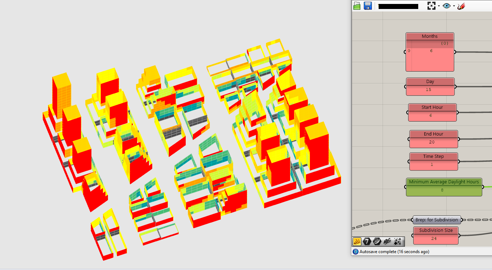
>*Before input calibration*

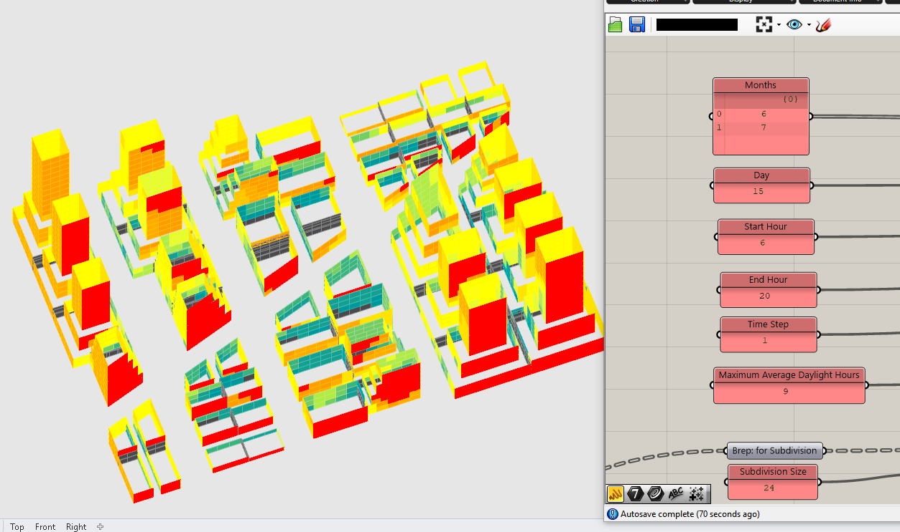
>*After input calibration*


### 4. Views From Buildings

Finally(!!) we are going to apply the view analysis tool developed in the Intro to Grasshopper sequence.

1. Copy the definition below the daylight to streets analysis tool and line up the inputs vertically.

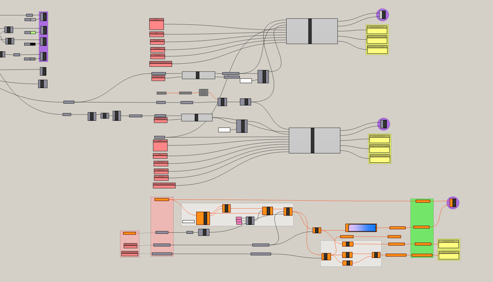

The assignment for the Deriving Spatial Data module was to modify the view analysis tool to account for a human field of view, however, in case you didn't get through it, we will go through the process now. We are going to rotate the line normal to each analysis surface to create lines that cover a human field of view (120 degrees.)

2. `Graft` the (S) input of Evaluate Surface.
3. Plug the output of the Line component into `(G)` of `Rotate an object in a plane`.
4. Plug the `(P) Points` from the evaluate surface into `(P) Plane` of the rotate component. Why points when the component wants planes? If you plug points into a input that is expecting planes grasshopper will use a global X,Y,Z plane centered at that point. Using the global plane will rotate the points horizontally, which we want.
5. Use a `Series` component to generate rotation degrees between `-60 and 60` degrees. In this example the starting value is -60, the step size is 15, and the number of values in the series is 9. This will generate values every 15 degrees starting at -60.
6. Plug the output of the series into `(A) Angle` of the rotate component. By default, any angle input will expect radians, so right click on (A) and select the option for degrees.

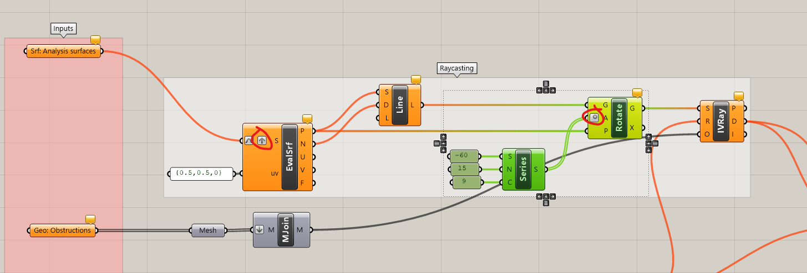

Next we are going to cluster view analysis:

7. Delete `Mesh Join` and connect the mesh input directly into `IsoVistRay`. The obstructing meshes are already being joined so we are deleting this to eliminate redundancy.
8. Make a copy of the `Srf: Analysis Surfaces` parameter holder to the right inline with the other inputs.
9. Select all of the components for view analysis, except the initial inputs and final outputs, right click, and `Cluster`.
10. Delete the analysis surfaces and obstructions parameter holders (we only needed them for clustering,) and move inputs and outputs to be in line with the rest of the analysis inputs and outputs.


We are now going to apply the view analysis to our geometry so, you guessed it:

11. `Save` and `Lock the solver`!
12. Input the `Srf: Analysis Surfaces` for your buildings.
13. Input the `Joined Mesh Obstructions` into `Geo: Obstructions`.
14. `Unlock the solver`

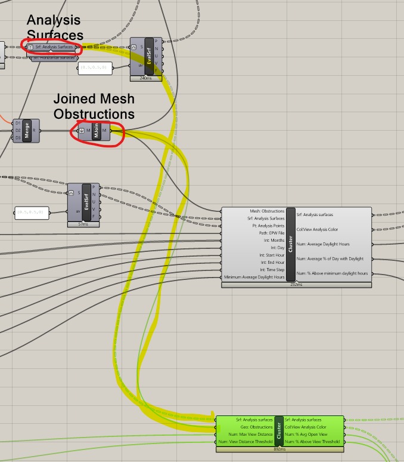

Visual check! *At least one has to run correctly right from the start, right??* Not this time. As we troubleshoot we will identify two issues, one generated by the revision we made to rotate the view rays, and the same data tree issues from the prior section causing the analysis to not display correctly.  

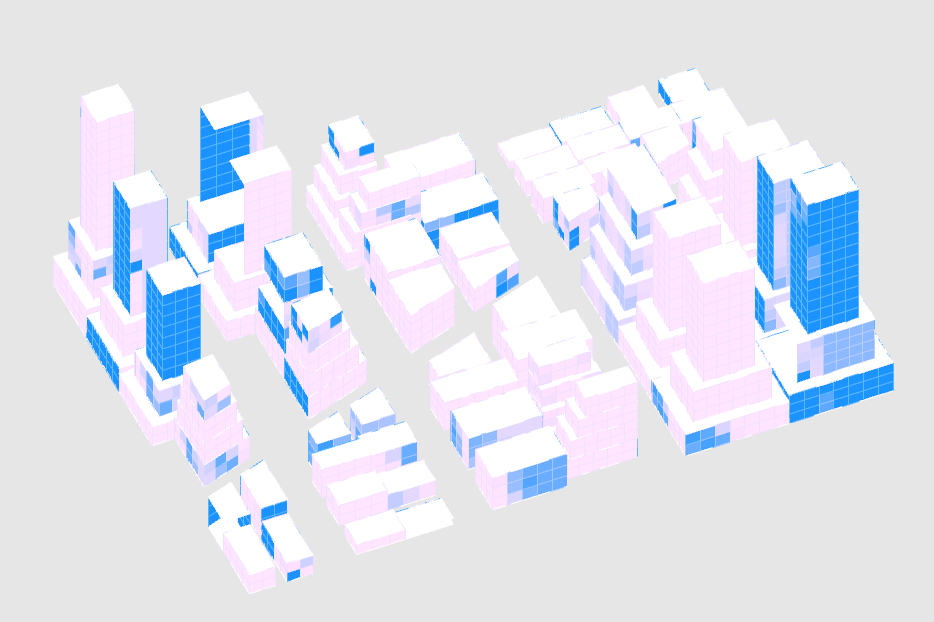

15. Start by using `param viewer` to compare the data tree structures for the analysis surfaces and analysis colors. Like with the previous tools, these should match,  be grafted (one item per branch,) and have a number of branches equal to the number of analysis surfaces. In this example they don't match, are not grafted, and don't have the same number of items.

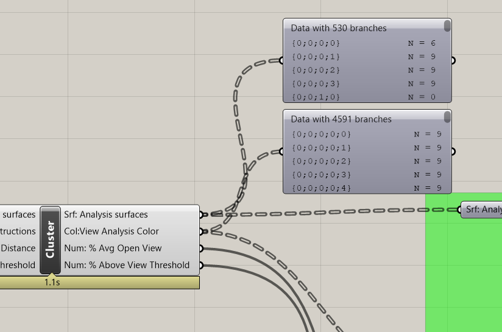

16. Enter the view analysis cluster.
17. Start by comparing the `List Length` of the analysis surfaces with the analysis colors. Make sure to `Flatten` the inputs. These should match, but don't.

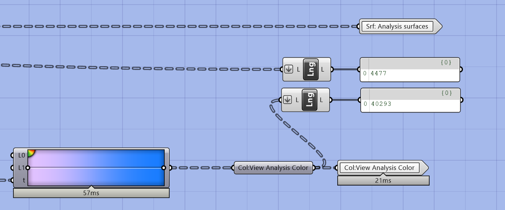

18. Continue to use list length to identify where the mismatch first occurred. Originally we had one distance value coming out of `IsoVitRay` but since we rotated the view rays to account for a human field of view we now have many distance values.

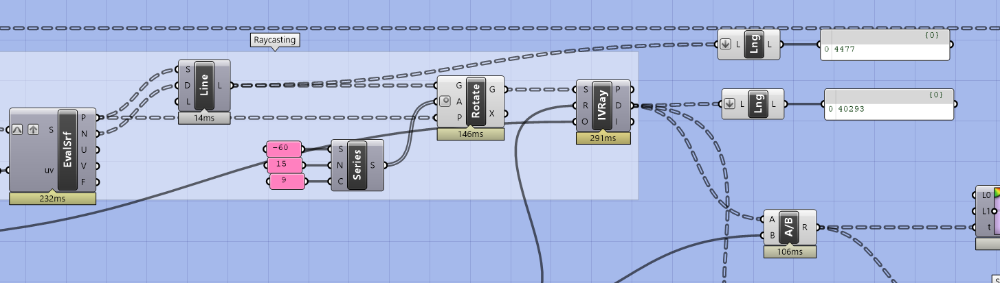

19. We want a single distance value -- one for each analysis point so use `Average` to generate a single value: the average distance to obstructions within a human field of view.

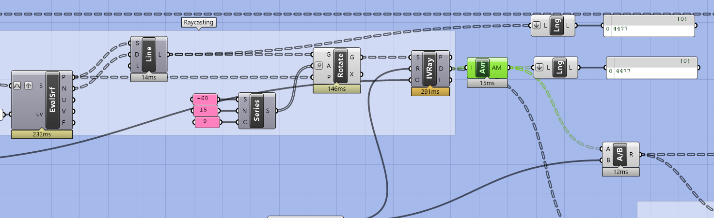

20. Similar to the other two analysis tools we need to `Flatten` the analysis surface input to remove the data tree structure, make and copy, `Graft` the copy and use it as the new output. The flow should now be: Cluster Input -> Flattened Parameter Holder -> Grafted Parameter Holder -> Clustered Output.

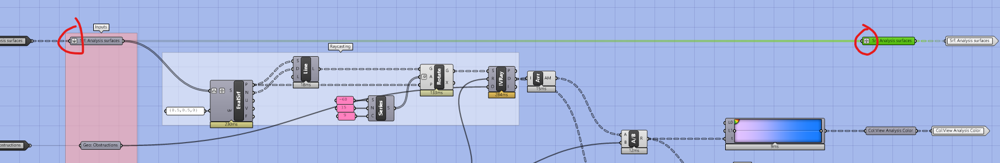

Visual Check! Still not correct? (Yours might actually be correct as this issue doesn't consistently occur.) Take a look at the image below. Can you tell what is wrong? Looks mostly correct but there are some faces of buildings that should have wide open views that are being visualized as completely obstructed.

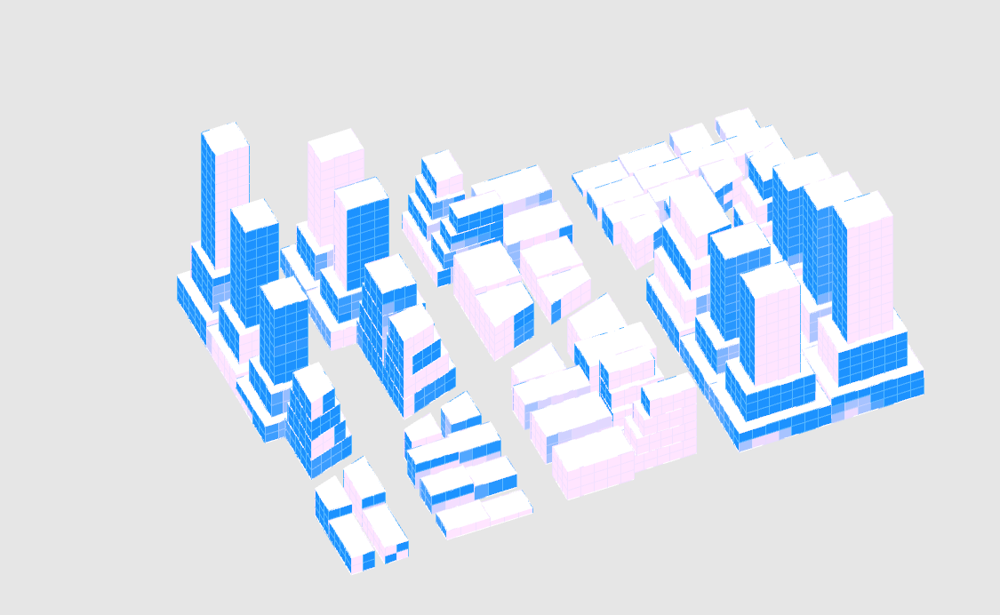
  
<a name="move"></a>
  
21. This is occurring because the meshing of the buildings (which is being used as the obstructing geometry) varies slightly from the original Brep so that the analysis point is actually just inside of the building. To fix this jump inside the cluster and use a `Move` and `Amplitude` component to move the analysis point just lightly off of the building using the normal vector. If this issue didn't occur in the Daylight to Buildings analysis tool, consider adding it to make it more robust

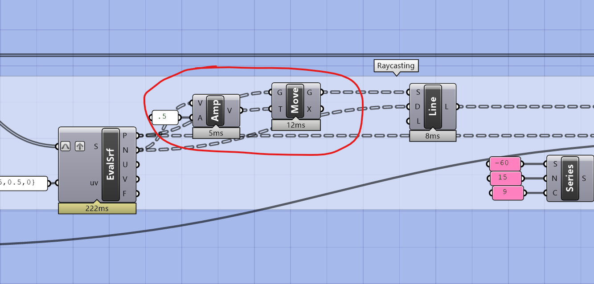

Visual Check! The results should now look correct, but if you were using the view analysis inputs from the Intro to Grasshopper module, you might be seeing that almost every building has unobstructed views. In that tutorial we were modeling that was context very close to the tower and using short values the view distance.

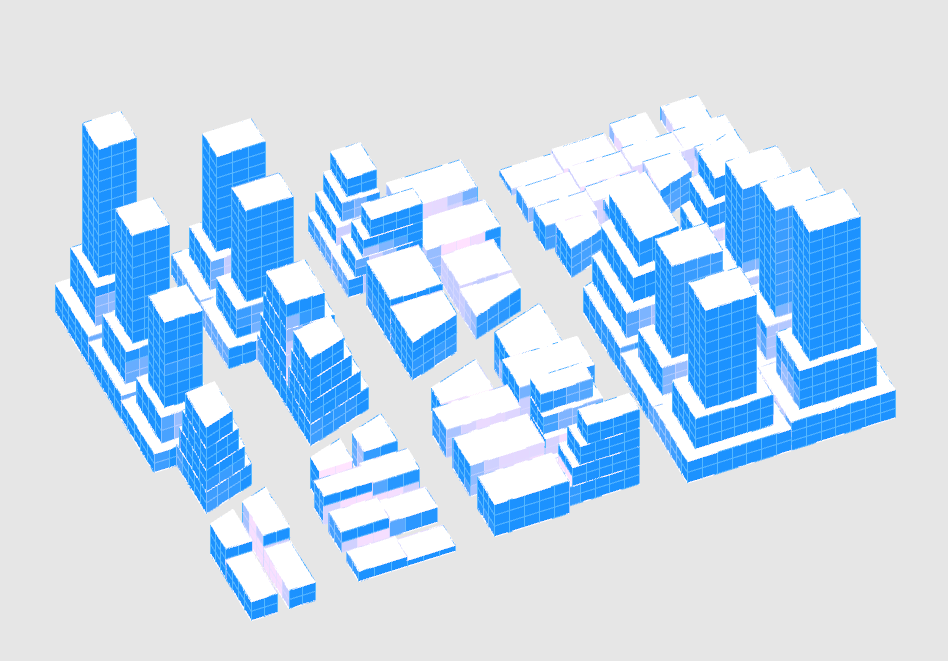

22. Adjust the `Max View Distance` (the distance at which we no longer consider an obstruction to determinantal to a view) to a value that make sense relative to the size of your site. In this example we are using a maximum view distance of 600ft.
23. Adjust the `View Distance Threshold` (the minimum distance for a view to be considered a good view.) Both of these are qualitative. In this example we are using 80ft, which is just slightly larger then the width of a narrow street in New York City.

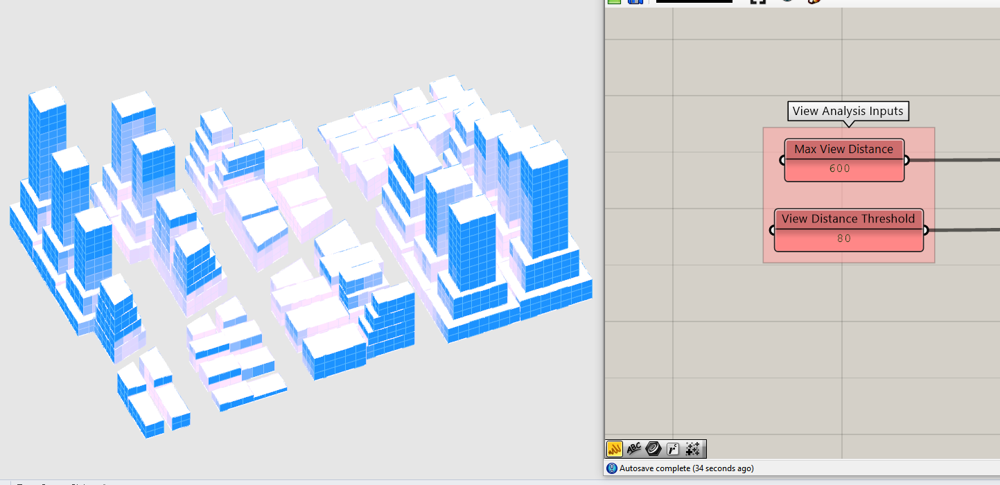


Finally, if you have gotten to this point and are still having issues, refer to this [completed definition](https://github.com/GSAPP-CDP/Smorgasbord/raw/main/src/content/modules/5-computational-design-modeling-in-grasshopper/definitions/5-6_Troubleshooting.gh) to help trouble shoot.

## Conclusion

Phew! This was a long one, but one of the most important modules. Getting all the pieces of a computational design model to work together correctly can be challenging. In this module we have covered a range of approaches and techniques for troubleshooting that will start to become second nature for your as you continue to develop your ability with grasshopper. The issues we dealt with cover almost every type of problem that may occur. (Although one we didn't cover is when something is just incorrectly connected.)

Beyond the techniques introduced, remember proper troubleshooting requires you to be critical of the output. If you are getting a metric and visual output, don't just assume everything is working correctly. Examine the visual output, if it looks wrong it probably is. Are the metric outputs in a range that you would expect? If not, something is probably wrong.

## Assignment

We've develop this all without a context so to wrap up this module, lets add one! You can manually model a context in Rhino or use a portion of an actual city. The Department of City Planning for the City of New York provides [3D models for the entire city.](https://www1.nyc.gov/site/planning/data-maps/open-data/dwn-nyc-3d-model-download.page) With either approach consider the context you are designing for. Are you introducing density to a low density neighborhood? Or a high density one? Are you designing along a park or a lake? They context will significantly influence the outcome of your model.

Note: you'll need to enable the `Geo: Context Input` that we previously disabled to add the context.

## Additional Resources

*To Do: resources on building types and built density*
