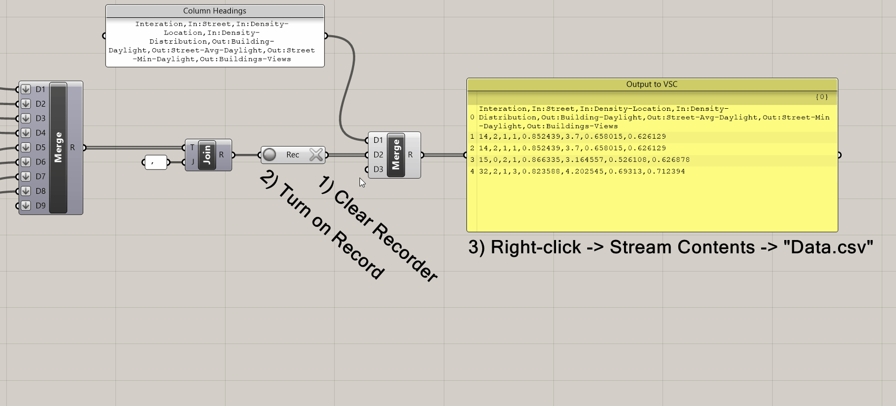
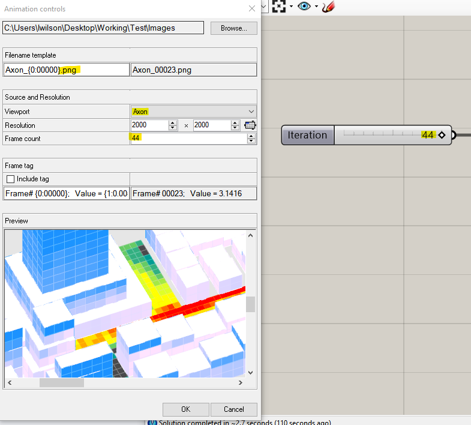

# Creating a Design Space and Exploring results


## Module Summary

In the final model in this sequence we will create a design space, run it out to derive a spatial data set, and explore results. Steps 2 through 4 of the tutorial are very similar to the final module of the Intro to Grasshopper sequence, so if you have not done that sequence yet, make sure to complete it first.

## Why is this important?

We are going to finally generate massing options with performance metrics to answer the question we established in module 4:

 "What street grid and distribution of density result in energy efficient buildings while creating comfortable outdoor spaces?"

 Through exploring the design space we will identify performance trends, describe the relationship between form (inputs) and performance (outputs,) and establish design insights.

## Tutorial

This tutorial has four sections:

1. Establishing the design space.
2. Formatting for export.
3. Running out the design space.
4. Exploring the results and deriving insights.


>*Complete definition.*

### 1. Establishing the design space

We are going to create a single list of all design options -- every combination of our slider inputs -- that we can then use a single slider to `animate` through all options.

1. First, we need to make some room. Move everything except the input sliders over to the right.


2. Next, we need to create lists with values for each step of the sliders. This can be done with `panels` (remember to make them `multiline`) or with a `series` component.


In this example we have 3 values for Streets, 3 for Density Location, and 5 for Density Distribution Factor. You may have added street grids or density locations as part of prior assignments so may have more values for some of your inputs. At this point you can calculate the size of your design space, just multiple the number of values for each input together. In this case `3 x 3 x 5 = 45 options`.

*Only 45 options?! At the start of this sequence I was promised HUNDREDS of options.*

It is often good to start with a small design space. First, you can make sure that everything is working and successfully generating a design space without waiting for a large design space to run. Next, you can do an initial exploration of the results and use your insights to inform additional input values to add, like more street grids or different ways of varying density.

Lets explore some potential expansions of this design space. What if we add two street grids and two density location options?

`5 x 5 x 5 = 125 options`

Maybe we also test a low, medium, and high FARs? Currently this is a static input, but we could add it as a dynamic input.

`5 x 5 x 5 x 3 = 325 options`

<details>
  <summary>A Note on Density in design spaces.</summary>
Why aren't we varying density? Good question!

Varying density in a computational design model is not technically difficult (you would just replace the panel with a slider), but it can make interpreting the results more challenging. For example, comparing a low density option to a high density option isn't particularly useful since differences in performance will almost always be primarily driven by the fact that one options just takes up way more space. If you compare options at the same density differences in performance can be attributed to design elements, such as street grids or density distribution, which is far more useful. Although, to vary density or not also depends on your hypothesis or question. If the question is to determine a maximum suitable density, then you would want to vary it. For this Sequence we are not going to vary density to keep the overall complexity of interpreting the results down, however, if you do include density as a dynamic input keep this aside in mind.
</details>

<br>

Except for the streets, we don't have any meaningful open space in our model. What if we added an input for no, small, medium, and large open spaces? And an input for how it is designed: centrally located vs distributed? (Including open space is out of the scope of this Sequence, it is only being used to illustrate constructing design spaces.)

`5 x 5 x 5 x 3 x 4 x 2 = 3,000 options`

That escalated quickly! As with every aspect of developing a computational design model, establishing the design space takes your judgement and agency as a designer. This is why starting small is good. You can evaluate what makes a difference in performance and use your insight to grow the design space.


3. Collect your three sets of inputs together on the canvas and plug them into `Cross Reference`. You'll need to zoom into the component and click the `+` button to add a third input.
4. `Graft` the outputs.


5. `Merge` the outputs.
6. Use `Text Join` to join the output of the merge with `,` (comma.)
7. `Flatten` output.

Now instead of 45 branches, each with three items, we have 45 items were each is a unique combination of the inputs for our design space.


8. Use `List Length` to calculate the size of the design space. (Make sure to flatten the input.) We've already done this exercise but it is good to confirm we were correct.
9. Create a `Slider` with a domain equal to the size of your design space, in this case `0 < 0 < 44`.
10. Plug the text join and slider into a `List Item`.

This is the slider we will use to animate through every input combination and generate our design space.


Next, we are going to split the text into the individual input values and replace the input sliders.

11. Plug the list item into `Text Split` and use the `,` that you used to join the text previously to now split it.
12. Plug the output of split text into `List Item` and zoom in to list item and add two additional outputs.
13. Add labeled integer parameter holders for the three outputs of list item. These should be Street Option, Density Location, and Density Distribution.

```
List Item Tip
Each output you add to list item selects the next item in the list from the one specified by the (i) input.
In this example (i) equals 0 so we selecting items 0, 1, and 2, which are all three of our input values.
```


>*Now we have a single slider that will run through all of our options!*

Next, we are going to replace the input sliders with these new values.

14. To prevent the analysis tools from solving each time you replace an input, select them, right click, and `Disable`.


Because our model has so many inputs it can be easy to plug in the new parameter holders incorrectly. If your model is not working correctly at the end of this section of the tutorial, double check that you plugged everything in correctly.

15. Replace the input sliders with their corresponding inputs from the list item outputs.


Visual check! Vary the values on the design space slider to make sure that everything is working correctly.


### 2. Formatting for export

Now that we have established our design space we need to format the inputs and outputs for export so we can record them when we animate the design space slider through all of the options. Through this we are deriving a unique spatial data set of design variation with spatial analysis.

We want to include the iteration number (the value on the design space slider) for each option we export so that we can recreate as we explore the results of the design space.

1. Add a labeled integer parameter holder to the design space slider.
2. Replace the list item input with the parameter holder.
3. Copy the parameter holder to the far end of the canvas This is where we will do set up the export.

It will be impossible to get the wires of the various export elements laid out cleanly so in this instance `hide wires`.


Next, we are going to collect all of our inputs and some of the outputs in labeled parameter holders to merge for exporting. This is another step where it can be easy to plug in the wrong data; work carefully and double check to make sure everything is correct.

4. Below the `Int: Iteration Number` parameter holder from the design space slider, create labeled parameter holders that connect back to your inputs and the following outputs:
*Inputs*
- "Int: Street Option"
- Int: Density Location"
- Int: Density Distribution"

*Outputs*
- "Num: % Below Maximum Daylight Hours" The maximum daylight hours of the buildings.
- "Num: Average Daylight Hours" The average daylight hours of the streets.
- "Num: % Above Minimum Daylight Hours" The minimum daylight hours of the streets.
- "Num: % Above View Threshold" The view analysis of the buildings.

5. Plug the parameter holders into `Merge` in the following order: Iteration Number -> Inputs -> Outputs. `Flatten` all of the inputs.


*Why did we leave some outputs out? Wouldn't you want all the data?*

Not necessarily. If we were using statistical models to explore the data we might want all of it. But we will be sorting and filtering the data and using visual observation to identify patterns and trends. To do that we need to keep the number of features we output small enough that our human brains can make connections between them. This is usually in the range of 3 - 5 metric outputs.

6. Use `Text Join` to join the output of the merge using `,` (comma). We are using this to structure our data for export to a Comma-Separated Values, or CSV, file type. CSV are a simple file format for structuring tabular data. A row is defined by each item in our list and the commas delineate columns. Once we export our data we will open in a spreadsheet program, such as Google Sheets or Excel, to explore the data.
7. Plug the joined text into a `Data Recorder`. When active it records any changes to the input, so when we animate out slider in the next section, the data recorder will record the data for each step of the design space slider.

The data recorder has two buttons. The circular one to on the left is to activate or deactivate recording. Make sure it is active (red) before exporting data. The X to the right clears any data. Make sure to clear all data before exporting.


8. Create a panel with a label for each of the features to output in the order same order they are merged and separated by columns. In this example we have: Interation,In:Street,In:Density-Location,In:Density-Distribution,Out:Building-Daylight,Out:Street-Avg-Daylight,Out:Street-Min-Daylight,Out:Buildings-Views. This will be the column header labels for the data set we export.
9. Plug the panel with the labels into the first input of a `Merge` and the output of the data recorder into the second.


10. Plug the `Merge` into a `Panel`. If the data recorder is turned off, you should only see the column labels. If it is on, you should see at least one additional row of data.
11. If not on, turn the data recorder on.
12. `Enable` the analysis tools that you disabled in the previous section.
13. Move the design space slider. (It will likely take 8 - 14 seconds between steps to solve.) As you do you should start to see additional lines of data populating the panel.


### 3. Running out the design space

Time to export our data! Follow these steps to prepare:

1. Set the `Rotation Step` slider to the last value. In our case, 44.
2. Click the `X` of the `Data Recorder` to clear any data.
3. Make sure the `Record Button` is on and red.

The `Data Recorder` should be orange (since it hasn't received any new data) and the panel empty.


We will use the export function of a panel (yes, panels can export data!)
4. Right click on the output panel, select `Stream Contents`, navigate to the folder you want to export to, name the file, and add .csv to the file extension. Common convention is to call it `data.csv`.

If you have previously set the file path, clicking Stream Contents toggles the streaming on and off, and clicking `Stream Destination` allows you to change the file path and file name.



Next, right click anywhere on the design space slider and select `Animate...` to bring up the animation dialogue box:
5. Set your file path.
6. In the Filename template change the name of your files by replacing the text preceding "_{0:00000}." The file name doesn't make a difference, so name it whatever you want or keep the default.
7. Change the file extension to either .jpg or .png. (Or keep it as .bmp if you prefer that image file type.)
8. Click the drop down menu next to Viewport and select the Named View you want to use. If you don't have a Named View saved, select whatever view you are currently on.
9. Adjust the resolution to your desired size. You can see the exact image size in the Preview window at the bottom, but will likely need to use the scroll bars to navigate the window to see the full extents of the image.
10. Set the Frame count to be `1 - Total Options` tested. If your slider starts at 0 then this value will be the last number on your slider, so in our case 44.
11. Click `ok` to animate and export your data set!



As the slider animates you should see the panel with data filing up and an image of each individual step exported. The dialogue box just above the command line in Rhino will display which step it is currently on and an *estimate* of the time remaining. The estimate is extrapolated from the time per option run out to that point so can't account for other factors that could slow down the export, such as options with more complicated geometry.


The images being exported are really cool, but not actually that import. You can use them to make an animation illustrating your design space, but the data.csv is far more important as it is the data set that will allow us to explore the relationship between form (inputs) and performance (outputs.)

12. Make a copy of the `data.csv` file

With the panel set to stream contents it will continue to write (or delete) data from the data.csv file if there are any changes in grasshopper. For example, if you clear the data in the Data Recorder it will delete all data from you .csv or if you change the slider it will continue to write data. There are two ways to protect your data, either toggle off the stream contents for the panel or make a copy of you data.csv file. (The second method is the safest.)

13. Open of the copy of the data.csv and adjust the column widths to clearly see column titles and data. Scroll down and do a visual check for completeness. You should have a number of rows equal to the size of your design space and a value in every cell. Are any rows or values missing? If so, adjust the design space slider in Rhino the option number with missing data to investigate.


### 4. Exploring the results and deriving insights

*OUTLINE*
1. Sort by output
2. Delete options below key thresholds
3. Sort by most important output
4. Look for patterns in inputs and describe sub set of form that gets good performance
5. Generate options representative trends and use the visualization to describe the relationship between form and performance
6. Summary diagrams and option comparison

## Conclusion


## Assignment

Based on insights from the initial design space run and exploration, revise the inputs and re-run.
