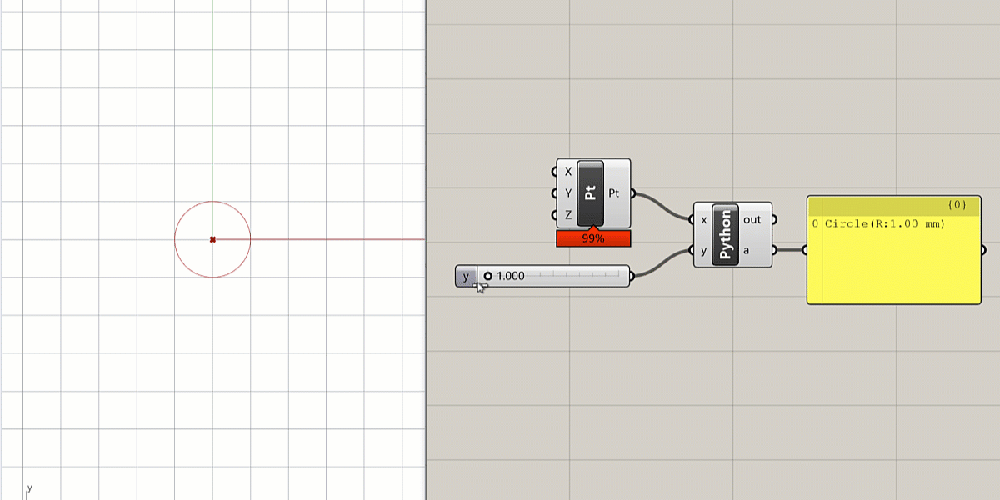

# Accessing the Rhino Libraies in Python

## Module Summary

This module demonstrates how we can access a number of Rhino Libraries while working in Python from withing Grasshopper, and use it to work with Rhino's native geometry types.

## Introduction

By design, the core Python language is fairly limited in functionality, being restricted to the basic algebra, flow control structures, and data manipulation functions we worked with in the [Fundamentals of Python]() sequence. This is done intentionally to keep the core Python language as light-weight and fast as possible. To extend Python's functionality to more advanced uses, we rely on a series of external Libraries which define classes and methods useful for specific tasks. To use these Libraries we must first make sure they are installed into our version of Python, and then we need to import them into our script. Some very common Libraries such as [random](https://docs.python.org/3/library/random.html) or [math](https://docs.python.org/3/library/math.html) come pre-installed with Python but still must be imported into every script we want to use it in. Other Libraries such as [numpy](https://numpy.org/) must be installed separately before they can be imported into our scripts. For a more in-depth discussion of Libraries in Python, please review the [related module]().

## Working with the Rhino and Grasshopper Libraries

To enable us to work with geometry in Python, Rhino and Grasshopper provide several pre-installed Libraries which we will cover in this section.

The three main Libraries provided by Rhino/Grasshopper which allow Python to access geometric data types and operations are:

- **ghpythonlib.components** — allows you to directly reference Grasshopper components in Python code
- **Rhino.Geometry** — allows you to access all commands and data types in the main [RhinoCommon](http://developer.rhino3d.com/guides/rhinocommon/what-is-rhinocommon/) library
- **rhinoscriptsyntax** — a wrapper over the Rhino.Geometry library which provides similar commands and functionality to Rhinoscript

Let's see how each one of these work through an example. We will create a simple Python script that takes a Point as an input and creates a Circle with that Point as the center and a radius of '2'. The Grasshopper definition consists of a `Python` component with one input and one output, a `Point` component connected to the input, and a `Panel` component connected to the output so we can see the results.


> Initial setup of basic example in Grasshopper

### Inputting geometry

Double-click on the `Python` component to open up the Python script editor. First, let's see how the input point is represented in Python. We can see this by printing the input's value and using Python's type() function to print its type. Type these lines in the script and click the 'Test' button to see the results:

```python
print x
print type(x)
```

You should see something like this:

```
ac7825d2-24b0-4225-b52a-f04a3daa0849
<type 'Guid'>
```

Wait a second, didn't we input a Point — why are we getting this 'Guid'?

By default any geometry input into a `Python` component is not brought in as the geometry itself, but as a reference to the geometry in the Grasshopper environment. This reference is stored in the geometry's unique ID number, a text string called a 'Guid'. This can create problems for most geometric functions, which expect actual geometry data instead of a 'Guid' reference.

We can fix this by telling Python exactly what kind of data we are inputting using 'Type hints'. To set the input's type, right click on the 'x' input of the Python node, go to 'Type hint', and select Point3d. The 'Type hint' menu shows all the geometry types supported by Grasshopper. When we specify that the input is of the type 'Point3d', Python will automatically convert the 'Guid' reference to the actual point geometry so that we can use it with geometric functions in our script.


> Setting the 'Type hint' for a Python input

### The _ghpythonlib.components_ library

Now that we have correctly specified the type of the geometry we are inputting, we can start to build our simple script. We will start by importing the _ghpythonlib.components_ library. Delete the previous two lines and type on the first line:

```python
import ghpythonlib.components as ghcomp
```

This will import the components portion of the main _ghpythonlib_ library into our script so we can use it’s methods to work with geometry. We use the `import ... as ...` syntax to give the library a shorter keyword that will save us typing and make the script cleaner. Now when we want to use the library we can reference it with `ghcomp` rather than typing the full `ghpythonlib.components` each time.

The _ghpythonlib.components_ library contains methods that replicate the behavior of each component in Grasshopper. Each method expects the same number and type of inputs as its Grasshopper component equivalent, and returns the same outputs. If the component has more than one output the return will be a list whose length is the number of outputs.

Let’s use the library's `Circle` method to create a Circle based on a center Point and radius, just like the `Circle` component in Grasshopper. On the next line type:

```python
a = ghcomp.Circle(x, 2)
```

As expected this creates a circle with a radius of 2, centered on the input point.


> Creating a circle with Python

### The _Rhino.Geometry_ library

Now let’s do the same thing with the Rhino.Geometry library. Below the first import line, type:

```python
import Rhino.Geometry as rh
```

This line imports the _Geometry_ portion of the main _Rhino_ library and assigns it the keyword `rh`. Now we can change the line of code that creates the circle to:

```python
a = rh.Circle(x, 2)
```

If you run the script you will see that the result is exactly the same — a circle centered on our input point with a radius of 2.

### The _rhinoscriptsyntax_ library

Finally, let’s look at the same example using the _rhinoscriptsyntax_ library. We can import the library by typing:

```python
import rhinoscriptsyntax as rs
```

and use the library’s `.AddCircle()` method to create a new circle based on the input point and radius.

```python
a = rs.AddCircle(x, 2)
```

We have now seen three different libraries that allow you to work with geometry in Python, so which one should you use? Ultimately all three do basically the same thing and create the same exact geometry, but they each come with certain benefits and limitations:

- The **ghpythonlib.components** library makes it easier to get started because you can directly use the same components you are used to using in Grasshopper. However you are restricted to what is available in Grasshopper, and some of the methods can be clunky compared to those in RhinoCommon.

- The **rhinoscriptsyntax** library was created to make it easier for those already used to using RhinoScript to transition to using Python. The methods in the _rhinoscriptsyntax_ library replicate those in RhinoScript, but do so by ‘wrapping up’ methods from RhinoCommon. Thus they may make some geometric operations easier and cleaner, but also limit the scope of possibilities compared to using the full RhinoCommon.

- The **Rhino.Geometry** library is the most comprehensive and robust way to work with geometry in Python because it exposes all of the methods in the full [RhinoCommon](http://developer.rhino3d.com/guides/rhinocommon/what-is-rhinocommon/) library. RhinoCommon is a universal cross-platform library developed by McNeel for the release of Rhino 5 which allows all versions of Rhino and Grasshopper to access the same geometric data types and methods. By tapping into this library we gain access to everything Rhino is capable of, which allows us to do things we could not do with either Grasshopper or RhinoScript.

One major difficulty when starting to work with libraries such as _rhinoscriptsyntax_ or _Rhino.Geometry_ is knowing the exact syntax of each geometric method available, what to pass in for inputs, and what returns to expect from each one. In Grasshopper you can easily see what components are available to you by looking through the options in the toolbar. You can also see each component's expected inputs and outputs by looking at the ports of the component. This is more difficult with code, since there is no graphic interface for any of the methods. So how do we know what methods are available and how to use them?

The best way is to search through the documentation of each library, which contains a full description of each class implemented by the library and its methods. You can find the documentation for _rhinoscriptsyntax_ and _Rhino.Geometry_ here:

- http://developer.rhino3d.com/api/RhinoScriptSyntax — documentation for the _rhinoscriptsyntax_ Library with a description of each method and data type supported
- https://github.com/mcneel/rhinoscriptsyntax — source code of the _rhinoscriptsyntax_ Library which shows how each method is implemented using RhinoCommon
- http://4.rhino3d.com/5/rhinocommon/ — documentation of the full _RhinoCommon_ Library including all data types and methods with Python examples for each one.

In practice, searching through full documentation sets can be difficult and confusing for someone just getting started, so the Python script editor provides two tools that make it easier to find out what methods are available in a Library and how to use them.

The first is the autocomplete feature, which gives you hints on what methods are available in the Library as you type the code. You may have already noticed it as you were writing the lines above. Lets type the line

```python
a = rh.Circle(x, 2)
```

again character by character to see how this works. Remember that `rh` is a keyword representing the _Rhino.Geometry_ Library, and the `.` symbol is Python's way of accessing a Class from a Library or a method or property from a Class. Once you type in the `.` symbol, a window will pop up with a list of all the Classes in that Library. This would also work if you had an instance of a Class and were trying to access it's methods and properties. As you continue typing, the pop-up list will automatically scroll down to the portion you are typing and highlight the best matching Class name. Once you see the Class you want highlighted you can press 'Enter' or double-click on the name to enter the Class name into the script.


> Browsing Classes within a Library

Following the Class or method name you typically place a set of parenthesis where you pass in the method or Class constructor’s inputs. Once you type the first `(` the Python window will automatically load the documentation of that method into the results windows which tells you what inputs the method expects and what outputs it generates.


> Reading documentation for a method

In the case of the `.Circle()` Class constructor method you can see that it actually supports many different combinations of inputs. In Python this is called 'overloading' a method, and allows a single method to do different things based on different combinations of inputs.

In this case it allows us to create Circles in several different ways such as based on a center and radius or based on 3 Points. Overloading is another advantage of using the _Rhino.Geometry_ library over the _ghpythonlib.components_ Library. Instead of remembering the 7 different components for creating Circles in Grasshopper, we have a single `.Circle()` Class which can make circles in different ways based on the inputs we give its constructor.

# CHALLENGE:

Can you add a slider to our definition to control the radius of the Circle?



> Hint: create a new input in the `Python` component using the [Zoomable UI]() and connect to it a new `Number Slider`. Then use the variable name of the input inside the Python code to replace the hard-coded value of '2'.
